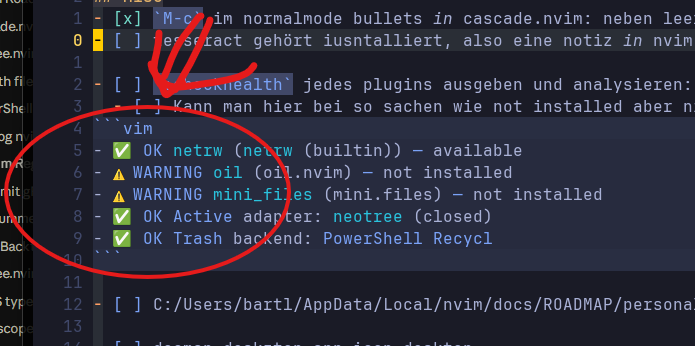
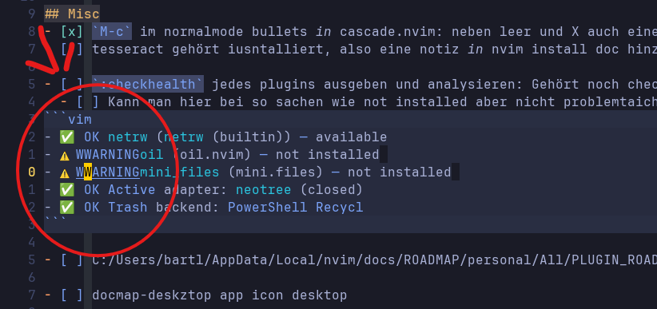

# Garbled text in fenced blocks: Neovim and WezTerm disagree on the width of ⚠️

**Status:** fixed locally — `opt.emoji = false` in `lua/options.lua`
(Appearance & UI). Nothing to file upstream: neither side is wrong, they are
just configured to two different Unicode width tables.

**Found:** 2026-08-31, in `docs/ROADMAP/ROADMAP.md`. Symptom was a `vim` fenced
block whose text visibly rearranged itself whenever the cursor entered it.
Suspicion at the time was the `color_my_ascii.nvim` fence highlighting — it was
not (see [Not the plugin](#not-the-plugin)).

---

## The one-sentence version

`⚠️` is two cells wide to Neovim and one cell wide to WezTerm, so every
character right of it is drawn one column left of where Neovim thinks it is —
and the first partial redraw of that line writes over the wrong cells.

---

## Symptom

A fenced block holding pasted `:checkhealth` output:

````markdown
```vim
- ✅ OK netrw (netrw (builtin)) — available
- ⚠️ WARNING oil (oil.nvim) — not installed
- ⚠️ WARNING mini_files (mini.files) — not installed
- ✅ OK Active adapter: neotree (closed)
```
````

Cursor outside the block, the two `⚠️` lines render correctly. Cursor inside
the block, both of them turn into:

```
- ⚠️ WWARNINGoil (oil.nvim) — not installed
- ⚠️ WWARNINGmini_files (mini.files) — not installed
```

plus a one-cell black notch at the end of each affected line. The `✅` lines are
never affected, and a fenced block with Lua content is never affected.





## Reproduction

Any line containing `⚠️` (U+26A0 U+FE0F) in a WezTerm-hosted Neovim, once
something makes Neovim repaint only a *span* of that line rather than the whole
line. Moving the cursor into a region that carries its own highlighting is
enough.

## Measurements

Neovim 0.12.2, `--clean`:

```
:echo strdisplaywidth("\u26A0\uFE0F")   " -> 2     ⚠️  ambiguous + VS16
:echo strdisplaywidth("\u2705")         " -> 2     ✅  East Asian Wide
```

WezTerm draws the same two sequences as **1** and **2** cells respectively.
Visible without any measuring tool: in a correctly-rendered screenshot the `W`
of `WARNING` sits one column *left* of the `O` of `OK` on the neighbouring line,
although both start at buffer column 5 in Neovim's model.

## Root cause

`⚠️` is U+26A0 (East Asian **Ambiguous**) followed by U+FE0F, the emoji
variation selector. Whether that sequence is 1 or 2 cells wide is a matter of
which Unicode version's rules you apply:

| | `⚠️` | `✅` | rule in use |
|---|---|---|---|
| Neovim, `'emoji'` on (default) | **2** | 2 | VS16 forces emoji presentation → full width |
| WezTerm, `unicode_version = 9` (default) | **1** | 2 | Unicode 9: VS16 widens nothing, ambiguous → 1 |

So from the `⚠️` onward, Neovim's grid and the terminal's screen are offset by
one column. That offset is invisible while whole lines are redrawn — the line
just ends one cell short. It becomes visible the moment Neovim decides to
rewrite a *fragment*: it moves the terminal cursor to an absolute column and
writes there.

For `- ⚠️ WARNING oil …`:

```
Neovim's grid   0:-  1:' '  2..3:⚠️   4:' '  5..11:WARNING  12:' '  13..15:oil
WezTerm screen  0:-  1:' '  2:⚠️      3:' '  4..10:WARNING  11:' '  12..14:oil

Neovim rewrites the "WARNING" span → absolute columns 5..11
WezTerm screen  0:-  1:' '  2:⚠️      3:' '  4:W  5..11:WARNING  12..14:oil
                                              ^^^^^^^^^^^^^^^^^  ^^^
                                              stale W kept       space eaten by the G
             →  - ⚠️ WWARNINGoil (oil.nvim) — not installed
```

Which is exactly the observed output, character for character. The black notch
at the end of the line is the same mechanism at the line's tail: Neovim's model
ends one column further right than the terminal's, so one cell keeps its old
background.

WezTerm's own documentation describes the failure mode without naming it:
"text columns may no longer line up as the application author expected, and/or
that the cursor may appear to be in the wrong place when editing lines or text
in shells or text editors" — `unicode_version`, default 9, "as that is the most
widely used version (from the perspective of width)".

## Not the plugin

`color_my_ascii.nvim` was the first suspect because the block it decorates was
the block that broke. It is clean. Dumping its extmarks headless against the
real config, on the offending row:

```
ns ColorMyAscii
  col  0..1   Operator   ->  -
  col  2..8   @label     ->  ⚠️        (exactly its 6 bytes, not split)
  col  9..16  @label     ->  WARNING
  col 17..20  Function   ->  oil
  col 21..22  Operator   ->  (
ns ColorMyAsciiFenceLine
  col  0      line_hl_group = ColorMyAsciiFenceContent
```

Every range is byte-exact, and the emoji is covered by a single range rather
than being split between its two codepoints. The plugin only makes the
underlying mismatch *visible*, by giving the line enough highlight spans that a
partial repaint has something to repaint.

## Fix

Pick **one** side. Setting both re-creates the mismatch in the other direction.

**Chosen — Neovim follows the terminal** (`lua/options.lua`):

```lua
opt.emoji = false
```

`'emoji'` off falls back to `'ambiwidth'` (= `single`) for exactly the ambiguous
codepoints, i.e. Unicode 9 widths, i.e. what WezTerm is already using. Verified
that this does not disturb the genuinely wide emoji:

```
emoji=true    ⚠️ 2   ℹ️ 2   ▶️ 2   ✔️ 2   ✅ 2   ❌ 2   😀 2
emoji=false   ⚠️ 1   ℹ️ 1   ▶️ 1   ✔️ 1   ✅ 2   ❌ 2   😀 2
                                            ^^^^^^^^^^^^^^^^^ unchanged, WezTerm agrees
```

Only affects Neovim. Nothing changes visually — `⚠️` already rendered as a
one-cell glyph — the corruption simply stops.

**Alternative — terminal follows Neovim** (`Configs/Terminals/wezterm/`):

```lua
Config.unicode_version = 14
```

Renders `⚠️` as a proper two-cell emoji, matching `✅`. But it applies to every
TUI running in WezTerm — starship, lazygit, fzf, … — most of which still assume
Unicode 9 widths, so it trades one alignment problem for a wider one.

## If it comes back

Symptoms of the same class, any of them worth checking `'emoji'` / the
terminal's width table for:

- characters doubled or swallowed on lines containing emoji, only after the
  cursor visits them
- the block cursor sitting one cell off the character it is supposed to be on
- a one-cell background notch at the end of a line

Quick check for any suspicious character:

```vim
:echo strdisplaywidth("⚠️")
```

If that disagrees with how many cells the terminal actually paints, this is the
same bug.

## See also

- `lua/options.lua` — Appearance & UI, `opt.emoji`
- `:help 'emoji'`, `:help 'ambiwidth'`
- <https://wezterm.org/config/lua/config/unicode_version.html>
