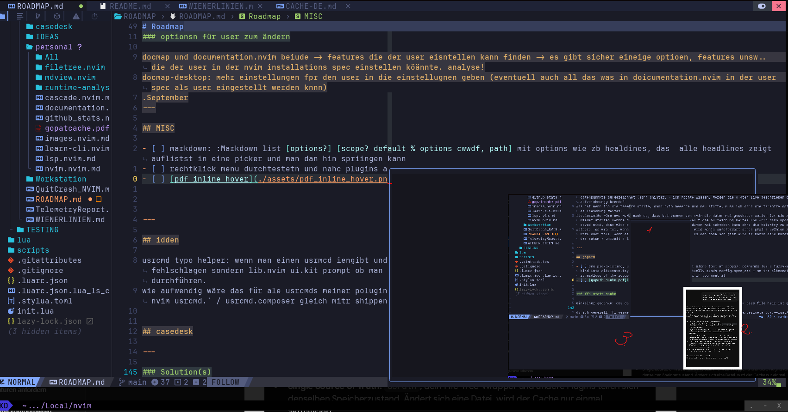

# Roadmap

## cdx

free: So., 09:00 x - 21. Juli 2027
work: Sa., 06:00 o - 20.Sept
dev:  Sa., 22:00 o - 03.Sep

## inline hover img/pdf

- [ ] - [ ] [pdf inline hover](./assets/pdf_inline_hover.png)

  Man ieht hier, dass der hoiver buffer (1. eingezichent)endert wid, dann aber das pdf (2.) verschoben ist und 3. sdiehst ud, dass die statusline um ein drittel angehoben wird; wie bei :messages aber hahalt ohne inhalt- keine ahnun gwarum das gamacht wird

- [ ] 

  Ich hab dann den screenshot weiderum inline hovert, und man sieht auch ier, dass es wieder verschiebnen ist da simage / bufer

* Ich k önnte mir vorstellen, das beide BEobachtungen sogar miteinader verbudnen sind.
* Kann man den scracth bffer für hpover iwie durcsichtig machen wenn man ihn schon nicht abdrehen kann?
* wenn beides nicht funkt, dann  - wie knnte man das fixen, dass die beiden nicht verschoiben sind?

Es ist zwar nur ein kosmetisches problem, aber gerade wenn man mit dem feture angeben will "schau mal, ich kann images im terminal anziegen lase, sogar pdf startseiten!" - das ist aber nur halb so beeindruckend, wenn nicht alles schön ist. Am ende wird es wrsch eine abwägung sein wieviel aufwand man in ds debuggen stekcen will.
Interesant wöäre, ganz gernell das malzu erklären, was hh ier genau püassiert, also warum ein scratch hover buffer.. was wird von welchern tools diesbezüglih übernommen - usw...

### `images.nvim`  - Roadmap

- [ ] `snacks.nvim` independent werden - also dass die funktionen , die snacks images anbietet, in `images.nvim` angeboternnn werden (also die die ichj nutze)

---

## Misc

- nvim performance optimeren: startup modul, runtime analysis, docmap, usw...

---

## (AN CLAUDE: NOCH NIHCT IMPLEMENTIEREN: EINFACH IGNORIEREN!)

- [ ] spotlight: warum `leader mk`? Und nicht `leader s*`? itte umstelen. sofdern nichts dagegen spricht (andere mappings). update doe docs und auch C:/Users/bartl/AppData/Local/nvim/docs/NOTES/BINDINGS  (hier kajnn man auch checken ob eine keymaps schon besetzte ist=)
- spotlight checken und lernen
- documentation.nvim lernen
- [ ]  Könnte es nicht eine "neue art" software sein, alle meine nvim plugins entweder mit oder ohne einer nvim instanz gemeinesam bündeln und als bnary ausgheben, so das s man es wieder wie normales nvim aber halt mit + verewnden kann.

1. `leader wq`: Alle issues lösen
  1. dass was wq macht in einem `lib.nvim / lib.nvim.ui` ausgeben
2. `/wkdoptions`
  1. UI Linemarker gehört README
  2. `wkdoptions` mit `options.lua` verheiraten (vielleicht als default_options)
3. `nvim/init.lua` durchgehen
4. [ ] Funktionen/Module identifizieren, die man mit FFI/C performanter machen könnte
  - [ ] `/nvim/lua/` – alle Module durchgehen und checken, ob sie irgendwo hineinpassen

- `z` - zoxide soll $REPOS_DIR auflösen können; Powershell soll alle meine repo ordner auflösen können. also wkdbooks -> cd $REPOS_DIR/wkdbooks usw..
- Alle claud ebranches in allen plugins entfernen

---

## Implementieren

- [ ] `nvim/lua/autocmds` analysieren:
  - [ ] Refactoring?
    - [ ] `nvim/lua/autocmds` nach `nvim/lua/Bindings`
  - [ ] Welche automcds gehören in ein projet von  einen in C:\Users\bartl\AppData\Local\nvim\docs\ROADMAP\IDEAS?

- wenn man eine ganzeu zeile markiert, also shiift v im nomralmode, und dann diese in backticks umhüllen will, dabn macht man danach `` aber es umhült nicht sonder macht:
    C:/Users/bartl/AppData/Local/nvim/docs/ROADMAP/personal/documentation.nvim.md
    ```
  also hängt in der nächsten zeile eiunfach dreio backticks an.
- [ ] strg+v soll trimmen

- [ ] `lua/config/menu` nach `lua/wkdnvchad`?
- [ ] Autocompletion beim schreiben funktiert schon mit zusätzlichen dictionary bvon mir, jetzt wäre es noch toll, wenn oft verwendete höher geranked werden bei den vorschlägen

## ZIEL

1. Alle plugin fähigen Module augliedern
2. Funktionen/Module/ganze Custom Plugins, die man mit ffi über vc performanter machen könnte?
  1.  Eventuell wie eine zweite runtime alle sinnvollen plugins darin laufen lassen, die mit nvim gemeinsam gestartet wir Eventuell wie eine zweite runtime alle sinnvollen plugins darin laufe n lassen, die mit nvim gemeinsam gestartet wirdd
-2. `BINDINGS.lua`: In der Descrtiptionder Keymaps und Usrcmds: Das plugin selbst nicht nennen,, wie zb.: "[iletree]:" in fileteree.nvim keymap descreiption
3. `/autcmds`
  1. passt zu `/bindings` ?
  2. autocmds aller folder zusammen in einer /autcmd und dort dann korrekte anordnung, also nach events usw,... sodass die performance steigt.

---

