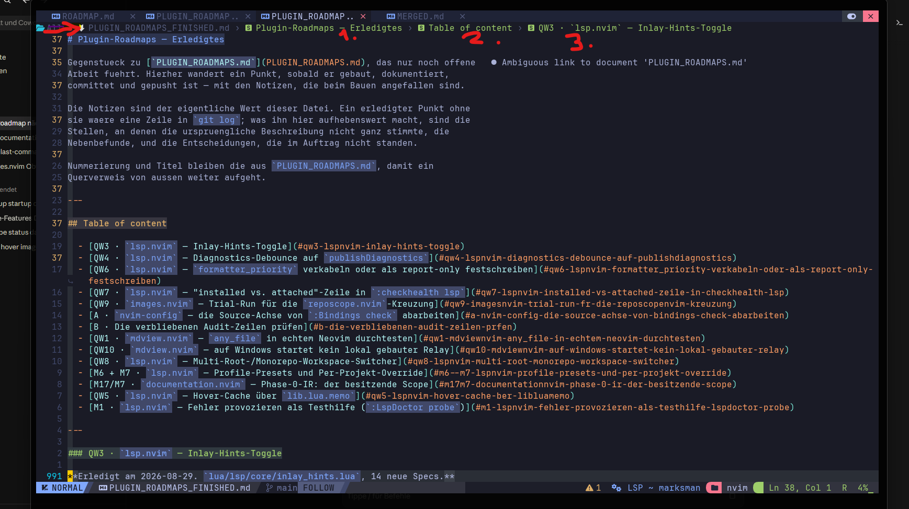

# Roadmap
leader np / leader pf sind vertauscht  fileops.nvim

## Table of content

  - [cdx](#cdx)
  - [Lists](#lists)
  - [Misc](#misc)
  - [true check](#true-check)
  - [Plugin-Liste](#plugin-liste)

---

## cdx

| Account  |    Sub Bis    | Week Reset Date |  Next 5h Reset  | Actual/Insgesamt |
| -------- | ------------- | --------------- | --------------- | ---------------- |
| **main** |   ~ 27. Sep   |   Fr., 11:00    |     00:30       |    69% / 56%     |
| **dev**  |    03. Sep    |   Sa., 22:00    |     10:40       |    77% / 39%     |
| **work** |   20. Sept    |   Sa., 06:00    |     23:50       |    55% / 34%     |
| **free** | 21. Juli 2027 |   So., 09:00    |     15:30       |    92% / 30%     |

never start more than 3 agents simultaneously; if more are needed, run multiple rounds of up to 3 agents each
antwortet immer auf Deutsch; im Quellcode (Code und Kommentare usw.) immer Englisch verwenden

---

## Lists

- [ ] C:/Users/StefanBartl/AppData/Local/nvim/docs/ROADMAP/personal/All/FINISH/MERGED.md
- [ ] C:/Users/StefanBartl/AppData/Local/nvim/docs/ROADMAP/personal/All/PLUGIN_ROADMAPS.md
- [ ] C:/Users/StefanBartl/AppData/Local/nvim/docs/ROADMAP/personal/All/Diagnostics.md
- [ ] C:/Users/StefanBartl/AppData/Local/nvim/docs/ROADMAP/personal/All/WQ.md

---

## Misc

- [ ] docmap-deskztop app icon desktop

- [ ] Casedesk auslagern; WKDBook-Tricentis/EngineLab;

- [ ] Unter der Tableiste ist nich im buffer / file kontext infios: Parent folder > Fileaname > 1. Markdown Headline > 2. MD Healdline (TOC) -> TOC Entrys
Parent folder, Filenam & Erste headline ist ok, aber dann die nächsten jheadlines + toc einträge ist zu viel. ichj hab nachegesehn, es ist nur markdown fies so, bei zb lua ist nor der folder + filename anegegebn. Von wpo kommt das überhaupt her? plugin das mit nvchad mitkam? 

- [ ] Wenn man in einer md file eine Referenz aus einen markdown link entfernt, dann soll es euinen keymap dafür eben, zb `DD` (statt `dd`), dass die Referenz file auch gleidh entfernt. Es soll aber einen lib.nvim ui.kit prompt geben, ob die file gefunden wurde und man sie wriklcijh löschen will.

```markdown
- [ ] Parent folder, Filenam & Erste headline ist ok, aber dann die nächsten jheadlines + toc einträge ist zu viel. ichj hab nachegesehn, es ist nur markdown fies so, bei zb lua ist nor der folder + filename anegegebn. Von wpo kommt das überhaupt her? plugin das mit nvchad mitkam? 
```


- [ ] lspdoctor legacy names nicht mehr callbar machen/entfernen
- [ ] :checkhealth filetree zeigt zusätzlich, wie viele stale IDs geheilt wurden — steht da nach einer Weile eine Zahl > 0, hat die Session den Bug getroffen und überlebt.
- [ ] In C:/Users/StefanBartl/AppData/Local/nvim/docs/ROADMAP/personal/All/Diagnostics.md:
     [`deprecated` (23) -- veraltete Neovim-APIs](#deprecated-23-veraltete-neovim-apis)
  -> das zeigt gut an, was in `migrate.nvim` implementiert werden soll.
    Zusatz Feature: Alle im `h deprecated` implementieren
    - scope `path/cwd` -> damit könnte man dann ein gesamtes repo automatisch ent-deprecaten
    - cool wäre dann eine  Art picker mit den Treffern und im Preview window wird angezeigt, wie es updatet werden soll, dann lann man treffer für treffer entschiedne ob das eh passt. ein `m` - mark feautre wie in `filetree.nvim` wäre ideal um mehrere zu markieren die updatet werden sollen
    - ein test-sheet mit absichtlichen Fehlern, um z utesten und zu belegen, dass dass Plugin funktioniert.

- [ ] Logo / Bild für repo (socal prview card aber auch images.nvim hover)
- [ ] `:Bindings [options?]` verbessern, andere optionen durchgehen, bestehdne ausbauen und optimieren
  - [ ] "Dashboard"-Funktionen wie `?`-Cheatsheet, keys, usw... Beispiele: `:Reposcope status`

- [ ] Anticheat knacken
- [ ] alle keymaps der nvim config durcsheen ob die wirlich gebraucht werden
- [ ] Github Stats auswerten / backupen
- [ ] ai: mit slaude code die beste für den rechner lokale llm installieren, soll ein paar modelle auspropoeren,  vpn hängen nicht offen ins netz, opencode usw / ollame alternativen verwenden: https://www.youtube.com/watch?v=M1j_uRqKMKI
    Wichrig: genau lernen, wie da sfunkitnert, llm, auch wuantisierung usw... graka _> iwe aerbeiten di egnau, ram upgrde treiber erstllen usw....
- [ ] TAKT -> aai impllementierung von anfang an mitbauen

---

## true check

Ein Freund von mir, mitdem ich gemiensam nvim gelernt habe, hat ~ 30 nvim (+ ein natives docmap-desktop) plugins geschrieben und mir angeboten, dass ich alle üebrhnehmen kann. ich bin daran interessiert, will aber zuerst wissen, wie die codequalität ist, inahltlich ist mir alles klar, also was die plugins machen, aber ich will keine schlechte codebase übernehmen. kannst du die plugins analysieren und diese einschätzug machen. bitte ehrlich, keine honig ums maul oder so. ich will wissen, was gut ist, was außergewöhnlich ist (gut als auch schlecht), was schlecht ist, wo noch viel arbeit rein gesteckt werden muss, overall zustand, usw...
  Ich hoffe, du kannst das trotzdem so effizient managen, dass dies keine mega aufgabe wird, dass soll es nämlich auch nicht sein, leider ist mir klar das dass ein wenig meine wünsche konterkariert. Ich denke, du must da einen goldenen Zwischenweg finden.
  Wenn dir Logikfehler, offensichtliche Bugs oder docs Probleme auffallen in einen Plugin, dann notiere diese gleich.

---

## Plugin-Liste

Hier die Liste meiner Plugins - du findest sie unter `c:\repos` bzw `e:\repos` - und du hast Zugriff darauf:

buffer-ctx.nvim
cascade.nvim
cmdlog.nvim
color_my_ascii.nvim
dap.nvim
debugging.nvim
diff.nvim
documentation.nvim
emojis.nvim
fileops.nvim
filetree.nvim
github_stats.nvim
gopath.nvim
images.nvim
insights.nvim
language.nvim
lib.nvim
lsp.nvim
markdown.nvim
mdview.nvim
migrate.nvim
open.nvim
pdfport.nvim
pickers.nvim
recommender.nvim
replacer.nvim
reposcope.nvim
runtime-analysis.nvim
sandbox.nvim
sessions.nvim
spotlight.nvim

und das native: docmap-desktop

---

