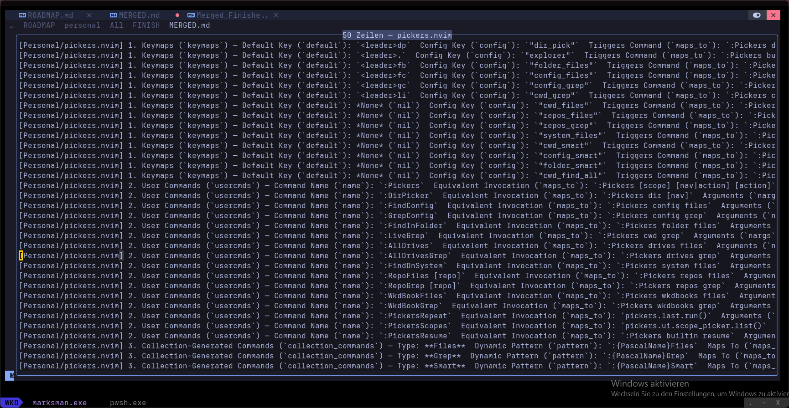

okay, mache bitte hier weiter, eine neute tssk und heir ist die handover file dazu: C:\Users\bartl\AppData\Local\nvim\docs\ROADMAP\handovers\lib-nvim-module-audit-2026-09-07.md

- never start more than 1 agents simultaneously; if more are needed, run multiple rounds of up to 1 agents each
- antwortet immer auf Deutsch; im Quellcode (Code und Kommentare usw.) immer Englisch verwenden
- Die Installations-Specs meiner Pluigns findest du in: vim.fn.stdpath('config') .. /lua/plugins/personal/init.lua
- Gib immer aus was du gerade machst / ob es interessante unde gab - damit ich Bescheuid weiß.
- Docs / README.md des Plugins updaten sofern es Sinn macht
- Keine Co-Authorenschaft von Claude in den Commits
- Wenn du mit etwas fertig bist committe / pushe / pulle so dass das uupdate sofort im main branch, sodass ich es gleich verwenden kann.
- Beachte `$REPOS_DIR/WKDBooks/Development/wkdbook-myplugins/TOOL-PLACEMENT.md` (Tool bauen vs. Wegwerf-Skript, wohin damit)
- Beachte `$REPOS_DIR/WKDBooks/Development/wkdbook-myplugins/HEREDOC.md` (keine großen/escapehaltigen Literale durch die Shell)

---

C:\Users\bartl\AppData\Local\nvim\docs\ROADMAP\handovers\diagnostics-recheck-2026-09-07.md
KANNST DUD HIER WEITERBAREITEN
- never start more than 1 agents simultaneously; if more are needed, run multiple rounds of up to 1 agents each
- antwortet immer auf Deutsch; im Quellcode (Code und Kommentare usw.) immer Englisch verwenden
- Die Installations-Specs meiner Pluigns findest du in: vim.fn.stdpath('config') .. /lua/plugins/personal/init.lua
- Gib immer aus was du gerade machst / ob es interessante unde gab - damit ich Bescheuid weiß.
- Docs / README.md des Plugins updaten sofern es Sinn macht
- Keine Co-Authorenschaft von Claude in den Commits
- Wenn du mit etwas fertig bist committe / pushe / pulle so dass das uupdate sofort im main branch, sodass ich es gleich verwenden kann.
- Beachte `$REPOS_DIR/WKDBooks/Development/wkdbook-myplugins/TOOL-PLACEMENT.md` (Tool bauen vs. Wegwerf-Skript, wohin damit)
- Beachte `$REPOS_DIR/WKDBooks/Development/wkdbook-myplugins/HEREDOC.md` (keine großen/escapehaltigen Literale durch die Shell)

# Roadmap

---

## Table of content

  - [cdx](#cdx)
  - [Misc](#misc)
  - [true check](#true-check)
  - [Plugin-Liste](#plugin-liste)
  - [stdpaths](#stdpaths)

---

## cdx

| Account  |    Sub Bis    | Week Reset Date |  Next 5h Reset  | Actual/Insgesamt |
| -------- | ------------- | --------------- | --------------- | ---------------- |
| **main** |   ~ 27. Sep   |   Fr., 11:00    |     18:10       |    20% / 80%     | X
| **work** |   20. Sept    |   Sa., 06:00    |     17:20       |    27% / 58%     | X
| **free** | 21. Juli 2027 |   So., 09:00    |     14:50       |    82% / 29%     | X
| **dev**  |    03. Sep    |   Sa., --:--    |     --:--       |    --% / --%     | !!!

- never start more than 1 agents simultaneously; if more are needed, run multiple rounds of up to 1 agents each
- antwortet immer auf Deutsch; im Quellcode (Code und Kommentare usw.) immer Englisch verwenden
- Die Installations-Specs meiner Pluigns findest du in: vim.fn.stdpath('config') .. /lua/plugins/personal/init.lua
- Gib immer aus was du gerade machst / ob es interessante unde gab - damit ich Bescheuid weiß.
- Docs / README.md des Plugins updaten sofern es Sinn macht
- Keine Co-Authorenschaft von Claude in den Commits
- Wenn du mit etwas fertig bist committe / pushe / pulle so dass das uupdate sofort im main branch, sodass ich es gleich verwenden kann.
- Beachte `$REPOS_DIR/WKDBooks/Development/wkdbook-myplugins/TOOL-PLACEMENT.md` (Tool bauen vs. Wegwerf-Skript, wohin damit)
- Beachte `$REPOS_DIR/WKDBooks/Development/wkdbook-myplugins/HEREDOC.md` (keine großen/escapehaltigen Literale durch die Shell)

---

## Misc

 - so formatiert ist das de factop nciht zu verwenden. wrsch auch bei den anderen usrcm options. das mus besser werden, übersichtlicher

- [ ] start vim optimieren
    - [ ] C:\Users\bartl\AppData\Local\nvim\after
- [ ] plugins/personal/ bzw überhaupt in der gesatmen nvim-config -> kommentare und docs prüfen / alles was in den plugins gecheckt wurde hier auch

- [ ] Anticheat knacken

---

## true check

- [ ] 3rd/image.nvim vs. snacks.nvim image vs meine .nvim image related plugins (Verbund: images.nvim, hover.nvim, pdfport.nvim, markdown.nvim, gopath.nvim, lib.nvim, pickers.nvim, filetree.nvim, open.nvim, language.nvim, nvzone/menu (solange nicht eigenes right click ui plugin geschrieben ist))
  - [ ] Wie ist die image implemntierung in diesen verschiedenen Projekten bereitgestellt?
    - [ ] Architektur
    - [ ] Welche CLI-Tools werden genutzt? Wie werden sie implemenitert?
    - [ ] Wie wird sichergestellt, dass auch tatsächlich iages in nvim angezeigt werden (Ich hbae sowohl 3rd als auch snacks mehrmals eingerichtet gehab, eshatte nie funkltienrt, obwohl deren chechealth alle grün waren, mappings korrekt aufgerufen wurden usw...)
    - [ ] Welche Vorteile/Nachteile hat die jedweilige implementierung?
  - [ ] Welche Features werden jeweils bereitgestellt? (Vergleich)
  - [ ] Security Features?
  - [ ] Performance relevante umgesaetzte Ideen / patterns?
  - [ ] ...
  - [ ] (Verbund: images.nvim, hover.nvim, pdfport.nvim, markdown.nvim, gopath.nvim, lib.nvim, pickers.nvim, filetree.nvim, open.nvim, language.nvim, nvzone/menu (solange nicht eigenes right click ui plugin geschrieben ist)) -> Würde es sinn machen, ein "Bundle-plugin" zusätzlich anzubieten, dass alles diese imßlementiert und man sozusagenm eine "Image-Suite"-Implementieren könnte?

- [ ] Ein Freund von mir, mitdem ich gemiensam nvim gelernt habe, hat ~ 30 nvim (+ ein natives docmap-desktop) plugins geschrieben und mir angeboten, dass ich alle üebrhnehmen kann. ich bin daran interessiert, will aber zuerst wissen, wie die codequalität ist, inahltlich ist mir alles klar, also was die plugins machen, aber ich will keine schlechte codebase übernehmen. kannst du die plugins analysieren und diese einschätzug machen. bitte ehrlich, keine honig ums maul oder so. ich will wissen, was gut ist, was außergewöhnlich ist (gut als auch schlecht), was schlecht ist, wo noch viel arbeit rein gesteckt werden muss, overall zustand, usw...
  Ich hoffe, du kannst das trotzdem so effizient managen, dass dies keine mega aufgabe wird, dass soll es nämlich auch nicht sein, leider ist mir klar das dass ein wenig meine wünsche konterkariert. Ich denke, du must da einen goldenen Zwischenweg finden.
  Wenn dir Logikfehler, offensichtliche Bugs oder docs Probleme auffallen in einen Plugin, dann notiere diese gleich.

---

## Plugin-Liste

Hier die Liste meiner Plugins - du findest sie unter `$REPOS_DIR\repos` - und du hast Zugriff darauf:

buffer-ctx.nvim
cascade.nvim
casedesk.nvim
cmdlog.nvim
color_my_ascii.nvim
dap.nvim
debugging.nvim
diff.nvim
documentation.nvim
emojis.nvim
fileops.nvim
filetree.nvim
github_stats.nvim
gopath.nvim
hover.nvim
images.nvim
insights.nvim
language.nvim
lib.nvim
lsp.nvim
markdown.nvim
mdview.nvim
open.nvim
pdfport.nvim
pickers.nvim
recommender.nvim
replacer.nvim
reposcope.nvim
runtime-analysis.nvim
sandbox.nvim
sessions.nvim
spotlight.nvim

und das native: docmap-desktop

---

## stdpaths

:Replacer "vim.fn.stdpath('config') .. " "vim.fn.stdpath('config') .. " cwd

```vim
:lua print(vim.fn.stdpath("config"))
:lua print(vim.fn.stdpath("data"))
:lua print(vim.fn.stdpath("state"))
:lua print(vim.fn.stdpath("cache"))
:lua print(vim.fn.stdpath("log"))
:lua print(vim.fn.stdpath("run"))
```

| Pfad     | Inhalt                                                  |
| -------- | ------------------------------------------------------- |
| `config` | `init.lua`, Plugins, Keymaps, eigene Lua-Module         |
| `data`   | Lazy.nvim-Repositories, Mason-Pakete, Treesitter-Parser |
| `state`  | Shada, Sessions, Swap-Informationen, Statusdaten        |
| `cache`  | Parser-Cache, Plugin-Caches, generierte Dateien         |
| `log`    | `lsp.log`, Plugin-Logs, Debug-Ausgaben                  |
| `run`    | Sockets, RPC-Pipes, temporäre Runtime-Dateien           |

---
