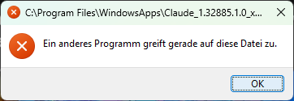

# Roadmap




eie sache: kannst du mir kurz erklären wenn ichruntime-analysy.nvim :RATelenteryStart bzw enes der varianten verwende, dann weren ja datenpunhkte aufgezeichnet (sinn dhinter) - ich möchte wissen, werden die d aten live geschrieben oder erst dann, wenn ich mit Stop die aufzeichnunjg beende?
Was ist wenn ich die teemtry starte, dann nvim beeende und neu starte, muss ich dann die telemtry daten neu starten oder lauft die az´fzeichung weiter?
idealerweiße wäre ews m.M. nach sp, dass bei beenen von nvim die daten mal geschrben werden (um sie zusaven sozusagen) und wenn nvim wieder starten uohhne die telemtry zu beenden, dann lauft die aufzeichung weiter und wrid dann updatet. wenn sie ncht "live" geschireben/saved wird, dann wäre ein usrcmd tol, mit dem man de daten mal schreben kann ohne die telemtry zu ebeenden.
weiters: es wre tol, wenn mandie telemtry beendet, dann wird manja aufefordert einen pfad z uwählen zum svcen. der pfad passt auch, es wäre aber toll, wenn ein name vorgeschlgen wird. wenn es den dann sch gibt wird im namen eine numerierng raufgezählt oder ebbesser noch, das satum / uhrzeit s im namenm dabei


docmap beiude -> features die der user eisntellen lassen kann
docmap-desktop: mehr einstellungen fpr den user in die einstellugnen geben (eventuell auch all das was in doicumentation.nvim in der user spec als user eingestellt werden knnn)


- [ ] gopath, aber anstelle das eis den link öffnet, öffnet es ihn im file explorer. bei usrcmd könnte nman hier einen euen mode hinzufügeen: `| `:Gopath open [mode]` | `edit\|split\|vsplit\|tab` | resolve & open |`
- [ ] rechtklick menu durchtestetn und nahc plugins auftilen aubmenus...
- [ ] markdown: :Markdown list [options?] [scope? default % options cwwdf, path] mit options wie zb healdines, das  alle headlines zeigt auflistst in eine picker und man dan hin spriingen kann
---

## idden

usrcmd typo helper: wenn man einen usrmcd iengibt und man hat einen falshcen buschatben oder einen zu viel oder so, dann solles nicht fehlschlagen sondern lib.nvim ui.kit prompt ob man vl den commafd XY oder YX gemeint hat und mn ann sch dan den richtigen aussuchen und durchführen.
wie aufwendig wäre das für ale usrcmds meiner polugins? kann man das als zusätzliches fature, das man enaben/diasbalen kann, üer das lib.nvim usrcmd.´ / usrcmd.composer gleich mitr shippen?


## casedesk

---

### Solution(s)

hierzu äwre ein temlate gut, dass ich dann von einer ai ausfpllen lassen kann, wenn der case solved ist. kannst du das erstellen, mit keywords ausfüllen us.w... so das süäter die solutions files von einer ai zw ohne ai nur mit der heuritsik durcsucht werden können.
:Case solution bzw solve sold ann das gleich auch höandlen zum eingeben der solution
dazu braucht es ein workflow udn ein konzept. das ollte an auch in C:\users\StefanBartl\AppData\Local\nvim\docs\NOTES\casedesk  stehen...

---

### update der \nvim\docs

alle neune commands usw..
use cases ersellen, so dass ich suchen kann " ich will eine xy im case" -> dann so

---

### ai implemeniterung

endlich die ai implementierung angehen. claude code wäre ideal ich hbe einen pro account, aber ich weioß nicht, ob es damit überhauüt geht. gemini nehmen ich bisher üner die web ui das funkt auch ganz gut inhaltlich

---

## Misc

- nvim performance optimeren: startup modul, runtime analysis, docmap, usw...

---

## (AN CLAUDE: NOCH NIHCT IMPLEMENTIEREN: EINFACH IGNORIEREN!)

- [ ] spotlight: warum `leader mk`? Und nicht `leader s*`? itte umstelen. sofdern nichts dagegen spricht (andere mappings). update doe docs und auch C:/Users/bartl/AppData/Local/nvim/docs/NOTES/BINDINGS  (hier kajnn man auch checken ob eine keymaps schon besetzte ist=)
- spotlight checken und lernen
- documentation.nvim lernen
- [ ]  Könnte es nicht eine "neue art" software sein, alle meine nvim plugins entweder mit oder ohne einer nvim instanz gemeinesam bündeln und als bnary ausgheben, so das s man es wieder wie normales nvim aber halt mit + verewnden kann.
  - [ ] recommender.nvimmus nicht mitggeshipped werdem; vielleicht verwchiedene ausbaustufen bereitstellen: Base mit lib.nvim und wenigen wichtigen, dann eine versoin wo zusätliche oplugins dabei sind. usw.. als idee
- [ ] `learn-cli.nvim` vielleicht doch ?
- [ ] E:\repos\Notes\ProjectIdeas: Durchgehen und anlysieren lassen
- [ ] finish & checkists & review in nvim config durchjagen

1. `leader wq`: Alle issues lösen
  1. dass was wq macht in einem `lib.nvim / lib.nvim.ui` ausgeben
2. `/wkdoptions`
  1. UI Linemarker gehört README
  2. `wkdoptions` mit `options.lua` verheiraten (vielleicht als default_options)
3. `nvim/init.lua` durchgehen
4. [ ] Funktionen/Module identifizieren, die man mit FFI/C performanter machen könnte
  - [ ] `/nvim/lua/` – alle Module durchgehen und checken, ob sie irgendwo hineinpassen

- `z` - zoxide soll $REPOS_DIR auflösen können; Powershell soll alle meine repo ordner auflösen können. also wkdbooks -> cd $REPOS_DIR/wkdbooks usw..
- Alle claud ebranches in allen plugins entfernen

---

## Implementieren

- [ ] `nvim/lua/autocmds` analysieren:
  - [ ] Refactoring?
    - [ ] `nvim/lua/autocmds` nach `nvim/lua/Bindings`
  - [ ] Welche automcds gehören in ein projet von  einen in C:\Users\bartl\AppData\Local\nvim\docs\ROADMAP\IDEAS?

- wenn man eine ganzeu zeile markiert, also shiift v im nomralmode, und dann diese in backticks umhüllen will, dabn macht man danach `` aber es umhült nicht sonder macht:
    C:/Users/bartl/AppData/Local/nvim/docs/ROADMAP/personal/documentation.nvim.md
    ```
  also hängt in der nächsten zeile eiunfach dreio backticks an.
- [ ] strg+v soll trimmen

- [ ] `lua/config/menu` nach `lua/wkdnvchad`?
- [ ] Autocompletion beim schreiben funktiert schon mit zusätzlichen dictionary bvon mir, jetzt wäre es noch toll, wenn oft verwendete höher geranked werden bei den vorschlägen

## ZIEL

1. Alle plugin fähigen Module augliedern
2. Funktionen/Module/ganze Custom Plugins, die man mit ffi über vc performanter machen könnte?
  1.  Eventuell wie eine zweite runtime alle sinnvollen plugins darin laufen lassen, die mit nvim gemeinsam gestartet wir Eventuell wie eine zweite runtime alle sinnvollen plugins darin laufe n lassen, die mit nvim gemeinsam gestartet wirdd
-2. `BINDINGS.lua`: In der Descrtiptionder Keymaps und Usrcmds: Das plugin selbst nicht nennen,, wie zb.: "[iletree]:" in fileteree.nvim keymap descreiption
3. `/autcmds`
  1. passt zu `/bindings` ?
  2. autocmds aller folder zusammen in einer /autcmd und dort dann korrekte anordnung, also nach events usw,... sodass die performance steigt.

---

