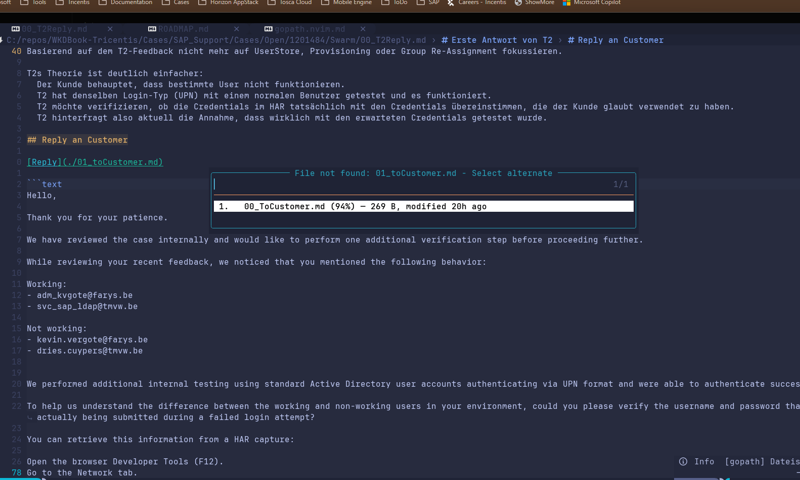

[Reply](./01_toCustomer.md)

Wennich daruaf `gF` ausführe unddie file nicht existiert, abrer eine 00_toCustomer.md, dann schlagt es mir vor, ob ich diese file meinte und öffnen möchte. Es kann aber auch sein, dass ich 00_toCustomer.md nicht öffnen möchte, sondern iene neue file mit `01_toCustomer.md` anegen möchte. Das sollte immer möglich sein und implementiert werden. Bitte auch checken, ob ein ähnliches szenario in anderen bindings sinn macht bzw bitte auch eine entsprechende Task mal formulieren.

---

