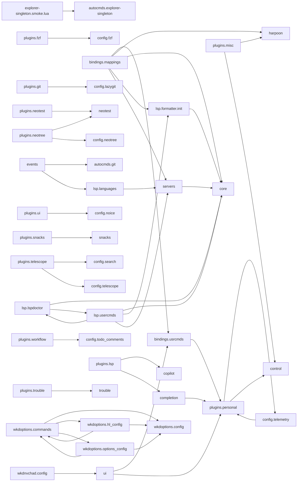

# nvim — module map

> **Generated** by `documentation`. Do not edit by hand — run `:DocMap`
> (or `nvim --headless -l scripts/gen_map.lua`) to regenerate.

**109 modules** · 358 namespaces · 337 helper files

The [interactive map](index.html) has filtering, full descriptions and
source links; this page is the version the code host renders directly.

## Namespaces

```mermaid
flowchart LR
  nlua["nvim"]
  nlua_autocmds["autocmdsbr/smallInitialize module for 'autocmds' FIX:…/small"]
  nlua_autocmds_events["events"]
  nlua_autocmds_general["generalbr/smallCentralized, toggleable autocmd suite with…/small"]
  nlua_autocmds_git["gitbr/smallOrchestrates all Git-related autocommands…/small"]
  nlua_autocmds_terminals["terminalsbr/smallTerminal-focused autocommands with feature…/small"]
  nlua_autocmds_text["textbr/smallText-focused autocommands with feature…/small"]
  nlua_bindings["bindings"]
  nlua_bindings_mappings["mappingsbr/smallEntry point to register all keymaps grouped…/small"]
  nlua_bindings_usrcmds["usrcmdsbr/smallInitialize module for 'bindings.usrcmds'/small"]
  nlua_config["config"]
  nlua_config_ai["ai"]
  nlua_config_copilot["copilot"]
  nlua_config_fzf["fzfbr/smallComposed fzf-lua configuration with custom…/small"]
  nlua_config_gp_config["gp_config"]
  nlua_config_harpoon["harpoon"]
  nlua_config_inc_rename["inc_rename"]
  nlua_config_lazy["lazy"]
  nlua_config_lazygit["lazygitbr/smallBridge that lets LazyGit custom commands…/small"]
  nlua_config_mason["mason"]
  nlua_config_menu["menubr/smallOrchestrates submodules and exposes a…/small"]
  nlua_config_neotest["neotest"]
  nlua_config_neotree["neotreebr/smallNeo-tree unified configuration and…/small"]
  nlua_config_noice["noice"]
  nlua_config_search["searchbr/smallCentralized configuration for search.nvim./small"]
  nlua_config_snacks["snacks"]
  nlua_config_tabufline["tabuflinebr/smallCustom buffer navigation without automatic…/small"]
  nlua_config_telescope["telescopebr/smallModularized Telescope setup with file…/small"]
  nlua_config_todo_comments["todo_comments"]
  nlua_config_treesitter["treesitter"]
  nlua_config_trouble["trouble"]
  nlua_lsp["lspbr/smallNative LSP bootstrap for Neovim ≥ 0.11./small"]
  nlua_lsp_completion["completion"]
  nlua_lsp_core["core"]
  nlua_lsp_debug_adapters["debug_adapters"]
  nlua_lsp_diagnostics["diagnosticsbr/smallEntry point for diagnostics helpers…/small"]
  nlua_lsp_formatter["formatterbr/smallFormatter API with on-save toggle,…/small"]
  nlua_lsp_languages["languages"]
  nlua_lsp_lspdoctor["lspdoctorbr/smallLSP Doctor provides multiple diagnostic…/small"]
  nlua_lsp_servers["servers"]
  nlua_lsp_tools["tools"]
  nlua_lsp_usercmds["usercmdsbr/smallLSP UserCommands - Main Registry Delegates…/small"]
  nlua_nvchad["nvchad"]
  nlua_plugins["plugins"]
  nlua_plugins_ai["ai"]
  nlua_plugins_colorscheme["colorscheme"]
  nlua_plugins_control["control"]
  nlua_plugins_github_stats["github-stats"]
  nlua_plugins_personal["personalbr/smallPersonal and local development plugins -…/small"]
  nlua_startup["startupbr/smallStartup phase runner with built-in…/small"]
  nlua_themes["themes"]
  nlua_wkdnvchad["wkdnvchad"]
  nlua_wkdnvchad_config["configbr/smallCentral configuration loader with…/small"]
  nlua_wkdnvchad_mappings["mappingsbr/smallMappings using lib.map for consistency/small"]
  nlua_wkdnvchad_ui["ui"]
  nlua_wkdnvchad_usrcmd["usrcmdbr/smallProvides :UI usercommand for runtime UI…/small"]
  nlua_wkdoptions["wkdoptionsbr/smallEntry point that enables the two…/small"]
  nlua_wkdoptions_commands["commandsbr/smallUser command registration system for…/small"]
  nlua_wkdoptions_config["configbr/smallCentral, modular configuration with lazy…/small"]
  nlua_wkdoptions_doc["doc"]
  nlua_wkdoptions_docs["docs"]
  nlua_wkdoptions_hl_config["hl_configbr/smallVisual/UX feature orchestrator (refactored…/small"]
  nlua_wkdoptions_indent_per_ft["indent_per_ftbr/small── Indent width per filetype…/small"]
  nlua_wkdoptions_italic_keywords["italic_keywords"]
  nlua_wkdoptions_options_config["options_configbr/smallEditor option toggles & global behaviors…/small"]
  nlua_wkdoptions_qflist["qflist"]
  nlua_wkdoptions_set_diff_profile["set_diff_profile"]
  nlua_wkdoptions_ui["ui"]
  nlua --> nlua_autocmds
  nlua_autocmds --> nlua_autocmds_events
  nlua_autocmds --> nlua_autocmds_general
  nlua_autocmds --> nlua_autocmds_git
  nlua_autocmds --> nlua_autocmds_terminals
  nlua_autocmds --> nlua_autocmds_text
  nlua --> nlua_bindings
  nlua_bindings --> nlua_bindings_mappings
  nlua_bindings --> nlua_bindings_usrcmds
  nlua --> nlua_config
  nlua_config --> nlua_config_ai
  nlua_config --> nlua_config_copilot
  nlua_config --> nlua_config_fzf
  nlua_config --> nlua_config_gp_config
  nlua_config --> nlua_config_harpoon
  nlua_config --> nlua_config_inc_rename
  nlua_config --> nlua_config_lazy
  nlua_config --> nlua_config_lazygit
  nlua_config --> nlua_config_mason
  nlua_config --> nlua_config_menu
  nlua_config --> nlua_config_neotest
  nlua_config --> nlua_config_neotree
  nlua_config --> nlua_config_noice
  nlua_config --> nlua_config_search
  nlua_config --> nlua_config_snacks
  nlua_config --> nlua_config_tabufline
  nlua_config --> nlua_config_telescope
  nlua_config --> nlua_config_todo_comments
  nlua_config --> nlua_config_treesitter
  nlua_config --> nlua_config_trouble
  nlua --> nlua_lsp
  nlua_lsp --> nlua_lsp_completion
  nlua_lsp --> nlua_lsp_core
  nlua_lsp --> nlua_lsp_debug_adapters
  nlua_lsp --> nlua_lsp_diagnostics
  nlua_lsp --> nlua_lsp_formatter
  nlua_lsp --> nlua_lsp_languages
  nlua_lsp --> nlua_lsp_lspdoctor
  nlua_lsp --> nlua_lsp_servers
  nlua_lsp --> nlua_lsp_tools
  nlua_lsp --> nlua_lsp_usercmds
  nlua --> nlua_nvchad
  nlua --> nlua_plugins
  nlua_plugins --> nlua_plugins_ai
  nlua_plugins --> nlua_plugins_colorscheme
  nlua_plugins --> nlua_plugins_control
  nlua_plugins --> nlua_plugins_github_stats
  nlua_plugins --> nlua_plugins_personal
  nlua --> nlua_startup
  nlua --> nlua_themes
  nlua --> nlua_wkdnvchad
  nlua_wkdnvchad --> nlua_wkdnvchad_config
  nlua_wkdnvchad --> nlua_wkdnvchad_mappings
  nlua_wkdnvchad --> nlua_wkdnvchad_ui
  nlua_wkdnvchad --> nlua_wkdnvchad_usrcmd
  nlua --> nlua_wkdoptions
  nlua_wkdoptions --> nlua_wkdoptions_commands
  nlua_wkdoptions --> nlua_wkdoptions_config
  nlua_wkdoptions --> nlua_wkdoptions_doc
  nlua_wkdoptions --> nlua_wkdoptions_docs
  nlua_wkdoptions --> nlua_wkdoptions_hl_config
  nlua_wkdoptions --> nlua_wkdoptions_indent_per_ft
  nlua_wkdoptions --> nlua_wkdoptions_italic_keywords
  nlua_wkdoptions --> nlua_wkdoptions_options_config
  nlua_wkdoptions --> nlua_wkdoptions_qflist
  nlua_wkdoptions --> nlua_wkdoptions_set_diff_profile
  nlua_wkdoptions --> nlua_wkdoptions_ui
```

## Dependencies

Which parts of the tree require which, rolled up to the second level.
The [interactive map](index.html)'s **Deps** view has this per module,
in both directions, with load-time and lazy requires told apart.

## Modules

| Module | Description | Fns | Docs |
|---|---|---|---|
| `autocmds` | Initialize module for 'autocmds' FIX: Modularisere die submodule in eigene module AUDIT: Wenn keine Probleme, dann dauerhaft implementieren, aber nach… |  | [src](../../lua/autocmds/init.lua) |
| &nbsp;&nbsp;`events` |  |  |  |
| &nbsp;&nbsp;&nbsp;&nbsp;`utils` |  |  |  |
| &nbsp;&nbsp;`autocmds.general` | Centralized, toggleable autocmd suite with safe defaults and idempotent setup. | 1 | [src](../../lua/autocmds/general/init.lua) |
| &nbsp;&nbsp;`autocmds.git` | Orchestrates all Git-related autocommands by delegating to submodules. | 1 | [src](../../lua/autocmds/git/init.lua) |
| &nbsp;&nbsp;`autocmds.terminals` | Terminal-focused autocommands with feature flags. | 1 | [src](../../lua/autocmds/terminals/init.lua) |
| &nbsp;&nbsp;`autocmds.text` | Text-focused autocommands with feature flags and detailed options. | 2 | [src](../../lua/autocmds/text/init.lua) |
| `bindings` |  |  |  |
| &nbsp;&nbsp;`bindings.mappings` | Entry point to register all keymaps grouped by topic. | 1 | [src](../../lua/bindings/mappings/init.lua) |
| &nbsp;&nbsp;&nbsp;&nbsp;`utils` |  |  |  |
| &nbsp;&nbsp;&nbsp;&nbsp;&nbsp;&nbsp;`mapings.utils.window_zoom` | Toggle maximize current window and restore previous layout sizes. | 4 | [src](../../lua/bindings/mappings/utils/window_zoom/init.lua) |
| &nbsp;&nbsp;`bindings.usrcmds` | Initialize module for 'bindings.usrcmds' |  | [src](../../lua/bindings/usrcmds/init.lua) |
| &nbsp;&nbsp;&nbsp;&nbsp;`bindings.usrcmds.bindings_explorer` | `:Bindings` — Picker über die BINDINGS-Cheatsheets (docs/NOTES/ PersonelPlugins/BINDINGS + docs/NOTES/ExternPlugins/Bindings). | 8 | [src](../../lua/bindings/usrcmds/bindings_explorer/init.lua) |
| &nbsp;&nbsp;&nbsp;&nbsp;&nbsp;&nbsp;`doc` |  |  |  |
| &nbsp;&nbsp;&nbsp;&nbsp;&nbsp;&nbsp;`docs` |  |  |  |
| &nbsp;&nbsp;&nbsp;&nbsp;`bindings.usrcmds.case` | :Case — SAP-Support case scaffolding. | 8 | [src](../../lua/bindings/usrcmds/case/init.lua) |
| &nbsp;&nbsp;&nbsp;&nbsp;&nbsp;&nbsp;`docs` |  |  |  |
| &nbsp;&nbsp;&nbsp;&nbsp;&nbsp;&nbsp;`extract` |  |  |  |
| &nbsp;&nbsp;&nbsp;&nbsp;&nbsp;&nbsp;`bindings.usrcmds.case.sla` | Public API for casedesk's SLA layer (docs/ROADMAP/casedesk/SLA.md): given a case, which of the three SAP-SLA clocks (Erstreaktion, laufende Rückmeldung,… | 10 | [src](../../lua/bindings/usrcmds/case/sla/init.lua) |
| &nbsp;&nbsp;&nbsp;&nbsp;&nbsp;&nbsp;`templates` |  |  |  |
| &nbsp;&nbsp;&nbsp;&nbsp;`bindings.usrcmds.plugin_repos` | source mode of the personal plugin list — plus an interactive picker. | 18 | [README](../../lua/bindings/usrcmds/plugin_repos/README.md) · [src](../../lua/bindings/usrcmds/plugin_repos/init.lua) |
| &nbsp;&nbsp;&nbsp;&nbsp;`bindings.usrcmds.update_repos` | Registers `:MyReposUpdate [path]`. | 7 | [src](../../lua/bindings/usrcmds/update_repos/init.lua) |
| &nbsp;&nbsp;&nbsp;&nbsp;`bindings.usrcmds.who_locks` | Registers `:WhoLocks [path]`. | 3 | [src](../../lua/bindings/usrcmds/who_locks/init.lua) |
| `config` |  |  |  |
| &nbsp;&nbsp;`ai` |  |  |  |
| &nbsp;&nbsp;&nbsp;&nbsp;`config.ai.anthropic` | Anthropic provider configuration for Avante. |  | [src](../../lua/config/ai/anthropic/init.lua) |
| &nbsp;&nbsp;`copilot` |  |  |  |
| &nbsp;&nbsp;`config.fzf` | Composed fzf-lua configuration with custom actions | 1 | [src](../../lua/config/fzf/init.lua) |
| &nbsp;&nbsp;&nbsp;&nbsp;`config.fzf.files` | File picker (fd) configuration and entry formatting | 4 | [src](../../lua/config/fzf/files/init.lua) |
| &nbsp;&nbsp;&nbsp;&nbsp;`config.fzf.fzf_opts` | Low-level fzf command-line options History is owned by pickers.nvim (history.fzf_scope = "patch" in its setup()), which patches fzf-lua's… | 1 | [src](../../lua/config/fzf/fzf_opts/init.lua) |
| &nbsp;&nbsp;&nbsp;&nbsp;`config.fzf.grep` | ripgrep configuration for fzf-lua | 1 | [src](../../lua/config/fzf/grep/init.lua) |
| &nbsp;&nbsp;&nbsp;&nbsp;`config.fzf.keymaps` | Keymaps for fzf-lua (fzf prompt). | 1 | [src](../../lua/config/fzf/keymaps/init.lua) |
| &nbsp;&nbsp;`gp_config` |  |  |  |
| &nbsp;&nbsp;&nbsp;&nbsp;`hooks` |  |  |  |
| &nbsp;&nbsp;`harpoon` |  |  |  |
| &nbsp;&nbsp;&nbsp;&nbsp;`docs` |  |  |  |
| &nbsp;&nbsp;&nbsp;&nbsp;`types.harpoon` | Add these or adapt your existing type file accordingly. |  | [src](../../lua/config/harpoon/types/init.lua) |
| &nbsp;&nbsp;&nbsp;&nbsp;`ui` |  |  |  |
| &nbsp;&nbsp;&nbsp;&nbsp;`utils` |  |  |  |
| &nbsp;&nbsp;`inc_rename` |  | 3 | [src](../../lua/config/inc_rename/init.lua) |
| &nbsp;&nbsp;`config.lazy_config` |  |  | [src](../../lua/config/lazy/init.lua) |
| &nbsp;&nbsp;`config.lazygit` | Bridge that lets LazyGit custom commands open files in the *parent* Neovim. | 1 | [README](../../lua/config/lazygit/README.md) · [src](../../lua/config/lazygit/init.lua) |
| &nbsp;&nbsp;&nbsp;&nbsp;`actions` |  |  |  |
| &nbsp;&nbsp;&nbsp;&nbsp;`docs` |  |  | [README](../../lua/config/lazygit/docs/README.md) |
| &nbsp;&nbsp;`mason` |  |  |  |
| &nbsp;&nbsp;&nbsp;&nbsp;`config.mason.ensure_install` | Ensure-install facade around mason.nvim (and its registry) for LSPs, DAP adapters, linters and formatters. | 13 | [src](../../lua/config/mason/ensure_install/init.lua) |
| &nbsp;&nbsp;&nbsp;&nbsp;&nbsp;&nbsp;`defaults` |  |  |  |
| &nbsp;&nbsp;`config/menu/init.lua` | Orchestrates submodules and exposes a setup() that controls which top-level menu entries are enabled. | 1 | [src](../../lua/config/menu/init.lua) |
| &nbsp;&nbsp;&nbsp;&nbsp;`config/menu/custom_menu.lua` | Returns the menu table for quick requires if desired | 4 | [src](../../lua/config/menu/custom_menu/init.lua) |
| &nbsp;&nbsp;&nbsp;&nbsp;`docs` |  |  |  |
| &nbsp;&nbsp;`neotest` |  |  |  |
| &nbsp;&nbsp;&nbsp;&nbsp;`config.neotest.actions` | Centralized Neotest actions usable by keymaps, usercommands and menus. | 10 | [src](../../lua/config/neotest/actions/init.lua) |
| &nbsp;&nbsp;&nbsp;&nbsp;`adapters` |  |  |  |
| &nbsp;&nbsp;&nbsp;&nbsp;`autocmds` |  |  |  |
| &nbsp;&nbsp;&nbsp;&nbsp;`config.neotest.commands` | User commands for Neotest based on shared actions. | 1 | [src](../../lua/config/neotest/commands/init.lua) |
| &nbsp;&nbsp;&nbsp;&nbsp;`consumers` |  |  |  |
| &nbsp;&nbsp;&nbsp;&nbsp;`config.neotest.core` | Core configuration and utilities for neotest integration | 4 | [src](../../lua/config/neotest/core/init.lua) |
| &nbsp;&nbsp;&nbsp;&nbsp;`config.neotest.debug` |  | 3 | [src](../../lua/config/neotest/debug/init.lua) |
| &nbsp;&nbsp;&nbsp;&nbsp;`docs` |  |  |  |
| &nbsp;&nbsp;&nbsp;&nbsp;`config.neotest.highlights` | Neotest highlight groups setup | 1 | [src](../../lua/config/neotest/highlights/init.lua) |
| &nbsp;&nbsp;&nbsp;&nbsp;`init` |  |  |  |
| &nbsp;&nbsp;&nbsp;&nbsp;&nbsp;&nbsp;`checks` |  |  |  |
| &nbsp;&nbsp;&nbsp;&nbsp;`config.neotest.keymaps` | Neotest keymaps using centralized actions. | 1 | [src](../../lua/config/neotest/keymaps/init.lua) |
| &nbsp;&nbsp;&nbsp;&nbsp;`config.neotest.neotree` | Neo-tree integration for Neotest actions. | 2 | [src](../../lua/config/neotest/neotree/init.lua) |
| &nbsp;&nbsp;&nbsp;&nbsp;`config.neotest.telescope` | Telescope picker for Neotest actions. | 1 | [src](../../lua/config/neotest/telescope/init.lua) |
| &nbsp;&nbsp;&nbsp;&nbsp;`utils` |  |  |  |
| &nbsp;&nbsp;&nbsp;&nbsp;`config.neotest.which_key` | Which-key integration for Neotest actions (new spec) | 1 | [src](../../lua/config/neotest/whichkey/init.lua) |
| &nbsp;&nbsp;`config.neotree` | Neo-tree unified configuration and initialization | 2 | [src](../../lua/config/neotree/init.lua) |
| &nbsp;&nbsp;&nbsp;&nbsp;`config.neotree.checkhealth` | Aggregated health checks for Neo-tree configuration | 1 | [src](../../lua/config/neotree/checkhealth/init.lua) |
| &nbsp;&nbsp;&nbsp;&nbsp;`commands` |  |  |  |
| &nbsp;&nbsp;&nbsp;&nbsp;&nbsp;&nbsp;`config.neotree.commands.source` |  | 2 | [src](../../lua/config/neotree/commands/source/init.lua) |
| &nbsp;&nbsp;&nbsp;&nbsp;`config.neotree.event_handlers` | Neo-tree unified event handlers configuration |  | [README](../../lua/config/neotree/event_handlers/README.md) · [src](../../lua/config/neotree/event_handlers/init.lua) |
| &nbsp;&nbsp;&nbsp;&nbsp;`config.neotree.keymaps` | Centralized, buffer-local Neo-tree keymaps that override defaults consistently. |  | [src](../../lua/config/neotree/keymaps/init.lua) |
| &nbsp;&nbsp;&nbsp;&nbsp;&nbsp;&nbsp;`config.neotree.keymaps.filesystem` | Entry point that merges all filesystem keymap modules into a single mapping table. |  | [src](../../lua/config/neotree/keymaps/filesystem/init.lua) |
| &nbsp;&nbsp;&nbsp;&nbsp;`sources` |  |  |  |
| &nbsp;&nbsp;&nbsp;&nbsp;`config.neotree.usercmds` |  | 1 | [src](../../lua/config/neotree/usercmds/init.lua) |
| &nbsp;&nbsp;&nbsp;&nbsp;`config.neotree.utils` | Unified utilities for Neo-tree configuration | 3 | [src](../../lua/config/neotree/utils/init.lua) |
| &nbsp;&nbsp;&nbsp;&nbsp;`window` |  |  |  |
| &nbsp;&nbsp;&nbsp;&nbsp;&nbsp;&nbsp;`open` |  |  |  |
| &nbsp;&nbsp;&nbsp;&nbsp;&nbsp;&nbsp;&nbsp;&nbsp;`keymaps` |  |  |  |
| &nbsp;&nbsp;`config.noice` |  |  | [src](../../lua/config/noice/init.lua) |
| &nbsp;&nbsp;`config.search` | Centralized configuration for search.nvim. | 1 | [src](../../lua/config/search/init.lua) |
| &nbsp;&nbsp;`snacks` |  |  |  |
| &nbsp;&nbsp;&nbsp;&nbsp;`docs` |  |  |  |
| &nbsp;&nbsp;&nbsp;&nbsp;`config.snacks.mappings.init` | Keymap definitions for folke/snacks.nvim. | 1 | [src](../../lua/config/snacks/mappings/init.lua) |
| &nbsp;&nbsp;&nbsp;&nbsp;`config.snacks.picker` | Thin adapter that assembles the `Snacks.picker` options from pickers.nvim so the in-picker UX is unified across every engine (telescope / fzf-lua / snacks): | 8 | [src](../../lua/config/snacks/picker/init.lua) |
| &nbsp;&nbsp;`config.tabufline` | Custom buffer navigation without automatic centering | 5 | [src](../../lua/config/tabufline/init.lua) |
| &nbsp;&nbsp;`config.telescope` | Modularized Telescope setup with file browser keymaps. | 6 | [src](../../lua/config/telescope/init.lua) |
| &nbsp;&nbsp;&nbsp;&nbsp;`file_browser` |  |  |  |
| &nbsp;&nbsp;`config.todo_comments` |  | 4 | [src](../../lua/config/todo_comments/init.lua) |
| &nbsp;&nbsp;&nbsp;&nbsp;`colors` |  |  |  |
| &nbsp;&nbsp;&nbsp;&nbsp;`config.todo_comments.keywords` |  |  | [src](../../lua/config/todo_comments/keywords/init.lua) |
| &nbsp;&nbsp;`treesitter` |  |  |  |
| &nbsp;&nbsp;`trouble` |  |  |  |
| `lsp` | Native LSP bootstrap for Neovim ≥ 0.11. | 1 | [src](../../lua/lsp/init.lua) |
| &nbsp;&nbsp;`completion` |  |  |  |
| &nbsp;&nbsp;&nbsp;&nbsp;`lsp.completion.personal_names` | nvim-cmp source completing this config's ~30 dotted personal-plugin names (e.g. | 11 | [src](../../lua/lsp/completion/personal_names/init.lua) |
| &nbsp;&nbsp;`core` |  |  |  |
| &nbsp;&nbsp;`dap` |  |  | [src](../../lua/lsp/debug_adapters/init.lua) |
| &nbsp;&nbsp;&nbsp;&nbsp;`webdev` |  |  |  |
| &nbsp;&nbsp;&nbsp;&nbsp;&nbsp;&nbsp;`lsp.debug_adapters.webdev.browser` | Browser-basiertes Debugging für Web-Anwendungen mit js-debug-adapter [[ |  | [src](../../lua/lsp/debug_adapters/webdev/browser/init.lua) |
| &nbsp;&nbsp;`lsp.diagnostics` | Entry point for diagnostics helpers (commands + keymaps). | 1 | [src](../../lua/lsp/diagnostics/init.lua) |
| &nbsp;&nbsp;`lsp.formatter.init` | Formatter API with on-save toggle, Conform-first strategy, and view preservation. | 1 | [src](../../lua/lsp/formatter/init.lua) |
| &nbsp;&nbsp;`lsp.languages` |  | 6 | [src](../../lua/lsp/languages/init.lua) |
| &nbsp;&nbsp;&nbsp;&nbsp;`app` |  |  |  |
| &nbsp;&nbsp;&nbsp;&nbsp;`documentation` |  |  |  |
| &nbsp;&nbsp;&nbsp;&nbsp;&nbsp;&nbsp;`lsp.languages.documentation.markdown_words` | nvim-cmp source that provides project-wide word completions for Markdown files. | 15 | [README](../../lua/lsp/languages/documentation/markdown_words/README.md) · [src](../../lua/lsp/languages/documentation/markdown_words/init.lua) |
| &nbsp;&nbsp;&nbsp;&nbsp;`scripting` |  |  |  |
| &nbsp;&nbsp;&nbsp;&nbsp;`systems` |  |  |  |
| &nbsp;&nbsp;&nbsp;&nbsp;`lsp.languages.webdev` |  | 1 | [src](../../lua/lsp/languages/webdev/init.lua) |
| &nbsp;&nbsp;&nbsp;&nbsp;&nbsp;&nbsp;`lsp.languages.webdev.astro` |  | 1 | [src](../../lua/lsp/languages/webdev/astro/init.lua) |
| &nbsp;&nbsp;`lsp.lspdoctor` | LSP Doctor provides multiple diagnostic modes for inspecting LSP state: - health: Server health checks (running, configured, errors) - debug: Configuration… | 9 | [README](../../lua/lsp/lspdoctor/README.md) · [src](../../lua/lsp/lspdoctor/init.lua) |
| &nbsp;&nbsp;&nbsp;&nbsp;`doc` |  |  |  |
| &nbsp;&nbsp;`servers` |  |  |  |
| &nbsp;&nbsp;&nbsp;&nbsp;`lsp.servers.lua_ls` | Lua language server setup using native LSP config/enable with strict root and scoped libraries. | 1 | [README](../../lua/lsp/servers/lua_ls/README.md) · [src](../../lua/lsp/servers/lua_ls/init.lua) |
| &nbsp;&nbsp;&nbsp;&nbsp;&nbsp;&nbsp;`docs` |  |  |  |
| &nbsp;&nbsp;&nbsp;&nbsp;`lsp.servers.marksman` | Marksman (Markdown) via native LSP config/enable with scoped diagnostics filter. | 1 | [src](../../lua/lsp/servers/marksman/init.lua) |
| &nbsp;&nbsp;&nbsp;&nbsp;`mobiledev` |  |  |  |
| &nbsp;&nbsp;&nbsp;&nbsp;`webdev` |  |  |  |
| &nbsp;&nbsp;&nbsp;&nbsp;&nbsp;&nbsp;`lsp.servers.webdev.astro` | Astro Language Server für .astro Komponenten FIXED: Consistent server name across config/enable | 1 | [src](../../lua/lsp/servers/webdev/astro/init.lua) |
| &nbsp;&nbsp;&nbsp;&nbsp;&nbsp;&nbsp;`lsp.servers.webdev.htmx_lsp` | HTMX Language Server für HTMX-Attribute | 2 | [src](../../lua/lsp/servers/webdev/htmx/init.lua) |
| &nbsp;&nbsp;`tools` |  |  |  |
| &nbsp;&nbsp;&nbsp;&nbsp;`lsp.tools.deprecated_help.init` | Initialization entry for the modularized deprecated-warning helper. | 1 | [src](../../lua/lsp/tools/deprecated_help/init.lua) |
| &nbsp;&nbsp;&nbsp;&nbsp;&nbsp;&nbsp;`doc` |  |  |  |
| &nbsp;&nbsp;&nbsp;&nbsp;&nbsp;&nbsp;`lsp` |  |  |  |
| &nbsp;&nbsp;&nbsp;&nbsp;&nbsp;&nbsp;&nbsp;&nbsp;`lua_ls` |  |  |  |
| &nbsp;&nbsp;&nbsp;&nbsp;`lsp.tools.eslint_prettier` | Main entry for eslint_prettier tooling. | 2 | [src](../../lua/lsp/tools/eslint_prettier/init.lua) |
| &nbsp;&nbsp;&nbsp;&nbsp;&nbsp;&nbsp;`lsp.tools.eslint_prettier.autocmds` | Attach autocmds (BufWritePre) for lint+format with toggle support. | 1 | [src](../../lua/lsp/tools/eslint_prettier/autocmds/init.lua) |
| &nbsp;&nbsp;&nbsp;&nbsp;&nbsp;&nbsp;`core` |  |  |  |
| &nbsp;&nbsp;&nbsp;&nbsp;&nbsp;&nbsp;`doc` |  |  | [README](../../lua/lsp/tools/eslint_prettier/doc/README.md) |
| &nbsp;&nbsp;&nbsp;&nbsp;&nbsp;&nbsp;`lsp.tools.eslint_prettier.eslint` | eslint utilities and bin resolution | 3 | [src](../../lua/lsp/tools/eslint_prettier/eslint/init.lua) |
| &nbsp;&nbsp;&nbsp;&nbsp;&nbsp;&nbsp;`lsp.tools.eslint_prettier.prettier` |  | 3 | [src](../../lua/lsp/tools/eslint_prettier/prettier/init.lua) |
| &nbsp;&nbsp;&nbsp;&nbsp;&nbsp;&nbsp;`lsp.tools.eslint_prettier.usercmds` | Create user commands like :EslintFix, :PrettierFormat, :LintAndFormat, :ToggleLintFormatOnSave | 1 | [src](../../lua/lsp/tools/eslint_prettier/usercmds/init.lua) |
| &nbsp;&nbsp;&nbsp;&nbsp;`mappings.lsp_signature` | Provides Insert- and Normal-mode mapping for LSP signature help / hover preview. | 1 | [README](../../lua/lsp/tools/lsp_signature/README.md) · [src](../../lua/lsp/tools/lsp_signature/init.lua) |
| &nbsp;&nbsp;&nbsp;&nbsp;&nbsp;&nbsp;`highlights` |  |  |  |
| &nbsp;&nbsp;&nbsp;&nbsp;&nbsp;&nbsp;`utils` |  |  |  |
| &nbsp;&nbsp;&nbsp;&nbsp;`lsp.tools.ts_type_lookup` |  | 1 | [src](../../lua/lsp/tools/ts_type_lookup/init.lua) |
| &nbsp;&nbsp;&nbsp;&nbsp;&nbsp;&nbsp;`doc` |  |  | [README](../../lua/lsp/tools/ts_type_lookup/doc/README.md) |
| &nbsp;&nbsp;`lsp.usercmds` | LSP UserCommands - Main Registry Delegates to specialized submodules for each command | 2 | [README](../../lua/lsp/usercmds/README.md) · [src](../../lua/lsp/usercmds/init.lua) |
| &nbsp;&nbsp;&nbsp;&nbsp;`lsp.usercmds.mobile_diagnostics` | Diagnostic command to check mobile development setup. | 4 | [src](../../lua/lsp/usercmds/mobile_diagnostics/init.lua) |
| `nvchad` |  |  |  |
| `plugins` |  |  |  |
| &nbsp;&nbsp;`ai` |  |  |  |
| &nbsp;&nbsp;`colorscheme` |  |  |  |
| &nbsp;&nbsp;`control` |  |  |  |
| &nbsp;&nbsp;`github-stats` |  |  |  |
| &nbsp;&nbsp;&nbsp;&nbsp;`data` |  |  |  |
| &nbsp;&nbsp;&nbsp;&nbsp;&nbsp;&nbsp;`StefanBartl_buffer-ctx.nvim` |  |  |  |
| &nbsp;&nbsp;&nbsp;&nbsp;&nbsp;&nbsp;&nbsp;&nbsp;`clones` |  |  |  |
| &nbsp;&nbsp;&nbsp;&nbsp;&nbsp;&nbsp;&nbsp;&nbsp;`paths` |  |  |  |
| &nbsp;&nbsp;&nbsp;&nbsp;&nbsp;&nbsp;&nbsp;&nbsp;`referrers` |  |  |  |
| &nbsp;&nbsp;&nbsp;&nbsp;&nbsp;&nbsp;&nbsp;&nbsp;`views` |  |  |  |
| &nbsp;&nbsp;&nbsp;&nbsp;&nbsp;&nbsp;`StefanBartl_cascade.nvim` |  |  |  |
| &nbsp;&nbsp;&nbsp;&nbsp;&nbsp;&nbsp;&nbsp;&nbsp;`clones` |  |  |  |
| &nbsp;&nbsp;&nbsp;&nbsp;&nbsp;&nbsp;&nbsp;&nbsp;`paths` |  |  |  |
| &nbsp;&nbsp;&nbsp;&nbsp;&nbsp;&nbsp;&nbsp;&nbsp;`referrers` |  |  |  |
| &nbsp;&nbsp;&nbsp;&nbsp;&nbsp;&nbsp;&nbsp;&nbsp;`views` |  |  |  |
| &nbsp;&nbsp;&nbsp;&nbsp;&nbsp;&nbsp;`StefanBartl_color_my_ascii.nvim` |  |  |  |
| &nbsp;&nbsp;&nbsp;&nbsp;&nbsp;&nbsp;&nbsp;&nbsp;`clones` |  |  |  |
| &nbsp;&nbsp;&nbsp;&nbsp;&nbsp;&nbsp;&nbsp;&nbsp;`paths` |  |  |  |
| &nbsp;&nbsp;&nbsp;&nbsp;&nbsp;&nbsp;&nbsp;&nbsp;`referrers` |  |  |  |
| &nbsp;&nbsp;&nbsp;&nbsp;&nbsp;&nbsp;&nbsp;&nbsp;`views` |  |  |  |
| &nbsp;&nbsp;&nbsp;&nbsp;&nbsp;&nbsp;`StefanBartl_debugging.nvim` |  |  |  |
| &nbsp;&nbsp;&nbsp;&nbsp;&nbsp;&nbsp;&nbsp;&nbsp;`clones` |  |  |  |
| &nbsp;&nbsp;&nbsp;&nbsp;&nbsp;&nbsp;&nbsp;&nbsp;`paths` |  |  |  |
| &nbsp;&nbsp;&nbsp;&nbsp;&nbsp;&nbsp;&nbsp;&nbsp;`referrers` |  |  |  |
| &nbsp;&nbsp;&nbsp;&nbsp;&nbsp;&nbsp;&nbsp;&nbsp;`views` |  |  |  |
| &nbsp;&nbsp;&nbsp;&nbsp;&nbsp;&nbsp;`StefanBartl_diff.nvim` |  |  |  |
| &nbsp;&nbsp;&nbsp;&nbsp;&nbsp;&nbsp;&nbsp;&nbsp;`clones` |  |  |  |
| &nbsp;&nbsp;&nbsp;&nbsp;&nbsp;&nbsp;&nbsp;&nbsp;`paths` |  |  |  |
| &nbsp;&nbsp;&nbsp;&nbsp;&nbsp;&nbsp;&nbsp;&nbsp;`referrers` |  |  |  |
| &nbsp;&nbsp;&nbsp;&nbsp;&nbsp;&nbsp;&nbsp;&nbsp;`views` |  |  |  |
| &nbsp;&nbsp;&nbsp;&nbsp;&nbsp;&nbsp;`StefanBartl_emojis.nvim` |  |  |  |
| &nbsp;&nbsp;&nbsp;&nbsp;&nbsp;&nbsp;&nbsp;&nbsp;`clones` |  |  |  |
| &nbsp;&nbsp;&nbsp;&nbsp;&nbsp;&nbsp;&nbsp;&nbsp;`paths` |  |  |  |
| &nbsp;&nbsp;&nbsp;&nbsp;&nbsp;&nbsp;&nbsp;&nbsp;`referrers` |  |  |  |
| &nbsp;&nbsp;&nbsp;&nbsp;&nbsp;&nbsp;&nbsp;&nbsp;`views` |  |  |  |
| &nbsp;&nbsp;&nbsp;&nbsp;&nbsp;&nbsp;`StefanBartl_fileops.nvim` |  |  |  |
| &nbsp;&nbsp;&nbsp;&nbsp;&nbsp;&nbsp;&nbsp;&nbsp;`clones` |  |  |  |
| &nbsp;&nbsp;&nbsp;&nbsp;&nbsp;&nbsp;&nbsp;&nbsp;`paths` |  |  |  |
| &nbsp;&nbsp;&nbsp;&nbsp;&nbsp;&nbsp;&nbsp;&nbsp;`referrers` |  |  |  |
| &nbsp;&nbsp;&nbsp;&nbsp;&nbsp;&nbsp;&nbsp;&nbsp;`views` |  |  |  |
| &nbsp;&nbsp;&nbsp;&nbsp;&nbsp;&nbsp;`StefanBartl_filetree.nvim` |  |  |  |
| &nbsp;&nbsp;&nbsp;&nbsp;&nbsp;&nbsp;&nbsp;&nbsp;`clones` |  |  |  |
| &nbsp;&nbsp;&nbsp;&nbsp;&nbsp;&nbsp;&nbsp;&nbsp;`paths` |  |  |  |
| &nbsp;&nbsp;&nbsp;&nbsp;&nbsp;&nbsp;&nbsp;&nbsp;`referrers` |  |  |  |
| &nbsp;&nbsp;&nbsp;&nbsp;&nbsp;&nbsp;&nbsp;&nbsp;`views` |  |  |  |
| &nbsp;&nbsp;&nbsp;&nbsp;&nbsp;&nbsp;`StefanBartl_github_stats.nvim` |  |  |  |
| &nbsp;&nbsp;&nbsp;&nbsp;&nbsp;&nbsp;&nbsp;&nbsp;`clones` |  |  |  |
| &nbsp;&nbsp;&nbsp;&nbsp;&nbsp;&nbsp;&nbsp;&nbsp;`paths` |  |  |  |
| &nbsp;&nbsp;&nbsp;&nbsp;&nbsp;&nbsp;&nbsp;&nbsp;`referrers` |  |  |  |
| &nbsp;&nbsp;&nbsp;&nbsp;&nbsp;&nbsp;&nbsp;&nbsp;`views` |  |  |  |
| &nbsp;&nbsp;&nbsp;&nbsp;&nbsp;&nbsp;`StefanBartl_gopath.nvim` |  |  |  |
| &nbsp;&nbsp;&nbsp;&nbsp;&nbsp;&nbsp;&nbsp;&nbsp;`clones` |  |  |  |
| &nbsp;&nbsp;&nbsp;&nbsp;&nbsp;&nbsp;&nbsp;&nbsp;`paths` |  |  |  |
| &nbsp;&nbsp;&nbsp;&nbsp;&nbsp;&nbsp;&nbsp;&nbsp;`referrers` |  |  |  |
| &nbsp;&nbsp;&nbsp;&nbsp;&nbsp;&nbsp;&nbsp;&nbsp;`views` |  |  |  |
| &nbsp;&nbsp;&nbsp;&nbsp;&nbsp;&nbsp;`StefanBartl_language.nvim` |  |  |  |
| &nbsp;&nbsp;&nbsp;&nbsp;&nbsp;&nbsp;&nbsp;&nbsp;`clones` |  |  |  |
| &nbsp;&nbsp;&nbsp;&nbsp;&nbsp;&nbsp;&nbsp;&nbsp;`paths` |  |  |  |
| &nbsp;&nbsp;&nbsp;&nbsp;&nbsp;&nbsp;&nbsp;&nbsp;`referrers` |  |  |  |
| &nbsp;&nbsp;&nbsp;&nbsp;&nbsp;&nbsp;&nbsp;&nbsp;`views` |  |  |  |
| &nbsp;&nbsp;&nbsp;&nbsp;&nbsp;&nbsp;`StefanBartl_lib.nvim` |  |  |  |
| &nbsp;&nbsp;&nbsp;&nbsp;&nbsp;&nbsp;&nbsp;&nbsp;`clones` |  |  |  |
| &nbsp;&nbsp;&nbsp;&nbsp;&nbsp;&nbsp;&nbsp;&nbsp;`paths` |  |  |  |
| &nbsp;&nbsp;&nbsp;&nbsp;&nbsp;&nbsp;&nbsp;&nbsp;`referrers` |  |  |  |
| &nbsp;&nbsp;&nbsp;&nbsp;&nbsp;&nbsp;&nbsp;&nbsp;`views` |  |  |  |
| &nbsp;&nbsp;&nbsp;&nbsp;&nbsp;&nbsp;`StefanBartl_markdown.nvim` |  |  |  |
| &nbsp;&nbsp;&nbsp;&nbsp;&nbsp;&nbsp;&nbsp;&nbsp;`clones` |  |  |  |
| &nbsp;&nbsp;&nbsp;&nbsp;&nbsp;&nbsp;&nbsp;&nbsp;`paths` |  |  |  |
| &nbsp;&nbsp;&nbsp;&nbsp;&nbsp;&nbsp;&nbsp;&nbsp;`referrers` |  |  |  |
| &nbsp;&nbsp;&nbsp;&nbsp;&nbsp;&nbsp;&nbsp;&nbsp;`views` |  |  |  |
| &nbsp;&nbsp;&nbsp;&nbsp;&nbsp;&nbsp;`StefanBartl_mdview.nvim` |  |  |  |
| &nbsp;&nbsp;&nbsp;&nbsp;&nbsp;&nbsp;&nbsp;&nbsp;`clones` |  |  |  |
| &nbsp;&nbsp;&nbsp;&nbsp;&nbsp;&nbsp;&nbsp;&nbsp;`paths` |  |  |  |
| &nbsp;&nbsp;&nbsp;&nbsp;&nbsp;&nbsp;&nbsp;&nbsp;`referrers` |  |  |  |
| &nbsp;&nbsp;&nbsp;&nbsp;&nbsp;&nbsp;&nbsp;&nbsp;`views` |  |  |  |
| &nbsp;&nbsp;&nbsp;&nbsp;&nbsp;&nbsp;`StefanBartl_migrate.nvim` |  |  |  |
| &nbsp;&nbsp;&nbsp;&nbsp;&nbsp;&nbsp;&nbsp;&nbsp;`clones` |  |  |  |
| &nbsp;&nbsp;&nbsp;&nbsp;&nbsp;&nbsp;&nbsp;&nbsp;`paths` |  |  |  |
| &nbsp;&nbsp;&nbsp;&nbsp;&nbsp;&nbsp;&nbsp;&nbsp;`referrers` |  |  |  |
| &nbsp;&nbsp;&nbsp;&nbsp;&nbsp;&nbsp;&nbsp;&nbsp;`views` |  |  |  |
| &nbsp;&nbsp;&nbsp;&nbsp;&nbsp;&nbsp;`StefanBartl_nvim-cmdlog` |  |  |  |
| &nbsp;&nbsp;&nbsp;&nbsp;&nbsp;&nbsp;&nbsp;&nbsp;`clones` |  |  |  |
| &nbsp;&nbsp;&nbsp;&nbsp;&nbsp;&nbsp;&nbsp;&nbsp;`paths` |  |  |  |
| &nbsp;&nbsp;&nbsp;&nbsp;&nbsp;&nbsp;&nbsp;&nbsp;`referrers` |  |  |  |
| &nbsp;&nbsp;&nbsp;&nbsp;&nbsp;&nbsp;&nbsp;&nbsp;`views` |  |  |  |
| &nbsp;&nbsp;&nbsp;&nbsp;&nbsp;&nbsp;`StefanBartl_nvim-containers` |  |  |  |
| &nbsp;&nbsp;&nbsp;&nbsp;&nbsp;&nbsp;&nbsp;&nbsp;`clones` |  |  |  |
| &nbsp;&nbsp;&nbsp;&nbsp;&nbsp;&nbsp;&nbsp;&nbsp;`paths` |  |  |  |
| &nbsp;&nbsp;&nbsp;&nbsp;&nbsp;&nbsp;&nbsp;&nbsp;`referrers` |  |  |  |
| &nbsp;&nbsp;&nbsp;&nbsp;&nbsp;&nbsp;&nbsp;&nbsp;`views` |  |  |  |
| &nbsp;&nbsp;&nbsp;&nbsp;&nbsp;&nbsp;`StefanBartl_open.nvim` |  |  |  |
| &nbsp;&nbsp;&nbsp;&nbsp;&nbsp;&nbsp;&nbsp;&nbsp;`clones` |  |  |  |
| &nbsp;&nbsp;&nbsp;&nbsp;&nbsp;&nbsp;&nbsp;&nbsp;`paths` |  |  |  |
| &nbsp;&nbsp;&nbsp;&nbsp;&nbsp;&nbsp;&nbsp;&nbsp;`referrers` |  |  |  |
| &nbsp;&nbsp;&nbsp;&nbsp;&nbsp;&nbsp;&nbsp;&nbsp;`views` |  |  |  |
| &nbsp;&nbsp;&nbsp;&nbsp;&nbsp;&nbsp;`StefanBartl_pdfport.nvim` |  |  |  |
| &nbsp;&nbsp;&nbsp;&nbsp;&nbsp;&nbsp;&nbsp;&nbsp;`clones` |  |  |  |
| &nbsp;&nbsp;&nbsp;&nbsp;&nbsp;&nbsp;&nbsp;&nbsp;`paths` |  |  |  |
| &nbsp;&nbsp;&nbsp;&nbsp;&nbsp;&nbsp;&nbsp;&nbsp;`referrers` |  |  |  |
| &nbsp;&nbsp;&nbsp;&nbsp;&nbsp;&nbsp;&nbsp;&nbsp;`views` |  |  |  |
| &nbsp;&nbsp;&nbsp;&nbsp;&nbsp;&nbsp;`StefanBartl_pickers.nvim` |  |  |  |
| &nbsp;&nbsp;&nbsp;&nbsp;&nbsp;&nbsp;&nbsp;&nbsp;`clones` |  |  |  |
| &nbsp;&nbsp;&nbsp;&nbsp;&nbsp;&nbsp;&nbsp;&nbsp;`paths` |  |  |  |
| &nbsp;&nbsp;&nbsp;&nbsp;&nbsp;&nbsp;&nbsp;&nbsp;`referrers` |  |  |  |
| &nbsp;&nbsp;&nbsp;&nbsp;&nbsp;&nbsp;&nbsp;&nbsp;`views` |  |  |  |
| &nbsp;&nbsp;&nbsp;&nbsp;&nbsp;&nbsp;`StefanBartl_project-insight.nvim` |  |  |  |
| &nbsp;&nbsp;&nbsp;&nbsp;&nbsp;&nbsp;&nbsp;&nbsp;`clones` |  |  |  |
| &nbsp;&nbsp;&nbsp;&nbsp;&nbsp;&nbsp;&nbsp;&nbsp;`paths` |  |  |  |
| &nbsp;&nbsp;&nbsp;&nbsp;&nbsp;&nbsp;&nbsp;&nbsp;`referrers` |  |  |  |
| &nbsp;&nbsp;&nbsp;&nbsp;&nbsp;&nbsp;&nbsp;&nbsp;`views` |  |  |  |
| &nbsp;&nbsp;&nbsp;&nbsp;&nbsp;&nbsp;`StefanBartl_recommender.nvim` |  |  |  |
| &nbsp;&nbsp;&nbsp;&nbsp;&nbsp;&nbsp;&nbsp;&nbsp;`clones` |  |  |  |
| &nbsp;&nbsp;&nbsp;&nbsp;&nbsp;&nbsp;&nbsp;&nbsp;`paths` |  |  |  |
| &nbsp;&nbsp;&nbsp;&nbsp;&nbsp;&nbsp;&nbsp;&nbsp;`referrers` |  |  |  |
| &nbsp;&nbsp;&nbsp;&nbsp;&nbsp;&nbsp;&nbsp;&nbsp;`views` |  |  |  |
| &nbsp;&nbsp;&nbsp;&nbsp;&nbsp;&nbsp;`StefanBartl_replacer.nvim` |  |  |  |
| &nbsp;&nbsp;&nbsp;&nbsp;&nbsp;&nbsp;&nbsp;&nbsp;`clones` |  |  |  |
| &nbsp;&nbsp;&nbsp;&nbsp;&nbsp;&nbsp;&nbsp;&nbsp;`paths` |  |  |  |
| &nbsp;&nbsp;&nbsp;&nbsp;&nbsp;&nbsp;&nbsp;&nbsp;`referrers` |  |  |  |
| &nbsp;&nbsp;&nbsp;&nbsp;&nbsp;&nbsp;&nbsp;&nbsp;`views` |  |  |  |
| &nbsp;&nbsp;&nbsp;&nbsp;&nbsp;&nbsp;`StefanBartl_reposcope.nvim` |  |  |  |
| &nbsp;&nbsp;&nbsp;&nbsp;&nbsp;&nbsp;&nbsp;&nbsp;`clones` |  |  |  |
| &nbsp;&nbsp;&nbsp;&nbsp;&nbsp;&nbsp;&nbsp;&nbsp;`paths` |  |  |  |
| &nbsp;&nbsp;&nbsp;&nbsp;&nbsp;&nbsp;&nbsp;&nbsp;`referrers` |  |  |  |
| &nbsp;&nbsp;&nbsp;&nbsp;&nbsp;&nbsp;&nbsp;&nbsp;`views` |  |  |  |
| &nbsp;&nbsp;&nbsp;&nbsp;&nbsp;&nbsp;`data` |  |  |  |
| &nbsp;&nbsp;&nbsp;&nbsp;&nbsp;&nbsp;&nbsp;&nbsp;`StefanBartl_buffer-ctx.nvim` |  |  |  |
| &nbsp;&nbsp;&nbsp;&nbsp;&nbsp;&nbsp;&nbsp;&nbsp;&nbsp;&nbsp;`clones` |  |  |  |
| &nbsp;&nbsp;&nbsp;&nbsp;&nbsp;&nbsp;&nbsp;&nbsp;&nbsp;&nbsp;`paths` |  |  |  |
| &nbsp;&nbsp;&nbsp;&nbsp;&nbsp;&nbsp;&nbsp;&nbsp;&nbsp;&nbsp;`referrers` |  |  |  |
| &nbsp;&nbsp;&nbsp;&nbsp;&nbsp;&nbsp;&nbsp;&nbsp;&nbsp;&nbsp;`views` |  |  |  |
| &nbsp;&nbsp;&nbsp;&nbsp;&nbsp;&nbsp;&nbsp;&nbsp;`StefanBartl_cascade.nvim` |  |  |  |
| &nbsp;&nbsp;&nbsp;&nbsp;&nbsp;&nbsp;&nbsp;&nbsp;&nbsp;&nbsp;`clones` |  |  |  |
| &nbsp;&nbsp;&nbsp;&nbsp;&nbsp;&nbsp;&nbsp;&nbsp;&nbsp;&nbsp;`paths` |  |  |  |
| &nbsp;&nbsp;&nbsp;&nbsp;&nbsp;&nbsp;&nbsp;&nbsp;&nbsp;&nbsp;`referrers` |  |  |  |
| &nbsp;&nbsp;&nbsp;&nbsp;&nbsp;&nbsp;&nbsp;&nbsp;&nbsp;&nbsp;`views` |  |  |  |
| &nbsp;&nbsp;&nbsp;&nbsp;&nbsp;&nbsp;&nbsp;&nbsp;`StefanBartl_cmdlog.nvim` |  |  |  |
| &nbsp;&nbsp;&nbsp;&nbsp;&nbsp;&nbsp;&nbsp;&nbsp;&nbsp;&nbsp;`clones` |  |  |  |
| &nbsp;&nbsp;&nbsp;&nbsp;&nbsp;&nbsp;&nbsp;&nbsp;&nbsp;&nbsp;`paths` |  |  |  |
| &nbsp;&nbsp;&nbsp;&nbsp;&nbsp;&nbsp;&nbsp;&nbsp;&nbsp;&nbsp;`referrers` |  |  |  |
| &nbsp;&nbsp;&nbsp;&nbsp;&nbsp;&nbsp;&nbsp;&nbsp;&nbsp;&nbsp;`views` |  |  |  |
| &nbsp;&nbsp;&nbsp;&nbsp;&nbsp;&nbsp;&nbsp;&nbsp;`StefanBartl_color_my_ascii.nvim` |  |  |  |
| &nbsp;&nbsp;&nbsp;&nbsp;&nbsp;&nbsp;&nbsp;&nbsp;&nbsp;&nbsp;`clones` |  |  |  |
| &nbsp;&nbsp;&nbsp;&nbsp;&nbsp;&nbsp;&nbsp;&nbsp;&nbsp;&nbsp;`paths` |  |  |  |
| &nbsp;&nbsp;&nbsp;&nbsp;&nbsp;&nbsp;&nbsp;&nbsp;&nbsp;&nbsp;`referrers` |  |  |  |
| &nbsp;&nbsp;&nbsp;&nbsp;&nbsp;&nbsp;&nbsp;&nbsp;&nbsp;&nbsp;`views` |  |  |  |
| &nbsp;&nbsp;&nbsp;&nbsp;&nbsp;&nbsp;&nbsp;&nbsp;`StefanBartl_debugging.nvim` |  |  |  |
| &nbsp;&nbsp;&nbsp;&nbsp;&nbsp;&nbsp;&nbsp;&nbsp;&nbsp;&nbsp;`clones` |  |  |  |
| &nbsp;&nbsp;&nbsp;&nbsp;&nbsp;&nbsp;&nbsp;&nbsp;&nbsp;&nbsp;`paths` |  |  |  |
| &nbsp;&nbsp;&nbsp;&nbsp;&nbsp;&nbsp;&nbsp;&nbsp;&nbsp;&nbsp;`referrers` |  |  |  |
| &nbsp;&nbsp;&nbsp;&nbsp;&nbsp;&nbsp;&nbsp;&nbsp;&nbsp;&nbsp;`views` |  |  |  |
| &nbsp;&nbsp;&nbsp;&nbsp;&nbsp;&nbsp;&nbsp;&nbsp;`StefanBartl_diff.nvim` |  |  |  |
| &nbsp;&nbsp;&nbsp;&nbsp;&nbsp;&nbsp;&nbsp;&nbsp;&nbsp;&nbsp;`clones` |  |  |  |
| &nbsp;&nbsp;&nbsp;&nbsp;&nbsp;&nbsp;&nbsp;&nbsp;&nbsp;&nbsp;`paths` |  |  |  |
| &nbsp;&nbsp;&nbsp;&nbsp;&nbsp;&nbsp;&nbsp;&nbsp;&nbsp;&nbsp;`referrers` |  |  |  |
| &nbsp;&nbsp;&nbsp;&nbsp;&nbsp;&nbsp;&nbsp;&nbsp;&nbsp;&nbsp;`views` |  |  |  |
| &nbsp;&nbsp;&nbsp;&nbsp;&nbsp;&nbsp;&nbsp;&nbsp;`StefanBartl_documentation.nvim` |  |  |  |
| &nbsp;&nbsp;&nbsp;&nbsp;&nbsp;&nbsp;&nbsp;&nbsp;&nbsp;&nbsp;`clones` |  |  |  |
| &nbsp;&nbsp;&nbsp;&nbsp;&nbsp;&nbsp;&nbsp;&nbsp;&nbsp;&nbsp;`paths` |  |  |  |
| &nbsp;&nbsp;&nbsp;&nbsp;&nbsp;&nbsp;&nbsp;&nbsp;&nbsp;&nbsp;`referrers` |  |  |  |
| &nbsp;&nbsp;&nbsp;&nbsp;&nbsp;&nbsp;&nbsp;&nbsp;&nbsp;&nbsp;`views` |  |  |  |
| &nbsp;&nbsp;&nbsp;&nbsp;&nbsp;&nbsp;&nbsp;&nbsp;`StefanBartl_emojis.nvim` |  |  |  |
| &nbsp;&nbsp;&nbsp;&nbsp;&nbsp;&nbsp;&nbsp;&nbsp;&nbsp;&nbsp;`clones` |  |  |  |
| &nbsp;&nbsp;&nbsp;&nbsp;&nbsp;&nbsp;&nbsp;&nbsp;&nbsp;&nbsp;`paths` |  |  |  |
| &nbsp;&nbsp;&nbsp;&nbsp;&nbsp;&nbsp;&nbsp;&nbsp;&nbsp;&nbsp;`referrers` |  |  |  |
| &nbsp;&nbsp;&nbsp;&nbsp;&nbsp;&nbsp;&nbsp;&nbsp;&nbsp;&nbsp;`views` |  |  |  |
| &nbsp;&nbsp;&nbsp;&nbsp;&nbsp;&nbsp;&nbsp;&nbsp;`StefanBartl_fileops.nvim` |  |  |  |
| &nbsp;&nbsp;&nbsp;&nbsp;&nbsp;&nbsp;&nbsp;&nbsp;&nbsp;&nbsp;`clones` |  |  |  |
| &nbsp;&nbsp;&nbsp;&nbsp;&nbsp;&nbsp;&nbsp;&nbsp;&nbsp;&nbsp;`paths` |  |  |  |
| &nbsp;&nbsp;&nbsp;&nbsp;&nbsp;&nbsp;&nbsp;&nbsp;&nbsp;&nbsp;`referrers` |  |  |  |
| &nbsp;&nbsp;&nbsp;&nbsp;&nbsp;&nbsp;&nbsp;&nbsp;&nbsp;&nbsp;`views` |  |  |  |
| &nbsp;&nbsp;&nbsp;&nbsp;&nbsp;&nbsp;&nbsp;&nbsp;`StefanBartl_filetree.nvim` |  |  |  |
| &nbsp;&nbsp;&nbsp;&nbsp;&nbsp;&nbsp;&nbsp;&nbsp;&nbsp;&nbsp;`clones` |  |  |  |
| &nbsp;&nbsp;&nbsp;&nbsp;&nbsp;&nbsp;&nbsp;&nbsp;&nbsp;&nbsp;`paths` |  |  |  |
| &nbsp;&nbsp;&nbsp;&nbsp;&nbsp;&nbsp;&nbsp;&nbsp;&nbsp;&nbsp;`referrers` |  |  |  |
| &nbsp;&nbsp;&nbsp;&nbsp;&nbsp;&nbsp;&nbsp;&nbsp;&nbsp;&nbsp;`views` |  |  |  |
| &nbsp;&nbsp;&nbsp;&nbsp;&nbsp;&nbsp;&nbsp;&nbsp;`StefanBartl_github_stats.nvim` |  |  |  |
| &nbsp;&nbsp;&nbsp;&nbsp;&nbsp;&nbsp;&nbsp;&nbsp;&nbsp;&nbsp;`clones` |  |  |  |
| &nbsp;&nbsp;&nbsp;&nbsp;&nbsp;&nbsp;&nbsp;&nbsp;&nbsp;&nbsp;`paths` |  |  |  |
| &nbsp;&nbsp;&nbsp;&nbsp;&nbsp;&nbsp;&nbsp;&nbsp;&nbsp;&nbsp;`referrers` |  |  |  |
| &nbsp;&nbsp;&nbsp;&nbsp;&nbsp;&nbsp;&nbsp;&nbsp;&nbsp;&nbsp;`views` |  |  |  |
| &nbsp;&nbsp;&nbsp;&nbsp;&nbsp;&nbsp;&nbsp;&nbsp;`StefanBartl_gopath.nvim` |  |  |  |
| &nbsp;&nbsp;&nbsp;&nbsp;&nbsp;&nbsp;&nbsp;&nbsp;&nbsp;&nbsp;`clones` |  |  |  |
| &nbsp;&nbsp;&nbsp;&nbsp;&nbsp;&nbsp;&nbsp;&nbsp;&nbsp;&nbsp;`paths` |  |  |  |
| &nbsp;&nbsp;&nbsp;&nbsp;&nbsp;&nbsp;&nbsp;&nbsp;&nbsp;&nbsp;`referrers` |  |  |  |
| &nbsp;&nbsp;&nbsp;&nbsp;&nbsp;&nbsp;&nbsp;&nbsp;&nbsp;&nbsp;`views` |  |  |  |
| &nbsp;&nbsp;&nbsp;&nbsp;&nbsp;&nbsp;&nbsp;&nbsp;`StefanBartl_insights.nvim` |  |  |  |
| &nbsp;&nbsp;&nbsp;&nbsp;&nbsp;&nbsp;&nbsp;&nbsp;&nbsp;&nbsp;`clones` |  |  |  |
| &nbsp;&nbsp;&nbsp;&nbsp;&nbsp;&nbsp;&nbsp;&nbsp;&nbsp;&nbsp;`paths` |  |  |  |
| &nbsp;&nbsp;&nbsp;&nbsp;&nbsp;&nbsp;&nbsp;&nbsp;&nbsp;&nbsp;`referrers` |  |  |  |
| &nbsp;&nbsp;&nbsp;&nbsp;&nbsp;&nbsp;&nbsp;&nbsp;&nbsp;&nbsp;`views` |  |  |  |
| &nbsp;&nbsp;&nbsp;&nbsp;&nbsp;&nbsp;&nbsp;&nbsp;`StefanBartl_language.nvim` |  |  |  |
| &nbsp;&nbsp;&nbsp;&nbsp;&nbsp;&nbsp;&nbsp;&nbsp;&nbsp;&nbsp;`clones` |  |  |  |
| &nbsp;&nbsp;&nbsp;&nbsp;&nbsp;&nbsp;&nbsp;&nbsp;&nbsp;&nbsp;`paths` |  |  |  |
| &nbsp;&nbsp;&nbsp;&nbsp;&nbsp;&nbsp;&nbsp;&nbsp;&nbsp;&nbsp;`referrers` |  |  |  |
| &nbsp;&nbsp;&nbsp;&nbsp;&nbsp;&nbsp;&nbsp;&nbsp;&nbsp;&nbsp;`views` |  |  |  |
| &nbsp;&nbsp;&nbsp;&nbsp;&nbsp;&nbsp;&nbsp;&nbsp;`StefanBartl_lib.nvim` |  |  |  |
| &nbsp;&nbsp;&nbsp;&nbsp;&nbsp;&nbsp;&nbsp;&nbsp;&nbsp;&nbsp;`clones` |  |  |  |
| &nbsp;&nbsp;&nbsp;&nbsp;&nbsp;&nbsp;&nbsp;&nbsp;&nbsp;&nbsp;`paths` |  |  |  |
| &nbsp;&nbsp;&nbsp;&nbsp;&nbsp;&nbsp;&nbsp;&nbsp;&nbsp;&nbsp;`referrers` |  |  |  |
| &nbsp;&nbsp;&nbsp;&nbsp;&nbsp;&nbsp;&nbsp;&nbsp;&nbsp;&nbsp;`views` |  |  |  |
| &nbsp;&nbsp;&nbsp;&nbsp;&nbsp;&nbsp;&nbsp;&nbsp;`StefanBartl_markdown.nvim` |  |  |  |
| &nbsp;&nbsp;&nbsp;&nbsp;&nbsp;&nbsp;&nbsp;&nbsp;&nbsp;&nbsp;`clones` |  |  |  |
| &nbsp;&nbsp;&nbsp;&nbsp;&nbsp;&nbsp;&nbsp;&nbsp;&nbsp;&nbsp;`paths` |  |  |  |
| &nbsp;&nbsp;&nbsp;&nbsp;&nbsp;&nbsp;&nbsp;&nbsp;&nbsp;&nbsp;`referrers` |  |  |  |
| &nbsp;&nbsp;&nbsp;&nbsp;&nbsp;&nbsp;&nbsp;&nbsp;&nbsp;&nbsp;`views` |  |  |  |
| &nbsp;&nbsp;&nbsp;&nbsp;&nbsp;&nbsp;&nbsp;&nbsp;`StefanBartl_mdview.nvim` |  |  |  |
| &nbsp;&nbsp;&nbsp;&nbsp;&nbsp;&nbsp;&nbsp;&nbsp;&nbsp;&nbsp;`clones` |  |  |  |
| &nbsp;&nbsp;&nbsp;&nbsp;&nbsp;&nbsp;&nbsp;&nbsp;&nbsp;&nbsp;`paths` |  |  |  |
| &nbsp;&nbsp;&nbsp;&nbsp;&nbsp;&nbsp;&nbsp;&nbsp;&nbsp;&nbsp;`referrers` |  |  |  |
| &nbsp;&nbsp;&nbsp;&nbsp;&nbsp;&nbsp;&nbsp;&nbsp;&nbsp;&nbsp;`views` |  |  |  |
| &nbsp;&nbsp;&nbsp;&nbsp;&nbsp;&nbsp;&nbsp;&nbsp;`StefanBartl_migrate.nvim` |  |  |  |
| &nbsp;&nbsp;&nbsp;&nbsp;&nbsp;&nbsp;&nbsp;&nbsp;&nbsp;&nbsp;`clones` |  |  |  |
| &nbsp;&nbsp;&nbsp;&nbsp;&nbsp;&nbsp;&nbsp;&nbsp;&nbsp;&nbsp;`paths` |  |  |  |
| &nbsp;&nbsp;&nbsp;&nbsp;&nbsp;&nbsp;&nbsp;&nbsp;&nbsp;&nbsp;`referrers` |  |  |  |
| &nbsp;&nbsp;&nbsp;&nbsp;&nbsp;&nbsp;&nbsp;&nbsp;&nbsp;&nbsp;`views` |  |  |  |
| &nbsp;&nbsp;&nbsp;&nbsp;&nbsp;&nbsp;&nbsp;&nbsp;`StefanBartl_nvim-cmdlog` |  |  |  |
| &nbsp;&nbsp;&nbsp;&nbsp;&nbsp;&nbsp;&nbsp;&nbsp;&nbsp;&nbsp;`clones` |  |  |  |
| &nbsp;&nbsp;&nbsp;&nbsp;&nbsp;&nbsp;&nbsp;&nbsp;&nbsp;&nbsp;`paths` |  |  |  |
| &nbsp;&nbsp;&nbsp;&nbsp;&nbsp;&nbsp;&nbsp;&nbsp;&nbsp;&nbsp;`referrers` |  |  |  |
| &nbsp;&nbsp;&nbsp;&nbsp;&nbsp;&nbsp;&nbsp;&nbsp;&nbsp;&nbsp;`views` |  |  |  |
| &nbsp;&nbsp;&nbsp;&nbsp;&nbsp;&nbsp;&nbsp;&nbsp;`StefanBartl_nvim-containers` |  |  |  |
| &nbsp;&nbsp;&nbsp;&nbsp;&nbsp;&nbsp;&nbsp;&nbsp;&nbsp;&nbsp;`clones` |  |  |  |
| &nbsp;&nbsp;&nbsp;&nbsp;&nbsp;&nbsp;&nbsp;&nbsp;&nbsp;&nbsp;`paths` |  |  |  |
| &nbsp;&nbsp;&nbsp;&nbsp;&nbsp;&nbsp;&nbsp;&nbsp;&nbsp;&nbsp;`referrers` |  |  |  |
| &nbsp;&nbsp;&nbsp;&nbsp;&nbsp;&nbsp;&nbsp;&nbsp;&nbsp;&nbsp;`views` |  |  |  |
| &nbsp;&nbsp;&nbsp;&nbsp;&nbsp;&nbsp;&nbsp;&nbsp;`StefanBartl_open.nvim` |  |  |  |
| &nbsp;&nbsp;&nbsp;&nbsp;&nbsp;&nbsp;&nbsp;&nbsp;&nbsp;&nbsp;`clones` |  |  |  |
| &nbsp;&nbsp;&nbsp;&nbsp;&nbsp;&nbsp;&nbsp;&nbsp;&nbsp;&nbsp;`paths` |  |  |  |
| &nbsp;&nbsp;&nbsp;&nbsp;&nbsp;&nbsp;&nbsp;&nbsp;&nbsp;&nbsp;`referrers` |  |  |  |
| &nbsp;&nbsp;&nbsp;&nbsp;&nbsp;&nbsp;&nbsp;&nbsp;&nbsp;&nbsp;`views` |  |  |  |
| &nbsp;&nbsp;&nbsp;&nbsp;&nbsp;&nbsp;&nbsp;&nbsp;`StefanBartl_pdfport.nvim` |  |  |  |
| &nbsp;&nbsp;&nbsp;&nbsp;&nbsp;&nbsp;&nbsp;&nbsp;&nbsp;&nbsp;`clones` |  |  |  |
| &nbsp;&nbsp;&nbsp;&nbsp;&nbsp;&nbsp;&nbsp;&nbsp;&nbsp;&nbsp;`paths` |  |  |  |
| &nbsp;&nbsp;&nbsp;&nbsp;&nbsp;&nbsp;&nbsp;&nbsp;&nbsp;&nbsp;`referrers` |  |  |  |
| &nbsp;&nbsp;&nbsp;&nbsp;&nbsp;&nbsp;&nbsp;&nbsp;&nbsp;&nbsp;`views` |  |  |  |
| &nbsp;&nbsp;&nbsp;&nbsp;&nbsp;&nbsp;&nbsp;&nbsp;`StefanBartl_pickers.nvim` |  |  |  |
| &nbsp;&nbsp;&nbsp;&nbsp;&nbsp;&nbsp;&nbsp;&nbsp;&nbsp;&nbsp;`clones` |  |  |  |
| &nbsp;&nbsp;&nbsp;&nbsp;&nbsp;&nbsp;&nbsp;&nbsp;&nbsp;&nbsp;`paths` |  |  |  |
| &nbsp;&nbsp;&nbsp;&nbsp;&nbsp;&nbsp;&nbsp;&nbsp;&nbsp;&nbsp;`referrers` |  |  |  |
| &nbsp;&nbsp;&nbsp;&nbsp;&nbsp;&nbsp;&nbsp;&nbsp;&nbsp;&nbsp;`views` |  |  |  |
| &nbsp;&nbsp;&nbsp;&nbsp;&nbsp;&nbsp;&nbsp;&nbsp;`StefanBartl_project-insight.nvim` |  |  |  |
| &nbsp;&nbsp;&nbsp;&nbsp;&nbsp;&nbsp;&nbsp;&nbsp;&nbsp;&nbsp;`clones` |  |  |  |
| &nbsp;&nbsp;&nbsp;&nbsp;&nbsp;&nbsp;&nbsp;&nbsp;&nbsp;&nbsp;`paths` |  |  |  |
| &nbsp;&nbsp;&nbsp;&nbsp;&nbsp;&nbsp;&nbsp;&nbsp;&nbsp;&nbsp;`referrers` |  |  |  |
| &nbsp;&nbsp;&nbsp;&nbsp;&nbsp;&nbsp;&nbsp;&nbsp;&nbsp;&nbsp;`views` |  |  |  |
| &nbsp;&nbsp;&nbsp;&nbsp;&nbsp;&nbsp;&nbsp;&nbsp;`StefanBartl_recommender.nvim` |  |  |  |
| &nbsp;&nbsp;&nbsp;&nbsp;&nbsp;&nbsp;&nbsp;&nbsp;&nbsp;&nbsp;`clones` |  |  |  |
| &nbsp;&nbsp;&nbsp;&nbsp;&nbsp;&nbsp;&nbsp;&nbsp;&nbsp;&nbsp;`paths` |  |  |  |
| &nbsp;&nbsp;&nbsp;&nbsp;&nbsp;&nbsp;&nbsp;&nbsp;&nbsp;&nbsp;`referrers` |  |  |  |
| &nbsp;&nbsp;&nbsp;&nbsp;&nbsp;&nbsp;&nbsp;&nbsp;&nbsp;&nbsp;`views` |  |  |  |
| &nbsp;&nbsp;&nbsp;&nbsp;&nbsp;&nbsp;&nbsp;&nbsp;`StefanBartl_replacer.nvim` |  |  |  |
| &nbsp;&nbsp;&nbsp;&nbsp;&nbsp;&nbsp;&nbsp;&nbsp;&nbsp;&nbsp;`clones` |  |  |  |
| &nbsp;&nbsp;&nbsp;&nbsp;&nbsp;&nbsp;&nbsp;&nbsp;&nbsp;&nbsp;`paths` |  |  |  |
| &nbsp;&nbsp;&nbsp;&nbsp;&nbsp;&nbsp;&nbsp;&nbsp;&nbsp;&nbsp;`referrers` |  |  |  |
| &nbsp;&nbsp;&nbsp;&nbsp;&nbsp;&nbsp;&nbsp;&nbsp;&nbsp;&nbsp;`views` |  |  |  |
| &nbsp;&nbsp;&nbsp;&nbsp;&nbsp;&nbsp;&nbsp;&nbsp;`StefanBartl_reposcope.nvim` |  |  |  |
| &nbsp;&nbsp;&nbsp;&nbsp;&nbsp;&nbsp;&nbsp;&nbsp;&nbsp;&nbsp;`clones` |  |  |  |
| &nbsp;&nbsp;&nbsp;&nbsp;&nbsp;&nbsp;&nbsp;&nbsp;&nbsp;&nbsp;`paths` |  |  |  |
| &nbsp;&nbsp;&nbsp;&nbsp;&nbsp;&nbsp;&nbsp;&nbsp;&nbsp;&nbsp;`referrers` |  |  |  |
| &nbsp;&nbsp;&nbsp;&nbsp;&nbsp;&nbsp;&nbsp;&nbsp;&nbsp;&nbsp;`views` |  |  |  |
| &nbsp;&nbsp;&nbsp;&nbsp;&nbsp;&nbsp;&nbsp;&nbsp;`StefanBartl_sandbox.nvim` |  |  |  |
| &nbsp;&nbsp;&nbsp;&nbsp;&nbsp;&nbsp;&nbsp;&nbsp;&nbsp;&nbsp;`clones` |  |  |  |
| &nbsp;&nbsp;&nbsp;&nbsp;&nbsp;&nbsp;&nbsp;&nbsp;&nbsp;&nbsp;`paths` |  |  |  |
| &nbsp;&nbsp;&nbsp;&nbsp;&nbsp;&nbsp;&nbsp;&nbsp;&nbsp;&nbsp;`referrers` |  |  |  |
| &nbsp;&nbsp;&nbsp;&nbsp;&nbsp;&nbsp;&nbsp;&nbsp;&nbsp;&nbsp;`views` |  |  |  |
| &nbsp;&nbsp;`plugins.personal` | Personal and local development plugins - the SPEC IMPLEMENTATION only. |  | [src](../../lua/plugins/personal/init.lua) |
| `startup` | Startup phase runner with built-in measurement. | 9 | [src](../../lua/startup/init.lua) |
| `themes` |  |  |  |
| `wkdnvchad` |  | 1 | [README](../../lua/wkdnvchad/README.md) · [src](../../lua/wkdnvchad/init.lua) |
| &nbsp;&nbsp;`wkdnvchad.config` | Central configuration loader with statusline variant selection. | 3 | [README](../../lua/wkdnvchad/config/README.md) · [src](../../lua/wkdnvchad/config/init.lua) |
| &nbsp;&nbsp;&nbsp;&nbsp;`statusline` |  |  |  |
| &nbsp;&nbsp;`wkdnvchad.mappings` | Mappings using lib.map for consistency | 4 | [src](../../lua/wkdnvchad/mappings/init.lua) |
| &nbsp;&nbsp;&nbsp;&nbsp;`wkdnvchad.mappings.tabufline` | Custom buffer navigation without automatic centering | 8 | [src](../../lua/wkdnvchad/mappings/tabufline/init.lua) |
| &nbsp;&nbsp;`ui` |  |  |  |
| &nbsp;&nbsp;&nbsp;&nbsp;`highlights` |  |  |  |
| &nbsp;&nbsp;&nbsp;&nbsp;`statusline` |  |  |  |
| &nbsp;&nbsp;&nbsp;&nbsp;&nbsp;&nbsp;`wkdnvchad.ui.statusline.cursor_ctl` |  | 3 | [src](../../lua/wkdnvchad/ui/statusline/cursor_ctl/init.lua) |
| &nbsp;&nbsp;&nbsp;&nbsp;&nbsp;&nbsp;`modules` |  |  |  |
| &nbsp;&nbsp;&nbsp;&nbsp;&nbsp;&nbsp;&nbsp;&nbsp;`wkdnvchad.ui.statusline.modules.casedesk` | Statusline segment: current case's short number + company + how many files sit in its Replies/ folder, plus an SLA badge when a P1/P2 clock is urgent… | 3 | [src](../../lua/wkdnvchad/ui/statusline/modules/casedesk/init.lua) |
| &nbsp;&nbsp;&nbsp;&nbsp;&nbsp;&nbsp;&nbsp;&nbsp;`wkdnvchad.ui.statusline.modules.custom` | Module with helper function for custom nvchad/ui/statusline |  | [src](../../lua/wkdnvchad/ui/statusline/modules/custom/init.lua) |
| &nbsp;&nbsp;&nbsp;&nbsp;&nbsp;&nbsp;&nbsp;&nbsp;&nbsp;&nbsp;`breadcrumbs` |  |  |  |
| &nbsp;&nbsp;&nbsp;&nbsp;&nbsp;&nbsp;&nbsp;&nbsp;`file_icons` |  |  |  |
| &nbsp;&nbsp;&nbsp;&nbsp;&nbsp;&nbsp;&nbsp;&nbsp;`wkdnvchad.ui.statusline.modules.filetree_cwd_mode` | filetree.nvim's cwd_mode badge (PROJECT/PKG/LOCK/MANUAL/TREE, or whatever `indicator.style` renders it as), read via its external-statusline API rather than… | 2 | [src](../../lua/wkdnvchad/ui/statusline/modules/filetree_cwd_mode/init.lua) |
| &nbsp;&nbsp;&nbsp;&nbsp;&nbsp;&nbsp;&nbsp;&nbsp;`wkdnvchad.ui.statusline.modules.formatters` | Statusline formatters with lib integration and performance optimizations | 5 | [src](../../lua/wkdnvchad/ui/statusline/modules/formatters/init.lua) |
| &nbsp;&nbsp;&nbsp;&nbsp;&nbsp;&nbsp;&nbsp;&nbsp;`helpers` |  |  |  |
| &nbsp;&nbsp;&nbsp;&nbsp;&nbsp;&nbsp;&nbsp;&nbsp;`wkdnvchad.ui.statusline.modules.highlighting` | ========================================================= Statusline Highlighting Utilities | 4 | [src](../../lua/wkdnvchad/ui/statusline/modules/highlighting/init.lua) |
| &nbsp;&nbsp;&nbsp;&nbsp;&nbsp;&nbsp;&nbsp;&nbsp;`wkdnvchad.ui.statusline.modules.lsp` | LSP-first breadcrumbs for NvChad statusline (async + cached), with Treesitter fallback. | 6 | [src](../../lua/wkdnvchad/ui/statusline/modules/lsp/init.lua) |
| &nbsp;&nbsp;&nbsp;&nbsp;&nbsp;&nbsp;&nbsp;&nbsp;&nbsp;&nbsp;`wkdnvchad.ui.statusline.modules.lsp.config` | ============================================================================ Typed configuration accessor for LSP-based statusline module | 4 | [src](../../lua/wkdnvchad/ui/statusline/modules/lsp/config/init.lua) |
| &nbsp;&nbsp;&nbsp;&nbsp;&nbsp;&nbsp;&nbsp;&nbsp;&nbsp;&nbsp;`docs` |  |  |  |
| &nbsp;&nbsp;&nbsp;&nbsp;&nbsp;&nbsp;&nbsp;&nbsp;&nbsp;&nbsp;`helpers` |  |  |  |
| &nbsp;&nbsp;&nbsp;&nbsp;&nbsp;&nbsp;&nbsp;&nbsp;&nbsp;&nbsp;`symbols` |  |  |  |
| &nbsp;&nbsp;&nbsp;&nbsp;&nbsp;&nbsp;&nbsp;&nbsp;`wkdnvchad.ui.statusline.modules.neotest_module` |  |  | [src](../../lua/wkdnvchad/ui/statusline/modules/neotest_module/init.lua) |
| &nbsp;&nbsp;&nbsp;&nbsp;&nbsp;&nbsp;&nbsp;&nbsp;`wkdnvchad.ui.statusline.modules.plugin_progress` | Statusline component for any plugin running a long operation. |  | [src](../../lua/wkdnvchad/ui/statusline/modules/plugin_progress/init.lua) |
| &nbsp;&nbsp;&nbsp;&nbsp;&nbsp;&nbsp;&nbsp;&nbsp;`wkdnvchad.ui.statusline.modules.plugin_summary` | Statusline segment: how many plugins lazy.nvim manages, split into "own" (the personal StefanBartl/*.nvim repos declared in `plugins.personal` — the same… | 1 | [src](../../lua/wkdnvchad/ui/statusline/modules/plugin_summary/init.lua) |
| &nbsp;&nbsp;&nbsp;&nbsp;&nbsp;&nbsp;`utils` |  |  |  |
| &nbsp;&nbsp;`wkdnvchad.ui.usrcmd` | Provides :UI usercommand for runtime UI configuration (Base46, editor UI). | 10 | [README](../../lua/wkdnvchad/usrcmd/README.md) · [src](../../lua/wkdnvchad/usrcmd/init.lua) |
| &nbsp;&nbsp;&nbsp;&nbsp;`wkdnvchad.usrcmd.themes` | Theme management for Base46/NvChad | 13 | [README](../../lua/wkdnvchad/usrcmd/themes/README.md) · [src](../../lua/wkdnvchad/usrcmd/themes/init.lua) |
| `wkdoptions` | Entry point that enables the two configuration modules: - wkdoptions/hl_config (visual/UX features & highlight groups) - wkdoptions/options_config (editor… | 9 | [README](../../lua/wkdoptions/README.md) · [src](../../lua/wkdoptions/init.lua) |
| &nbsp;&nbsp;`wkdoptions.commands` | User command registration system for WKDOptions (refactored). | 6 | [src](../../lua/wkdoptions/commands/init.lua) |
| &nbsp;&nbsp;`wkdoptions.config` | Central, modular configuration with lazy loading and observer pattern. | 15 | [src](../../lua/wkdoptions/config/init.lua) |
| &nbsp;&nbsp;&nbsp;&nbsp;`core` |  |  |  |
| &nbsp;&nbsp;&nbsp;&nbsp;`data` |  |  |  |
| &nbsp;&nbsp;`doc` |  |  |  |
| &nbsp;&nbsp;`docs` |  |  |  |
| &nbsp;&nbsp;&nbsp;&nbsp;`highlights` |  |  |  |
| &nbsp;&nbsp;`wkdoptions.hl_config` | Visual/UX feature orchestrator (refactored for modularity, safety, and performance). | 7 | [src](../../lua/wkdoptions/hl_config/init.lua) |
| &nbsp;&nbsp;&nbsp;&nbsp;`wkdoptions.hl_config.breadcrumbs` | Breadcrumbs orchestrator: coordinates context building and winbar rendering. | 5 | [src](../../lua/wkdoptions/hl_config/breadcrumbs/init.lua) |
| &nbsp;&nbsp;&nbsp;&nbsp;&nbsp;&nbsp;`wkdoptions.hl_config.breadcrumbs.ctx` | Architecture: 1. | 9 | [src](../../lua/wkdoptions/hl_config/breadcrumbs/ctx/init.lua) |
| &nbsp;&nbsp;&nbsp;&nbsp;&nbsp;&nbsp;&nbsp;&nbsp;`lang` |  |  |  |
| &nbsp;&nbsp;&nbsp;&nbsp;&nbsp;&nbsp;&nbsp;&nbsp;`providers` |  |  |  |
| &nbsp;&nbsp;&nbsp;&nbsp;&nbsp;&nbsp;&nbsp;&nbsp;`utils` |  |  |  |
| &nbsp;&nbsp;&nbsp;&nbsp;`core` |  |  |  |
| &nbsp;&nbsp;&nbsp;&nbsp;`wkdoptions.hl_config.cword_occurrences` | Highlight all occurrences of <cword> in the buffer except the one under the cursor. | 16 | [src](../../lua/wkdoptions/hl_config/cword_occurrences/init.lua) |
| &nbsp;&nbsp;&nbsp;&nbsp;`features` |  |  |  |
| &nbsp;&nbsp;&nbsp;&nbsp;`wkdoptions.hl_config.path_cache` | Buffer-local cache for repo root and repo-relative path. | 5 | [src](../../lua/wkdoptions/hl_config/path_cache/init.lua) |
| &nbsp;&nbsp;&nbsp;&nbsp;`utils` |  |  |  |
| &nbsp;&nbsp;`wkdoptions.indent_per_ft` | ── Indent width per filetype ───────────────────────────────── Add or change entries as… |  | [src](../../lua/wkdoptions/indent_per_ft/init.lua) |
| &nbsp;&nbsp;`wkdoptions.italic_keywords` |  | 1 | [src](../../lua/wkdoptions/italic_keywords/init.lua) |
| &nbsp;&nbsp;`wkdoptions.options_config` | Editor option toggles & global behaviors which are not purely visual highlight groups: * cursorline/column defaults (cooperate with hl_config) * guicursor… | 5 | [src](../../lua/wkdoptions/options_config/init.lua) |
| &nbsp;&nbsp;`wkdoptions.qflist` |  |  | [src](../../lua/wkdoptions/qflist/init.lua) |
| &nbsp;&nbsp;`set_diff_profile` |  |  | [README](../../lua/wkdoptions/set_diff_profile/README.md) |
| &nbsp;&nbsp;`ui` |  |  |  |
| &nbsp;&nbsp;&nbsp;&nbsp;`line_numbers` | Viewport-aware hybrid line numbers using centralized ignore list. | 1 | [src](../../lua/wkdoptions/ui/line_numbers/init.lua) |

## Drift

53 errors · 175 warnings · 333 info

| Severity | Check | Message |
|---|---|---|
| error | `missing-module-tag` | lua/autocmds/explorer-singleton.smoke.lua has no ---@module annotation |
| error | `missing-module-tag` | lua/bindings/mappings/archive.lua has no ---@module annotation |
| error | `missing-module-tag` | lua/config/inc_rename/init.lua has no ---@module annotation |
| error | `missing-module-tag` | lua/lsp/tools/lsp_signature/open_floating_preview.lua has no ---@module annotation |
| error | `missing-module-tag` | lua/nvchad/au.lua has no ---@module annotation |
| error | `missing-module-tag` | lua/plugins/markdown.lua has no ---@module annotation |
| error | `missing-module-tag` | lua/wkdoptions/ui/line_numbers/init.lua has no ---@module annotation |
| error | `module-path-mismatch` | lua/bindings/mappings/ctrl_cycle.lua declares @module 'custom.ctrl_cycle' but lives at 'bindings.mappings.ctrl_cycle' |
| error | `module-path-mismatch` | lua/bindings/mappings/smart_del_key.lua declares @module 'custom.smart_edit' but lives at 'bindings.mappings.smart_del_key' |
| error | `module-path-mismatch` | lua/bindings/mappings/sourrounding.lua declares @module 'bindings.mappings.surround' but lives at 'bindings.mappings.sourrounding' |
| error | `module-path-mismatch` | lua/bindings/mappings/utils/window_zoom/init.lua declares @module 'mapings.utils.window_zoom' but lives at 'bindings.mappings.utils.window_zoom' |
| error | `module-path-mismatch` | lua/config/copilot/nes_guard.lua declares @module 'utils.copilot.nes_guard' but lives at 'config.copilot.nes_guard' |
| error | `module-path-mismatch` | lua/config/gp_config/hooks/buffer_new_chat.lua declares @module 'config.gp.hooks.buffer_new_chat' but lives at 'config.gp_config.hooks.buffer_new_chat' |
| error | `module-path-mismatch` | lua/config/harpoon/types/init.lua declares @module 'types.harpoon' but lives at 'config.harpoon.types' |
| error | `module-path-mismatch` | lua/config/lazy/init.lua declares @module 'config.lazy_config' but lives at 'config.lazy' |
| error | `module-path-mismatch` | lua/config/menu/init.lua declares @module 'config/menu/init.lua' but lives at 'config.menu' |
| error | `module-path-mismatch` | lua/config/menu/custom_menu/init.lua declares @module 'config/menu/custom_menu.lua' but lives at 'config.menu.custom_menu' |
| error | `module-path-mismatch` | lua/config/menu/mappings.lua declares @module 'config/menu/keymaps.lua' but lives at 'config.menu.mappings' |
| error | `module-path-mismatch` | lua/config/neotest/adapters/c_ccp.lua declares @module 'config.neotest.adapters.c_cpp' but lives at 'config.neotest.adapters.c_ccp' |
| error | `module-path-mismatch` | lua/config/neotest/whichkey/init.lua declares @module 'config.neotest.which_key' but lives at 'config.neotest.whichkey' |
| error | `module-path-mismatch` | lua/config/neotree/window/open/keymaps/only_lhs.lua declares @module 'config.neotree.open.keymaps_only_ls' but lives at 'config.neotree.window.open.keymaps.only_lhs' |
| error | `module-path-mismatch` | lua/config/snacks/mappings/init.lua declares @module 'config.snacks.mappings.init' but lives at 'config.snacks.mappings' |
| error | `module-path-mismatch` | lua/config/snacks/mappings/extended.lua declares @module 'config.snacks.mappings.ext_mappings' but lives at 'config.snacks.mappings.extended' |
| error | `module-path-mismatch` | lua/lsp/debug_adapters/init.lua declares @module 'dap' but lives at 'lsp.debug_adapters' |
| error | `module-path-mismatch` | lua/lsp/formatter/init.lua declares @module 'lsp.formatter.init' but lives at 'lsp.formatter' |
| error | `module-path-mismatch` | lua/lsp/languages/scripting/shell.lua declares @module 'lsp.servers.bashls' but lives at 'lsp.languages.scripting.shell' |
| error | `module-path-mismatch` | lua/lsp/languages/systems/c.lua declares @module 'lsp.languages.c' but lives at 'lsp.languages.systems.c' |
| error | `module-path-mismatch` | lua/lsp/languages/webdev/astro/usercmds.lua declares @module 'lsp.languages.webdev.astro.commands' but lives at 'lsp.languages.webdev.astro.usercmds' |
| error | `module-path-mismatch` | lua/lsp/lspdoctor/@types.lua declares @module 'lsp.lspdoctor.types' but lives at 'lsp.lspdoctor.@types' |
| error | `module-path-mismatch` | lua/lsp/servers/mobiledev/dartls.lua declares @module 'lsp.servers.dartls' but lives at 'lsp.servers.mobiledev.dartls' |
| error | `module-path-mismatch` | lua/lsp/servers/mobiledev/jdtls.lua declares @module 'lsp.servers.jdtls' but lives at 'lsp.servers.mobiledev.jdtls' |
| error | `module-path-mismatch` | lua/lsp/servers/mobiledev/kotlin_language_server.lua declares @module 'lsp.servers.kotlin_language_server' but lives at 'lsp.servers.mobiledev.kotlin_language_server' |
| error | `module-path-mismatch` | lua/lsp/servers/mobiledev/sourcekit.lua declares @module 'lsp.servers.sourcekit' but lives at 'lsp.servers.mobiledev.sourcekit' |
| error | `module-path-mismatch` | lua/lsp/servers/webdev/astro/autotag.lua declares @module 'lsp.languages.webdev.astro.autotag' but lives at 'lsp.servers.webdev.astro.autotag' |
| error | `module-path-mismatch` | lua/lsp/servers/webdev/emmet_ls.lua declares @module 'lsp.servers.emmet_ls' but lives at 'lsp.servers.webdev.emmet_ls' |
| error | `module-path-mismatch` | lua/lsp/servers/webdev/html.lua declares @module 'lsp.servers.html' but lives at 'lsp.servers.webdev.html' |
| error | `module-path-mismatch` | lua/lsp/servers/webdev/htmx/init.lua declares @module 'lsp.servers.webdev.htmx_lsp' but lives at 'lsp.servers.webdev.htmx' |
| error | `module-path-mismatch` | lua/lsp/tools/deprecated_help/init.lua declares @module 'lsp.tools.deprecated_help.init' but lives at 'lsp.tools.deprecated_help' |
| error | `module-path-mismatch` | lua/lsp/tools/deprecated_help/__init.lua declares @module 'lsp.tools.deprecated_help' but lives at 'lsp.tools.deprecated_help.__init' |
| error | `module-path-mismatch` | lua/lsp/tools/deprecated_help/helper.lua declares @module 'lps.tools.deprecated_help.helper' but lives at 'lsp.tools.deprecated_help.helper' |
| error | `module-path-mismatch` | lua/lsp/tools/deprecated_help/lsp/lua_ls/catch.lua declares @module 'lsp.tools.deprecated_help.catch' but lives at 'lsp.tools.deprecated_help.lsp.lua_ls.catch' |
| error | `module-path-mismatch` | lua/lsp/tools/deprecated_help/lsp/lua_ls/lua_ls.lua declares @module 'lsp.tools.deprecated_help.lsp_lua_ls.lua_ls' but lives at 'lsp.tools.deprecated_help.lsp.lua_ls.lua_ls' |
| error | `module-path-mismatch` | lua/lsp/tools/lsp_signature/init.lua declares @module 'mappings.lsp_signature' but lives at 'lsp.tools.lsp_signature' |
| error | `module-path-mismatch` | lua/plugins/ai/avante.lua declares @module 'plugins.avante' but lives at 'plugins.ai.avante' |
| error | `module-path-mismatch` | lua/plugins/colorscheme/tokyonight.lua declares @module 'plugins.colorscheme' but lives at 'plugins.colorscheme.tokyonight' |
| error | `module-path-mismatch` | lua/plugins/nvchad.lua declares @module 'plugins/nvdash.lua' but lives at 'plugins.nvchad' |
| error | `module-path-mismatch` | lua/plugins/webdev.lua declares @module 'plugins/webdev.lua' but lives at 'plugins.webdev' |
| error | `module-path-mismatch` | lua/wkdnvchad/config/statusline/custom_light.lua declares @module 'wkdnvchad.config.chadrc' but lives at 'wkdnvchad.config.statusline.custom_light' |
| error | `module-path-mismatch` | lua/wkdnvchad/config/statusline/custom_minimal.lua declares @module 'wkdnvchad.config.statusline.custom' but lives at 'wkdnvchad.config.statusline.custom_minimal' |
| error | `module-path-mismatch` | lua/wkdnvchad/ui/statusline/modules/helpers/nerd_fonts.lua declares @module 'wkdnvchad.ui.statusline.modules.custom.helpers.nerd_fonts' but lives at 'wkdnvchad.ui.statusline.modules.helpers.nerd_fonts' |
| error | `module-path-mismatch` | lua/wkdnvchad/usrcmd/init.lua declares @module 'wkdnvchad.ui.usrcmd' but lives at 'wkdnvchad.usrcmd' |
| error | `module-path-mismatch` | lua/wkdoptions/set_diff_profile/profiles.lua declares @module 'mypotions.set_diff_profile.profiles' but lives at 'wkdoptions.set_diff_profile.profiles' |
| error | `module-path-mismatch` | lua/wkdoptions/set_diff_profile/selector.lua declares @module 'mypotions.set_diff_profile.selector' but lives at 'wkdoptions.set_diff_profile.selector' |
| warn | `dead-readme-link` | lua/bindings/usrcmds/plugin_repos/README.md links to '../../plugins/personal/init.lua' which does not exist |
| warn | `dead-readme-link` | lua/bindings/usrcmds/plugin_repos/README.md links to '../../plugins/personal/source.lua' which does not exist |
| warn | `dead-readme-link` | lua/bindings/usrcmds/plugin_repos/README.md links to '../../../docs/NOTES/PersonelPlugins/BINDINGS/Usercmds/MyPlugins.md' which does not exist |
| warn | `dead-readme-link` | lua/bindings/usrcmds/plugin_repos/README.md links to '../../plugins/personal/list.lua' which does not exist |
| warn | `doc-references-missing` | docs/NOTES/PersonelPlugins/BINDINGS/Autocmds/documentation.nvim.md:32 references 'autocmds.lua', but autocmds has no 'lua' |
| warn | `doc-references-missing` | docs/NOTES/ExternPlugins/Bindings/Keymaps/Gitsigns.md:5 references 'bindings.mappings.init', but bindings.mappings has no 'init' |
| warn | `doc-references-missing` | docs/NOTES/ExternPlugins/Bindings/Keymaps/Harpoon.md:5 references 'bindings.mappings.init', but bindings.mappings has no 'init' |
| warn | `doc-references-missing` | docs/NOTES/ExternPlugins/Bindings/Keymaps/Trouble.md:5 references 'bindings.mappings.init', but bindings.mappings has no 'init' |
| warn | `doc-references-missing` | docs/NOTES/ExternPlugins/Bindings/Keymaps/Telescope.md:7 references 'bindings.mappings.init', but bindings.mappings has no 'init' |
| warn | `doc-references-missing` | docs/NOTES/ExternPlugins/Bindings/Keymaps/Noice.md:5 references 'bindings.mappings.init', but bindings.mappings has no 'init' |
| warn | `doc-references-missing` | docs/NOTES/ExternPlugins/Bindings/Keymaps/Telescope.md:47 references 'bindings.mappings.telescope.lua', but bindings.mappings.telescope has no 'lua' |
| warn | `doc-references-missing` | docs/ROADMAP/RULES/plugins/cmdlog.nvim.md:47 references 'bindings.usrcmds.catalog', but bindings.usrcmds has no 'catalog' |
| warn | `doc-references-missing` | lua/wkdnvchad/config/README.md:364 references 'chadrc.lua', but chadrc has no 'lua' |
| warn | `doc-references-missing` | lua/wkdnvchad/config/README.md:365 references 'chadrc.lua', but chadrc has no 'lua' |
| warn | `doc-references-missing` | docs/ROADMAP/IDEAS/NEW_PLUGIN.md:249 references 'chadrc.lua', but chadrc has no 'lua' |
| warn | `doc-references-missing` | lua/wkdnvchad/config/README.md:366 references 'chadrc.lua', but chadrc has no 'lua' |
| warn | `doc-references-missing` | lua/wkdnvchad/config/README.md:333 references 'chadrc.lua', but chadrc has no 'lua' |
| warn | `doc-references-missing` | lua/wkdnvchad/README.md:64 references 'chadrc.lua', but chadrc has no 'lua' |
| warn | `doc-references-missing` | lua/wkdnvchad/usrcmd/README.md:101 references 'chadrc.lua', but chadrc has no 'lua' |
| warn | `doc-references-missing` | lua/wkdnvchad/config/README.md:299 references 'chadrc.lua', but chadrc has no 'lua' |
| warn | `doc-references-missing` | docs/ROADMAP/IDEAS/NEW_PLUGIN.md:318 references 'chadrc.lua', but chadrc has no 'lua' |
| warn | `doc-references-missing` | docs/ROADMAP/IDEAS/NEW_PLUGIN.md:42 references 'chadrc.lua', but chadrc has no 'lua' |
| warn | `doc-references-missing` | docs/ROADMAP/IDEAS/NEW_PLUGIN.md:188 references 'chadrc.lua', but chadrc has no 'lua' |
| warn | `doc-references-missing` | docs/NOTES/ExternPlugins/Legacy-Notes-Import/08_plugins/nvchad/ui/statusline/initialisierung/ui.base_config.md:227 references 'chadrc.lua', but chadrc has no 'lua' |
| warn | `doc-references-missing` | docs/NOTES/ExternPlugins/Legacy-Notes-Import/08_plugins/nvchad/ui/statusline/initialisierung/ui.base_config.md:175 references 'chadrc.lua', but chadrc has no 'lua' |
| warn | `doc-references-missing` | docs/NOTES/ExternPlugins/Bindings/Usercmds/NvChadUI.md:32 references 'chadrc.lua', but chadrc has no 'lua' |
| warn | `doc-references-missing` | docs/NOTES/ExternPlugins/Legacy-Notes-Import/08_plugins/nvchad/ui/statusline/initialisierung/ui.base_config.md:42 references 'chadrc.lua', but chadrc has no 'lua' |
| warn | `doc-references-missing` | docs/NOTES/ExternPlugins/Legacy-Notes-Import/08_plugins/nvchad/ui/statusline/initialisierung/ui.base_config.md:16 references 'chadrc.lua', but chadrc has no 'lua' |
| warn | `doc-references-missing` | docs/NOTES/ExternPlugins/Legacy-Notes-Import/08_plugins/nvchad/ui/statusline/initialisierung/ui.base_config.md:123 references 'chadrc.lua', but chadrc has no 'lua' |
| warn | `doc-references-missing` | docs/NOTES/ExternPlugins/Legacy-Notes-Import/08_plugins/nvchad/ui/statusline/initialisierung/ui.base_config.md:84 references 'chadrc.lua', but chadrc has no 'lua' |
| warn | `doc-references-missing` | docs/NOTES/Harpoon.md:31 references 'config.harpoon.persist_paths.PINS_KEY', but config.harpoon.persist_paths has no 'PINS_KEY' |
| warn | `doc-references-missing` | lua/config/harpoon/docs/featurelist.md:3 references 'config.harpoon.persist_paths.PINS_KEY', but config.harpoon.persist_paths has no 'PINS_KEY' |
| warn | `doc-references-missing` | lua/config/neotree/@types/README.md:40 references 'config.neotree.init', but config.neotree has no 'init' |
| warn | `doc-references-missing` | docs/NOTES/ExternPlugins/Bindings/Keymaps/NeoTree.md:300 references 'config.neotree.keymaps.tests', but config.neotree.keymaps has no 'tests' |
| warn | `doc-references-missing` | docs/NOTES/ExternPlugins/Bindings/Keymaps/Telescope.md:93 references 'config.telescope.file_browser.keymaps.lua', but config.telescope.file_browser.keymaps has no 'lua' |
| warn | `doc-references-missing` | docs/NOTES/ExternPlugins/Bindings/Keymaps/Telescope.md:160 references 'config.telescope.file_browser.keymaps.lua', but config.telescope.file_browser.keymaps has no 'lua' |
| warn | `doc-references-missing` | docs/NOTES/ExternPlugins/Bindings/TODO.md:54 references 'lsp.lua', but lsp has no 'lua' |
| warn | `doc-references-missing` | docs/NOTES/ExternPlugins/Legacy-Notes-Import/08_plugins/PATCHES/nvchad/tabufline/patch-notes.md:34 references 'lsp.signature', but lsp has no 'signature' |
| warn | `doc-references-missing` | docs/NOTES/ExternPlugins/Bindings/TODO.md:55 references 'lsp.lua', but lsp has no 'lua' |
| warn | `doc-references-missing` | docs/NOTES/PersonelPlugins/BINDINGS/Keymaps/dap.nvim.md:38 references 'dap.toggle_breakpoint', but dap has no 'toggle_breakpoint' |
| warn | `doc-references-missing` | docs/NOTES/PersonelPlugins/BINDINGS/Keymaps/dap.nvim.md:36 references 'dap.terminate', but dap has no 'terminate' |
| warn | `doc-references-missing` | docs/NOTES/PersonelPlugins/BINDINGS/Keymaps/dap.nvim.md:41 references 'dap.list_breakpoints', but dap has no 'list_breakpoints' |
| warn | `doc-references-missing` | docs/NOTES/PersonelPlugins/BINDINGS/Keymaps/dap.nvim.md:37 references 'dap.restart', but dap has no 'restart' |
| warn | `doc-references-missing` | docs/NOTES/PersonelPlugins/BINDINGS/Keymaps/dap.nvim.md:21 references 'dap.step_over', but dap has no 'step_over' |
| warn | `doc-references-missing` | docs/NOTES/PersonelPlugins/BINDINGS/Keymaps/dap.nvim.md:23 references 'dap.step_out', but dap has no 'step_out' |
| warn | `doc-references-missing` | docs/NOTES/PersonelPlugins/BINDINGS/Keymaps/dap.nvim.md:20 references 'dap.continue', but dap has no 'continue' |
| warn | `doc-references-missing` | docs/NOTES/PersonelPlugins/BINDINGS/Keymaps/dap.nvim.md:22 references 'dap.step_into', but dap has no 'step_into' |
| warn | `doc-references-missing` | docs/ROADMAP/RULES/themes/from-nvim-config.md:180 references 'machine.lua', but machine has no 'lua' |
| warn | `doc-references-missing` | lua/wkdoptions/set_diff_profile/README.md:1 references 'options.lua', but options has no 'lua' |
| warn | `doc-references-missing` | lua/wkdoptions/set_diff_profile/README.md:7 references 'options.lua', but options has no 'lua' |
| warn | `doc-references-missing` | docs/ROADMAP/ROADMAP.md:17 references 'options.lua', but options has no 'lua' |
| warn | `doc-references-missing` | docs/ROADMAP/IDEAS/NEW_PLUGIN.md:41 references 'options.lua', but options has no 'lua' |
| warn | `doc-references-missing` | docs/ROADMAP/IDEAS/NEW_PLUGIN.md:153 references 'options.lua', but options has no 'lua' |
| warn | `doc-references-missing` | docs/ROADMAP/IDEAS/NEW_PLUGIN.md:148 references 'options.lua', but options has no 'lua' |
| warn | `doc-references-missing` | docs/ROADMAP/IDEAS/NEW_PLUGIN.md:104 references 'options.lua', but options has no 'lua' |
| warn | `doc-references-missing` | lua/wkdoptions/set_diff_profile/README.md:45 references 'options.lua', but options has no 'lua' |
| warn | `missing-summary` | lua/autocmds/general/helpers.lua has no description line |
| warn | `missing-summary` | lua/bindings/mappings/buf_win_tab.lua has no description line |
| warn | `missing-summary` | lua/bindings/mappings/custom.lua has no description line |
| warn | `missing-summary` | lua/bindings/mappings/fzf.lua has no description line |
| warn | `missing-summary` | lua/bindings/mappings/general.lua has no description line |
| warn | `missing-summary` | lua/bindings/mappings/git.lua has no description line |
| warn | `missing-summary` | lua/bindings/mappings/lsp.lua has no description line |
| warn | `missing-summary` | lua/bindings/mappings/nvchad.lua has no description line |
| warn | `missing-summary` | lua/bindings/mappings/terminal.lua has no description line |
| warn | `missing-summary` | lua/bindings/mappings/trouble.lua has no description line |
| warn | `missing-summary` | lua/config/gp_config/config.lua has no description line |
| warn | `missing-summary` | lua/config/harpoon/health.lua has no description line |
| warn | `missing-summary` | lua/config/harpoon/ui/menu_telescope.lua has no description line |
| warn | `missing-summary` | lua/config/lazy/init.lua has no description line |
| warn | `missing-summary` | lua/config/neotest/autocmds/auto_discovery.lua has no description line |
| warn | `missing-summary` | lua/config/neotest/debug/init.lua has no description line |
| warn | `missing-summary` | lua/config/neotest/init/checks/adapter.lua has no description line |
| warn | `missing-summary` | lua/config/neotest/init/cmd.lua has no description line |
| warn | `missing-summary` | lua/config/neotest/init/dependencies.lua has no description line |
| warn | `missing-summary` | lua/config/neotest/init/utils.lua has no description line |
| warn | `missing-summary` | lua/config/neotree/commands/source/init.lua has no description line |
| warn | `missing-summary` | lua/config/neotree/usercmds/init.lua has no description line |
| warn | `missing-summary` | lua/config/noice/init.lua has no description line |
| warn | `missing-summary` | lua/config/todo_comments/init.lua has no description line |
| warn | `missing-summary` | lua/config/todo_comments/colors/strong.lua has no description line |
| warn | `missing-summary` | lua/config/todo_comments/keywords/init.lua has no description line |
| warn | `missing-summary` | lua/lsp/core/diagnostics.lua has no description line |
| warn | `missing-summary` | lua/lsp/core/filter.lua has no description line |
| warn | `missing-summary` | lua/lsp/core/handlers.lua has no description line |
| warn | `missing-summary` | lua/lsp/core/registry.lua has no description line |
| warn | `missing-summary` | lua/lsp/core/util.lua has no description line |
| warn | `missing-summary` | lua/lsp/debug_adapters/init.lua has no description line |
| warn | `missing-summary` | lua/lsp/debug_adapters/dotnet.lua has no description line |
| warn | `missing-summary` | lua/lsp/debug_adapters/go.lua has no description line |
| warn | `missing-summary` | lua/lsp/debug_adapters/node.lua has no description line |
| warn | `missing-summary` | lua/lsp/languages/init.lua has no description line |
| warn | `missing-summary` | lua/lsp/languages/app/csharp.lua has no description line |
| warn | `missing-summary` | lua/lsp/languages/app/dart.lua has no description line |
| warn | `missing-summary` | lua/lsp/languages/app/java.lua has no description line |
| warn | `missing-summary` | lua/lsp/languages/scripting/lua.lua has no description line |
| warn | `missing-summary` | lua/lsp/languages/systems/c.lua has no description line |
| warn | `missing-summary` | lua/lsp/languages/systems/go.lua has no description line |
| warn | `missing-summary` | lua/lsp/languages/systems/zig.lua has no description line |
| warn | `missing-summary` | lua/lsp/languages/webdev/init.lua has no description line |
| warn | `missing-summary` | lua/lsp/languages/webdev/astro/init.lua has no description line |
| warn | `missing-summary` | lua/lsp/languages/webdev/astro/autocmds.lua has no description line |
| warn | `missing-summary` | lua/lsp/languages/webdev/astro/keymaps.lua has no description line |
| warn | `missing-summary` | lua/lsp/languages/webdev/astro/usercmds.lua has no description line |
| warn | `missing-summary` | lua/lsp/languages/webdev/typescript.lua has no description line |
| warn | `missing-summary` | lua/lsp/lspdoctor/@types.lua has no description line |
| warn | `missing-summary` | lua/lsp/servers/marksman/code_action_handler.lua has no description line |
| warn | `missing-summary` | lua/lsp/tools/deprecated_help/defaults.lua has no description line |
| warn | `missing-summary` | lua/lsp/tools/deprecated_help/lsp/lua_ls/diagnostic.lua has no description line |
| warn | `missing-summary` | lua/lsp/tools/deprecated_help/lsp/lua_ls/publish_diagnostics.lua has no description line |
| warn | `missing-summary` | lua/lsp/tools/eslint_prettier/prettier/init.lua has no description line |
| warn | `missing-summary` | lua/lsp/tools/eslint_prettier/prettier/format.lua has no description line |
| warn | `missing-summary` | lua/lsp/tools/lsp_signature/format_hover.lua has no description line |
| warn | `missing-summary` | lua/lsp/tools/lsp_signature/format_signature_help.lua has no description line |
| warn | `missing-summary` | lua/lsp/tools/lsp_signature/utils/helper.lua has no description line |
| warn | `missing-summary` | lua/lsp/tools/ts_type_lookup/init.lua has no description line |
| warn | `missing-summary` | lua/lsp/usercmds/formatter.lua has no description line |
| warn | `missing-summary` | lua/plugins/ai/gp.lua has no description line |
| warn | `missing-summary` | lua/plugins/colorscheme/tokyonight.lua has no description line |
| warn | `missing-summary` | lua/plugins/misc.lua has no description line |
| warn | `missing-summary` | lua/plugins/neotree.lua has no description line |
| warn | `missing-summary` | lua/plugins/ui_icons.lua has no description line |
| warn | `missing-summary` | lua/plugins/webdev.lua has no description line |
| warn | `missing-summary` | lua/wkdnvchad/init.lua has no description line |
| warn | `missing-summary` | lua/wkdnvchad/config/base46.lua has no description line |
| warn | `missing-summary` | lua/wkdnvchad/ui/statusline/cursor_ctl/init.lua has no description line |
| warn | `missing-summary` | lua/wkdnvchad/ui/statusline/cursor_ctl/progress_calculators.lua has no description line |
| warn | `missing-summary` | lua/wkdnvchad/ui/statusline/modules/helpers/path.lua has no description line |
| warn | `missing-summary` | lua/wkdnvchad/ui/statusline/modules/lsp/symbols/treesitter.lua has no description line |
| warn | `missing-summary` | lua/wkdnvchad/ui/statusline/modules/neotest_module/init.lua has no description line |
| warn | `missing-summary` | lua/wkdoptions/italic_keywords/init.lua has no description line |
| warn | `missing-summary` | lua/wkdoptions/qflist/init.lua has no description line |
| warn | `require-not-declared` | requires "mappings.noice" (line 36), which no file in this tree declares |
| warn | `require-not-declared` | requires "lsp.languages.systems.c" (line 56), which no file in this tree declares |
| warn | `require-not-declared` | requires "bindings.mappings.sourrounding" (line 25), which no file in this tree declares |
| warn | `require-not-declared` | requires "bindings.mappings.smart_del_key" (line 24), which no file in this tree declares |
| warn | `require-not-declared` | requires "bindings.mappings.ctrl_cycle" (line 14), which no file in this tree declares |
| warn | `require-not-declared` | requires "bindings.mappings.utils.window_zoom" (line 90), which no file in this tree declares |
| warn | `require-not-declared` | requires "config.gp_config.hooks.buffer_new_chat" (line 76), which no file in this tree declares |
| warn | `require-not-declared` | requires "config.harpoon.ui.menu_" (line 138), which no file in this tree declares |
| warn | `require-not-declared` | requires "config.harpoon.preview_layout" (line 34), which no file in this tree declares |
| warn | `require-not-declared` | requires "config.menu.custom_menu" (line 4), which no file in this tree declares |
| warn | `require-not-declared` | requires "config.neotree.window.open.keymaps.reveal_current_file" (line 42), which no file in this tree declares |
| warn | `require-not-declared` | requires "config.neotree.window.open.keymaps.only_lhs" (line 45), which no file in this tree declares |
| warn | `require-not-declared` | requires "config.snacks.mappings.extended" (line 17), which no file in this tree declares |
| warn | `require-not-declared` | requires "lsp.tools.lsp_signature" (line 236), which no file in this tree declares |
| warn | `require-not-declared` | requires "lsp.languages.webdev.astro.usercmds" (line 12), which no file in this tree declares |
| warn | `require-not-declared` | requires "lsp.usercmds.state" (line 59), which no file in this tree declares |
| warn | `require-not-declared` | requires "lsp.tools.deprecated_help.lsp.lua_ls.lua_ls" (line 11), which no file in this tree declares |
| warn | `require-not-declared` | requires "lsp.tools.deprecated_help.helper" (line 9), which no file in this tree declares |
| warn | `require-not-declared` | requires "lsp.tools.deprecated_help.helper" (line 15), which no file in this tree declares |
| warn | `require-not-declared` | requires "lsp.tools.deprecated_help.lsp.lua_ls.catch" (line 16), which no file in this tree declares |
| warn | `require-not-declared` | requires "lsp.tools.lsp_signature.open_floating_preview" (line 18), which no file in this tree declares |
| warn | `require-not-declared` | requires "lsp.tools.lsp_signature.open_floating_preview" (line 14), which no file in this tree declares |
| warn | `require-not-declared` | requires "lsp.tools.lsp_signature.open_floating_preview" (line 11), which no file in this tree declares |
| warn | `require-not-declared` | requires "wkdoptions.set_diff_profile.selector" (line 137), which no file in this tree declares |
| warn | `require-not-declared` | requires "wkdoptions.ui.line_numbers" (line 21), which no file in this tree declares |
| warn | `require-not-declared` | requires "config.inc_rename" (line 160), which no file in this tree declares |
| warn | `require-not-declared` | requires "config.neotest.whichkey" (line 92), which no file in this tree declares |
| warn | `require-not-declared` | requires "config.menu.init" (line 11), which no file in this tree declares |
| warn | `require-not-declared` | requires "config.menu.mappings" (line 20), which no file in this tree declares |
| warn | `require-not-declared` | requires "config.snacks.mappings" (line 73), which no file in this tree declares |
| warn | `require-not-declared` | requires "wkdnvchad.usrcmd" (line 15), which no file in this tree declares |
| warn | `require-not-declared` | requires "wkdnvchad.config.base" (line 38), which no file in this tree declares |
| warn | `require-not-declared` | requires "wkdnvchad.ui.statusline.custom.helpers.nerd_fonts" (line 6), which no file in this tree declares |
| warn | `require-not-declared` | requires "wkdoptions.set_diff_profile.profiles" (line 245), which no file in this tree declares |
| warn | `require-not-declared` | requires "wkdoptions.set_diff_profile.selector" (line 244), which no file in this tree declares |
| warn | `require-not-declared` | requires "wkdoptions.set_diff_profile.profiles" (line 6), which no file in this tree declares |
| warn | `type-vs-class` | module table annotated ---@type AutoCmds.General.Cfg, but 1 field(s) are assigned to it — LuaLS reports missing-fields/"fields cannot be injected" for this shape; use ---@class instead (---@class autocmds.general.defaults : AutoCmds.General.Cfg, plus @see the type definition, if AutoCmds.General.Cfg should still be checked against it) |
| warn | `type-vs-class` | module table annotated ---@type AutoCmds.Git.Cfg, but 1 field(s) are assigned to it — LuaLS reports missing-fields/"fields cannot be injected" for this shape; use ---@class instead (---@class autocmds.git.defaults : AutoCmds.Git.Cfg, plus @see the type definition, if AutoCmds.Git.Cfg should still be checked against it) |
| warn | `type-vs-class` | module table annotated ---@type AutoCmds.Term.Cfg, but 1 field(s) are assigned to it — LuaLS reports missing-fields/"fields cannot be injected" for this shape; use ---@class instead (---@class autocmds.terminals.defaults : AutoCmds.Term.Cfg, plus @see the type definition, if AutoCmds.Term.Cfg should still be checked against it) |
| warn | `type-vs-class` | module table annotated ---@type AutoCmds.Text.Cfg, but 1 field(s) are assigned to it — LuaLS reports missing-fields/"fields cannot be injected" for this shape; use ---@class instead (---@class autocmds.text.defaults : AutoCmds.Text.Cfg, plus @see the type definition, if AutoCmds.Text.Cfg should still be checked against it) |
| warn | `type-vs-class` | module table annotated ---@type table<string, string>, but 2 field(s) are assigned to it — LuaLS reports missing-fields/"fields cannot be injected" for this shape; use ---@class instead (---@class config.neotest.init.icons : table<string, string>, plus @see the type definition, if table<string, string> should still be checked against it) |
| warn | `type-vs-class` | module table annotated ---@type WkdNvC.UI.Stl.CursorCtl.module, but 3 field(s) are assigned to it — LuaLS reports missing-fields/"fields cannot be injected" for this shape; use ---@class instead (---@class wkdnvchad.ui.statusline.cursor_ctl : WkdNvC.UI.Stl.CursorCtl.module, plus @see the type definition, if WkdNvC.UI.Stl.CursorCtl.module should still be checked against it) |
| warn | `type-vs-class` | module table annotated ---@type integer\|nil total plugin count the cached text was last derived from, but 1 field(s) are assigned to it — LuaLS reports missing-fields/"fields cannot be injected" for this shape; use ---@class instead (---@class wkdnvchad.ui.statusline.modules.plugin_summary : integer\|nil total plugin count the cached text was last derived from, plus @see the type definition, if integer\|nil total plugin count the cached text was last derived from should still be checked against it) |

333 informational findings

| Check | Message |
|---|---|
| `missing-readme` | lua/autocmds has no README.md |
| `missing-readme` | lua/autocmds/general has no README.md |
| `missing-readme` | lua/autocmds/git has no README.md |
| `missing-readme` | lua/autocmds/terminals has no README.md |
| `missing-readme` | lua/autocmds/text has no README.md |
| `missing-readme` | lua/bindings/mappings has no README.md |
| `missing-readme` | lua/bindings/mappings/utils/window_zoom has no README.md |
| `missing-readme` | lua/bindings/usrcmds has no README.md |
| `missing-readme` | lua/bindings/usrcmds/bindings_explorer has no README.md |
| `missing-readme` | lua/bindings/usrcmds/case has no README.md |
| `missing-readme` | lua/bindings/usrcmds/case/sla has no README.md |
| `missing-readme` | lua/bindings/usrcmds/update_repos has no README.md |
| `missing-readme` | lua/bindings/usrcmds/who_locks has no README.md |
| `missing-readme` | lua/config/ai/anthropic has no README.md |
| `missing-readme` | lua/config/fzf has no README.md |
| `missing-readme` | lua/config/fzf/files has no README.md |
| `missing-readme` | lua/config/fzf/fzf_opts has no README.md |
| `missing-readme` | lua/config/fzf/grep has no README.md |
| `missing-readme` | lua/config/fzf/keymaps has no README.md |
| `missing-readme` | lua/config/harpoon/types has no README.md |
| `missing-readme` | lua/config/inc_rename has no README.md |
| `missing-readme` | lua/config/lazy has no README.md |
| `missing-readme` | lua/config/mason/ensure_install has no README.md |
| `missing-readme` | lua/config/menu has no README.md |
| `missing-readme` | lua/config/menu/custom_menu has no README.md |
| `missing-readme` | lua/config/neotest/actions has no README.md |
| `missing-readme` | lua/config/neotest/commands has no README.md |
| `missing-readme` | lua/config/neotest/core has no README.md |
| `missing-readme` | lua/config/neotest/debug has no README.md |
| `missing-readme` | lua/config/neotest/highlights has no README.md |
| `missing-readme` | lua/config/neotest/keymaps has no README.md |
| `missing-readme` | lua/config/neotest/neotree has no README.md |
| `missing-readme` | lua/config/neotest/telescope has no README.md |
| `missing-readme` | lua/config/neotest/whichkey has no README.md |
| `missing-readme` | lua/config/neotree has no README.md |
| `missing-readme` | lua/config/neotree/checkhealth has no README.md |
| `missing-readme` | lua/config/neotree/commands/source has no README.md |
| `missing-readme` | lua/config/neotree/keymaps has no README.md |
| `missing-readme` | lua/config/neotree/keymaps/filesystem has no README.md |
| `missing-readme` | lua/config/neotree/usercmds has no README.md |
| `missing-readme` | lua/config/neotree/utils has no README.md |
| `missing-readme` | lua/config/noice has no README.md |
| `missing-readme` | lua/config/search has no README.md |
| `missing-readme` | lua/config/snacks/mappings has no README.md |
| `missing-readme` | lua/config/snacks/picker has no README.md |
| `missing-readme` | lua/config/tabufline has no README.md |
| `missing-readme` | lua/config/telescope has no README.md |
| `missing-readme` | lua/config/todo_comments has no README.md |
| `missing-readme` | lua/config/todo_comments/keywords has no README.md |
| `missing-readme` | lua/lsp has no README.md |
| `missing-readme` | lua/lsp/completion/personal_names has no README.md |
| `missing-readme` | lua/lsp/debug_adapters has no README.md |
| `missing-readme` | lua/lsp/debug_adapters/webdev/browser has no README.md |
| `missing-readme` | lua/lsp/diagnostics has no README.md |
| `missing-readme` | lua/lsp/formatter has no README.md |
| `missing-readme` | lua/lsp/languages has no README.md |
| `missing-readme` | lua/lsp/languages/webdev has no README.md |
| `missing-readme` | lua/lsp/languages/webdev/astro has no README.md |
| `missing-readme` | lua/lsp/servers/marksman has no README.md |
| `missing-readme` | lua/lsp/servers/webdev/astro has no README.md |
| `missing-readme` | lua/lsp/servers/webdev/htmx has no README.md |
| `missing-readme` | lua/lsp/tools/deprecated_help has no README.md |
| `missing-readme` | lua/lsp/tools/eslint_prettier has no README.md |
| `missing-readme` | lua/lsp/tools/eslint_prettier/autocmds has no README.md |
| `missing-readme` | lua/lsp/tools/eslint_prettier/eslint has no README.md |
| `missing-readme` | lua/lsp/tools/eslint_prettier/prettier has no README.md |
| `missing-readme` | lua/lsp/tools/eslint_prettier/usercmds has no README.md |
| `missing-readme` | lua/lsp/tools/ts_type_lookup has no README.md |
| `missing-readme` | lua/lsp/usercmds/mobile_diagnostics has no README.md |
| `missing-readme` | lua/plugins/personal has no README.md |
| `missing-readme` | lua/startup has no README.md |
| `missing-readme` | lua/wkdnvchad/mappings has no README.md |
| `missing-readme` | lua/wkdnvchad/mappings/tabufline has no README.md |
| `missing-readme` | lua/wkdnvchad/ui/statusline/cursor_ctl has no README.md |
| `missing-readme` | lua/wkdnvchad/ui/statusline/modules/casedesk has no README.md |
| `missing-readme` | lua/wkdnvchad/ui/statusline/modules/custom has no README.md |
| `missing-readme` | lua/wkdnvchad/ui/statusline/modules/filetree_cwd_mode has no README.md |
| `missing-readme` | lua/wkdnvchad/ui/statusline/modules/formatters has no README.md |
| `missing-readme` | lua/wkdnvchad/ui/statusline/modules/highlighting has no README.md |
| `missing-readme` | lua/wkdnvchad/ui/statusline/modules/lsp has no README.md |
| `missing-readme` | lua/wkdnvchad/ui/statusline/modules/lsp/config has no README.md |
| `missing-readme` | lua/wkdnvchad/ui/statusline/modules/neotest_module has no README.md |
| `missing-readme` | lua/wkdnvchad/ui/statusline/modules/plugin_progress has no README.md |
| `missing-readme` | lua/wkdnvchad/ui/statusline/modules/plugin_summary has no README.md |
| `missing-readme` | lua/wkdoptions/commands has no README.md |
| `missing-readme` | lua/wkdoptions/config has no README.md |
| `missing-readme` | lua/wkdoptions/hl_config has no README.md |
| `missing-readme` | lua/wkdoptions/hl_config/breadcrumbs has no README.md |
| `missing-readme` | lua/wkdoptions/hl_config/breadcrumbs/ctx has no README.md |
| `missing-readme` | lua/wkdoptions/hl_config/cword_occurrences has no README.md |
| `missing-readme` | lua/wkdoptions/hl_config/path_cache has no README.md |
| `missing-readme` | lua/wkdoptions/indent_per_ft has no README.md |
| `missing-readme` | lua/wkdoptions/italic_keywords has no README.md |
| `missing-readme` | lua/wkdoptions/options_config has no README.md |
| `missing-readme` | lua/wkdoptions/qflist has no README.md |
| `missing-readme` | lua/wkdoptions/ui/line_numbers has no README.md |
| `param-name-mismatch` | newest_reply: @param #1 is documented as 'short' but the signature declares 'dir' at that position |
| `undocumented-param` | check has 3 parameter(s) but only 0 @param line(s) |
| `undocumented-param` | find_named_buffer has 1 parameter(s) but only 0 @param line(s) |
| `undocumented-param` | is_stray_no_name has 1 parameter(s) but only 0 @param line(s) |
| `undocumented-param` | M.snorm_pattern has 1 parameter(s) but only 0 @param line(s) |
| `undocumented-param` | M.no_name_guard_sweep has 1 parameter(s) but only 0 @param line(s) |
| `undocumented-param` | M.augroup has 1 parameter(s) but only 0 @param line(s) |
| `undocumented-param` | _wrap_index has 3 parameter(s) but only 0 @param line(s) |
| `undocumented-param` | Apply has 2 parameter(s) but only 0 @param line(s) |
| `undocumented-param` | _try_cycle has 2 parameter(s) but only 0 @param line(s) |
| `undocumented-param` | _apply_shape has 2 parameter(s) but only 0 @param line(s) |
| `undocumented-param` | _feed_native has 1 parameter(s) but only 0 @param line(s) |
| `undocumented-param` | _is_numeric_like has 1 parameter(s) but only 0 @param line(s) |
| `undocumented-param` | _case_shape has 1 parameter(s) but only 0 @param line(s) |
| `undocumented-param` | M.setup has 1 parameter(s) but only 0 @param line(s) |
| `undocumented-param` | M.map_default_keys has 2 parameter(s) but only 0 @param line(s) |
| `undocumented-param` | M.view_scroll_up has 1 parameter(s) but only 0 @param line(s) |
| `undocumented-param` | M.view_scroll_down has 1 parameter(s) but only 0 @param line(s) |
| `undocumented-param` | effective_count has 1 parameter(s) but only 0 @param line(s) |
| `undocumented-param` | M.check has 1 parameter(s) but only 0 @param line(s) |
| `undocumented-param` | doclinks_line has 2 parameter(s) but only 1 @param line(s) |
| `undocumented-param` | M.open_summary has 1 parameter(s) but only 0 @param line(s) |
| `undocumented-param` | M.open_index has 1 parameter(s) but only 0 @param line(s) |
| `undocumented-param` | has_edits has 1 parameter(s) but only 0 @param line(s) |
| `undocumented-param` | write_uri_buffers has 1 parameter(s) but only 0 @param line(s) |
| `undocumented-param` | collect_uris has 1 parameter(s) but only 0 @param line(s) |
| `undocumented-param` | M.run has 1 parameter(s) but only 0 @param line(s) |
| `undocumented-param` | M.run has 1 parameter(s) but only 0 @param line(s) |
| `undocumented-param` | M.enable_dap has 3 parameter(s) but only 0 @param line(s) |
| `undocumented-param` | M.enable_lsp has 3 parameter(s) but only 0 @param line(s) |
| `undocumented-param` | ensure_tools has 3 parameter(s) but only 0 @param line(s) |
| `undocumented-param` | M.enable_formatters has 3 parameter(s) but only 0 @param line(s) |
| `undocumented-param` | M.enable has 1 parameter(s) but only 0 @param line(s) |
| `undocumented-param` | M.enable_linters has 3 parameter(s) but only 0 @param line(s) |
| `undocumented-param` | M.setup has 1 parameter(s) but only 0 @param line(s) |
| `undocumented-param` | merge_table has 2 parameter(s) but only 0 @param line(s) |
| `undocumented-param` | M.is_test_file has 1 parameter(s) but only 0 @param line(s) |
| `undocumented-param` | M.is_test_file has 1 parameter(s) but only 0 @param line(s) |
| `undocumented-param` | M.next_source has 1 parameter(s) but only 0 @param line(s) |
| `undocumented-param` | M.prev_source has 1 parameter(s) but only 0 @param line(s) |
| `undocumented-param` | safe_call has 2 parameter(s) but only 0 @param line(s) |
| `undocumented-param` | call has 1 parameter(s) but only 0 @param line(s) |
| `undocumented-param` | buf_index has 1 parameter(s) but only 0 @param line(s) |
| `undocumented-param` | set_buf_no_center has 1 parameter(s) but only 0 @param line(s) |
| `undocumented-param` | M.setup has 1 parameter(s) but only 0 @param line(s) |
| `undocumented-param` | M.setup has 1 parameter(s) but only 0 @param line(s) |
| `undocumented-param` | build_keyword_list has 1 parameter(s) but only 0 @param line(s) |
| `undocumented-param` | M.dedup has 1 parameter(s) but only 0 @param line(s) |
| `undocumented-param` | M.filter has 2 parameter(s) but only 0 @param line(s) |
| `undocumented-param` | normalize_for_platform has 1 parameter(s) but only 0 @param line(s) |
| `undocumented-param` | strict_root_from has 1 parameter(s) but only 0 @param line(s) |
| `undocumented-param` | M.setup has 2 parameter(s) but only 0 @param line(s) |
| `undocumented-param` | contains_any_substring has 2 parameter(s) but only 0 @param line(s) |
| `undocumented-param` | matches_any_pattern has 2 parameter(s) but only 0 @param line(s) |
| `undocumented-param` | code_in_list has 2 parameter(s) but only 0 @param line(s) |
| `undocumented-param` | M.filter_diagnostics has 1 parameter(s) but only 0 @param line(s) |
| `undocumented-param` | code_to_string has 1 parameter(s) but only 0 @param line(s) |
| `undocumented-param` | lc has 1 parameter(s) but only 0 @param line(s) |
| `undocumented-param` | wrapper has 4 parameter(s) but only 0 @param line(s) |
| `undocumented-param` | M.has_eslint has 1 parameter(s) but only 0 @param line(s) |
| `undocumented-param` | M.has_prettier has 1 parameter(s) but only 0 @param line(s) |
| `undocumented-param` | file_contains has 2 parameter(s) but only 0 @param line(s) |
| `undocumented-param` | M.set_eslint_bin has 1 parameter(s) but only 0 @param line(s) |
| `undocumented-param` | M.set_prettier_bin has 1 parameter(s) but only 0 @param line(s) |
| `undocumented-param` | run_cmd_collect has 2 parameter(s) but only 0 @param line(s) |
| `undocumented-param` | M.attach has 1 parameter(s) but only 0 @param line(s) |
| `undocumented-param` | try_client_providers has 4 parameter(s) but only 0 @param line(s) |
| `undocumented-param` | get_line_preview has 2 parameter(s) but only 0 @param line(s) |
| `undocumented-param` | format_location_line_for_preview has 1 parameter(s) but only 0 @param line(s) |
| `undocumented-param` | M.try_providers has 3 parameter(s) but only 0 @param line(s) |
| `undocumented-param` | flatten_locations has 1 parameter(s) but only 0 @param line(s) |
| `undocumented-param` | request_one_client has 4 parameter(s) but only 0 @param line(s) |
| `undocumented-param` | make_client_request_handler has 4 parameter(s) but only 0 @param line(s) |
| `undocumented-param` | M.attach has 1 parameter(s) but only 0 @param line(s) |
| `undocumented-param` | M.set_cursor_progress_mode has 1 parameter(s) but only 0 @param line(s) |
| `undocumented-param` | cursor_ctl.set_mode has 1 parameter(s) but only 0 @param line(s) |
| `undocumented-param` | pct_bar has 1 parameter(s) but only 0 @param line(s) |
| `undocumented-param` | M.pct_token has 2 parameter(s) but only 0 @param line(s) |
| `undocumented-param` | esc_percent has 1 parameter(s) but only 0 @param line(s) |
| `undocumented-param` | M.stl_escape has 1 parameter(s) but only 0 @param line(s) |
| `undocumented-param` | M.repo_relative has 1 parameter(s) but only 0 @param line(s) |
| `undocumented-param` | M.ellipsize_middle has 2 parameter(s) but only 0 @param line(s) |
| `undocumented-param` | M.render_breadcrumbs_inherit_lspfirst has 1 parameter(s) but only 0 @param line(s) |
| `undocumented-param` | M.hl_open has 1 parameter(s) but only 0 @param line(s) |
| `undocumented-param` | M.extract_base has 1 parameter(s) but only 0 @param line(s) |
| `undocumented-param` | M.extract_container has 2 parameter(s) but only 0 @param line(s) |
| `undocumented-param` | M.detect_literal_field has 1 parameter(s) but only 0 @param line(s) |
| `undocumented-param` | M.extract_owner has 1 parameter(s) but only 0 @param line(s) |
| `undocumented-param` | M.extract_base has 1 parameter(s) but only 0 @param line(s) |
| `undocumented-param` | M.extract_container has 2 parameter(s) but only 0 @param line(s) |
| `undocumented-param` | M.detect_literal_field has 1 parameter(s) but only 0 @param line(s) |
| `undocumented-param` | M.extract_owner has 1 parameter(s) but only 0 @param line(s) |
| `undocumented-param` | M.extract has 2 parameter(s) but only 0 @param line(s) |
| `undocumented-param` | M.enabled has 1 parameter(s) but only 0 @param line(s) |
| `undocumented-param` | M.extract has 2 parameter(s) but only 0 @param line(s) |
| `undocumented-param` | M.enabled has 1 parameter(s) but only 0 @param line(s) |
| `undocumented-param` | M.extract has 2 parameter(s) but only 0 @param line(s) |
| `undocumented-param` | M.enabled has 1 parameter(s) but only 0 @param line(s) |
| `undocumented-param` | extract_identifier has 1 parameter(s) but only 0 @param line(s) |
| `undocumented-param` | M.enabled has 1 parameter(s) but only 0 @param line(s) |
| `undocumented-param` | M.extract has 2 parameter(s) but only 0 @param line(s) |
| `undocumented-param` | M.std_skip has 1 parameter(s) but only 0 @param line(s) |
| `unreferenced-module` | autocmds is required by no other file in the tree |
| `unreferenced-module` | autocmds.events.utils.filetype is required by no other file in the tree |
| `unreferenced-module` | bindings.mappings is required by no other file in the tree |
| `unreferenced-module` | custom.ctrl_cycle is required by no other file in the tree |
| `unreferenced-module` | custom.smart_edit is required by no other file in the tree |
| `unreferenced-module` | bindings.mappings.snacks is required by no other file in the tree |
| `unreferenced-module` | bindings.mappings.surround is required by no other file in the tree |
| `unreferenced-module` | mapings.utils.window_zoom is required by no other file in the tree |
| `unreferenced-module` | bindings.mappings.view_scroll is required by no other file in the tree |
| `unreferenced-module` | bindings.usrcmds is required by no other file in the tree |
| `unreferenced-module` | bindings.usrcmds.case.migrate is required by no other file in the tree |
| `unreferenced-module` | bindings.usrcmds.plugin_repos is required by no other file in the tree |
| `unreferenced-module` | bindings.usrcmds.update_repos is required by no other file in the tree |
| `unreferenced-module` | bindings.usrcmds.who_locks is required by no other file in the tree |
| `unreferenced-module` | config.ai.anthropic is required by no other file in the tree |
| `unreferenced-module` | utils.copilot.nes_guard is required by no other file in the tree |
| `unreferenced-module` | config.gp_config.config is required by no other file in the tree |
| `unreferenced-module` | config.gp.hooks.buffer_new_chat is required by no other file in the tree |
| `unreferenced-module` | types.harpoon is required by no other file in the tree |
| `unreferenced-module` | config.harpoon.ui.menu_fzf is required by no other file in the tree |
| `unreferenced-module` | config.harpoon.ui.menu_telescope is required by no other file in the tree |
| `unreferenced-module` | config.lazy_config is required by no other file in the tree |
| `unreferenced-module` | config/menu/init.lua is required by no other file in the tree |
| `unreferenced-module` | config/menu/custom_menu.lua is required by no other file in the tree |
| `unreferenced-module` | config/menu/keymaps.lua is required by no other file in the tree |
| `unreferenced-module` | config.neotest.adapters.assembly is required by no other file in the tree |
| `unreferenced-module` | config.neotest.adapters.bash is required by no other file in the tree |
| `unreferenced-module` | config.neotest.adapters.c_cpp is required by no other file in the tree |
| `unreferenced-module` | config.neotest.adapters.go is required by no other file in the tree |
| `unreferenced-module` | config.neotest.adapters.lua is required by no other file in the tree |
| `unreferenced-module` | config.neotest.adapters.python is required by no other file in the tree |
| `unreferenced-module` | config.neotest.adapters.rust is required by no other file in the tree |
| `unreferenced-module` | config.neotest.adapters.wasm is required by no other file in the tree |
| `unreferenced-module` | config.neotest.adapters.zig is required by no other file in the tree |
| `unreferenced-module` | config.neotest.autocmds.auto_discovery is required by no other file in the tree |
| `unreferenced-module` | config.neotest.init.checks.adapter is required by no other file in the tree |
| `unreferenced-module` | config.neotest.which_key is required by no other file in the tree |
| `unreferenced-module` | config.neotree.open.keymaps_only_ls is required by no other file in the tree |
| `unreferenced-module` | config.snacks.mappings.init is required by no other file in the tree |
| `unreferenced-module` | config.snacks.mappings.ext_mappings is required by no other file in the tree |
| `unreferenced-module` | config.tabufline is required by no other file in the tree |
| `unreferenced-module` | config.ui_open is required by no other file in the tree |
| `unreferenced-module` | lsp is required by no other file in the tree |
| `unreferenced-module` | lsp.debug_adapters.bash is required by no other file in the tree |
| `unreferenced-module` | lsp.debug_adapters.dotnet is required by no other file in the tree |
| `unreferenced-module` | lsp.debug_adapters.go is required by no other file in the tree |
| `unreferenced-module` | lsp.debug_adapters.node is required by no other file in the tree |
| `unreferenced-module` | lsp.debug_adapters.webdev.browser is required by no other file in the tree |
| `unreferenced-module` | lsp.diagnostics.@types is required by no other file in the tree |
| `unreferenced-module` | lsp.diagnostics.navigation is required by no other file in the tree |
| `unreferenced-module` | lsp.languages.app.dart is required by no other file in the tree |
| `unreferenced-module` | lsp.languages.app.java is required by no other file in the tree |
| `unreferenced-module` | lsp.languages.documentation.markdown is required by no other file in the tree |
| `unreferenced-module` | lsp.servers.bashls is required by no other file in the tree |
| `unreferenced-module` | lsp.languages.c is required by no other file in the tree |
| `unreferenced-module` | lsp.languages.webdev is required by no other file in the tree |
| `unreferenced-module` | lsp.languages.webdev.astro is required by no other file in the tree |
| `unreferenced-module` | lsp.languages.webdev.astro.commands is required by no other file in the tree |
| `unreferenced-module` | lsp.languages.webdev.typescript is required by no other file in the tree |
| `unreferenced-module` | lsp.lspdoctor.types is required by no other file in the tree |
| `unreferenced-module` | lsp.servers.bashls is required by no other file in the tree |
| `unreferenced-module` | lsp.servers.clangd is required by no other file in the tree |
| `unreferenced-module` | lsp.servers.csharp is required by no other file in the tree |
| `unreferenced-module` | lsp.servers.gopls is required by no other file in the tree |
| `unreferenced-module` | lsp.servers.lua_ls is required by no other file in the tree |
| `unreferenced-module` | lsp.servers.marksman is required by no other file in the tree |
| `unreferenced-module` | lsp.servers.dartls is required by no other file in the tree |
| `unreferenced-module` | lsp.servers.jdtls is required by no other file in the tree |
| `unreferenced-module` | lsp.servers.kotlin_language_server is required by no other file in the tree |
| `unreferenced-module` | lsp.servers.sourcekit is required by no other file in the tree |
| `unreferenced-module` | lsp.servers.webdev.astro is required by no other file in the tree |
| `unreferenced-module` | lsp.servers.emmet_ls is required by no other file in the tree |
| `unreferenced-module` | lsp.servers.html is required by no other file in the tree |
| `unreferenced-module` | lsp.servers.webdev.htmx_lsp is required by no other file in the tree |
| `unreferenced-module` | lsp.servers.webdev.ssp is required by no other file in the tree |
| `unreferenced-module` | lsp.servers.webdev.tailwindcss is required by no other file in the tree |
| `unreferenced-module` | lsp.servers.webdev.ts_ls is required by no other file in the tree |
| `unreferenced-module` | lsp.servers.webdev.wasm_language_tools is required by no other file in the tree |
| `unreferenced-module` | lsp.servers.zig is required by no other file in the tree |
| `unreferenced-module` | lsp.tools.deprecated_help.init is required by no other file in the tree |
| `unreferenced-module` | lps.tools.deprecated_help.helper is required by no other file in the tree |
| `unreferenced-module` | lsp.tools.deprecated_help.catch is required by no other file in the tree |
| `unreferenced-module` | lsp.tools.deprecated_help.lsp_lua_ls.lua_ls is required by no other file in the tree |
| `unreferenced-module` | mappings.lsp_signature is required by no other file in the tree |
| `unreferenced-module` | lsp.usercmds.mobile_diagnostics is required by no other file in the tree |
| `unreferenced-module` | options is required by no other file in the tree |
| `unreferenced-module` | plugins.avante is required by no other file in the tree |
| `unreferenced-module` | plugins.ai.copilot is required by no other file in the tree |
| `unreferenced-module` | plugins.ai.gp is required by no other file in the tree |
| `unreferenced-module` | plugins.colorscheme is required by no other file in the tree |
| `unreferenced-module` | plugins.editing is required by no other file in the tree |
| `unreferenced-module` | plugins.essentials is required by no other file in the tree |
| `unreferenced-module` | plugins.experimental is required by no other file in the tree |
| `unreferenced-module` | plugins.fzf is required by no other file in the tree |
| `unreferenced-module` | plugins.git is required by no other file in the tree |
| `unreferenced-module` | plugins.lsp is required by no other file in the tree |
| `unreferenced-module` | plugins.misc is required by no other file in the tree |
| `unreferenced-module` | plugins.neotest is required by no other file in the tree |
| `unreferenced-module` | plugins.neotree is required by no other file in the tree |
| `unreferenced-module` | plugins/nvdash.lua is required by no other file in the tree |
| `unreferenced-module` | plugins.snacks is required by no other file in the tree |
| `unreferenced-module` | plugins.telescope is required by no other file in the tree |
| `unreferenced-module` | plugins.textobjects is required by no other file in the tree |
| `unreferenced-module` | plugins.treesitter is required by no other file in the tree |
| `unreferenced-module` | plugins.trouble is required by no other file in the tree |
| `unreferenced-module` | plugins.ui is required by no other file in the tree |
| `unreferenced-module` | plugins.ui_icons is required by no other file in the tree |
| `unreferenced-module` | plugins/webdev.lua is required by no other file in the tree |
| `unreferenced-module` | plugins.workflow is required by no other file in the tree |
| `unreferenced-module` | themes.vim_default is required by no other file in the tree |
| `unreferenced-module` | wkdnvchad.config.statusline.base is required by no other file in the tree |
| `unreferenced-module` | wkdnvchad.config.statusline.custom is required by no other file in the tree |
| `unreferenced-module` | wkdnvchad.config.statusline.custom is required by no other file in the tree |
| `unreferenced-module` | wkdnvchad.config.statusline.lspbased is required by no other file in the tree |
| `unreferenced-module` | wkdnvchad.ui.statusline.modules.custom is required by no other file in the tree |
| `unreferenced-module` | wkdnvchad.ui.statusline.modules.custom.breadcrumbs.helpers is required by no other file in the tree |
| `unreferenced-module` | wkdnvchad.ui.statusline.modules.custom.breadcrumbs.render is required by no other file in the tree |
| `unreferenced-module` | wkdnvchad.ui.statusline.modules.custom.helpers.nerd_fonts is required by no other file in the tree |
| `unreferenced-module` | wkdnvchad.ui.statusline.modules.helpers.path is required by no other file in the tree |
| `unreferenced-module` | wkdnvchad.ui.statusline.modules.neotest_module is required by no other file in the tree |
| `unreferenced-module` | wkdnvchad.ui.usrcmd is required by no other file in the tree |
| `unreferenced-module` | wkdoptions is required by no other file in the tree |
| `unreferenced-module` | wkdoptions.commands.debug is required by no other file in the tree |
| `unreferenced-module` | wkdoptions.commands.highlight is required by no other file in the tree |
| `unreferenced-module` | wkdoptions.commands.options is required by no other file in the tree |
| `unreferenced-module` | wkdoptions.hl_config.breadcrumbs.ctx.lang.javascript is required by no other file in the tree |
| `unreferenced-module` | wkdoptions.hl_config.breadcrumbs.ctx.lang.lua is required by no other file in the tree |
| `unreferenced-module` | wkdoptions.hl_config.breadcrumbs.ctx.providers.container is required by no other file in the tree |
| `unreferenced-module` | wkdoptions.hl_config.breadcrumbs.ctx.providers.lang_extra is required by no other file in the tree |
| `unreferenced-module` | wkdoptions.hl_config.breadcrumbs.ctx.providers.lsp is required by no other file in the tree |
| `unreferenced-module` | wkdoptions.hl_config.breadcrumbs.ctx.providers.ts_symbol is required by no other file in the tree |
| `unreferenced-module` | wkdoptions.hl_config.breadcrumbs.ctx.providers.word is required by no other file in the tree |
| `unreferenced-module` | wkdoptions.hl_config.breadcrumbs.statusline is required by no other file in the tree |
| `unreferenced-module` | mypotions.set_diff_profile.profiles is required by no other file in the tree |
| `unreferenced-module` | mypotions.set_diff_profile.selector is required by no other file in the tree |

