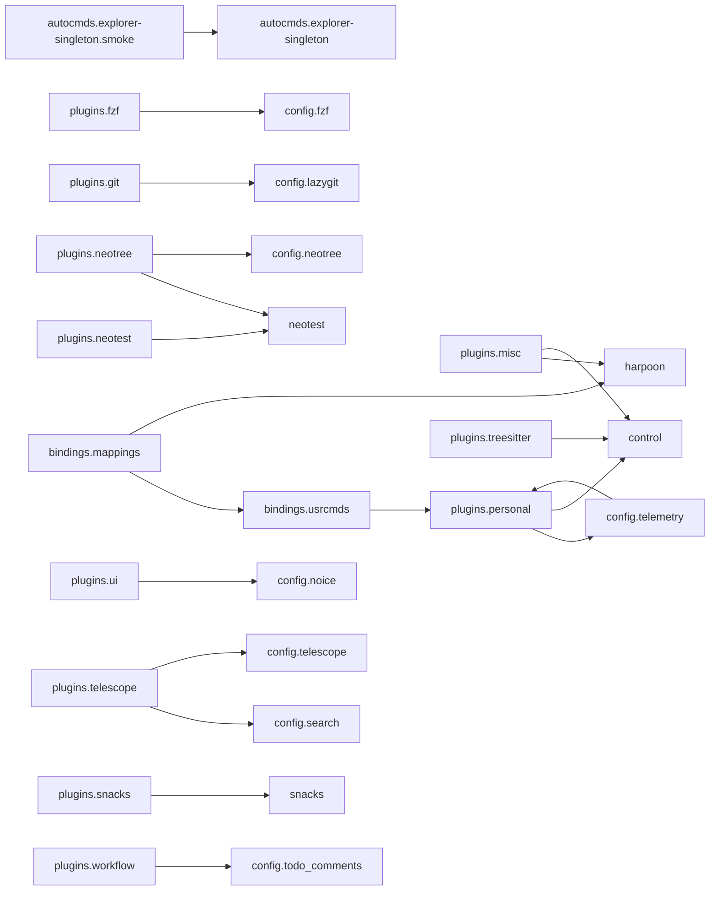

# nvim-config — module map

> **Generated** by `documentation`. Do not edit by hand — run `:DocMap`
> (or `nvim --headless -l scripts/gen_map.lua`) to regenerate.

**57 modules** · 192 namespaces · 165 helper files

The [interactive map](index.html) has filtering, full descriptions and
source links; this page is the version the code host renders directly.

## Namespaces

```mermaid
flowchart LR
  nlua["nvim-config"]
  nlua_autocmds["autocmdsbr/smallWires up every autocmd submodule./small"]
  nlua_autocmds_general["generalbr/smallCentralized, toggleable autocmd suite with…/small"]
  nlua_autocmds_git["gitbr/smallOrchestrates all Git-related autocommands…/small"]
  nlua_autocmds_terminals["terminalsbr/smallTerminal-focused autocommands with feature…/small"]
  nlua_autocmds_text["textbr/smallText-focused autocommands with feature…/small"]
  nlua_bindings["bindings"]
  nlua_bindings_mappings["mappingsbr/smallEntry point to register all keymaps grouped…/small"]
  nlua_bindings_usrcmds["usrcmds"]
  nlua_config["config"]
  nlua_config_fzf["fzfbr/smallComposed fzf-lua configuration with custom…/small"]
  nlua_config_gp_config["gp_config"]
  nlua_config_harpoon["harpoon"]
  nlua_config_lazy["lazybr/smalllazy.nvim's own bootstrap options --…/small"]
  nlua_config_lazygit["lazygitbr/smallBridge that lets LazyGit custom commands…/small"]
  nlua_config_menu["menubr/smallEntry point for the general (non-tree)…/small"]
  nlua_config_neotest["neotest"]
  nlua_config_neotree["neotreebr/smallNeo-tree unified configuration and…/small"]
  nlua_config_noice["noicebr/smallnoice.nvim's own opts table…/small"]
  nlua_config_search["searchbr/smallCentralized configuration for search.nvim:…/small"]
  nlua_config_snacks["snacks"]
  nlua_config_tabufline["tabuflinebr/smallCustom buffer navigation without automatic…/small"]
  nlua_config_telescope["telescopebr/smallModularized Telescope setup with file…/small"]
  nlua_config_todo_comments["todo_commentsbr/smalltodo-comments.nvim setup, built from…/small"]
  nlua_config_treesitter["treesitter"]
  nlua_config_ui_statusline["ui_statuslinebr/smallWires this host's own statusline AND…/small"]
  nlua_plugins["plugins"]
  nlua_plugins_colorscheme["colorscheme"]
  nlua_plugins_control["control"]
  nlua_plugins_github_stats["github-stats"]
  nlua_plugins_personal["personalbr/smallPersonal and local development plugins -…/small"]
  nlua_startup["startupbr/smallStartup phase runner with built-in…/small"]
  nlua_themes["themes"]
  nlua --> nlua_autocmds
  nlua_autocmds --> nlua_autocmds_general
  nlua_autocmds --> nlua_autocmds_git
  nlua_autocmds --> nlua_autocmds_terminals
  nlua_autocmds --> nlua_autocmds_text
  nlua --> nlua_bindings
  nlua_bindings --> nlua_bindings_mappings
  nlua_bindings --> nlua_bindings_usrcmds
  nlua --> nlua_config
  nlua_config --> nlua_config_fzf
  nlua_config --> nlua_config_gp_config
  nlua_config --> nlua_config_harpoon
  nlua_config --> nlua_config_lazy
  nlua_config --> nlua_config_lazygit
  nlua_config --> nlua_config_menu
  nlua_config --> nlua_config_neotest
  nlua_config --> nlua_config_neotree
  nlua_config --> nlua_config_noice
  nlua_config --> nlua_config_search
  nlua_config --> nlua_config_snacks
  nlua_config --> nlua_config_tabufline
  nlua_config --> nlua_config_telescope
  nlua_config --> nlua_config_todo_comments
  nlua_config --> nlua_config_treesitter
  nlua_config --> nlua_config_ui_statusline
  nlua --> nlua_plugins
  nlua_plugins --> nlua_plugins_colorscheme
  nlua_plugins --> nlua_plugins_control
  nlua_plugins --> nlua_plugins_github_stats
  nlua_plugins --> nlua_plugins_personal
  nlua --> nlua_startup
  nlua --> nlua_themes
```

## Dependencies

Which parts of the tree require which, rolled up to the second level.
The [interactive map](index.html)'s **Deps** view has this per module,
in both directions, with load-time and lazy requires told apart.

## Modules

| Module | Description | Fns | Docs |
|---|---|---|---|
| `autocmds` | Wires up every autocmd submodule. |  | [README](../../lua/autocmds/README.md) · [src](../../lua/autocmds/init.lua) |
| &nbsp;&nbsp;`autocmds.general` | Centralized, toggleable autocmd suite with safe defaults and idempotent setup. | 1 | [README](../../lua/autocmds/general/README.md) · [src](../../lua/autocmds/general/init.lua) |
| &nbsp;&nbsp;`autocmds.git` | Orchestrates all Git-related autocommands by delegating to submodules. | 1 | [README](../../lua/autocmds/git/README.md) · [src](../../lua/autocmds/git/init.lua) |
| &nbsp;&nbsp;`autocmds.terminals` | Terminal-focused autocommands with feature flags. | 2 | [README](../../lua/autocmds/terminals/README.md) · [src](../../lua/autocmds/terminals/init.lua) |
| &nbsp;&nbsp;`autocmds.text` | Text-focused autocommands with feature flags. | 2 | [README](../../lua/autocmds/text/README.md) · [src](../../lua/autocmds/text/init.lua) |
| `bindings` |  |  |  |
| &nbsp;&nbsp;`bindings.mappings` | Entry point to register all keymaps grouped by topic. | 1 | [README](../../lua/bindings/mappings/README.md) · [src](../../lua/bindings/mappings/init.lua) |
| &nbsp;&nbsp;&nbsp;&nbsp;`utils` |  |  |  |
| &nbsp;&nbsp;&nbsp;&nbsp;&nbsp;&nbsp;`bindings.mappings.utils.window_zoom` | Toggle maximize current window and restore previous layout sizes. | 4 | [README](../../lua/bindings/mappings/utils/window_zoom/README.md) · [src](../../lua/bindings/mappings/utils/window_zoom/init.lua) |
| &nbsp;&nbsp;`bindings.usrcmds` |  |  | [README](../../lua/bindings/usrcmds/README.md) · [src](../../lua/bindings/usrcmds/init.lua) |
| &nbsp;&nbsp;&nbsp;&nbsp;`bindings.usrcmds.autocmd_docs` | `bindings/autocmd/` and `bindings/usercmd/` markdown from what `lib.nvim.bindings.autocmd` actually registered this session. | 2 | [src](../../lua/bindings/usrcmds/autocmd_docs/init.lua) |
| &nbsp;&nbsp;&nbsp;&nbsp;`bindings.usrcmds.bindings_audit` | `:LibKeymapConflicts` and `:BindingsRuntimeChecklist` — cross-registry checks over whatever this session actually loaded: keymap action vs. | 1 | [src](../../lua/bindings/usrcmds/bindings_audit/init.lua) |
| &nbsp;&nbsp;&nbsp;&nbsp;`bindings.usrcmds.bindings_explorer` | `:Bindings` — the composer verb + route table over the BINDINGS corpus (extern cheatsheets under docs/NOTES/ExternPlugins/Bindings + each personal plugin's… | 16 | [README](../../lua/bindings/usrcmds/bindings_explorer/README.md) · [src](../../lua/bindings/usrcmds/bindings_explorer/init.lua) |
| &nbsp;&nbsp;&nbsp;&nbsp;&nbsp;&nbsp;`doc` |  |  |  |
| &nbsp;&nbsp;&nbsp;&nbsp;&nbsp;&nbsp;`docs` |  |  |  |
| &nbsp;&nbsp;&nbsp;&nbsp;`bindings.usrcmds.case` | :Case — SAP-Support case scaffolding. | 8 | [README](../../lua/bindings/usrcmds/case/README.md) · [src](../../lua/bindings/usrcmds/case/init.lua) |
| &nbsp;&nbsp;&nbsp;&nbsp;&nbsp;&nbsp;`docs` |  |  |  |
| &nbsp;&nbsp;&nbsp;&nbsp;&nbsp;&nbsp;`extract` |  |  |  |
| &nbsp;&nbsp;&nbsp;&nbsp;&nbsp;&nbsp;`bindings.usrcmds.case.sla` | Public API for casedesk's SLA layer (docs/ROADMAP/casedesk/SLA.md): given a case, which of the three SAP-SLA clocks (first response, ongoing follow-up,… | 10 | [README](../../lua/bindings/usrcmds/case/sla/README.md) · [src](../../lua/bindings/usrcmds/case/sla/init.lua) |
| &nbsp;&nbsp;&nbsp;&nbsp;&nbsp;&nbsp;`templates` |  |  |  |
| &nbsp;&nbsp;&nbsp;&nbsp;`bindings.usrcmds.context_open` | `M-o` / `M-O` / `:ContextOpen` -- one dispatcher unifying "open the thing under the cursor" across gopath.nvim (gF), markdown.nvim (TableView), images.nvim,… | 5 | [README](../../lua/bindings/usrcmds/context_open/README.md) · [src](../../lua/bindings/usrcmds/context_open/init.lua) |
| &nbsp;&nbsp;&nbsp;&nbsp;`bindings.usrcmds.plugin_repos` | source mode of the personal plugin list — plus an interactive picker and a dashboard. | 18 | [README](../../lua/bindings/usrcmds/plugin_repos/README.md) · [src](../../lua/bindings/usrcmds/plugin_repos/init.lua) |
| &nbsp;&nbsp;&nbsp;&nbsp;`bindings.usrcmds.strip_coauthor` | `Co-Authored-By: Claude` trailer from the commits that carry it, across the config and the personal plugin checkouts. | 5 | [src](../../lua/bindings/usrcmds/strip_coauthor/init.lua) |
| &nbsp;&nbsp;&nbsp;&nbsp;`bindings.usrcmds.telemetry_nvim_config` | aliases for `:RATelemetry setup nvim-config` / `:RATelemetry full nvim-config`. | 1 | [README](../../lua/bindings/usrcmds/telemetry_nvim_config/README.md) · [src](../../lua/bindings/usrcmds/telemetry_nvim_config/init.lua) |
| &nbsp;&nbsp;&nbsp;&nbsp;`bindings.usrcmds.update_repos` | Registers `:MyReposUpdate [path]`. | 11 | [README](../../lua/bindings/usrcmds/update_repos/README.md) · [src](../../lua/bindings/usrcmds/update_repos/init.lua) |
| &nbsp;&nbsp;&nbsp;&nbsp;`bindings.usrcmds.who_locks` | Registers `:WhoLocks [path]`. | 5 | [README](../../lua/bindings/usrcmds/who_locks/README.md) · [src](../../lua/bindings/usrcmds/who_locks/init.lua) |
| `config` |  |  |  |
| &nbsp;&nbsp;`config.fzf` | Composed fzf-lua configuration with custom actions | 1 | [README](../../lua/config/fzf/README.md) · [src](../../lua/config/fzf/init.lua) |
| &nbsp;&nbsp;&nbsp;&nbsp;`config.fzf.files` | File picker (fd) configuration and entry formatting | 4 | [README](../../lua/config/fzf/files/README.md) · [src](../../lua/config/fzf/files/init.lua) |
| &nbsp;&nbsp;&nbsp;&nbsp;`config.fzf.fzf_opts` | Low-level fzf command-line options History is owned by pickers.nvim (history.fzf_scope = "patch" in its setup()), which patches fzf-lua's… | 1 | [README](../../lua/config/fzf/fzf_opts/README.md) · [src](../../lua/config/fzf/fzf_opts/init.lua) |
| &nbsp;&nbsp;&nbsp;&nbsp;`config.fzf.grep` | ripgrep configuration for fzf-lua | 1 | [README](../../lua/config/fzf/grep/README.md) · [src](../../lua/config/fzf/grep/init.lua) |
| &nbsp;&nbsp;&nbsp;&nbsp;`config.fzf.keymaps` | Keymaps for fzf-lua (fzf prompt). | 1 | [README](../../lua/config/fzf/keymaps/README.md) · [src](../../lua/config/fzf/keymaps/init.lua) |
| &nbsp;&nbsp;`gp_config` |  |  |  |
| &nbsp;&nbsp;&nbsp;&nbsp;`hooks` |  |  |  |
| &nbsp;&nbsp;`harpoon` |  |  |  |
| &nbsp;&nbsp;&nbsp;&nbsp;`docs` |  |  |  |
| &nbsp;&nbsp;&nbsp;&nbsp;`config.harpoon.types` | Add these or adapt your existing type file accordingly. |  | [README](../../lua/config/harpoon/types/README.md) · [src](../../lua/config/harpoon/types/init.lua) |
| &nbsp;&nbsp;&nbsp;&nbsp;`ui` |  |  |  |
| &nbsp;&nbsp;&nbsp;&nbsp;`utils` |  |  |  |
| &nbsp;&nbsp;`config.lazy` | lazy.nvim's own bootstrap options -- `defaults.lazy = true`, plus a long comment on why remote-managed personal plugins need special handling (dir-mode… |  | [README](../../lua/config/lazy/README.md) · [src](../../lua/config/lazy/init.lua) |
| &nbsp;&nbsp;`config.lazygit` | Bridge that lets LazyGit custom commands open files in the *parent* Neovim. | 1 | [README](../../lua/config/lazygit/README.md) · [src](../../lua/config/lazygit/init.lua) |
| &nbsp;&nbsp;&nbsp;&nbsp;`actions` |  |  |  |
| &nbsp;&nbsp;&nbsp;&nbsp;`docs` |  |  | [README](../../lua/config/lazygit/docs/README.md) |
| &nbsp;&nbsp;`config.menu` | Entry point for the general (non-tree) right-click menu: picks the renderer, hands the general section its options, and binds the triggers. | 1 | [README](../../lua/config/menu/README.md) · [src](../../lua/config/menu/init.lua) |
| &nbsp;&nbsp;&nbsp;&nbsp;`config.menu.custom_menu` | The general (non-plugin) section of the right-click menu: format, copy, paste, delete, and a few tools. | 13 | [README](../../lua/config/menu/custom_menu/README.md) · [src](../../lua/config/menu/custom_menu/init.lua) |
| &nbsp;&nbsp;&nbsp;&nbsp;`docs` |  |  |  |
| &nbsp;&nbsp;`neotest` |  |  |  |
| &nbsp;&nbsp;&nbsp;&nbsp;`config.neotest.actions` | Centralized Neotest actions usable by keymaps, usercommands and menus. | 10 | [README](../../lua/config/neotest/actions/README.md) · [src](../../lua/config/neotest/actions/init.lua) |
| &nbsp;&nbsp;&nbsp;&nbsp;`adapters` |  |  |  |
| &nbsp;&nbsp;&nbsp;&nbsp;`autocmds` |  |  |  |
| &nbsp;&nbsp;&nbsp;&nbsp;`config.neotest.commands` | User commands for Neotest based on shared actions. | 1 | [README](../../lua/config/neotest/commands/README.md) · [src](../../lua/config/neotest/commands/init.lua) |
| &nbsp;&nbsp;&nbsp;&nbsp;`consumers` |  |  |  |
| &nbsp;&nbsp;&nbsp;&nbsp;`config.neotest.core` | Core configuration and utilities for neotest integration | 4 | [README](../../lua/config/neotest/core/README.md) · [src](../../lua/config/neotest/core/init.lua) |
| &nbsp;&nbsp;&nbsp;&nbsp;`config.neotest.debug` | Neotest debug tooling: `:NeotestDebugAdapters`/`State`/`File`/`Root`/ `Framework` user commands, `M.keymaps()`, and `M.setup_all()` wiring both up --… | 3 | [README](../../lua/config/neotest/debug/README.md) · [src](../../lua/config/neotest/debug/init.lua) |
| &nbsp;&nbsp;&nbsp;&nbsp;`docs` |  |  |  |
| &nbsp;&nbsp;&nbsp;&nbsp;`config.neotest.highlights` | Neotest highlight groups setup | 1 | [README](../../lua/config/neotest/highlights/README.md) · [src](../../lua/config/neotest/highlights/init.lua) |
| &nbsp;&nbsp;&nbsp;&nbsp;`init` |  |  |  |
| &nbsp;&nbsp;&nbsp;&nbsp;&nbsp;&nbsp;`checks` |  |  |  |
| &nbsp;&nbsp;&nbsp;&nbsp;`config.neotest.keymaps` | Neotest keymaps using centralized actions. | 1 | [README](../../lua/config/neotest/keymaps/README.md) · [src](../../lua/config/neotest/keymaps/init.lua) |
| &nbsp;&nbsp;&nbsp;&nbsp;`config.neotest.neotree` | Neo-tree integration for Neotest actions. | 2 | [README](../../lua/config/neotest/neotree/README.md) · [src](../../lua/config/neotest/neotree/init.lua) |
| &nbsp;&nbsp;&nbsp;&nbsp;`config.neotest.telescope` | Telescope picker for Neotest actions. | 1 | [README](../../lua/config/neotest/telescope/README.md) · [src](../../lua/config/neotest/telescope/init.lua) |
| &nbsp;&nbsp;&nbsp;&nbsp;`utils` |  |  |  |
| &nbsp;&nbsp;&nbsp;&nbsp;`config.neotest.whichkey` | Which-key integration for Neotest actions (new spec) | 1 | [README](../../lua/config/neotest/whichkey/README.md) · [src](../../lua/config/neotest/whichkey/init.lua) |
| &nbsp;&nbsp;`config.neotree` | Neo-tree unified configuration and initialization | 2 | [README](../../lua/config/neotree/README.md) · [src](../../lua/config/neotree/init.lua) |
| &nbsp;&nbsp;&nbsp;&nbsp;`config.neotree.checkhealth` | Aggregated health checks for Neo-tree configuration | 1 | [README](../../lua/config/neotree/checkhealth/README.md) · [src](../../lua/config/neotree/checkhealth/init.lua) |
| &nbsp;&nbsp;&nbsp;&nbsp;`commands` |  |  |  |
| &nbsp;&nbsp;&nbsp;&nbsp;&nbsp;&nbsp;`config.neotree.commands.source` | `next_source`/`prev_source`: cycle neo-tree between its configured sources (filesystem, git_status, ...) in either direction, wrapping around. | 2 | [README](../../lua/config/neotree/commands/source/README.md) · [src](../../lua/config/neotree/commands/source/init.lua) |
| &nbsp;&nbsp;&nbsp;&nbsp;`config.neotree.event_handlers` | Neo-tree unified event handlers configuration |  | [README](../../lua/config/neotree/event_handlers/README.md) · [src](../../lua/config/neotree/event_handlers/init.lua) |
| &nbsp;&nbsp;&nbsp;&nbsp;`config.neotree.keymaps` | Centralized, buffer-local Neo-tree keymaps that override defaults consistently. |  | [README](../../lua/config/neotree/keymaps/README.md) · [src](../../lua/config/neotree/keymaps/init.lua) |
| &nbsp;&nbsp;&nbsp;&nbsp;&nbsp;&nbsp;`config.neotree.keymaps.filesystem` | Entry point that merges all filesystem keymap modules into a single mapping table. |  | [README](../../lua/config/neotree/keymaps/filesystem/README.md) · [src](../../lua/config/neotree/keymaps/filesystem/init.lua) |
| &nbsp;&nbsp;&nbsp;&nbsp;`sources` |  |  |  |
| &nbsp;&nbsp;&nbsp;&nbsp;`config.neotree.usercmds` | `:NeoTreeCheckHealth` -- runs `config.neotree.checkhealth` as a real command instead of only through `:checkhealth`. | 1 | [README](../../lua/config/neotree/usercmds/README.md) · [src](../../lua/config/neotree/usercmds/init.lua) |
| &nbsp;&nbsp;&nbsp;&nbsp;`config.neotree.utils` | Unified utilities for Neo-tree configuration | 1 | [README](../../lua/config/neotree/utils/README.md) · [src](../../lua/config/neotree/utils/init.lua) |
| &nbsp;&nbsp;&nbsp;&nbsp;`window` |  |  |  |
| &nbsp;&nbsp;&nbsp;&nbsp;&nbsp;&nbsp;`open` |  |  |  |
| &nbsp;&nbsp;&nbsp;&nbsp;&nbsp;&nbsp;&nbsp;&nbsp;`keymaps` |  |  |  |
| &nbsp;&nbsp;`config.noice` | noice.nvim's own opts table (cmdline/lsp/messages/popupmenu/presets/ routes/views/notify), assembled here rather than inline in the plugin spec. |  | [README](../../lua/config/noice/README.md) · [src](../../lua/config/noice/init.lua) |
| &nbsp;&nbsp;`config.search` | Centralized configuration for search.nvim: Telescope integration and tab/collection definitions. | 1 | [README](../../lua/config/search/README.md) · [src](../../lua/config/search/init.lua) |
| &nbsp;&nbsp;`snacks` |  |  |  |
| &nbsp;&nbsp;&nbsp;&nbsp;`docs` |  |  |  |
| &nbsp;&nbsp;&nbsp;&nbsp;`config.snacks.mappings` | Keymap definitions for folke/snacks.nvim. | 1 | [README](../../lua/config/snacks/mappings/README.md) · [src](../../lua/config/snacks/mappings/init.lua) |
| &nbsp;&nbsp;&nbsp;&nbsp;`config.snacks.picker` | Thin adapter that assembles the `Snacks.picker` options from pickers.nvim so the in-picker UX is unified across every engine (telescope / fzf-lua / snacks): | 8 | [README](../../lua/config/snacks/picker/README.md) · [src](../../lua/config/snacks/picker/init.lua) |
| &nbsp;&nbsp;`config.tabufline` | Custom buffer navigation without automatic centering | 5 | [README](../../lua/config/tabufline/README.md) · [src](../../lua/config/tabufline/init.lua) |
| &nbsp;&nbsp;`config.telescope` | Modularized Telescope setup with file browser keymaps. | 6 | [README](../../lua/config/telescope/README.md) · [src](../../lua/config/telescope/init.lua) |
| &nbsp;&nbsp;&nbsp;&nbsp;`file_browser` |  |  |  |
| &nbsp;&nbsp;`config.todo_comments` | todo-comments.nvim setup, built from `keywords/init.lua`'s keyword table -- degrades to a no-op `M.setup` if todo-comments itself is not installed, rather… | 4 | [README](../../lua/config/todo_comments/README.md) · [src](../../lua/config/todo_comments/init.lua) |
| &nbsp;&nbsp;&nbsp;&nbsp;`colors` |  |  |  |
| &nbsp;&nbsp;&nbsp;&nbsp;`config.todo_comments.keywords` | The keyword table todo-comments.nvim highlights: icon, color category and recognized aliases per keyword (FIX/INFO/DEBUG/TODO/ROADMAP/AUDIT/ HACK/...). |  | [README](../../lua/config/todo_comments/keywords/README.md) · [src](../../lua/config/todo_comments/keywords/init.lua) |
| &nbsp;&nbsp;`treesitter` |  |  |  |
| &nbsp;&nbsp;`config.ui_statusline` | Wires this host's own statusline AND tabline into ui.nvim, at UIReady. | 1 | [src](../../lua/config/ui_statusline/init.lua) |
| `plugins` |  |  |  |
| &nbsp;&nbsp;`colorscheme` |  |  |  |
| &nbsp;&nbsp;`control` |  |  |  |
| &nbsp;&nbsp;`github-stats` |  |  |  |
| &nbsp;&nbsp;&nbsp;&nbsp;`data` |  |  |  |
| &nbsp;&nbsp;&nbsp;&nbsp;&nbsp;&nbsp;`StefanBartl_buffer-ctx.nvim` |  |  |  |
| &nbsp;&nbsp;&nbsp;&nbsp;&nbsp;&nbsp;&nbsp;&nbsp;`clones` |  |  |  |
| &nbsp;&nbsp;&nbsp;&nbsp;&nbsp;&nbsp;&nbsp;&nbsp;`paths` |  |  |  |
| &nbsp;&nbsp;&nbsp;&nbsp;&nbsp;&nbsp;&nbsp;&nbsp;`referrers` |  |  |  |
| &nbsp;&nbsp;&nbsp;&nbsp;&nbsp;&nbsp;&nbsp;&nbsp;`views` |  |  |  |
| &nbsp;&nbsp;&nbsp;&nbsp;&nbsp;&nbsp;`StefanBartl_cascade.nvim` |  |  |  |
| &nbsp;&nbsp;&nbsp;&nbsp;&nbsp;&nbsp;&nbsp;&nbsp;`clones` |  |  |  |
| &nbsp;&nbsp;&nbsp;&nbsp;&nbsp;&nbsp;&nbsp;&nbsp;`paths` |  |  |  |
| &nbsp;&nbsp;&nbsp;&nbsp;&nbsp;&nbsp;&nbsp;&nbsp;`referrers` |  |  |  |
| &nbsp;&nbsp;&nbsp;&nbsp;&nbsp;&nbsp;&nbsp;&nbsp;`views` |  |  |  |
| &nbsp;&nbsp;&nbsp;&nbsp;&nbsp;&nbsp;`StefanBartl_cmdlog.nvim` |  |  |  |
| &nbsp;&nbsp;&nbsp;&nbsp;&nbsp;&nbsp;&nbsp;&nbsp;`clones` |  |  |  |
| &nbsp;&nbsp;&nbsp;&nbsp;&nbsp;&nbsp;&nbsp;&nbsp;`paths` |  |  |  |
| &nbsp;&nbsp;&nbsp;&nbsp;&nbsp;&nbsp;&nbsp;&nbsp;`referrers` |  |  |  |
| &nbsp;&nbsp;&nbsp;&nbsp;&nbsp;&nbsp;&nbsp;&nbsp;`views` |  |  |  |
| &nbsp;&nbsp;&nbsp;&nbsp;&nbsp;&nbsp;`StefanBartl_color_my_ascii.nvim` |  |  |  |
| &nbsp;&nbsp;&nbsp;&nbsp;&nbsp;&nbsp;&nbsp;&nbsp;`clones` |  |  |  |
| &nbsp;&nbsp;&nbsp;&nbsp;&nbsp;&nbsp;&nbsp;&nbsp;`paths` |  |  |  |
| &nbsp;&nbsp;&nbsp;&nbsp;&nbsp;&nbsp;&nbsp;&nbsp;`referrers` |  |  |  |
| &nbsp;&nbsp;&nbsp;&nbsp;&nbsp;&nbsp;&nbsp;&nbsp;`views` |  |  |  |
| &nbsp;&nbsp;&nbsp;&nbsp;&nbsp;&nbsp;`StefanBartl_debugging.nvim` |  |  |  |
| &nbsp;&nbsp;&nbsp;&nbsp;&nbsp;&nbsp;&nbsp;&nbsp;`clones` |  |  |  |
| &nbsp;&nbsp;&nbsp;&nbsp;&nbsp;&nbsp;&nbsp;&nbsp;`paths` |  |  |  |
| &nbsp;&nbsp;&nbsp;&nbsp;&nbsp;&nbsp;&nbsp;&nbsp;`referrers` |  |  |  |
| &nbsp;&nbsp;&nbsp;&nbsp;&nbsp;&nbsp;&nbsp;&nbsp;`views` |  |  |  |
| &nbsp;&nbsp;&nbsp;&nbsp;&nbsp;&nbsp;`StefanBartl_diff.nvim` |  |  |  |
| &nbsp;&nbsp;&nbsp;&nbsp;&nbsp;&nbsp;&nbsp;&nbsp;`clones` |  |  |  |
| &nbsp;&nbsp;&nbsp;&nbsp;&nbsp;&nbsp;&nbsp;&nbsp;`paths` |  |  |  |
| &nbsp;&nbsp;&nbsp;&nbsp;&nbsp;&nbsp;&nbsp;&nbsp;`referrers` |  |  |  |
| &nbsp;&nbsp;&nbsp;&nbsp;&nbsp;&nbsp;&nbsp;&nbsp;`views` |  |  |  |
| &nbsp;&nbsp;&nbsp;&nbsp;&nbsp;&nbsp;`StefanBartl_documentation.nvim` |  |  |  |
| &nbsp;&nbsp;&nbsp;&nbsp;&nbsp;&nbsp;&nbsp;&nbsp;`clones` |  |  |  |
| &nbsp;&nbsp;&nbsp;&nbsp;&nbsp;&nbsp;&nbsp;&nbsp;`paths` |  |  |  |
| &nbsp;&nbsp;&nbsp;&nbsp;&nbsp;&nbsp;&nbsp;&nbsp;`referrers` |  |  |  |
| &nbsp;&nbsp;&nbsp;&nbsp;&nbsp;&nbsp;&nbsp;&nbsp;`views` |  |  |  |
| &nbsp;&nbsp;&nbsp;&nbsp;&nbsp;&nbsp;`StefanBartl_emojis.nvim` |  |  |  |
| &nbsp;&nbsp;&nbsp;&nbsp;&nbsp;&nbsp;&nbsp;&nbsp;`clones` |  |  |  |
| &nbsp;&nbsp;&nbsp;&nbsp;&nbsp;&nbsp;&nbsp;&nbsp;`paths` |  |  |  |
| &nbsp;&nbsp;&nbsp;&nbsp;&nbsp;&nbsp;&nbsp;&nbsp;`referrers` |  |  |  |
| &nbsp;&nbsp;&nbsp;&nbsp;&nbsp;&nbsp;&nbsp;&nbsp;`views` |  |  |  |
| &nbsp;&nbsp;&nbsp;&nbsp;&nbsp;&nbsp;`StefanBartl_fileops.nvim` |  |  |  |
| &nbsp;&nbsp;&nbsp;&nbsp;&nbsp;&nbsp;&nbsp;&nbsp;`clones` |  |  |  |
| &nbsp;&nbsp;&nbsp;&nbsp;&nbsp;&nbsp;&nbsp;&nbsp;`paths` |  |  |  |
| &nbsp;&nbsp;&nbsp;&nbsp;&nbsp;&nbsp;&nbsp;&nbsp;`referrers` |  |  |  |
| &nbsp;&nbsp;&nbsp;&nbsp;&nbsp;&nbsp;&nbsp;&nbsp;`views` |  |  |  |
| &nbsp;&nbsp;&nbsp;&nbsp;&nbsp;&nbsp;`StefanBartl_filetree.nvim` |  |  |  |
| &nbsp;&nbsp;&nbsp;&nbsp;&nbsp;&nbsp;&nbsp;&nbsp;`clones` |  |  |  |
| &nbsp;&nbsp;&nbsp;&nbsp;&nbsp;&nbsp;&nbsp;&nbsp;`paths` |  |  |  |
| &nbsp;&nbsp;&nbsp;&nbsp;&nbsp;&nbsp;&nbsp;&nbsp;`referrers` |  |  |  |
| &nbsp;&nbsp;&nbsp;&nbsp;&nbsp;&nbsp;&nbsp;&nbsp;`views` |  |  |  |
| &nbsp;&nbsp;&nbsp;&nbsp;&nbsp;&nbsp;`StefanBartl_github_stats.nvim` |  |  |  |
| &nbsp;&nbsp;&nbsp;&nbsp;&nbsp;&nbsp;&nbsp;&nbsp;`clones` |  |  |  |
| &nbsp;&nbsp;&nbsp;&nbsp;&nbsp;&nbsp;&nbsp;&nbsp;`paths` |  |  |  |
| &nbsp;&nbsp;&nbsp;&nbsp;&nbsp;&nbsp;&nbsp;&nbsp;`referrers` |  |  |  |
| &nbsp;&nbsp;&nbsp;&nbsp;&nbsp;&nbsp;&nbsp;&nbsp;`views` |  |  |  |
| &nbsp;&nbsp;&nbsp;&nbsp;&nbsp;&nbsp;`StefanBartl_gopath.nvim` |  |  |  |
| &nbsp;&nbsp;&nbsp;&nbsp;&nbsp;&nbsp;&nbsp;&nbsp;`clones` |  |  |  |
| &nbsp;&nbsp;&nbsp;&nbsp;&nbsp;&nbsp;&nbsp;&nbsp;`paths` |  |  |  |
| &nbsp;&nbsp;&nbsp;&nbsp;&nbsp;&nbsp;&nbsp;&nbsp;`referrers` |  |  |  |
| &nbsp;&nbsp;&nbsp;&nbsp;&nbsp;&nbsp;&nbsp;&nbsp;`views` |  |  |  |
| &nbsp;&nbsp;&nbsp;&nbsp;&nbsp;&nbsp;`StefanBartl_hover.nvim` |  |  |  |
| &nbsp;&nbsp;&nbsp;&nbsp;&nbsp;&nbsp;&nbsp;&nbsp;`clones` |  |  |  |
| &nbsp;&nbsp;&nbsp;&nbsp;&nbsp;&nbsp;&nbsp;&nbsp;`paths` |  |  |  |
| &nbsp;&nbsp;&nbsp;&nbsp;&nbsp;&nbsp;&nbsp;&nbsp;`referrers` |  |  |  |
| &nbsp;&nbsp;&nbsp;&nbsp;&nbsp;&nbsp;&nbsp;&nbsp;`views` |  |  |  |
| &nbsp;&nbsp;&nbsp;&nbsp;&nbsp;&nbsp;`StefanBartl_insights.nvim` |  |  |  |
| &nbsp;&nbsp;&nbsp;&nbsp;&nbsp;&nbsp;&nbsp;&nbsp;`clones` |  |  |  |
| &nbsp;&nbsp;&nbsp;&nbsp;&nbsp;&nbsp;&nbsp;&nbsp;`paths` |  |  |  |
| &nbsp;&nbsp;&nbsp;&nbsp;&nbsp;&nbsp;&nbsp;&nbsp;`referrers` |  |  |  |
| &nbsp;&nbsp;&nbsp;&nbsp;&nbsp;&nbsp;&nbsp;&nbsp;`views` |  |  |  |
| &nbsp;&nbsp;&nbsp;&nbsp;&nbsp;&nbsp;`StefanBartl_language.nvim` |  |  |  |
| &nbsp;&nbsp;&nbsp;&nbsp;&nbsp;&nbsp;&nbsp;&nbsp;`clones` |  |  |  |
| &nbsp;&nbsp;&nbsp;&nbsp;&nbsp;&nbsp;&nbsp;&nbsp;`paths` |  |  |  |
| &nbsp;&nbsp;&nbsp;&nbsp;&nbsp;&nbsp;&nbsp;&nbsp;`referrers` |  |  |  |
| &nbsp;&nbsp;&nbsp;&nbsp;&nbsp;&nbsp;&nbsp;&nbsp;`views` |  |  |  |
| &nbsp;&nbsp;&nbsp;&nbsp;&nbsp;&nbsp;`StefanBartl_lib.nvim` |  |  |  |
| &nbsp;&nbsp;&nbsp;&nbsp;&nbsp;&nbsp;&nbsp;&nbsp;`clones` |  |  |  |
| &nbsp;&nbsp;&nbsp;&nbsp;&nbsp;&nbsp;&nbsp;&nbsp;`paths` |  |  |  |
| &nbsp;&nbsp;&nbsp;&nbsp;&nbsp;&nbsp;&nbsp;&nbsp;`referrers` |  |  |  |
| &nbsp;&nbsp;&nbsp;&nbsp;&nbsp;&nbsp;&nbsp;&nbsp;`views` |  |  |  |
| &nbsp;&nbsp;&nbsp;&nbsp;&nbsp;&nbsp;`StefanBartl_lsp.nvim` |  |  |  |
| &nbsp;&nbsp;&nbsp;&nbsp;&nbsp;&nbsp;&nbsp;&nbsp;`clones` |  |  |  |
| &nbsp;&nbsp;&nbsp;&nbsp;&nbsp;&nbsp;&nbsp;&nbsp;`paths` |  |  |  |
| &nbsp;&nbsp;&nbsp;&nbsp;&nbsp;&nbsp;&nbsp;&nbsp;`referrers` |  |  |  |
| &nbsp;&nbsp;&nbsp;&nbsp;&nbsp;&nbsp;&nbsp;&nbsp;`views` |  |  |  |
| &nbsp;&nbsp;&nbsp;&nbsp;&nbsp;&nbsp;`StefanBartl_markdown.nvim` |  |  |  |
| &nbsp;&nbsp;&nbsp;&nbsp;&nbsp;&nbsp;&nbsp;&nbsp;`clones` |  |  |  |
| &nbsp;&nbsp;&nbsp;&nbsp;&nbsp;&nbsp;&nbsp;&nbsp;`paths` |  |  |  |
| &nbsp;&nbsp;&nbsp;&nbsp;&nbsp;&nbsp;&nbsp;&nbsp;`referrers` |  |  |  |
| &nbsp;&nbsp;&nbsp;&nbsp;&nbsp;&nbsp;&nbsp;&nbsp;`views` |  |  |  |
| &nbsp;&nbsp;&nbsp;&nbsp;&nbsp;&nbsp;`StefanBartl_mdview.nvim` |  |  |  |
| &nbsp;&nbsp;&nbsp;&nbsp;&nbsp;&nbsp;&nbsp;&nbsp;`clones` |  |  |  |
| &nbsp;&nbsp;&nbsp;&nbsp;&nbsp;&nbsp;&nbsp;&nbsp;`paths` |  |  |  |
| &nbsp;&nbsp;&nbsp;&nbsp;&nbsp;&nbsp;&nbsp;&nbsp;`referrers` |  |  |  |
| &nbsp;&nbsp;&nbsp;&nbsp;&nbsp;&nbsp;&nbsp;&nbsp;`views` |  |  |  |
| &nbsp;&nbsp;&nbsp;&nbsp;&nbsp;&nbsp;`StefanBartl_migrate.nvim` |  |  |  |
| &nbsp;&nbsp;&nbsp;&nbsp;&nbsp;&nbsp;&nbsp;&nbsp;`clones` |  |  |  |
| &nbsp;&nbsp;&nbsp;&nbsp;&nbsp;&nbsp;&nbsp;&nbsp;`paths` |  |  |  |
| &nbsp;&nbsp;&nbsp;&nbsp;&nbsp;&nbsp;&nbsp;&nbsp;`referrers` |  |  |  |
| &nbsp;&nbsp;&nbsp;&nbsp;&nbsp;&nbsp;&nbsp;&nbsp;`views` |  |  |  |
| &nbsp;&nbsp;&nbsp;&nbsp;&nbsp;&nbsp;`StefanBartl_nvim-cmdlog` |  |  |  |
| &nbsp;&nbsp;&nbsp;&nbsp;&nbsp;&nbsp;&nbsp;&nbsp;`clones` |  |  |  |
| &nbsp;&nbsp;&nbsp;&nbsp;&nbsp;&nbsp;&nbsp;&nbsp;`paths` |  |  |  |
| &nbsp;&nbsp;&nbsp;&nbsp;&nbsp;&nbsp;&nbsp;&nbsp;`referrers` |  |  |  |
| &nbsp;&nbsp;&nbsp;&nbsp;&nbsp;&nbsp;&nbsp;&nbsp;`views` |  |  |  |
| &nbsp;&nbsp;&nbsp;&nbsp;&nbsp;&nbsp;`StefanBartl_nvim-containers` |  |  |  |
| &nbsp;&nbsp;&nbsp;&nbsp;&nbsp;&nbsp;&nbsp;&nbsp;`clones` |  |  |  |
| &nbsp;&nbsp;&nbsp;&nbsp;&nbsp;&nbsp;&nbsp;&nbsp;`paths` |  |  |  |
| &nbsp;&nbsp;&nbsp;&nbsp;&nbsp;&nbsp;&nbsp;&nbsp;`referrers` |  |  |  |
| &nbsp;&nbsp;&nbsp;&nbsp;&nbsp;&nbsp;&nbsp;&nbsp;`views` |  |  |  |
| &nbsp;&nbsp;&nbsp;&nbsp;&nbsp;&nbsp;`StefanBartl_open.nvim` |  |  |  |
| &nbsp;&nbsp;&nbsp;&nbsp;&nbsp;&nbsp;&nbsp;&nbsp;`clones` |  |  |  |
| &nbsp;&nbsp;&nbsp;&nbsp;&nbsp;&nbsp;&nbsp;&nbsp;`paths` |  |  |  |
| &nbsp;&nbsp;&nbsp;&nbsp;&nbsp;&nbsp;&nbsp;&nbsp;`referrers` |  |  |  |
| &nbsp;&nbsp;&nbsp;&nbsp;&nbsp;&nbsp;&nbsp;&nbsp;`views` |  |  |  |
| &nbsp;&nbsp;&nbsp;&nbsp;&nbsp;&nbsp;`StefanBartl_pdfport.nvim` |  |  |  |
| &nbsp;&nbsp;&nbsp;&nbsp;&nbsp;&nbsp;&nbsp;&nbsp;`clones` |  |  |  |
| &nbsp;&nbsp;&nbsp;&nbsp;&nbsp;&nbsp;&nbsp;&nbsp;`paths` |  |  |  |
| &nbsp;&nbsp;&nbsp;&nbsp;&nbsp;&nbsp;&nbsp;&nbsp;`referrers` |  |  |  |
| &nbsp;&nbsp;&nbsp;&nbsp;&nbsp;&nbsp;&nbsp;&nbsp;`views` |  |  |  |
| &nbsp;&nbsp;&nbsp;&nbsp;&nbsp;&nbsp;`StefanBartl_pickers.nvim` |  |  |  |
| &nbsp;&nbsp;&nbsp;&nbsp;&nbsp;&nbsp;&nbsp;&nbsp;`clones` |  |  |  |
| &nbsp;&nbsp;&nbsp;&nbsp;&nbsp;&nbsp;&nbsp;&nbsp;`paths` |  |  |  |
| &nbsp;&nbsp;&nbsp;&nbsp;&nbsp;&nbsp;&nbsp;&nbsp;`referrers` |  |  |  |
| &nbsp;&nbsp;&nbsp;&nbsp;&nbsp;&nbsp;&nbsp;&nbsp;`views` |  |  |  |
| &nbsp;&nbsp;&nbsp;&nbsp;&nbsp;&nbsp;`StefanBartl_project-insight.nvim` |  |  |  |
| &nbsp;&nbsp;&nbsp;&nbsp;&nbsp;&nbsp;&nbsp;&nbsp;`clones` |  |  |  |
| &nbsp;&nbsp;&nbsp;&nbsp;&nbsp;&nbsp;&nbsp;&nbsp;`paths` |  |  |  |
| &nbsp;&nbsp;&nbsp;&nbsp;&nbsp;&nbsp;&nbsp;&nbsp;`referrers` |  |  |  |
| &nbsp;&nbsp;&nbsp;&nbsp;&nbsp;&nbsp;&nbsp;&nbsp;`views` |  |  |  |
| &nbsp;&nbsp;&nbsp;&nbsp;&nbsp;&nbsp;`StefanBartl_recommender.nvim` |  |  |  |
| &nbsp;&nbsp;&nbsp;&nbsp;&nbsp;&nbsp;&nbsp;&nbsp;`clones` |  |  |  |
| &nbsp;&nbsp;&nbsp;&nbsp;&nbsp;&nbsp;&nbsp;&nbsp;`paths` |  |  |  |
| &nbsp;&nbsp;&nbsp;&nbsp;&nbsp;&nbsp;&nbsp;&nbsp;`referrers` |  |  |  |
| &nbsp;&nbsp;&nbsp;&nbsp;&nbsp;&nbsp;&nbsp;&nbsp;`views` |  |  |  |
| &nbsp;&nbsp;&nbsp;&nbsp;&nbsp;&nbsp;`StefanBartl_replacer.nvim` |  |  |  |
| &nbsp;&nbsp;&nbsp;&nbsp;&nbsp;&nbsp;&nbsp;&nbsp;`clones` |  |  |  |
| &nbsp;&nbsp;&nbsp;&nbsp;&nbsp;&nbsp;&nbsp;&nbsp;`paths` |  |  |  |
| &nbsp;&nbsp;&nbsp;&nbsp;&nbsp;&nbsp;&nbsp;&nbsp;`referrers` |  |  |  |
| &nbsp;&nbsp;&nbsp;&nbsp;&nbsp;&nbsp;&nbsp;&nbsp;`views` |  |  |  |
| &nbsp;&nbsp;&nbsp;&nbsp;&nbsp;&nbsp;`StefanBartl_reposcope.nvim` |  |  |  |
| &nbsp;&nbsp;&nbsp;&nbsp;&nbsp;&nbsp;&nbsp;&nbsp;`clones` |  |  |  |
| &nbsp;&nbsp;&nbsp;&nbsp;&nbsp;&nbsp;&nbsp;&nbsp;`paths` |  |  |  |
| &nbsp;&nbsp;&nbsp;&nbsp;&nbsp;&nbsp;&nbsp;&nbsp;`referrers` |  |  |  |
| &nbsp;&nbsp;&nbsp;&nbsp;&nbsp;&nbsp;&nbsp;&nbsp;`views` |  |  |  |
| &nbsp;&nbsp;&nbsp;&nbsp;&nbsp;&nbsp;`StefanBartl_sandbox.nvim` |  |  |  |
| &nbsp;&nbsp;&nbsp;&nbsp;&nbsp;&nbsp;&nbsp;&nbsp;`clones` |  |  |  |
| &nbsp;&nbsp;&nbsp;&nbsp;&nbsp;&nbsp;&nbsp;&nbsp;`paths` |  |  |  |
| &nbsp;&nbsp;&nbsp;&nbsp;&nbsp;&nbsp;&nbsp;&nbsp;`referrers` |  |  |  |
| &nbsp;&nbsp;&nbsp;&nbsp;&nbsp;&nbsp;&nbsp;&nbsp;`views` |  |  |  |
| &nbsp;&nbsp;`plugins.personal` | Personal and local development plugins - the SPEC IMPLEMENTATION only. |  | [README](../../lua/plugins/personal/README.md) · [src](../../lua/plugins/personal/init.lua) |
| `startup` | Startup phase runner with built-in measurement. | 9 | [README](../../lua/startup/README.md) · [src](../../lua/startup/init.lua) |
| `themes` |  |  |  |

## Drift

0 errors · 202 warnings · 114 info

| Severity | Check | Message |
|---|---|---|
| warn | `dead-readme-link` | docs/NOTES/ARCHITECTURE/startup.md links to '../../init.lua' which does not exist |
| warn | `dead-readme-link` | docs/NOTES/ARCHITECTURE/startup.md links to '../../lua/startup/report.lua' which does not exist |
| warn | `dead-readme-link` | docs/NOTES/ARCHITECTURE/startup.md links to '../../lua/startup/init.lua' which does not exist |
| warn | `dead-readme-link` | docs/NOTES/BINDINGS-FORMAT.md links to 'ROADMAP/personal/bindings-explorer.nvim.md' which does not exist |
| warn | `dead-readme-link` | docs/NOTES/ExternPlugins/Bindings/Autocmds/Noice.md links to '../../../../../lua/lib/nvim/bindings/autocmd.lua' which does not exist |
| warn | `dead-readme-link` | docs/NOTES/ExternPlugins/Bindings/Autocmds/NvChadUI.md links to '../../../../../lua/nvchad/au.lua' which does not exist |
| warn | `dead-readme-link` | docs/NOTES/ExternPlugins/Bindings/Autocmds/NvChadUI.md links to '../../../../../lua/chadrc.lua' which does not exist |
| warn | `dead-readme-link` | docs/NOTES/ExternPlugins/Bindings/Autocmds/NvChadUI.md links to '../../../../../lua/wkdnvchad' which does not exist |
| warn | `dead-readme-link` | docs/NOTES/ExternPlugins/Bindings/Keymaps/Conform.md links to '../../../../../lua/config/menu/neotree/entries.lua' which does not exist |
| warn | `dead-readme-link` | docs/NOTES/ExternPlugins/Bindings/Keymaps/Conform.md links to '../../../../../lua/lsp/languages/webdev/astro/keymaps.lua' which does not exist |
| warn | `dead-readme-link` | docs/NOTES/ExternPlugins/Bindings/Keymaps/Conform.md links to '../../../../../lua/lsp/languages/documentation/markdown.lua' which does not exist |
| warn | `dead-readme-link` | docs/NOTES/ExternPlugins/Bindings/Keymaps/Conform.md links to '../../../../../lua/bindings/mappings/nvchad.lua' which does not exist |
| warn | `dead-readme-link` | docs/NOTES/ExternPlugins/Bindings/Keymaps/Gitsigns.md links to '../../../../../lua/wkdoptions/hl_config/features/diff_peek.lua' which does not exist |
| warn | `dead-readme-link` | docs/NOTES/ExternPlugins/Bindings/Keymaps/Gitsigns.md links to '../../../../../lua/wkdoptions/config/data/highlight.lua' which does not exist |
| warn | `dead-readme-link` | docs/NOTES/ExternPlugins/Bindings/Keymaps/IncRename.md links to '../../../../../lua/plugins/lsp.lua' which does not exist |
| warn | `dead-readme-link` | docs/NOTES/ExternPlugins/Bindings/Keymaps/IncRename.md links to '../../../../../lua/config/inc_rename/init.lua' which does not exist |
| warn | `dead-readme-link` | docs/NOTES/ExternPlugins/Bindings/Keymaps/NvChadUI.md links to '../../../../../lua/wkdnvchad/mappings/init.lua' which does not exist |
| warn | `dead-readme-link` | docs/NOTES/ExternPlugins/Bindings/Keymaps/NvChadUI.md links to '../../../../../lua/chadrc.lua' which does not exist |
| warn | `dead-readme-link` | docs/NOTES/ExternPlugins/Bindings/Keymaps/NvChadUI.md links to '../../../../../lua/bindings/mappings/nvchad.lua' which does not exist |
| warn | `dead-readme-link` | docs/NOTES/ExternPlugins/Bindings/Keymaps/NvChadUI.md links to '../../../../../lua/wkdnvchad/mappings/tabufline/init.lua' which does not exist |
| warn | `dead-readme-link` | docs/NOTES/ExternPlugins/Bindings/Keymaps/Trouble.md links to '../../../../../lua/bindings/mappings/trouble.lua' which does not exist |
| warn | `dead-readme-link` | docs/NOTES/ExternPlugins/Bindings/Keymaps/Trouble.md links to '../../../../../lua/plugins/trouble.lua' which does not exist |
| warn | `dead-readme-link` | docs/NOTES/ExternPlugins/Bindings/Keymaps/Unicode.md links to '../../../../../../nvim-data/lazy/unicode.vim/doc/unicode.txt' which does not exist |
| warn | `dead-readme-link` | docs/NOTES/ExternPlugins/Bindings/Usercmds/Conform.md links to '../../../../../lua/lsp/init.lua' which does not exist |
| warn | `dead-readme-link` | docs/NOTES/ExternPlugins/Bindings/Usercmds/Conform.md links to '../../../../../lua/lsp/formatter/init.lua' which does not exist |
| warn | `dead-readme-link` | docs/NOTES/ExternPlugins/Bindings/Usercmds/Conform.md links to '../../../../../lua/lsp/formatter/conform.lua' which does not exist |
| warn | `dead-readme-link` | docs/NOTES/ExternPlugins/Bindings/Usercmds/Conform.md links to '../../../../../lua/bindings/mappings/nvchad.lua' which does not exist |
| warn | `dead-readme-link` | docs/NOTES/ExternPlugins/Bindings/Usercmds/Conform.md links to '../../../../../lua/plugins/lsp.lua' which does not exist |
| warn | `dead-readme-link` | docs/NOTES/ExternPlugins/Bindings/Usercmds/Conform.md links to '../../../../../lua/lsp/usercmds/formatter.lua' which does not exist |
| warn | `dead-readme-link` | docs/NOTES/ExternPlugins/Bindings/Usercmds/Conform.md links to '../../../../../lua/lsp/languages/documentation/markdown.lua' which does not exist |
| warn | `dead-readme-link` | docs/NOTES/ExternPlugins/Bindings/Usercmds/NvChadUI.md links to '../../../../../lua/nvchad/au.lua' which does not exist |
| warn | `dead-readme-link` | docs/NOTES/ExternPlugins/Bindings/Usercmds/NvChadUI.md links to '../../../../../lua/wkdnvchad/init.lua' which does not exist |
| warn | `dead-readme-link` | docs/NOTES/ExternPlugins/Bindings/Usercmds/NvChadUI.md links to '../../../../../lua/chadrc.lua' which does not exist |
| warn | `dead-readme-link` | docs/NOTES/ExternPlugins/Bindings/Usercmds/NvChadUI.md links to '../../../../../lua/wkdnvchad/usrcmd' which does not exist |
| warn | `dead-readme-link` | docs/NOTES/ExternPlugins/Bindings/Usercmds/NvChadUI.md links to '../../../../../lua/wkdnvchad/usrcmd/init.lua' which does not exist |
| warn | `dead-readme-link` | docs/NOTES/ExternPlugins/Bindings/Usercmds/Unicode.md links to '../../../../../../nvim-data/lazy/unicode.vim/doc/unicode.txt' which does not exist |
| warn | `dead-readme-link` | docs/NOTES/ExternPlugins/Bindings/Usercmds/WorkspaceDiagnostics.md links to '../../../../../lua/lsp/init.lua' which does not exist |
| warn | `dead-readme-link` | docs/NOTES/ExternPlugins/Bindings/Usercmds/WorkspaceDiagnostics.md links to '../../../../../lua/lsp/core/workspace_diagnostics.lua' which does not exist |
| warn | `dead-readme-link` | docs/NOTES/ExternPlugins/Bindings/Usercmds/WorkspaceDiagnostics.md links to '../../../../../lua/lsp/usercmds/workspace_diagnostics.lua' which does not exist |
| warn | `dead-readme-link` | docs/ROADMAP/CDX/create_cdx_chat.md links to './docs/ROADMAP/CDX/Heredoc.md' which does not exist |
| warn | `dead-readme-link` | docs/ROADMAP/LONG_RUN/IDEAS/_Analyse.md links to 'E:/repos/dap.nvim/README.md' which does not exist |
| warn | `dead-readme-link` | docs/ROADMAP/LONG_RUN/IDEAS/_Analyse.md links to 'E:/repos/ui.nvim/lua/ui/tabline' which does not exist |
| warn | `dead-readme-link` | docs/ROADMAP/LONG_RUN/IDEAS/_Analyse.md links to 'C:/Users/bartl/AppData/Local/nvim/lua/bindings/mappings/git.lua' which does not exist |
| warn | `dead-readme-link` | docs/ROADMAP/LONG_RUN/IDEAS/_Analyse.md links to 'C:/Users/bartl/AppData/Local/nvim/after' which does not exist |
| warn | `dead-readme-link` | docs/ROADMAP/LONG_RUN/IDEAS/_Analyse.md links to 'C:/Users/bartl/AppData/Local/nvim/lua/config/lazygit' which does not exist |
| warn | `dead-readme-link` | docs/ROADMAP/LONG_RUN/IDEAS/_Analyse.md links to 'C:/Users/bartl/AppData/Local/nvim/lua/plugins/git.lua' which does not exist |
| warn | `dead-readme-link` | docs/ROADMAP/LONG_RUN/IDEAS/_Analyse.md links to 'C:/Users/bartl/AppData/Local/nvim/lua/config/menu/git.lua' which does not exist |
| warn | `dead-readme-link` | docs/ROADMAP/LONG_RUN/IDEAS/_Analyse.md links to 'E:/repos/insights.nvim/README.md' which does not exist |
| warn | `dead-readme-link` | docs/ROADMAP/LONG_RUN/IDEAS/_Analyse.md links to 'C:/Users/bartl/AppData/Local/nvim/lua/autocmds/git' which does not exist |
| warn | `dead-readme-link` | docs/ROADMAP/LONG_RUN/IDEAS/_Analyse.md links to 'E:/repos/buffer-ctx.nvim/docs/FEATURES/MARK.md' which does not exist |
| warn | `dead-readme-link` | docs/ROADMAP/LONG_RUN/IDEAS/blueprint.nvim.md links to '../MATERIALS/Zentrale-Prinzipien.md' which does not exist |
| warn | `dead-readme-link` | docs/ROADMAP/LONG_RUN/IDEAS/blueprint.nvim.md links to '../MATERIALS/Arch&Coding-Regeln.md' which does not exist |
| warn | `dead-readme-link` | docs/ROADMAP/LONG_RUN/IDEAS/blueprint.nvim.md links to '../MATERIALS/Checklist.md' which does not exist |
| warn | `dead-readme-link` | docs/ROADMAP/LONG_RUN/IDEAS/blueprint.nvim.md links to '../LONG_RUN/polyglot-cmd.nvim.md' which does not exist |
| warn | `dead-readme-link` | docs/ROADMAP/LONG_RUN/IDEAS/blueprint.nvim.md links to '../MATERIALS/NEW_Project.md' which does not exist |
| warn | `dead-readme-link` | docs/ROADMAP/LONG_RUN/IDEAS/spec.nvim.md links to 'RULES.md' which does not exist |
| warn | `dead-readme-link` | docs/ROADMAP/LONG_RUN/IDEAS/test.md links to './MATERIALS/NEW_Project.md' which does not exist |
| warn | `dead-readme-link` | docs/ROADMAP/LONG_RUN/IDEAS/test.md links to './00_MISC.md' which does not exist |
| warn | `dead-readme-link` | docs/ROADMAP/LONG_RUN/IDEAS/test.md links to './NEW_PLUGIN.md' which does not exist |
| warn | `dead-readme-link` | docs/ROADMAP/LONG_RUN/IDEAS/test.md links to './lsp.md' which does not exist |
| warn | `dead-readme-link` | docs/ROADMAP/LONG_RUN/IDEAS/test.md links to './nvim.md' which does not exist |
| warn | `dead-readme-link` | docs/ROADMAP/ROADMAP.md links to 'C:/Users/bartl/AppData/Local/nvim/docs/ROADMAP/reports/media/live-testing-plan.md' which does not exist |
| warn | `dead-readme-link` | docs/ROADMAP/ROADMAP.md links to 'C:\Users\bartl\AppData\Local\nvim\docs\ROADMAP\reports\ai\live-testing-plan.md' which does not exist |
| warn | `dead-readme-link` | docs/ROADMAP/handovers/rules/rules-nvim-on-ui-nvim.md links to './ui-nvim-cross-feature-check.md' which does not exist |
| warn | `dead-readme-link` | docs/ROADMAP/handovers/rules/rules-nvim-on-ui-nvim.md links to '../reports/rules-nvim-on-ui-nvim.json' which does not exist |
| warn | `dead-readme-link` | docs/ROADMAP/personal/All/FINISH/ERLEDIGT/BEFORE_MERGE_CHECKLISTS/CHECKLIST.md links to './spec.md' which does not exist |
| warn | `dead-readme-link` | docs/ROADMAP/personal/All/FINISH/ERLEDIGT/Bindings/bindings-drift-followups-2026-09-02.md links to '../../../NOTES/PersonelPlugins/BINDINGS/Keymaps/cmdlog.nvim.md' which does not exist |
| warn | `dead-readme-link` | docs/ROADMAP/personal/All/FINISH/ERLEDIGT/Bindings/bindings-drift-followups-2026-09-02.md links to '../../personal/All/FINISH/ERLEDIGT/Bindings/bindings-drift-followups-2026-09-02.md' which does not exist |
| warn | `dead-readme-link` | docs/ROADMAP/personal/All/FINISH/ERLEDIGT/Bindings/bindings-drift-followups-2026-09-02.md links to '../../../../lua/bindings/usrcmds/bindings_explorer/docs/MEASURING.md' which does not exist |
| warn | `dead-readme-link` | docs/ROADMAP/personal/All/FINISH/ERLEDIGT/Bindings/bindings-drift-followups-2026-09-02.md links to '../../../NOTES/PersonelPlugins/BINDINGS/Keymaps/Collisions.md' which does not exist |
| warn | `dead-readme-link` | docs/ROADMAP/personal/All/FINISH/ERLEDIGT/Bindings/bindings-drift-followups-2026-09-02.md links to '../../../NOTES/BINDINGS-FORMAT.md' which does not exist |
| warn | `dead-readme-link` | docs/ROADMAP/personal/All/FINISH/ERLEDIGT/Bindings/bindings-drift-followups-2026-09-02.md links to '../../../../lua/bindings/usrcmds/bindings_explorer/docs/FEATURES.md' which does not exist |
| warn | `dead-readme-link` | docs/ROADMAP/personal/All/FINISH/ERLEDIGT/Bindings/bindings-drift-followups-2026-09-02.md links to '../../../NOTES/ExternPlugins/Bindings/Usercmds/Overview.md' which does not exist |
| warn | `dead-readme-link` | docs/ROADMAP/personal/All/FINISH/ERLEDIGT/CDX-bindings-runtime-check.md links to '../../NOTES/CrossPlugin/Usercmds-Overview.md' which does not exist |
| warn | `dead-readme-link` | docs/ROADMAP/personal/All/FINISH/ERLEDIGT/CDX-bindings-runtime-check.md links to '../personal/All/FINISH/ERLEDIGT/roadmap-tools-analysis.md' which does not exist |
| warn | `dead-readme-link` | docs/ROADMAP/personal/All/FINISH/ERLEDIGT/CDX-bindings-runtime-check.md links to '../../NOTES/CrossPlugin/Autocmds-Observations.md' which does not exist |
| warn | `dead-readme-link` | docs/ROADMAP/personal/All/FINISH/ERLEDIGT/CDX-bindings-runtime-check.md links to '../personal/All/FINISH/PLUGIN_ROADMAPS_TESTPLAN.md' which does not exist |
| warn | `dead-readme-link` | docs/ROADMAP/personal/All/FINISH/ERLEDIGT/CDX-bindings-runtime-check.md links to '../../NOTES/CrossPlugin/Keymaps-Collisions.md' which does not exist |
| warn | `dead-readme-link` | docs/ROADMAP/personal/All/FINISH/ERLEDIGT/DIAGNOSTICS/Diagnostics.md links to '../../../../scripts/luals-scan/README.md' which does not exist |
| warn | `dead-readme-link` | docs/ROADMAP/personal/All/FINISH/ERLEDIGT/DIAGNOSTICS/Diagnostics_FINISHED.md links to '../../../../scripts/luals-scan/README.md' which does not exist |
| warn | `dead-readme-link` | docs/ROADMAP/personal/All/FINISH/ERLEDIGT/Handover_ERLEDIGT/TASKS-2026-09-02.md links to './BINDINGS-DRIFT-2026-09-02.md' which does not exist |
| warn | `dead-readme-link` | docs/ROADMAP/personal/All/FINISH/ERLEDIGT/Handover_ERLEDIGT/cdx-comment-sweep.md links to '../personal/All/FINISH/ERLEDIGT/cdx-comments-docs.md' which does not exist |
| warn | `dead-readme-link` | docs/ROADMAP/personal/All/FINISH/ERLEDIGT/NEW_PLUGIN.md links to './MATERIALS/NEW_Project.md' which does not exist |
| warn | `dead-readme-link` | docs/ROADMAP/personal/All/FINISH/ERLEDIGT/NEW_PLUGIN.md links to '../../../init.lua' which does not exist |
| warn | `dead-readme-link` | docs/ROADMAP/personal/All/FINISH/ERLEDIGT/NEW_PLUGIN.md links to './lsp.md' which does not exist |
| warn | `dead-readme-link` | docs/ROADMAP/personal/All/FINISH/ERLEDIGT/ROADMAPS/PLUGIN_ROADMAPS.md links to '../../../NOTES/RULES.md' which does not exist |
| warn | `dead-readme-link` | docs/ROADMAP/personal/All/FINISH/ERLEDIGT/RULES.md links to '../ROADMAP/personal/All/FINISH/ERLEDIGT/plugin-sweep-2026-08' which does not exist |
| warn | `dead-readme-link` | docs/ROADMAP/personal/All/FINISH/ERLEDIGT/RULES.md links to '../ROADMAP/personal/All/FINISH/ERLEDIGT/ROADMAPS/PLUGIN_ROADMAPS.md' which does not exist |
| warn | `dead-readme-link` | docs/ROADMAP/personal/All/FINISH/ERLEDIGT/RULES.md links to '../../lua/plugins/personal/utils.lua' which does not exist |
| warn | `dead-readme-link` | docs/ROADMAP/personal/All/FINISH/ERLEDIGT/RULES.md links to '../ROADMAP/IDEAS/RULES-plugin-ideas.md' which does not exist |
| warn | `dead-readme-link` | docs/ROADMAP/personal/All/FINISH/ERLEDIGT/cdx-comments-docs.md links to '../../../../handovers/cdx-comment-sweep.md' which does not exist |
| warn | `dead-readme-link` | docs/ROADMAP/personal/All/FINISH/ERLEDIGT/checkhealth-conventions.md links to '../personal/All/FINISH/checkhealt_conventions.md' which does not exist |
| warn | `dead-readme-link` | docs/ROADMAP/personal/All/FINISH/ERLEDIGT/lib.nvim.deps.md links to '../../../../../repos/lib.nvim/lua/lib/nvim/deps/README.md' which does not exist |
| warn | `dead-readme-link` | docs/ROADMAP/personal/All/FINISH/ERLEDIGT/media.nvim-prompt.md links to 'E:/repos/images.nvim/lua/images/ocr.lua' which does not exist |
| warn | `dead-readme-link` | docs/ROADMAP/personal/All/FINISH/ERLEDIGT/media.nvim-prompt.md links to 'docs/ROADMAP/MEDIA-TO-TEXT.md' which does not exist |
| warn | `dead-readme-link` | docs/ROADMAP/personal/All/FINISH/ERLEDIGT/myplugins.md links to 'E:\repos\lsp.nvim\lua\lsp\completion\personal_names\init.lua' which does not exist |
| warn | `dead-readme-link` | docs/ROADMAP/personal/All/FINISH/ERLEDIGT/myplugins.md links to 'E:\repos\lsp.nvim\lua\lsp\completion\register.lua' which does not exist |
| warn | `dead-readme-link` | docs/ROADMAP/personal/All/FINISH/ERLEDIGT/myplugins.md links to 'E:\repos\pickers.nvim\lua\pickers\bindings\collections.lua' which does not exist |
| warn | `dead-readme-link` | docs/ROADMAP/personal/All/FINISH/ERLEDIGT/myplugins.md links to 'E:\repos\lsp.nvim\lua\lsp\completion\blink.lua' which does not exist |
| warn | `dead-readme-link` | docs/ROADMAP/personal/All/FINISH/ERLEDIGT/myplugins.md links to 'E:\repos\pickers.nvim\lua\pickers\sources\collection.lua' which does not exist |
| warn | `dead-readme-link` | docs/ROADMAP/personal/All/FINISH/ERLEDIGT/myplugins.md links to 'E:\repos\pickers.nvim\lua\pickers\bindings\usrcmds.lua' which does not exist |
| warn | `dead-readme-link` | docs/ROADMAP/personal/All/FINISH/ERLEDIGT/myplugins.md links to 'E:\repos\pickers.nvim\lua\pickers\bindings\util.lua' which does not exist |
| warn | `dead-readme-link` | docs/ROADMAP/personal/All/FINISH/ERLEDIGT/myplugins.md links to 'E:\repos\lsp.nvim\lua\lsp\pack\completion_blink.lua' which does not exist |
| warn | `dead-readme-link` | docs/ROADMAP/personal/All/FINISH/ERLEDIGT/myplugins.md links to 'E:\repos\pickers.nvim\lua\pickers\sources\repos.lua' which does not exist |
| warn | `dead-readme-link` | docs/ROADMAP/personal/All/FINISH/ERLEDIGT/nvim.nvim.md links to '$REPOS_DIR\filetree.nvim\lua\filetree\features\nav\no_name_guard\init.lua' which does not exist |
| warn | `dead-readme-link` | docs/ROADMAP/personal/All/FINISH/ERLEDIGT/nvim.nvim.md links to '$REPOS_DIR\filetree.nvim\lua\filetree\util\buffer.lua' which does not exist |
| warn | `dead-readme-link` | docs/ROADMAP/personal/All/FINISH/ERLEDIGT/nvim.nvim.md links to 'vim.fn.stdpath('config'' which does not exist |
| warn | `dead-readme-link` | docs/ROADMAP/personal/All/FINISH/ERLEDIGT/plugin-sweep-2026-08/README.md links to '../../../ROADMAP/IDEAS/RULES-plugin-ideas.md' which does not exist |
| warn | `dead-readme-link` | docs/ROADMAP/personal/All/FINISH/ERLEDIGT/plugin-sweep-2026-08/RULES-audit-completion.md links to 'E:/repos/WKDBooks/Development/wkdbook-Lua/Checklists/belege/plugins/cascade.nvim.md' which does not exist |
| warn | `dead-readme-link` | docs/ROADMAP/personal/All/FINISH/ERLEDIGT/plugin-sweep-2026-08/RULES-audit-completion.md links to 'E:/repos/WKDBooks/Development/wkdbook-Lua/Checklists/belege/plugins/insights.nvim.md' which does not exist |
| warn | `dead-readme-link` | docs/ROADMAP/personal/All/FINISH/ERLEDIGT/plugin-sweep-2026-08/RULES-audit-completion.md links to 'E:/repos/WKDBooks/Development/wkdbook-Lua/Checklists/belege/plugins/pickers.nvim.md' which does not exist |
| warn | `dead-readme-link` | docs/ROADMAP/personal/All/FINISH/ERLEDIGT/plugin-sweep-2026-08/RULES-audit-completion.md links to 'E:/repos/WKDBooks/Development/wkdbook-Lua/Checklists/belege/plugins/sessions.nvim.md' which does not exist |
| warn | `dead-readme-link` | docs/ROADMAP/personal/All/FINISH/ERLEDIGT/plugin-sweep-2026-08/RULES-audit-completion.md links to '../../../../lua/bindings/usrcmds/update_repos/init.lua' which does not exist |
| warn | `dead-readme-link` | docs/ROADMAP/personal/All/FINISH/ERLEDIGT/plugin-sweep-2026-08/RULES-audit-completion.md links to 'E:/repos/WKDBooks/Development/wkdbook-Lua/Checklists/belege/plugins/learn-cli.nvim.md' which does not exist |
| warn | `dead-readme-link` | docs/ROADMAP/personal/All/FINISH/ERLEDIGT/plugin-sweep-2026-08/RULES-audit-completion.md links to 'E:/repos/WKDBooks/Development/wkdbook-Lua/Checklists/belege/plugins/emojis.nvim.md' which does not exist |
| warn | `dead-readme-link` | docs/ROADMAP/personal/All/FINISH/ERLEDIGT/plugin-sweep-2026-08/RULES-audit-completion.md links to 'E:/repos/WKDBooks/Development/wkdbook-Lua/Checklists/belege/plugins/runtime-analysis.nvim.md' which does not exist |
| warn | `dead-readme-link` | docs/ROADMAP/personal/All/FINISH/ERLEDIGT/plugin-sweep-2026-08/RULES-audit-completion.md links to 'E:/repos/WKDBooks/Development/wkdbook-Lua/Checklists/belege/plugins/buffer-ctx.nvim.md' which does not exist |
| warn | `dead-readme-link` | docs/ROADMAP/personal/All/FINISH/ERLEDIGT/plugin-sweep-2026-08/RULES-audit-completion.md links to 'E:/repos/WKDBooks/Development/wkdbook-Lua/Checklists/belege/nvim-config.md' which does not exist |
| warn | `dead-readme-link` | docs/ROADMAP/personal/All/FINISH/ERLEDIGT/plugin-sweep-2026-08/RULES-audit-completion.md links to 'E:/repos/WKDBooks/Development/wkdbook-Lua/Checklists/belege/plugins/mdview.nvim.md' which does not exist |
| warn | `dead-readme-link` | docs/ROADMAP/personal/All/FINISH/ERLEDIGT/plugin-sweep-2026-08/RULES-audit-completion.md links to 'E:/repos/WKDBooks/Development/wkdbook-Lua/Checklists/belege/plugins/open.nvim.md' which does not exist |
| warn | `dead-readme-link` | docs/ROADMAP/personal/All/FINISH/ERLEDIGT/plugin-sweep-2026-08/RULES-audit-completion.md links to 'E:/repos/WKDBooks/Development/wkdbook-Lua/Checklists/belege/plugins/sandbox.nvim.md' which does not exist |
| warn | `dead-readme-link` | docs/ROADMAP/personal/All/FINISH/ERLEDIGT/plugin-sweep-2026-08/RULES-audit-completion.md links to 'E:/repos/WKDBooks/Development/wkdbook-Lua/Checklists/belege/plugins/lib.nvim.md' which does not exist |
| warn | `dead-readme-link` | docs/ROADMAP/personal/All/FINISH/ERLEDIGT/plugin-sweep-2026-08/RULES-audit-completion.md links to 'E:/repos/WKDBooks/Development/wkdbook-Lua/Checklists/belege/plugins/documentation.nvim.md' which does not exist |
| warn | `dead-readme-link` | docs/ROADMAP/personal/All/FINISH/ERLEDIGT/plugin-sweep-2026-08/RULES-audit-count.md links to 'E:/repos/WKDBooks/Development/wkdbook-Lua/Checklists/belege/nvim-config.md' which does not exist |
| warn | `dead-readme-link` | docs/ROADMAP/personal/All/FINISH/ERLEDIGT/plugin-sweep-2026-08/RULES-audit-count.md links to 'E:/repos/WKDBooks/Development/wkdbook-Lua/Checklists/belege/plugins/language.nvim.md' which does not exist |
| warn | `dead-readme-link` | docs/ROADMAP/personal/All/FINISH/ERLEDIGT/plugin-sweep-2026-08/RULES-audit-count.md links to 'E:/repos/WKDBooks/Development/wkdbook-Lua/Checklists/belege/plugins/cascade.nvim.md' which does not exist |
| warn | `dead-readme-link` | docs/ROADMAP/personal/All/FINISH/ERLEDIGT/plugin-sweep-2026-08/RULES-audit-count.md links to 'E:/repos/WKDBooks/Development/wkdbook-Lua/Checklists/belege/plugins/github_stats.nvim.md' which does not exist |
| warn | `dead-readme-link` | docs/ROADMAP/personal/All/FINISH/ERLEDIGT/plugin-sweep-2026-08/RULES-audit-count.md links to 'E:/repos/WKDBooks/Development/wkdbook-Lua/Checklists/belege/plugins/fileops.nvim.md' which does not exist |
| warn | `dead-readme-link` | docs/ROADMAP/personal/All/FINISH/ERLEDIGT/plugin-sweep-2026-08/RULES-audit-count.md links to 'E:/repos/WKDBooks/Development/wkdbook-Lua/Checklists/belege/plugins/emojis.nvim.md' which does not exist |
| warn | `dead-readme-link` | docs/ROADMAP/personal/All/FINISH/ERLEDIGT/plugin-sweep-2026-08/RULES-audit-count.md links to 'E:/repos/WKDBooks/Development/wkdbook-Lua/Checklists/belege/plugins/open.nvim.md' which does not exist |
| warn | `dead-readme-link` | docs/ROADMAP/personal/All/FINISH/ERLEDIGT/plugin-sweep-2026-08/RULES-audit-count.md links to 'E:/repos/WKDBooks/Development/wkdbook-Lua/Checklists/belege/plugins/sessions.nvim.md' which does not exist |
| warn | `dead-readme-link` | docs/ROADMAP/personal/All/FINISH/ERLEDIGT/plugin-sweep-2026-08/RULES-audit-count.md links to 'E:/repos/WKDBooks/Development/wkdbook-Lua/Checklists/belege/plugins/cmdlog.nvim.md' which does not exist |
| warn | `dead-readme-link` | docs/ROADMAP/personal/All/FINISH/ERLEDIGT/plugin-sweep-2026-08/RULES-audit-count.md links to 'E:/repos/WKDBooks/Development/wkdbook-Lua/Checklists/belege/plugins/pickers.nvim.md' which does not exist |
| warn | `dead-readme-link` | docs/ROADMAP/personal/All/FINISH/ERLEDIGT/plugin-sweep-2026-08/RULES-audit-count.md links to 'E:/repos/WKDBooks/Development/wkdbook-Lua/Checklists/belege/plugins/reposcope.nvim.md' which does not exist |
| warn | `dead-readme-link` | docs/ROADMAP/personal/All/FINISH/ERLEDIGT/plugin-sweep-2026-08/RULES-audit-count.md links to 'E:/repos/WKDBooks/Development/wkdbook-Lua/Checklists/belege/plugins/documentation.nvim.md' which does not exist |
| warn | `dead-readme-link` | docs/ROADMAP/personal/All/FINISH/ERLEDIGT/plugin-sweep-2026-08/RULES-audit-count.md links to 'E:/repos/WKDBooks/Development/wkdbook-Lua/Checklists/belege/plugins/sandbox.nvim.md' which does not exist |
| warn | `dead-readme-link` | docs/ROADMAP/personal/All/FINISH/ERLEDIGT/plugin-sweep-2026-08/RULES-audit-count.md links to 'E:/repos/WKDBooks/Development/wkdbook-Lua/Checklists/belege/plugins/debugging.nvim.md' which does not exist |
| warn | `dead-readme-link` | docs/ROADMAP/personal/All/FINISH/ERLEDIGT/plugin-sweep-2026-08/RULES-audit-count.md links to 'E:/repos/WKDBooks/Development/wkdbook-Lua/Checklists/belege/plugins/diff.nvim.md' which does not exist |
| warn | `dead-readme-link` | docs/ROADMAP/personal/All/FINISH/ERLEDIGT/plugin-sweep-2026-08/RULES-audit-count.md links to 'E:/repos/WKDBooks/Development/wkdbook-Lua/Checklists/belege/plugins/filetree.nvim.md' which does not exist |
| warn | `dead-readme-link` | docs/ROADMAP/personal/All/FINISH/ERLEDIGT/plugin-sweep-2026-08/RULES-audit-count.md links to 'E:/repos/WKDBooks/Development/wkdbook-Lua/Checklists/belege/plugins/gopath.nvim.md' which does not exist |
| warn | `dead-readme-link` | docs/ROADMAP/personal/All/FINISH/ERLEDIGT/plugin-sweep-2026-08/RULES-audit-count.md links to 'E:/repos/WKDBooks/Development/wkdbook-Lua/Checklists/belege/plugins/dap.nvim.md' which does not exist |
| warn | `dead-readme-link` | docs/ROADMAP/personal/All/FINISH/ERLEDIGT/plugin-sweep-2026-08/RULES-flags-options.md links to 'E:/repos/WKDBooks/Development/wkdbook-Lua/Checklists/belege/nvim-config.md' which does not exist |
| warn | `dead-readme-link` | docs/ROADMAP/personal/All/FINISH/ERLEDIGT/plugin-sweep-2026-08/RULES-flags-options.md links to 'E:/repos/WKDBooks/Development/wkdbook-Lua/Checklists/belege/plugins/lib.nvim.md' which does not exist |
| warn | `dead-readme-link` | docs/ROADMAP/personal/All/FINISH/ERLEDIGT/plugin-sweep-2026-08/RULES-flags-options.md links to 'E:/repos/WKDBooks/Development/wkdbook-Lua/Checklists/belege/plugins/documentation.nvim.md' which does not exist |
| warn | `dead-readme-link` | docs/ROADMAP/personal/All/FINISH/ERLEDIGT/recommender-perf-sweep.md links to 'E:/repos/insights.nvim/lua/insights/fileinfo/init.lua' which does not exist |
| warn | `dead-readme-link` | docs/ROADMAP/personal/All/FINISH/ERLEDIGT/recommender-perf-sweep.md links to 'E:/repos/insights.nvim/lua/insights/imports/langs/python.lua' which does not exist |
| warn | `dead-readme-link` | docs/ROADMAP/personal/All/FINISH/ERLEDIGT/recommender-perf-sweep.md links to 'E:/repos/gopath.nvim/lua/gopath/resolvers/common/extractor/find.lua' which does not exist |
| warn | `dead-readme-link` | docs/ROADMAP/personal/All/FINISH/ERLEDIGT/recommender-perf-sweep.md links to 'E:/repos/lib.nvim/lua/lib/nvim/bindings/keymap/modifier/init.lua' which does not exist |
| warn | `dead-readme-link` | docs/ROADMAP/personal/All/FINISH/ERLEDIGT/recommender-perf-sweep.md links to 'E:/repos/lsp.nvim/lua/lsp/lspdoctor/inspect.lua' which does not exist |
| warn | `dead-readme-link` | docs/ROADMAP/personal/All/FINISH/ERLEDIGT/recommender-perf-sweep.md links to 'E:/repos/markdown.nvim/lua/markdown/core/table_wrap.lua' which does not exist |
| warn | `dead-readme-link` | docs/ROADMAP/personal/All/FINISH/ERLEDIGT/recommender-perf-sweep.md links to 'E:/repos/lsp.nvim/lua/lsp/tools/deprecated_help/lsp/lua_ls/publish_diagnostics.lua' which does not exist |
| warn | `dead-readme-link` | docs/ROADMAP/personal/All/FINISH/ERLEDIGT/recommender-perf-sweep.md links to 'E:/repos/lib.nvim/lua/lib/nvim/fs/mkdirp/init.lua' which does not exist |
| warn | `dead-readme-link` | docs/ROADMAP/personal/All/FINISH/ERLEDIGT/recommender-perf-sweep.md links to 'E:/repos/emojis.nvim/lua/emojis/overlay/init.lua' which does not exist |
| warn | `dead-readme-link` | docs/ROADMAP/personal/All/FINISH/ERLEDIGT/recommender-perf-sweep.md links to 'E:/repos/mdview.nvim/lua/mdview/adapter/log.lua' which does not exist |
| warn | `dead-readme-link` | docs/ROADMAP/personal/All/FINISH/ERLEDIGT/recommender-perf-sweep.md links to 'E:/repos/debugging.nvim/lua/debugging/views/capture/init.lua' which does not exist |
| warn | `dead-readme-link` | docs/ROADMAP/personal/All/FINISH/ERLEDIGT/recommender-perf-sweep.md links to 'E:/repos/color_my_ascii.nvim/lua/color_my_ascii/commands/schemes.lua' which does not exist |
| warn | `dead-readme-link` | docs/ROADMAP/personal/All/FINISH/ERLEDIGT/recommender-perf-sweep.md links to 'E:/repos/lsp.nvim/lua/lsp/lspdoctor/health.lua' which does not exist |
| warn | `dead-readme-link` | docs/ROADMAP/personal/All/FINISH/ERLEDIGT/recommender-perf-sweep.md links to 'E:/repos/lib.nvim/lua/lib/lua/strings/core.lua' which does not exist |
| warn | `dead-readme-link` | docs/ROADMAP/personal/All/FINISH/ERLEDIGT/recommender-perf-sweep.md links to 'E:/repos/documentation.nvim/lua/documentation/core/lang/python.lua' which does not exist |
| warn | `dead-readme-link` | docs/ROADMAP/personal/All/FINISH/ERLEDIGT/recommender-perf-sweep.md links to 'E:/repos/documentation.nvim/lua/documentation/core/checklist.lua' which does not exist |
| warn | `dead-readme-link` | docs/ROADMAP/personal/All/FINISH/ERLEDIGT/recommender-perf-sweep.md links to 'E:/repos/documentation.nvim/lua/documentation/core/features.lua' which does not exist |
| warn | `dead-readme-link` | docs/ROADMAP/personal/All/FINISH/ERLEDIGT/recommender-perf-sweep.md links to 'E:/repos/buffer-ctx.nvim/lua/buffer_ctx/format/text_width.lua' which does not exist |
| warn | `dead-readme-link` | docs/ROADMAP/personal/All/FINISH/ERLEDIGT/recommender-perf-sweep.md links to 'E:/repos/recommender.nvim/docs/commands.md' which does not exist |
| warn | `dead-readme-link` | docs/ROADMAP/personal/All/FINISH/ERLEDIGT/recommender-perf-sweep.md links to 'E:/repos/casedesk.nvim/lua/casedesk/registry.lua' which does not exist |
| warn | `dead-readme-link` | docs/ROADMAP/personal/All/FINISH/ERLEDIGT/roadmap-tools-analysis.md links to '../../../../handovers/P5_WIEDERHOLUNGSLAEUFE_2026-09-05.md' which does not exist |
| warn | `dead-readme-link` | docs/ROADMAP/personal/All/FINISH/ERLEDIGT/rules.nvim.md links to '../personal/All/FINISH/ERLEDIGT/LAST_CDX_TASKS_2026-09-05/P5_WIEDERHOLUNGSLAEUFE_2026-09-05.md' which does not exist |
| warn | `dead-readme-link` | docs/ROADMAP/personal/All/FINISH/ERLEDIGT/rules.nvim.md links to 'B:/repos/WKDBooks/Development/wkdbook-myplugins/rules.nvim/ROADMAP/ROADMAP.md' which does not exist |
| warn | `dead-readme-link` | docs/ROADMAP/personal/All/FINISH/ERLEDIGT/rules.nvim.md links to 'B:/repos/WKDBooks/Development/wkdbook-myplugins/rules.nvim/' which does not exist |
| warn | `dead-readme-link` | docs/ROADMAP/personal/All/FINISH/ERLEDIGT/rules.nvim.md links to 'B:/repos/WKDBooks/Development/wkdbook-Lua/Checklists/WORKFLOW.md' which does not exist |
| warn | `dead-readme-link` | docs/ROADMAP/personal/All/FINISH/ERLEDIGT/rules.nvim.md links to 'B:/repos/WKDBooks/Development/wkdbook-Lua/Checklists/KONZEPT.md' which does not exist |
| warn | `dead-readme-link` | docs/ROADMAP/personal/All/FINISH/ERLEDIGT/rules.nvim.md links to 'B:/repos/WKDBooks/Development/wkdbook-Lua/Checklists/README.md' which does not exist |
| warn | `dead-readme-link` | docs/ROADMAP/personal/All/FINISH/ERLEDIGT/rules.nvim.md links to 'B:/repos/WKDBooks/Development/wkdbook-myplugins/TOOL-PLACEMENT.md' which does not exist |
| warn | `dead-readme-link` | docs/ROADMAP/personal/All/FINISH/ERLEDIGT/rules.nvim.md links to 'B:/repos/WKDBooks/Development/wkdbook-myplugins/HEREDOC.md' which does not exist |
| warn | `dead-readme-link` | docs/ROADMAP/personal/All/FINISH/ERLEDIGT/typepilot.nvim.md links to './E:/repos/WKDBooks/Development/wkdbook-myplugins/ai.nvim/ROADMAP/ai.nvim.md' which does not exist |
| warn | `dead-readme-link` | docs/ROADMAP/personal/All/FINISH/Final_Checks/PLUGIN_ROADMAPS_TESTPLAN.md links to './PLUGIN_ROADMAPS.md' which does not exist |
| warn | `dead-readme-link` | docs/ROADMAP/personal/All/FINISH/Final_Checks/PLUGIN_ROADMAPS_TESTPLAN.md links to '../../../NOTES/PersonelPlugins/TO_CHECK_FEATURES/mdview.md' which does not exist |
| warn | `dead-readme-link` | docs/ROADMAP/personal/All/FINISH/Final_Checks/PLUGIN_ROADMAPS_TESTPLAN.md links to './PLUGIN_ROADMAPS_FINISHED.md' which does not exist |
| warn | `dead-readme-link` | docs/ROADMAP/personal/All/FINISH/Final_Checks/PLUGIN_ROADMAPS_TESTPLAN.md links to '../../../NOTES/PersonelPlugins/TO_CHECK_FEATURES/' which does not exist |
| warn | `dead-readme-link` | docs/ROADMAP/reports/ai/live-testing-plan.md links to 'E:/repos/ai.nvim/lua/ai/providers/ollama.lua:28' which does not exist |
| warn | `dead-readme-link` | docs/TESTING/pdf_test.md links to 'docs\TESTING\pdf_test.pdf' which does not exist |
| warn | `dead-readme-link` | lua/bindings/usrcmds/case/docs/FEATURES.md links to '../../../../../docs/ROADMAP/casedesk/EXTRACTION.md' which does not exist |
| warn | `dead-readme-link` | lua/bindings/usrcmds/case/docs/FEATURES.md links to '../../../../../docs/NOTES/casedesk/Workflow.md' which does not exist |
| warn | `dead-readme-link` | lua/bindings/usrcmds/case/docs/FEATURES.md links to '../../../../../docs/ROADMAP/casedesk/CONCEPT.md' which does not exist |
| warn | `dead-readme-link` | lua/bindings/usrcmds/case/docs/FEATURES.md links to '../../../../../docs/ROADMAP/casedesk/SESSIONS.md' which does not exist |
| warn | `dead-readme-link` | lua/bindings/usrcmds/case/docs/FEATURES.md links to '../../../../../docs/NOTES/casedesk/Keymaps.md' which does not exist |
| warn | `dead-readme-link` | lua/bindings/usrcmds/case/docs/FEATURES.md links to '../../../../../docs/ROADMAP/casedesk/SLA.md' which does not exist |
| warn | `dead-readme-link` | lua/bindings/usrcmds/case/templates/Research.md links to '../Replies/00_PSO.md' which does not exist |
| warn | `doc-references-missing` | docs/NOTES/TELEMETRY/TelemetryReport.md:97 references 'bindings.usrcmds.apply', but bindings.usrcmds has no 'apply' |
| warn | `doc-references-missing` | lua/config/harpoon/docs/featurelist.md:3 references 'config.harpoon.persist_paths.PINS_KEY', but config.harpoon.persist_paths has no 'PINS_KEY' |
| warn | `doc-references-missing` | docs/NOTES/Harpoon.md:31 references 'config.harpoon.persist_paths.PINS_KEY', but config.harpoon.persist_paths has no 'PINS_KEY' |
| warn | `doc-references-missing` | docs/NOTES/ExternPlugins/Bindings/Keymaps/NeoTree.md:300 references 'config.neotree.keymaps.tests', but config.neotree.keymaps has no 'tests' |
| warn | `doc-references-missing` | docs/ROADMAP/personal/All/FINISH/ERLEDIGT/cdx-comments-docs.md:431 references 'config.neotree.keymaps.tests', but config.neotree.keymaps has no 'tests' |
| warn | `doc-references-missing` | docs/NOTES/TELEMETRY/TelemetryReport.md:409 references 'startup.is_running', but startup has no 'is_running' |
| warn | `doc-references-missing` | docs/NOTES/TELEMETRY/TelemetryReport.md:410 references 'startup.lines', but startup has no 'lines' |
| warn | `doc-references-missing` | docs/NOTES/TELEMETRY/TelemetryReport.md:412 references 'startup.stop', but startup has no 'stop' |
| warn | `missing-summary` | lua/autocmds/general/defaults.lua has no description line |
| warn | `missing-summary` | lua/autocmds/git/defaults.lua has no description line |
| warn | `missing-summary` | lua/autocmds/terminals/defaults.lua has no description line |
| warn | `missing-summary` | lua/autocmds/text/defaults.lua has no description line |
| warn | `missing-summary` | lua/bindings/usrcmds/init.lua has no description line |
| warn | `missing-summary` | lua/plugins/markdown.lua has no description line |
| warn | `require-not-declared` | requires "config.harpoon.ui.menu_" (line 138), which no file in this tree declares |

114 informational findings

| Check | Message |
|---|---|
| `missing-readme` | lua/bindings/usrcmds/autocmd_docs has no README.md |
| `missing-readme` | lua/bindings/usrcmds/bindings_audit has no README.md |
| `missing-readme` | lua/bindings/usrcmds/strip_coauthor has no README.md |
| `missing-readme` | lua/config/ui_statusline has no README.md |
| `orphaned-class-alias` | alias Fn2 is declared in lua/@types/aliases.lua and referenced by nothing in the tree |
| `orphaned-class-alias` | alias Getter is declared in lua/@types/aliases.lua and referenced by nothing in the tree |
| `orphaned-class-alias` | alias FunMap is declared in lua/@types/aliases.lua and referenced by nothing in the tree |
| `orphaned-class-alias` | alias FnN is declared in lua/@types/aliases.lua and referenced by nothing in the tree |
| `orphaned-class-alias` | alias Git.Command is declared in lua/@types/git.lua and referenced by nothing in the tree |
| `orphaned-class-alias` | alias KeymapOpts is declared in lua/@types/aliases.lua and referenced by nothing in the tree |
| `orphaned-class-alias` | alias HighlightGroup is declared in lua/@types/aliases.lua and referenced by nothing in the tree |
| `orphaned-class-alias` | alias Git.ModeChar is declared in lua/@types/git.lua and referenced by nothing in the tree |
| `orphaned-class-alias` | alias Fn1 is declared in lua/@types/aliases.lua and referenced by nothing in the tree |
| `orphaned-class-alias` | alias KeymapCallback is declared in lua/@types/aliases.lua and referenced by nothing in the tree |
| `orphaned-class-alias` | alias Fn0 is declared in lua/@types/aliases.lua and referenced by nothing in the tree |
| `orphaned-class-alias` | class DebugSetupOpts is declared in lua/@types/archive.lua and referenced by nothing in the tree |
| `orphaned-class-alias` | alias EventCallback is declared in lua/@types/aliases.lua and referenced by nothing in the tree |
| `orphaned-class-alias` | alias AutocmdOpts is declared in lua/@types/aliases.lua and referenced by nothing in the tree |
| `orphaned-class-alias` | alias BufOrNil is declared in lua/@types/aliases.lua and referenced by nothing in the tree |
| `orphaned-class-alias` | class BytePosition is declared in lua/@types/tsnode.lua and referenced by nothing in the tree |
| `orphaned-class-alias` | class ExtmarkLeakEntry is declared in lua/@types/archive.lua and referenced by nothing in the tree |
| `orphaned-class-alias` | alias AnyMap is declared in lua/@types/aliases.lua and referenced by nothing in the tree |
| `orphaned-class-alias` | class DebugDumpOpts is declared in lua/@types/archive.lua and referenced by nothing in the tree |
| `orphaned-class-alias` | alias Comparator is declared in lua/@types/functional.lua and referenced by nothing in the tree |
| `orphaned-class-alias` | class EnableConfig is declared in lua/@types/types.lua and referenced by nothing in the tree |
| `orphaned-class-alias` | alias LogLevel is declared in lua/@types/log.lua and referenced by nothing in the tree |
| `orphaned-class-alias` | alias Mapper is declared in lua/@types/functional.lua and referenced by nothing in the tree |
| `orphaned-class-alias` | alias ModuleConfig is declared in lua/@types/aliases.lua and referenced by nothing in the tree |
| `orphaned-class-alias` | alias ModuleFlag is declared in lua/@types/aliases.lua and referenced by nothing in the tree |
| `orphaned-class-alias` | alias TimerCallback is declared in lua/@types/aliases.lua and referenced by nothing in the tree |
| `orphaned-class-alias` | alias TabOrNil is declared in lua/@types/aliases.lua and referenced by nothing in the tree |
| `orphaned-class-alias` | alias StringList is declared in lua/@types/aliases.lua and referenced by nothing in the tree |
| `orphaned-class-alias` | alias Setter is declared in lua/@types/aliases.lua and referenced by nothing in the tree |
| `orphaned-class-alias` | alias Url is declared in lua/@types/aliases.lua and referenced by nothing in the tree |
| `orphaned-class-alias` | alias VoidCallback is declared in lua/@types/aliases.lua and referenced by nothing in the tree |
| `orphaned-class-alias` | alias UserCmdCallback is declared in lua/@types/aliases.lua and referenced by nothing in the tree |
| `orphaned-class-alias` | class uv.uv_connect_t is declared in lua/@types/vim_uv.lua and referenced by nothing in the tree |
| `orphaned-class-alias` | alias WinOrNil is declared in lua/@types/aliases.lua and referenced by nothing in the tree |
| `orphaned-class-alias` | class SafeCallResult is declared in lua/@types/safe.lua and referenced by nothing in the tree |
| `orphaned-class-alias` | class TableSliceOptions is declared in lua/@types/functional.lua and referenced by nothing in the tree |
| `orphaned-class-alias` | alias Predicate is declared in lua/@types/functional.lua and referenced by nothing in the tree |
| `orphaned-class-alias` | class ModuleSizeRow is declared in lua/@types/archive.lua and referenced by nothing in the tree |
| `orphaned-class-alias` | alias Reducer is declared in lua/@types/functional.lua and referenced by nothing in the tree |
| `orphaned-class-alias` | alias MoveDirectionDbg is declared in lua/@types/archive.lua and referenced by nothing in the tree |
| `orphaned-class-alias` | alias OptionToggle is declared in lua/@types/aliases.lua and referenced by nothing in the tree |
| `orphaned-class-alias` | class AutoCmds.General.MD.GotoFile.Cfg is declared in lua/autocmds/general/@types/init.lua and referenced by nothing in the tree |
| `orphaned-class-alias` | class NoiceConfig is declared in lua/config/@types/noice.lua and referenced by nothing in the tree |
| `orphaned-class-alias` | class Cfg.Neotest.AdapterConfig is declared in lua/config/neotest/@types/init.lua and referenced by nothing in the tree |
| `orphaned-class-alias` | class Cfg.Neotest.Result is declared in lua/config/neotest/@types/init.lua and referenced by nothing in the tree |
| `orphaned-class-alias` | class Cfg.Neotest.Position is declared in lua/config/neotest/@types/init.lua and referenced by nothing in the tree |
| `orphaned-class-alias` | alias NeoTest.Consumers is declared in lua/config/neotest/@types/neotest.lua and referenced by nothing in the tree |
| `orphaned-class-alias` | class Cfg.Neotest.RunOpts is declared in lua/config/neotest/@types/init.lua and referenced by nothing in the tree |
| `orphaned-class-alias` | class NeoTest.StrategyResult is declared in lua/config/neotest/@types/neotest.lua and referenced by nothing in the tree |
| `orphaned-class-alias` | class NeoTest.RunArgs is declared in lua/config/neotest/@types/neotest.lua and referenced by nothing in the tree |
| `orphaned-class-alias` | class Cfg.NeoTree.Sources.SourceDef is declared in lua/config/neotree/@types/sources.lua and referenced by nothing in the tree |
| `orphaned-class-alias` | class Cfg.NeoTree.Utils is declared in lua/config/neotree/@types/utils.lua and referenced by nothing in the tree |
| `orphaned-class-alias` | class Cfg.NeoTree.Sources.DynamicConfig is declared in lua/config/neotree/@types/sources.lua and referenced by nothing in the tree |
| `orphaned-class-alias` | alias Cfg.NeoTree.OutputFormat is declared in lua/config/neotree/@types/aliases.lua and referenced by nothing in the tree |
| `orphaned-class-alias` | class Cfg.NeoTree.Commands.AddOptions is declared in lua/config/neotree/@types/commands.lua and referenced by nothing in the tree |
| `orphaned-class-alias` | alias Cfg.NeoTree.FileOperation is declared in lua/config/neotree/@types/aliases.lua and referenced by nothing in the tree |
| `orphaned-class-alias` | alias Cfg.NeoTree.Actions.PickerType is declared in lua/config/neotree/@types/aliases.lua and referenced by nothing in the tree |
| `orphaned-class-alias` | alias Cfg.NeoTree.Backend is declared in lua/config/neotree/@types/aliases.lua and referenced by nothing in the tree |
| `orphaned-class-alias` | alias Cfg.NeoTree.NameLength is declared in lua/config/neotree/@types/aliases.lua and referenced by nothing in the tree |
| `orphaned-class-alias` | alias Cfg.NeoTree.DeleteMode is declared in lua/config/neotree/@types/aliases.lua and referenced by nothing in the tree |
| `orphaned-class-alias` | class snacks.picker.Item is declared in lua/config/snacks/@types/init.lua and referenced by nothing in the tree |
| `orphaned-class-alias` | class Cfg.Snacks is declared in lua/config/snacks/@types/init.lua and referenced by nothing in the tree |
| `param-name-mismatch` | ranged: @param #1 is documented as 'rev' but the signature declares 'prefix' at that position |
| `param-name-mismatch` | ranged: @param #3 is documented as 'prefix' but the signature declares 'excl' at that position |
| `param-name-mismatch` | ranged: @param #2 is documented as 'excl' but the signature declares 'rev' at that position |
| `undocumented-param` | M.toggle_inline_diff has 1 parameter(s) but only 0 @param line(s) |
| `undocumented-param` | package.loaded["lib.nvim.bindings.keymap"] has 4 parameter(s) but only 0 @param line(s) |
| `unreferenced-module` | autocmds is required by no other file in the tree |
| `unreferenced-module` | autocmds.explorer-singleton.smoke is required by no other file in the tree |
| `unreferenced-module` | bindings.mappings is required by no other file in the tree |
| `unreferenced-module` | bindings.mappings.archive is required by no other file in the tree |
| `unreferenced-module` | bindings.usrcmds is required by no other file in the tree |
| `unreferenced-module` | bindings.usrcmds.case is required by no other file in the tree |
| `unreferenced-module` | bindings.usrcmds.case.migrate is required by no other file in the tree |
| `unreferenced-module` | bindings.usrcmds.plugin_repos is required by no other file in the tree |
| `unreferenced-module` | bindings.usrcmds.update_repos is required by no other file in the tree |
| `unreferenced-module` | bindings.usrcmds.who_locks is required by no other file in the tree |
| `unreferenced-module` | config.gp_config.config is required by no other file in the tree |
| `unreferenced-module` | config.harpoon.types is required by no other file in the tree |
| `unreferenced-module` | config.harpoon.ui.menu_fzf is required by no other file in the tree |
| `unreferenced-module` | config.harpoon.ui.menu_telescope is required by no other file in the tree |
| `unreferenced-module` | config.lazy is required by no other file in the tree |
| `unreferenced-module` | config.menu is required by no other file in the tree |
| `unreferenced-module` | config.neotest.autocmds.auto_discovery is required by no other file in the tree |
| `unreferenced-module` | config.neotest.init.checks.adapter is required by no other file in the tree |
| `unreferenced-module` | config.neotree.window.open.keymaps.only_lhs.smoke is required by no other file in the tree |
| `unreferenced-module` | config.tabufline is required by no other file in the tree |
| `unreferenced-module` | config.ui_open is required by no other file in the tree |
| `unreferenced-module` | config.ui_statusline is required by no other file in the tree |
| `unreferenced-module` | plugins.colorscheme.tokyonight is required by no other file in the tree |
| `unreferenced-module` | plugins.completion is required by no other file in the tree |
| `unreferenced-module` | plugins.editing is required by no other file in the tree |
| `unreferenced-module` | plugins.essentials is required by no other file in the tree |
| `unreferenced-module` | plugins.experimental is required by no other file in the tree |
| `unreferenced-module` | plugins.fzf is required by no other file in the tree |
| `unreferenced-module` | plugins.git is required by no other file in the tree |
| `unreferenced-module` | plugins.markdown is required by no other file in the tree |
| `unreferenced-module` | plugins.misc is required by no other file in the tree |
| `unreferenced-module` | plugins.neotest is required by no other file in the tree |
| `unreferenced-module` | plugins.neotree is required by no other file in the tree |
| `unreferenced-module` | plugins.nvchad is required by no other file in the tree |
| `unreferenced-module` | plugins.snacks is required by no other file in the tree |
| `unreferenced-module` | plugins.telescope is required by no other file in the tree |
| `unreferenced-module` | plugins.textobjects is required by no other file in the tree |
| `unreferenced-module` | plugins.treesitter is required by no other file in the tree |
| `unreferenced-module` | plugins.ui is required by no other file in the tree |
| `unreferenced-module` | plugins.ui_icons is required by no other file in the tree |
| `unreferenced-module` | plugins.webdev is required by no other file in the tree |
| `unreferenced-module` | plugins.workflow is required by no other file in the tree |
| `unreferenced-module` | themes.vim_default is required by no other file in the tree |

