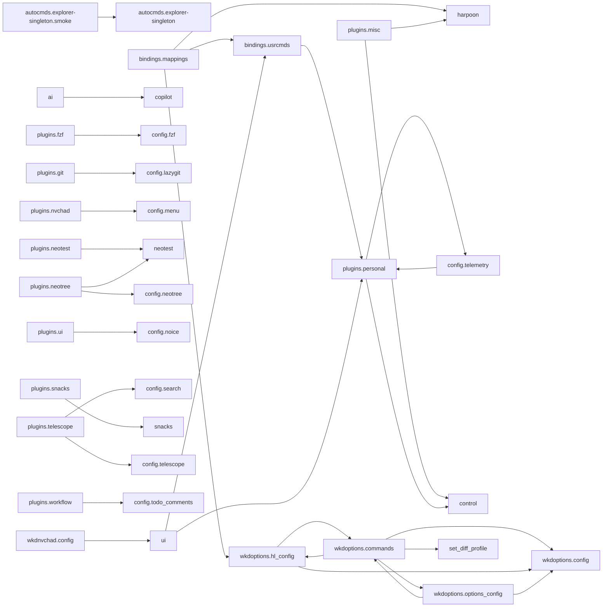

# nvim — module map

> **Generated** by `documentation`. Do not edit by hand — run `:DocMap`
> (or `nvim --headless -l scripts/gen_map.lua`) to regenerate.

**85 modules** · 338 namespaces · 219 helper files

The [interactive map](index.html) has filtering, full descriptions and
source links; this page is the version the code host renders directly.

## Namespaces

```mermaid
flowchart LR
  nlua["nvim"]
  nlua_autocmds["autocmdsbr/smallInitialize module for 'autocmds' FIX:…/small"]
  nlua_autocmds_general["generalbr/smallCentralized, toggleable autocmd suite with…/small"]
  nlua_autocmds_git["gitbr/smallOrchestrates all Git-related autocommands…/small"]
  nlua_autocmds_terminals["terminalsbr/smallTerminal-focused autocommands with feature…/small"]
  nlua_autocmds_text["textbr/smallText-focused autocommands with feature…/small"]
  nlua_bindings["bindings"]
  nlua_bindings_mappings["mappingsbr/smallEntry point to register all keymaps grouped…/small"]
  nlua_bindings_usrcmds["usrcmdsbr/smallInitialize module for 'bindings.usrcmds'/small"]
  nlua_config["config"]
  nlua_config_ai["ai"]
  nlua_config_copilot["copilot"]
  nlua_config_fzf["fzfbr/smallComposed fzf-lua configuration with custom…/small"]
  nlua_config_gp_config["gp_config"]
  nlua_config_harpoon["harpoon"]
  nlua_config_lazy["lazybr/smalllazy.nvim's own bootstrap options --…/small"]
  nlua_config_lazygit["lazygitbr/smallBridge that lets LazyGit custom commands…/small"]
  nlua_config_menu["menubr/smallOrchestrates submodules and exposes a…/small"]
  nlua_config_neotest["neotest"]
  nlua_config_neotree["neotreebr/smallNeo-tree unified configuration and…/small"]
  nlua_config_noice["noicebr/smallnoice.nvim's own opts table…/small"]
  nlua_config_search["searchbr/smallCentralized configuration for search.nvim./small"]
  nlua_config_snacks["snacks"]
  nlua_config_tabufline["tabuflinebr/smallCustom buffer navigation without automatic…/small"]
  nlua_config_telescope["telescopebr/smallModularized Telescope setup with file…/small"]
  nlua_config_todo_comments["todo_commentsbr/smalltodo-comments.nvim setup, built from…/small"]
  nlua_nvchad["nvchad"]
  nlua_plugins["plugins"]
  nlua_plugins_ai["ai"]
  nlua_plugins_colorscheme["colorscheme"]
  nlua_plugins_control["control"]
  nlua_plugins_github_stats["github-stats"]
  nlua_plugins_personal["personalbr/smallPersonal and local development plugins -…/small"]
  nlua_sessions["sessions"]
  nlua_sessions_storage["storage"]
  nlua_startup["startupbr/smallStartup phase runner with built-in…/small"]
  nlua_themes["themes"]
  nlua_wkdnvchad["wkdnvchadbr/smallEntry point: `M.setup(opts)` turns on…/small"]
  nlua_wkdnvchad_config["configbr/smallCentral configuration loader with…/small"]
  nlua_wkdnvchad_mappings["mappingsbr/smallMappings using lib.map for consistency/small"]
  nlua_wkdnvchad_ui["ui"]
  nlua_wkdnvchad_usrcmd["usrcmdbr/smallProvides :UI usercommand for runtime UI…/small"]
  nlua_wkdoptions["wkdoptionsbr/smallEntry point that enables the two…/small"]
  nlua_wkdoptions_commands["commandsbr/smallUser command registration system for…/small"]
  nlua_wkdoptions_config["configbr/smallCentral, modular configuration with lazy…/small"]
  nlua_wkdoptions_doc["doc"]
  nlua_wkdoptions_docs["docs"]
  nlua_wkdoptions_hl_config["hl_configbr/smallVisual/UX feature orchestrator (refactored…/small"]
  nlua_wkdoptions_indent_per_ft["indent_per_ftbr/small── Indent width per filetype…/small"]
  nlua_wkdoptions_italic_keywords["italic_keywordsbr/smallPer-language keyword lists…/small"]
  nlua_wkdoptions_options_config["options_configbr/smallEditor option toggles & global behaviors…/small"]
  nlua_wkdoptions_qflist["qflistbr/smallDiagnostic display config: virtual_text…/small"]
  nlua_wkdoptions_set_diff_profile["set_diff_profile"]
  nlua_wkdoptions_ui["ui"]
  nlua --> nlua_autocmds
  nlua_autocmds --> nlua_autocmds_general
  nlua_autocmds --> nlua_autocmds_git
  nlua_autocmds --> nlua_autocmds_terminals
  nlua_autocmds --> nlua_autocmds_text
  nlua --> nlua_bindings
  nlua_bindings --> nlua_bindings_mappings
  nlua_bindings --> nlua_bindings_usrcmds
  nlua --> nlua_config
  nlua_config --> nlua_config_ai
  nlua_config --> nlua_config_copilot
  nlua_config --> nlua_config_fzf
  nlua_config --> nlua_config_gp_config
  nlua_config --> nlua_config_harpoon
  nlua_config --> nlua_config_lazy
  nlua_config --> nlua_config_lazygit
  nlua_config --> nlua_config_menu
  nlua_config --> nlua_config_neotest
  nlua_config --> nlua_config_neotree
  nlua_config --> nlua_config_noice
  nlua_config --> nlua_config_search
  nlua_config --> nlua_config_snacks
  nlua_config --> nlua_config_tabufline
  nlua_config --> nlua_config_telescope
  nlua_config --> nlua_config_todo_comments
  nlua --> nlua_nvchad
  nlua --> nlua_plugins
  nlua_plugins --> nlua_plugins_ai
  nlua_plugins --> nlua_plugins_colorscheme
  nlua_plugins --> nlua_plugins_control
  nlua_plugins --> nlua_plugins_github_stats
  nlua_plugins --> nlua_plugins_personal
  nlua --> nlua_sessions
  nlua_sessions --> nlua_sessions_storage
  nlua --> nlua_startup
  nlua --> nlua_themes
  nlua --> nlua_wkdnvchad
  nlua_wkdnvchad --> nlua_wkdnvchad_config
  nlua_wkdnvchad --> nlua_wkdnvchad_mappings
  nlua_wkdnvchad --> nlua_wkdnvchad_ui
  nlua_wkdnvchad --> nlua_wkdnvchad_usrcmd
  nlua --> nlua_wkdoptions
  nlua_wkdoptions --> nlua_wkdoptions_commands
  nlua_wkdoptions --> nlua_wkdoptions_config
  nlua_wkdoptions --> nlua_wkdoptions_doc
  nlua_wkdoptions --> nlua_wkdoptions_docs
  nlua_wkdoptions --> nlua_wkdoptions_hl_config
  nlua_wkdoptions --> nlua_wkdoptions_indent_per_ft
  nlua_wkdoptions --> nlua_wkdoptions_italic_keywords
  nlua_wkdoptions --> nlua_wkdoptions_options_config
  nlua_wkdoptions --> nlua_wkdoptions_qflist
  nlua_wkdoptions --> nlua_wkdoptions_set_diff_profile
  nlua_wkdoptions --> nlua_wkdoptions_ui
```

## Dependencies

Which parts of the tree require which, rolled up to the second level.
The [interactive map](index.html)'s **Deps** view has this per module,
in both directions, with load-time and lazy requires told apart.

## Modules

| Module | Description | Fns | Docs |
|---|---|---|---|
| `autocmds` | Initialize module for 'autocmds' FIX: Modularisere die submodule in eigene module AUDIT: Wenn keine Probleme, dann dauerhaft implementieren, aber nach… |  | [README](../../lua/autocmds/README.md) · [src](../../lua/autocmds/init.lua) |
| &nbsp;&nbsp;`autocmds.general` | Centralized, toggleable autocmd suite with safe defaults and idempotent setup. | 1 | [README](../../lua/autocmds/general/README.md) · [src](../../lua/autocmds/general/init.lua) |
| &nbsp;&nbsp;`autocmds.git` | Orchestrates all Git-related autocommands by delegating to submodules. | 1 | [README](../../lua/autocmds/git/README.md) · [src](../../lua/autocmds/git/init.lua) |
| &nbsp;&nbsp;`autocmds.terminals` | Terminal-focused autocommands with feature flags. | 2 | [README](../../lua/autocmds/terminals/README.md) · [src](../../lua/autocmds/terminals/init.lua) |
| &nbsp;&nbsp;`autocmds.text` | Text-focused autocommands with feature flags and detailed options. | 2 | [README](../../lua/autocmds/text/README.md) · [src](../../lua/autocmds/text/init.lua) |
| `bindings` |  |  |  |
| &nbsp;&nbsp;`bindings.mappings` | Entry point to register all keymaps grouped by topic. | 1 | [README](../../lua/bindings/mappings/README.md) · [src](../../lua/bindings/mappings/init.lua) |
| &nbsp;&nbsp;&nbsp;&nbsp;`utils` |  |  |  |
| &nbsp;&nbsp;&nbsp;&nbsp;&nbsp;&nbsp;`bindings.mappings.utils.window_zoom` | Toggle maximize current window and restore previous layout sizes. | 4 | [README](../../lua/bindings/mappings/utils/window_zoom/README.md) · [src](../../lua/bindings/mappings/utils/window_zoom/init.lua) |
| &nbsp;&nbsp;`bindings.usrcmds` | Initialize module for 'bindings.usrcmds' |  | [README](../../lua/bindings/usrcmds/README.md) · [src](../../lua/bindings/usrcmds/init.lua) |
| &nbsp;&nbsp;&nbsp;&nbsp;`bindings.usrcmds.autocmd_docs` | `bindings/autocmd/` and `bindings/usercmd/` markdown from what `lib.nvim.bindings.autocmd` actually registered this session. | 2 | [src](../../lua/bindings/usrcmds/autocmd_docs/init.lua) |
| &nbsp;&nbsp;&nbsp;&nbsp;`bindings.usrcmds.bindings_explorer` | `:Bindings` — Picker über die BINDINGS-Cheatsheets (docs/NOTES/ PersonelPlugins/BINDINGS + docs/NOTES/ExternPlugins/Bindings). | 8 | [README](../../lua/bindings/usrcmds/bindings_explorer/README.md) · [src](../../lua/bindings/usrcmds/bindings_explorer/init.lua) |
| &nbsp;&nbsp;&nbsp;&nbsp;&nbsp;&nbsp;`doc` |  |  |  |
| &nbsp;&nbsp;&nbsp;&nbsp;&nbsp;&nbsp;`docs` |  |  |  |
| &nbsp;&nbsp;&nbsp;&nbsp;`bindings.usrcmds.case` | :Case — SAP-Support case scaffolding. | 8 | [README](../../lua/bindings/usrcmds/case/README.md) · [src](../../lua/bindings/usrcmds/case/init.lua) |
| &nbsp;&nbsp;&nbsp;&nbsp;&nbsp;&nbsp;`docs` |  |  |  |
| &nbsp;&nbsp;&nbsp;&nbsp;&nbsp;&nbsp;`extract` |  |  |  |
| &nbsp;&nbsp;&nbsp;&nbsp;&nbsp;&nbsp;`bindings.usrcmds.case.sla` | Public API for casedesk's SLA layer (docs/ROADMAP/casedesk/SLA.md): given a case, which of the three SAP-SLA clocks (Erstreaktion, laufende Rückmeldung,… | 10 | [README](../../lua/bindings/usrcmds/case/sla/README.md) · [src](../../lua/bindings/usrcmds/case/sla/init.lua) |
| &nbsp;&nbsp;&nbsp;&nbsp;&nbsp;&nbsp;`templates` |  |  |  |
| &nbsp;&nbsp;&nbsp;&nbsp;`bindings.usrcmds.context_open` | `M-o` / `M-O` / `:ContextOpen` -- one dispatcher unifying "open the thing under the cursor" across gopath.nvim (gF), markdown.nvim (TableView), images.nvim,… | 5 | [README](../../lua/bindings/usrcmds/context_open/README.md) · [src](../../lua/bindings/usrcmds/context_open/init.lua) |
| &nbsp;&nbsp;&nbsp;&nbsp;`bindings.usrcmds.plugin_repos` | source mode of the personal plugin list — plus an interactive picker and a dashboard. | 18 | [README](../../lua/bindings/usrcmds/plugin_repos/README.md) · [src](../../lua/bindings/usrcmds/plugin_repos/init.lua) |
| &nbsp;&nbsp;&nbsp;&nbsp;`bindings.usrcmds.telemetry_nvim_config` | aliases for `:RATelemetry setup nvim-config` / `:RATelemetry full nvim-config`. | 1 | [README](../../lua/bindings/usrcmds/telemetry_nvim_config/README.md) · [src](../../lua/bindings/usrcmds/telemetry_nvim_config/init.lua) |
| &nbsp;&nbsp;&nbsp;&nbsp;`bindings.usrcmds.update_repos` | Registers `:MyReposUpdate [path]`. | 11 | [README](../../lua/bindings/usrcmds/update_repos/README.md) · [src](../../lua/bindings/usrcmds/update_repos/init.lua) |
| &nbsp;&nbsp;&nbsp;&nbsp;`bindings.usrcmds.who_locks` | Registers `:WhoLocks [path]`. | 5 | [README](../../lua/bindings/usrcmds/who_locks/README.md) · [src](../../lua/bindings/usrcmds/who_locks/init.lua) |
| `config` |  |  |  |
| &nbsp;&nbsp;`ai` |  |  |  |
| &nbsp;&nbsp;&nbsp;&nbsp;`config.ai.anthropic` | Anthropic provider configuration for Avante. |  | [README](../../lua/config/ai/anthropic/README.md) · [src](../../lua/config/ai/anthropic/init.lua) |
| &nbsp;&nbsp;`copilot` |  |  |  |
| &nbsp;&nbsp;`config.fzf` | Composed fzf-lua configuration with custom actions | 1 | [README](../../lua/config/fzf/README.md) · [src](../../lua/config/fzf/init.lua) |
| &nbsp;&nbsp;&nbsp;&nbsp;`config.fzf.files` | File picker (fd) configuration and entry formatting | 4 | [README](../../lua/config/fzf/files/README.md) · [src](../../lua/config/fzf/files/init.lua) |
| &nbsp;&nbsp;&nbsp;&nbsp;`config.fzf.fzf_opts` | Low-level fzf command-line options History is owned by pickers.nvim (history.fzf_scope = "patch" in its setup()), which patches fzf-lua's… | 1 | [README](../../lua/config/fzf/fzf_opts/README.md) · [src](../../lua/config/fzf/fzf_opts/init.lua) |
| &nbsp;&nbsp;&nbsp;&nbsp;`config.fzf.grep` | ripgrep configuration for fzf-lua | 1 | [README](../../lua/config/fzf/grep/README.md) · [src](../../lua/config/fzf/grep/init.lua) |
| &nbsp;&nbsp;&nbsp;&nbsp;`config.fzf.keymaps` | Keymaps for fzf-lua (fzf prompt). | 1 | [README](../../lua/config/fzf/keymaps/README.md) · [src](../../lua/config/fzf/keymaps/init.lua) |
| &nbsp;&nbsp;`gp_config` |  |  |  |
| &nbsp;&nbsp;&nbsp;&nbsp;`hooks` |  |  |  |
| &nbsp;&nbsp;`harpoon` |  |  |  |
| &nbsp;&nbsp;&nbsp;&nbsp;`docs` |  |  |  |
| &nbsp;&nbsp;&nbsp;&nbsp;`config.harpoon.types` | Add these or adapt your existing type file accordingly. |  | [README](../../lua/config/harpoon/types/README.md) · [src](../../lua/config/harpoon/types/init.lua) |
| &nbsp;&nbsp;&nbsp;&nbsp;`ui` |  |  |  |
| &nbsp;&nbsp;&nbsp;&nbsp;`utils` |  |  |  |
| &nbsp;&nbsp;`config.lazy` | lazy.nvim's own bootstrap options -- `defaults.lazy = true`, plus a long comment on why remote-managed personal plugins need special handling (dir-mode… |  | [README](../../lua/config/lazy/README.md) · [src](../../lua/config/lazy/init.lua) |
| &nbsp;&nbsp;`config.lazygit` | Bridge that lets LazyGit custom commands open files in the *parent* Neovim. | 1 | [README](../../lua/config/lazygit/README.md) · [src](../../lua/config/lazygit/init.lua) |
| &nbsp;&nbsp;&nbsp;&nbsp;`actions` |  |  |  |
| &nbsp;&nbsp;&nbsp;&nbsp;`docs` |  |  | [README](../../lua/config/lazygit/docs/README.md) |
| &nbsp;&nbsp;`config.menu` | Orchestrates submodules and exposes a setup() that controls which top-level menu entries are enabled. | 1 | [README](../../lua/config/menu/README.md) · [src](../../lua/config/menu/init.lua) |
| &nbsp;&nbsp;&nbsp;&nbsp;`config.menu.custom_menu` | Returns the menu table for quick requires if desired | 4 | [README](../../lua/config/menu/custom_menu/README.md) · [src](../../lua/config/menu/custom_menu/init.lua) |
| &nbsp;&nbsp;&nbsp;&nbsp;`docs` |  |  |  |
| &nbsp;&nbsp;`neotest` |  |  |  |
| &nbsp;&nbsp;&nbsp;&nbsp;`config.neotest.actions` | Centralized Neotest actions usable by keymaps, usercommands and menus. | 10 | [README](../../lua/config/neotest/actions/README.md) · [src](../../lua/config/neotest/actions/init.lua) |
| &nbsp;&nbsp;&nbsp;&nbsp;`adapters` |  |  |  |
| &nbsp;&nbsp;&nbsp;&nbsp;`autocmds` |  |  |  |
| &nbsp;&nbsp;&nbsp;&nbsp;`config.neotest.commands` | User commands for Neotest based on shared actions. | 1 | [README](../../lua/config/neotest/commands/README.md) · [src](../../lua/config/neotest/commands/init.lua) |
| &nbsp;&nbsp;&nbsp;&nbsp;`consumers` |  |  |  |
| &nbsp;&nbsp;&nbsp;&nbsp;`config.neotest.core` | Core configuration and utilities for neotest integration | 4 | [README](../../lua/config/neotest/core/README.md) · [src](../../lua/config/neotest/core/init.lua) |
| &nbsp;&nbsp;&nbsp;&nbsp;`config.neotest.debug` | Neotest debug tooling: `:NeotestDebugAdapters`/`State`/`File`/`Root`/ `Framework` user commands, `M.keymaps()`, and `M.setup_all()` wiring both up --… | 3 | [README](../../lua/config/neotest/debug/README.md) · [src](../../lua/config/neotest/debug/init.lua) |
| &nbsp;&nbsp;&nbsp;&nbsp;`docs` |  |  |  |
| &nbsp;&nbsp;&nbsp;&nbsp;`config.neotest.highlights` | Neotest highlight groups setup | 1 | [README](../../lua/config/neotest/highlights/README.md) · [src](../../lua/config/neotest/highlights/init.lua) |
| &nbsp;&nbsp;&nbsp;&nbsp;`init` |  |  |  |
| &nbsp;&nbsp;&nbsp;&nbsp;&nbsp;&nbsp;`checks` |  |  |  |
| &nbsp;&nbsp;&nbsp;&nbsp;`config.neotest.keymaps` | Neotest keymaps using centralized actions. | 1 | [README](../../lua/config/neotest/keymaps/README.md) · [src](../../lua/config/neotest/keymaps/init.lua) |
| &nbsp;&nbsp;&nbsp;&nbsp;`config.neotest.neotree` | Neo-tree integration for Neotest actions. | 2 | [README](../../lua/config/neotest/neotree/README.md) · [src](../../lua/config/neotest/neotree/init.lua) |
| &nbsp;&nbsp;&nbsp;&nbsp;`config.neotest.telescope` | Telescope picker for Neotest actions. | 1 | [README](../../lua/config/neotest/telescope/README.md) · [src](../../lua/config/neotest/telescope/init.lua) |
| &nbsp;&nbsp;&nbsp;&nbsp;`utils` |  |  |  |
| &nbsp;&nbsp;&nbsp;&nbsp;`config.neotest.whichkey` | Which-key integration for Neotest actions (new spec) | 1 | [README](../../lua/config/neotest/whichkey/README.md) · [src](../../lua/config/neotest/whichkey/init.lua) |
| &nbsp;&nbsp;`config.neotree` | Neo-tree unified configuration and initialization | 2 | [README](../../lua/config/neotree/README.md) · [src](../../lua/config/neotree/init.lua) |
| &nbsp;&nbsp;&nbsp;&nbsp;`config.neotree.checkhealth` | Aggregated health checks for Neo-tree configuration | 1 | [README](../../lua/config/neotree/checkhealth/README.md) · [src](../../lua/config/neotree/checkhealth/init.lua) |
| &nbsp;&nbsp;&nbsp;&nbsp;`commands` |  |  |  |
| &nbsp;&nbsp;&nbsp;&nbsp;&nbsp;&nbsp;`config.neotree.commands.source` | `next_source`/`prev_source`: cycle neo-tree between its configured sources (filesystem, git_status, ...) in either direction, wrapping around. | 2 | [README](../../lua/config/neotree/commands/source/README.md) · [src](../../lua/config/neotree/commands/source/init.lua) |
| &nbsp;&nbsp;&nbsp;&nbsp;`config.neotree.event_handlers` | Neo-tree unified event handlers configuration |  | [README](../../lua/config/neotree/event_handlers/README.md) · [src](../../lua/config/neotree/event_handlers/init.lua) |
| &nbsp;&nbsp;&nbsp;&nbsp;`config.neotree.keymaps` | Centralized, buffer-local Neo-tree keymaps that override defaults consistently. |  | [README](../../lua/config/neotree/keymaps/README.md) · [src](../../lua/config/neotree/keymaps/init.lua) |
| &nbsp;&nbsp;&nbsp;&nbsp;&nbsp;&nbsp;`config.neotree.keymaps.filesystem` | Entry point that merges all filesystem keymap modules into a single mapping table. |  | [README](../../lua/config/neotree/keymaps/filesystem/README.md) · [src](../../lua/config/neotree/keymaps/filesystem/init.lua) |
| &nbsp;&nbsp;&nbsp;&nbsp;`sources` |  |  |  |
| &nbsp;&nbsp;&nbsp;&nbsp;`config.neotree.usercmds` | `:NeoTreeCheckHealth` -- runs `config.neotree.checkhealth` as a real command instead of only through `:checkhealth`. | 1 | [README](../../lua/config/neotree/usercmds/README.md) · [src](../../lua/config/neotree/usercmds/init.lua) |
| &nbsp;&nbsp;&nbsp;&nbsp;`config.neotree.utils` | Unified utilities for Neo-tree configuration | 3 | [README](../../lua/config/neotree/utils/README.md) · [src](../../lua/config/neotree/utils/init.lua) |
| &nbsp;&nbsp;&nbsp;&nbsp;`window` |  |  |  |
| &nbsp;&nbsp;&nbsp;&nbsp;&nbsp;&nbsp;`open` |  |  |  |
| &nbsp;&nbsp;&nbsp;&nbsp;&nbsp;&nbsp;&nbsp;&nbsp;`keymaps` |  |  |  |
| &nbsp;&nbsp;`config.noice` | noice.nvim's own opts table (cmdline/lsp/messages/popupmenu/presets/ routes/views/notify), assembled here rather than inline in the plugin spec. |  | [README](../../lua/config/noice/README.md) · [src](../../lua/config/noice/init.lua) |
| &nbsp;&nbsp;`config.search` | Centralized configuration for search.nvim. | 1 | [README](../../lua/config/search/README.md) · [src](../../lua/config/search/init.lua) |
| &nbsp;&nbsp;`snacks` |  |  |  |
| &nbsp;&nbsp;&nbsp;&nbsp;`docs` |  |  |  |
| &nbsp;&nbsp;&nbsp;&nbsp;`config.snacks.mappings` | Keymap definitions for folke/snacks.nvim. | 1 | [README](../../lua/config/snacks/mappings/README.md) · [src](../../lua/config/snacks/mappings/init.lua) |
| &nbsp;&nbsp;&nbsp;&nbsp;`config.snacks.picker` | Thin adapter that assembles the `Snacks.picker` options from pickers.nvim so the in-picker UX is unified across every engine (telescope / fzf-lua / snacks): | 8 | [README](../../lua/config/snacks/picker/README.md) · [src](../../lua/config/snacks/picker/init.lua) |
| &nbsp;&nbsp;`config.tabufline` | Custom buffer navigation without automatic centering | 5 | [README](../../lua/config/tabufline/README.md) · [src](../../lua/config/tabufline/init.lua) |
| &nbsp;&nbsp;`config.telescope` | Modularized Telescope setup with file browser keymaps. | 6 | [README](../../lua/config/telescope/README.md) · [src](../../lua/config/telescope/init.lua) |
| &nbsp;&nbsp;&nbsp;&nbsp;`file_browser` |  |  |  |
| &nbsp;&nbsp;`config.todo_comments` | todo-comments.nvim setup, built from `keywords/init.lua`'s keyword table -- degrades to a no-op `M.setup` if todo-comments itself is not installed, rather… | 4 | [README](../../lua/config/todo_comments/README.md) · [src](../../lua/config/todo_comments/init.lua) |
| &nbsp;&nbsp;&nbsp;&nbsp;`colors` |  |  |  |
| &nbsp;&nbsp;&nbsp;&nbsp;`config.todo_comments.keywords` | The keyword table todo-comments.nvim highlights: icon, color category and recognized aliases per keyword (FIX/INFO/DEBUG/TODO/ROADMAP/AUDIT/ HACK/...). |  | [README](../../lua/config/todo_comments/keywords/README.md) · [src](../../lua/config/todo_comments/keywords/init.lua) |
| `nvchad` |  |  |  |
| `plugins` |  |  |  |
| &nbsp;&nbsp;`ai` |  |  |  |
| &nbsp;&nbsp;`colorscheme` |  |  |  |
| &nbsp;&nbsp;`control` |  |  |  |
| &nbsp;&nbsp;`github-stats` |  |  |  |
| &nbsp;&nbsp;&nbsp;&nbsp;`data` |  |  |  |
| &nbsp;&nbsp;&nbsp;&nbsp;&nbsp;&nbsp;`StefanBartl_buffer-ctx.nvim` |  |  |  |
| &nbsp;&nbsp;&nbsp;&nbsp;&nbsp;&nbsp;&nbsp;&nbsp;`clones` |  |  |  |
| &nbsp;&nbsp;&nbsp;&nbsp;&nbsp;&nbsp;&nbsp;&nbsp;`paths` |  |  |  |
| &nbsp;&nbsp;&nbsp;&nbsp;&nbsp;&nbsp;&nbsp;&nbsp;`referrers` |  |  |  |
| &nbsp;&nbsp;&nbsp;&nbsp;&nbsp;&nbsp;&nbsp;&nbsp;`views` |  |  |  |
| &nbsp;&nbsp;&nbsp;&nbsp;&nbsp;&nbsp;`StefanBartl_cascade.nvim` |  |  |  |
| &nbsp;&nbsp;&nbsp;&nbsp;&nbsp;&nbsp;&nbsp;&nbsp;`clones` |  |  |  |
| &nbsp;&nbsp;&nbsp;&nbsp;&nbsp;&nbsp;&nbsp;&nbsp;`paths` |  |  |  |
| &nbsp;&nbsp;&nbsp;&nbsp;&nbsp;&nbsp;&nbsp;&nbsp;`referrers` |  |  |  |
| &nbsp;&nbsp;&nbsp;&nbsp;&nbsp;&nbsp;&nbsp;&nbsp;`views` |  |  |  |
| &nbsp;&nbsp;&nbsp;&nbsp;&nbsp;&nbsp;`StefanBartl_color_my_ascii.nvim` |  |  |  |
| &nbsp;&nbsp;&nbsp;&nbsp;&nbsp;&nbsp;&nbsp;&nbsp;`clones` |  |  |  |
| &nbsp;&nbsp;&nbsp;&nbsp;&nbsp;&nbsp;&nbsp;&nbsp;`paths` |  |  |  |
| &nbsp;&nbsp;&nbsp;&nbsp;&nbsp;&nbsp;&nbsp;&nbsp;`referrers` |  |  |  |
| &nbsp;&nbsp;&nbsp;&nbsp;&nbsp;&nbsp;&nbsp;&nbsp;`views` |  |  |  |
| &nbsp;&nbsp;&nbsp;&nbsp;&nbsp;&nbsp;`StefanBartl_debugging.nvim` |  |  |  |
| &nbsp;&nbsp;&nbsp;&nbsp;&nbsp;&nbsp;&nbsp;&nbsp;`clones` |  |  |  |
| &nbsp;&nbsp;&nbsp;&nbsp;&nbsp;&nbsp;&nbsp;&nbsp;`paths` |  |  |  |
| &nbsp;&nbsp;&nbsp;&nbsp;&nbsp;&nbsp;&nbsp;&nbsp;`referrers` |  |  |  |
| &nbsp;&nbsp;&nbsp;&nbsp;&nbsp;&nbsp;&nbsp;&nbsp;`views` |  |  |  |
| &nbsp;&nbsp;&nbsp;&nbsp;&nbsp;&nbsp;`StefanBartl_diff.nvim` |  |  |  |
| &nbsp;&nbsp;&nbsp;&nbsp;&nbsp;&nbsp;&nbsp;&nbsp;`clones` |  |  |  |
| &nbsp;&nbsp;&nbsp;&nbsp;&nbsp;&nbsp;&nbsp;&nbsp;`paths` |  |  |  |
| &nbsp;&nbsp;&nbsp;&nbsp;&nbsp;&nbsp;&nbsp;&nbsp;`referrers` |  |  |  |
| &nbsp;&nbsp;&nbsp;&nbsp;&nbsp;&nbsp;&nbsp;&nbsp;`views` |  |  |  |
| &nbsp;&nbsp;&nbsp;&nbsp;&nbsp;&nbsp;`StefanBartl_emojis.nvim` |  |  |  |
| &nbsp;&nbsp;&nbsp;&nbsp;&nbsp;&nbsp;&nbsp;&nbsp;`clones` |  |  |  |
| &nbsp;&nbsp;&nbsp;&nbsp;&nbsp;&nbsp;&nbsp;&nbsp;`paths` |  |  |  |
| &nbsp;&nbsp;&nbsp;&nbsp;&nbsp;&nbsp;&nbsp;&nbsp;`referrers` |  |  |  |
| &nbsp;&nbsp;&nbsp;&nbsp;&nbsp;&nbsp;&nbsp;&nbsp;`views` |  |  |  |
| &nbsp;&nbsp;&nbsp;&nbsp;&nbsp;&nbsp;`StefanBartl_fileops.nvim` |  |  |  |
| &nbsp;&nbsp;&nbsp;&nbsp;&nbsp;&nbsp;&nbsp;&nbsp;`clones` |  |  |  |
| &nbsp;&nbsp;&nbsp;&nbsp;&nbsp;&nbsp;&nbsp;&nbsp;`paths` |  |  |  |
| &nbsp;&nbsp;&nbsp;&nbsp;&nbsp;&nbsp;&nbsp;&nbsp;`referrers` |  |  |  |
| &nbsp;&nbsp;&nbsp;&nbsp;&nbsp;&nbsp;&nbsp;&nbsp;`views` |  |  |  |
| &nbsp;&nbsp;&nbsp;&nbsp;&nbsp;&nbsp;`StefanBartl_filetree.nvim` |  |  |  |
| &nbsp;&nbsp;&nbsp;&nbsp;&nbsp;&nbsp;&nbsp;&nbsp;`clones` |  |  |  |
| &nbsp;&nbsp;&nbsp;&nbsp;&nbsp;&nbsp;&nbsp;&nbsp;`paths` |  |  |  |
| &nbsp;&nbsp;&nbsp;&nbsp;&nbsp;&nbsp;&nbsp;&nbsp;`referrers` |  |  |  |
| &nbsp;&nbsp;&nbsp;&nbsp;&nbsp;&nbsp;&nbsp;&nbsp;`views` |  |  |  |
| &nbsp;&nbsp;&nbsp;&nbsp;&nbsp;&nbsp;`StefanBartl_github_stats.nvim` |  |  |  |
| &nbsp;&nbsp;&nbsp;&nbsp;&nbsp;&nbsp;&nbsp;&nbsp;`clones` |  |  |  |
| &nbsp;&nbsp;&nbsp;&nbsp;&nbsp;&nbsp;&nbsp;&nbsp;`paths` |  |  |  |
| &nbsp;&nbsp;&nbsp;&nbsp;&nbsp;&nbsp;&nbsp;&nbsp;`referrers` |  |  |  |
| &nbsp;&nbsp;&nbsp;&nbsp;&nbsp;&nbsp;&nbsp;&nbsp;`views` |  |  |  |
| &nbsp;&nbsp;&nbsp;&nbsp;&nbsp;&nbsp;`StefanBartl_gopath.nvim` |  |  |  |
| &nbsp;&nbsp;&nbsp;&nbsp;&nbsp;&nbsp;&nbsp;&nbsp;`clones` |  |  |  |
| &nbsp;&nbsp;&nbsp;&nbsp;&nbsp;&nbsp;&nbsp;&nbsp;`paths` |  |  |  |
| &nbsp;&nbsp;&nbsp;&nbsp;&nbsp;&nbsp;&nbsp;&nbsp;`referrers` |  |  |  |
| &nbsp;&nbsp;&nbsp;&nbsp;&nbsp;&nbsp;&nbsp;&nbsp;`views` |  |  |  |
| &nbsp;&nbsp;&nbsp;&nbsp;&nbsp;&nbsp;`StefanBartl_language.nvim` |  |  |  |
| &nbsp;&nbsp;&nbsp;&nbsp;&nbsp;&nbsp;&nbsp;&nbsp;`clones` |  |  |  |
| &nbsp;&nbsp;&nbsp;&nbsp;&nbsp;&nbsp;&nbsp;&nbsp;`paths` |  |  |  |
| &nbsp;&nbsp;&nbsp;&nbsp;&nbsp;&nbsp;&nbsp;&nbsp;`referrers` |  |  |  |
| &nbsp;&nbsp;&nbsp;&nbsp;&nbsp;&nbsp;&nbsp;&nbsp;`views` |  |  |  |
| &nbsp;&nbsp;&nbsp;&nbsp;&nbsp;&nbsp;`StefanBartl_lib.nvim` |  |  |  |
| &nbsp;&nbsp;&nbsp;&nbsp;&nbsp;&nbsp;&nbsp;&nbsp;`clones` |  |  |  |
| &nbsp;&nbsp;&nbsp;&nbsp;&nbsp;&nbsp;&nbsp;&nbsp;`paths` |  |  |  |
| &nbsp;&nbsp;&nbsp;&nbsp;&nbsp;&nbsp;&nbsp;&nbsp;`referrers` |  |  |  |
| &nbsp;&nbsp;&nbsp;&nbsp;&nbsp;&nbsp;&nbsp;&nbsp;`views` |  |  |  |
| &nbsp;&nbsp;&nbsp;&nbsp;&nbsp;&nbsp;`StefanBartl_markdown.nvim` |  |  |  |
| &nbsp;&nbsp;&nbsp;&nbsp;&nbsp;&nbsp;&nbsp;&nbsp;`clones` |  |  |  |
| &nbsp;&nbsp;&nbsp;&nbsp;&nbsp;&nbsp;&nbsp;&nbsp;`paths` |  |  |  |
| &nbsp;&nbsp;&nbsp;&nbsp;&nbsp;&nbsp;&nbsp;&nbsp;`referrers` |  |  |  |
| &nbsp;&nbsp;&nbsp;&nbsp;&nbsp;&nbsp;&nbsp;&nbsp;`views` |  |  |  |
| &nbsp;&nbsp;&nbsp;&nbsp;&nbsp;&nbsp;`StefanBartl_mdview.nvim` |  |  |  |
| &nbsp;&nbsp;&nbsp;&nbsp;&nbsp;&nbsp;&nbsp;&nbsp;`clones` |  |  |  |
| &nbsp;&nbsp;&nbsp;&nbsp;&nbsp;&nbsp;&nbsp;&nbsp;`paths` |  |  |  |
| &nbsp;&nbsp;&nbsp;&nbsp;&nbsp;&nbsp;&nbsp;&nbsp;`referrers` |  |  |  |
| &nbsp;&nbsp;&nbsp;&nbsp;&nbsp;&nbsp;&nbsp;&nbsp;`views` |  |  |  |
| &nbsp;&nbsp;&nbsp;&nbsp;&nbsp;&nbsp;`StefanBartl_migrate.nvim` |  |  |  |
| &nbsp;&nbsp;&nbsp;&nbsp;&nbsp;&nbsp;&nbsp;&nbsp;`clones` |  |  |  |
| &nbsp;&nbsp;&nbsp;&nbsp;&nbsp;&nbsp;&nbsp;&nbsp;`paths` |  |  |  |
| &nbsp;&nbsp;&nbsp;&nbsp;&nbsp;&nbsp;&nbsp;&nbsp;`referrers` |  |  |  |
| &nbsp;&nbsp;&nbsp;&nbsp;&nbsp;&nbsp;&nbsp;&nbsp;`views` |  |  |  |
| &nbsp;&nbsp;&nbsp;&nbsp;&nbsp;&nbsp;`StefanBartl_nvim-cmdlog` |  |  |  |
| &nbsp;&nbsp;&nbsp;&nbsp;&nbsp;&nbsp;&nbsp;&nbsp;`clones` |  |  |  |
| &nbsp;&nbsp;&nbsp;&nbsp;&nbsp;&nbsp;&nbsp;&nbsp;`paths` |  |  |  |
| &nbsp;&nbsp;&nbsp;&nbsp;&nbsp;&nbsp;&nbsp;&nbsp;`referrers` |  |  |  |
| &nbsp;&nbsp;&nbsp;&nbsp;&nbsp;&nbsp;&nbsp;&nbsp;`views` |  |  |  |
| &nbsp;&nbsp;&nbsp;&nbsp;&nbsp;&nbsp;`StefanBartl_nvim-containers` |  |  |  |
| &nbsp;&nbsp;&nbsp;&nbsp;&nbsp;&nbsp;&nbsp;&nbsp;`clones` |  |  |  |
| &nbsp;&nbsp;&nbsp;&nbsp;&nbsp;&nbsp;&nbsp;&nbsp;`paths` |  |  |  |
| &nbsp;&nbsp;&nbsp;&nbsp;&nbsp;&nbsp;&nbsp;&nbsp;`referrers` |  |  |  |
| &nbsp;&nbsp;&nbsp;&nbsp;&nbsp;&nbsp;&nbsp;&nbsp;`views` |  |  |  |
| &nbsp;&nbsp;&nbsp;&nbsp;&nbsp;&nbsp;`StefanBartl_open.nvim` |  |  |  |
| &nbsp;&nbsp;&nbsp;&nbsp;&nbsp;&nbsp;&nbsp;&nbsp;`clones` |  |  |  |
| &nbsp;&nbsp;&nbsp;&nbsp;&nbsp;&nbsp;&nbsp;&nbsp;`paths` |  |  |  |
| &nbsp;&nbsp;&nbsp;&nbsp;&nbsp;&nbsp;&nbsp;&nbsp;`referrers` |  |  |  |
| &nbsp;&nbsp;&nbsp;&nbsp;&nbsp;&nbsp;&nbsp;&nbsp;`views` |  |  |  |
| &nbsp;&nbsp;&nbsp;&nbsp;&nbsp;&nbsp;`StefanBartl_pdfport.nvim` |  |  |  |
| &nbsp;&nbsp;&nbsp;&nbsp;&nbsp;&nbsp;&nbsp;&nbsp;`clones` |  |  |  |
| &nbsp;&nbsp;&nbsp;&nbsp;&nbsp;&nbsp;&nbsp;&nbsp;`paths` |  |  |  |
| &nbsp;&nbsp;&nbsp;&nbsp;&nbsp;&nbsp;&nbsp;&nbsp;`referrers` |  |  |  |
| &nbsp;&nbsp;&nbsp;&nbsp;&nbsp;&nbsp;&nbsp;&nbsp;`views` |  |  |  |
| &nbsp;&nbsp;&nbsp;&nbsp;&nbsp;&nbsp;`StefanBartl_pickers.nvim` |  |  |  |
| &nbsp;&nbsp;&nbsp;&nbsp;&nbsp;&nbsp;&nbsp;&nbsp;`clones` |  |  |  |
| &nbsp;&nbsp;&nbsp;&nbsp;&nbsp;&nbsp;&nbsp;&nbsp;`paths` |  |  |  |
| &nbsp;&nbsp;&nbsp;&nbsp;&nbsp;&nbsp;&nbsp;&nbsp;`referrers` |  |  |  |
| &nbsp;&nbsp;&nbsp;&nbsp;&nbsp;&nbsp;&nbsp;&nbsp;`views` |  |  |  |
| &nbsp;&nbsp;&nbsp;&nbsp;&nbsp;&nbsp;`StefanBartl_project-insight.nvim` |  |  |  |
| &nbsp;&nbsp;&nbsp;&nbsp;&nbsp;&nbsp;&nbsp;&nbsp;`clones` |  |  |  |
| &nbsp;&nbsp;&nbsp;&nbsp;&nbsp;&nbsp;&nbsp;&nbsp;`paths` |  |  |  |
| &nbsp;&nbsp;&nbsp;&nbsp;&nbsp;&nbsp;&nbsp;&nbsp;`referrers` |  |  |  |
| &nbsp;&nbsp;&nbsp;&nbsp;&nbsp;&nbsp;&nbsp;&nbsp;`views` |  |  |  |
| &nbsp;&nbsp;&nbsp;&nbsp;&nbsp;&nbsp;`StefanBartl_recommender.nvim` |  |  |  |
| &nbsp;&nbsp;&nbsp;&nbsp;&nbsp;&nbsp;&nbsp;&nbsp;`clones` |  |  |  |
| &nbsp;&nbsp;&nbsp;&nbsp;&nbsp;&nbsp;&nbsp;&nbsp;`paths` |  |  |  |
| &nbsp;&nbsp;&nbsp;&nbsp;&nbsp;&nbsp;&nbsp;&nbsp;`referrers` |  |  |  |
| &nbsp;&nbsp;&nbsp;&nbsp;&nbsp;&nbsp;&nbsp;&nbsp;`views` |  |  |  |
| &nbsp;&nbsp;&nbsp;&nbsp;&nbsp;&nbsp;`StefanBartl_replacer.nvim` |  |  |  |
| &nbsp;&nbsp;&nbsp;&nbsp;&nbsp;&nbsp;&nbsp;&nbsp;`clones` |  |  |  |
| &nbsp;&nbsp;&nbsp;&nbsp;&nbsp;&nbsp;&nbsp;&nbsp;`paths` |  |  |  |
| &nbsp;&nbsp;&nbsp;&nbsp;&nbsp;&nbsp;&nbsp;&nbsp;`referrers` |  |  |  |
| &nbsp;&nbsp;&nbsp;&nbsp;&nbsp;&nbsp;&nbsp;&nbsp;`views` |  |  |  |
| &nbsp;&nbsp;&nbsp;&nbsp;&nbsp;&nbsp;`StefanBartl_reposcope.nvim` |  |  |  |
| &nbsp;&nbsp;&nbsp;&nbsp;&nbsp;&nbsp;&nbsp;&nbsp;`clones` |  |  |  |
| &nbsp;&nbsp;&nbsp;&nbsp;&nbsp;&nbsp;&nbsp;&nbsp;`paths` |  |  |  |
| &nbsp;&nbsp;&nbsp;&nbsp;&nbsp;&nbsp;&nbsp;&nbsp;`referrers` |  |  |  |
| &nbsp;&nbsp;&nbsp;&nbsp;&nbsp;&nbsp;&nbsp;&nbsp;`views` |  |  |  |
| &nbsp;&nbsp;&nbsp;&nbsp;&nbsp;&nbsp;`data` |  |  |  |
| &nbsp;&nbsp;&nbsp;&nbsp;&nbsp;&nbsp;&nbsp;&nbsp;`StefanBartl_buffer-ctx.nvim` |  |  |  |
| &nbsp;&nbsp;&nbsp;&nbsp;&nbsp;&nbsp;&nbsp;&nbsp;&nbsp;&nbsp;`clones` |  |  |  |
| &nbsp;&nbsp;&nbsp;&nbsp;&nbsp;&nbsp;&nbsp;&nbsp;&nbsp;&nbsp;`paths` |  |  |  |
| &nbsp;&nbsp;&nbsp;&nbsp;&nbsp;&nbsp;&nbsp;&nbsp;&nbsp;&nbsp;`referrers` |  |  |  |
| &nbsp;&nbsp;&nbsp;&nbsp;&nbsp;&nbsp;&nbsp;&nbsp;&nbsp;&nbsp;`views` |  |  |  |
| &nbsp;&nbsp;&nbsp;&nbsp;&nbsp;&nbsp;&nbsp;&nbsp;`StefanBartl_cascade.nvim` |  |  |  |
| &nbsp;&nbsp;&nbsp;&nbsp;&nbsp;&nbsp;&nbsp;&nbsp;&nbsp;&nbsp;`clones` |  |  |  |
| &nbsp;&nbsp;&nbsp;&nbsp;&nbsp;&nbsp;&nbsp;&nbsp;&nbsp;&nbsp;`paths` |  |  |  |
| &nbsp;&nbsp;&nbsp;&nbsp;&nbsp;&nbsp;&nbsp;&nbsp;&nbsp;&nbsp;`referrers` |  |  |  |
| &nbsp;&nbsp;&nbsp;&nbsp;&nbsp;&nbsp;&nbsp;&nbsp;&nbsp;&nbsp;`views` |  |  |  |
| &nbsp;&nbsp;&nbsp;&nbsp;&nbsp;&nbsp;&nbsp;&nbsp;`StefanBartl_cmdlog.nvim` |  |  |  |
| &nbsp;&nbsp;&nbsp;&nbsp;&nbsp;&nbsp;&nbsp;&nbsp;&nbsp;&nbsp;`clones` |  |  |  |
| &nbsp;&nbsp;&nbsp;&nbsp;&nbsp;&nbsp;&nbsp;&nbsp;&nbsp;&nbsp;`paths` |  |  |  |
| &nbsp;&nbsp;&nbsp;&nbsp;&nbsp;&nbsp;&nbsp;&nbsp;&nbsp;&nbsp;`referrers` |  |  |  |
| &nbsp;&nbsp;&nbsp;&nbsp;&nbsp;&nbsp;&nbsp;&nbsp;&nbsp;&nbsp;`views` |  |  |  |
| &nbsp;&nbsp;&nbsp;&nbsp;&nbsp;&nbsp;&nbsp;&nbsp;`StefanBartl_color_my_ascii.nvim` |  |  |  |
| &nbsp;&nbsp;&nbsp;&nbsp;&nbsp;&nbsp;&nbsp;&nbsp;&nbsp;&nbsp;`clones` |  |  |  |
| &nbsp;&nbsp;&nbsp;&nbsp;&nbsp;&nbsp;&nbsp;&nbsp;&nbsp;&nbsp;`paths` |  |  |  |
| &nbsp;&nbsp;&nbsp;&nbsp;&nbsp;&nbsp;&nbsp;&nbsp;&nbsp;&nbsp;`referrers` |  |  |  |
| &nbsp;&nbsp;&nbsp;&nbsp;&nbsp;&nbsp;&nbsp;&nbsp;&nbsp;&nbsp;`views` |  |  |  |
| &nbsp;&nbsp;&nbsp;&nbsp;&nbsp;&nbsp;&nbsp;&nbsp;`StefanBartl_debugging.nvim` |  |  |  |
| &nbsp;&nbsp;&nbsp;&nbsp;&nbsp;&nbsp;&nbsp;&nbsp;&nbsp;&nbsp;`clones` |  |  |  |
| &nbsp;&nbsp;&nbsp;&nbsp;&nbsp;&nbsp;&nbsp;&nbsp;&nbsp;&nbsp;`paths` |  |  |  |
| &nbsp;&nbsp;&nbsp;&nbsp;&nbsp;&nbsp;&nbsp;&nbsp;&nbsp;&nbsp;`referrers` |  |  |  |
| &nbsp;&nbsp;&nbsp;&nbsp;&nbsp;&nbsp;&nbsp;&nbsp;&nbsp;&nbsp;`views` |  |  |  |
| &nbsp;&nbsp;&nbsp;&nbsp;&nbsp;&nbsp;&nbsp;&nbsp;`StefanBartl_diff.nvim` |  |  |  |
| &nbsp;&nbsp;&nbsp;&nbsp;&nbsp;&nbsp;&nbsp;&nbsp;&nbsp;&nbsp;`clones` |  |  |  |
| &nbsp;&nbsp;&nbsp;&nbsp;&nbsp;&nbsp;&nbsp;&nbsp;&nbsp;&nbsp;`paths` |  |  |  |
| &nbsp;&nbsp;&nbsp;&nbsp;&nbsp;&nbsp;&nbsp;&nbsp;&nbsp;&nbsp;`referrers` |  |  |  |
| &nbsp;&nbsp;&nbsp;&nbsp;&nbsp;&nbsp;&nbsp;&nbsp;&nbsp;&nbsp;`views` |  |  |  |
| &nbsp;&nbsp;&nbsp;&nbsp;&nbsp;&nbsp;&nbsp;&nbsp;`StefanBartl_documentation.nvim` |  |  |  |
| &nbsp;&nbsp;&nbsp;&nbsp;&nbsp;&nbsp;&nbsp;&nbsp;&nbsp;&nbsp;`clones` |  |  |  |
| &nbsp;&nbsp;&nbsp;&nbsp;&nbsp;&nbsp;&nbsp;&nbsp;&nbsp;&nbsp;`paths` |  |  |  |
| &nbsp;&nbsp;&nbsp;&nbsp;&nbsp;&nbsp;&nbsp;&nbsp;&nbsp;&nbsp;`referrers` |  |  |  |
| &nbsp;&nbsp;&nbsp;&nbsp;&nbsp;&nbsp;&nbsp;&nbsp;&nbsp;&nbsp;`views` |  |  |  |
| &nbsp;&nbsp;&nbsp;&nbsp;&nbsp;&nbsp;&nbsp;&nbsp;`StefanBartl_emojis.nvim` |  |  |  |
| &nbsp;&nbsp;&nbsp;&nbsp;&nbsp;&nbsp;&nbsp;&nbsp;&nbsp;&nbsp;`clones` |  |  |  |
| &nbsp;&nbsp;&nbsp;&nbsp;&nbsp;&nbsp;&nbsp;&nbsp;&nbsp;&nbsp;`paths` |  |  |  |
| &nbsp;&nbsp;&nbsp;&nbsp;&nbsp;&nbsp;&nbsp;&nbsp;&nbsp;&nbsp;`referrers` |  |  |  |
| &nbsp;&nbsp;&nbsp;&nbsp;&nbsp;&nbsp;&nbsp;&nbsp;&nbsp;&nbsp;`views` |  |  |  |
| &nbsp;&nbsp;&nbsp;&nbsp;&nbsp;&nbsp;&nbsp;&nbsp;`StefanBartl_fileops.nvim` |  |  |  |
| &nbsp;&nbsp;&nbsp;&nbsp;&nbsp;&nbsp;&nbsp;&nbsp;&nbsp;&nbsp;`clones` |  |  |  |
| &nbsp;&nbsp;&nbsp;&nbsp;&nbsp;&nbsp;&nbsp;&nbsp;&nbsp;&nbsp;`paths` |  |  |  |
| &nbsp;&nbsp;&nbsp;&nbsp;&nbsp;&nbsp;&nbsp;&nbsp;&nbsp;&nbsp;`referrers` |  |  |  |
| &nbsp;&nbsp;&nbsp;&nbsp;&nbsp;&nbsp;&nbsp;&nbsp;&nbsp;&nbsp;`views` |  |  |  |
| &nbsp;&nbsp;&nbsp;&nbsp;&nbsp;&nbsp;&nbsp;&nbsp;`StefanBartl_filetree.nvim` |  |  |  |
| &nbsp;&nbsp;&nbsp;&nbsp;&nbsp;&nbsp;&nbsp;&nbsp;&nbsp;&nbsp;`clones` |  |  |  |
| &nbsp;&nbsp;&nbsp;&nbsp;&nbsp;&nbsp;&nbsp;&nbsp;&nbsp;&nbsp;`paths` |  |  |  |
| &nbsp;&nbsp;&nbsp;&nbsp;&nbsp;&nbsp;&nbsp;&nbsp;&nbsp;&nbsp;`referrers` |  |  |  |
| &nbsp;&nbsp;&nbsp;&nbsp;&nbsp;&nbsp;&nbsp;&nbsp;&nbsp;&nbsp;`views` |  |  |  |
| &nbsp;&nbsp;&nbsp;&nbsp;&nbsp;&nbsp;&nbsp;&nbsp;`StefanBartl_github_stats.nvim` |  |  |  |
| &nbsp;&nbsp;&nbsp;&nbsp;&nbsp;&nbsp;&nbsp;&nbsp;&nbsp;&nbsp;`clones` |  |  |  |
| &nbsp;&nbsp;&nbsp;&nbsp;&nbsp;&nbsp;&nbsp;&nbsp;&nbsp;&nbsp;`paths` |  |  |  |
| &nbsp;&nbsp;&nbsp;&nbsp;&nbsp;&nbsp;&nbsp;&nbsp;&nbsp;&nbsp;`referrers` |  |  |  |
| &nbsp;&nbsp;&nbsp;&nbsp;&nbsp;&nbsp;&nbsp;&nbsp;&nbsp;&nbsp;`views` |  |  |  |
| &nbsp;&nbsp;&nbsp;&nbsp;&nbsp;&nbsp;&nbsp;&nbsp;`StefanBartl_gopath.nvim` |  |  |  |
| &nbsp;&nbsp;&nbsp;&nbsp;&nbsp;&nbsp;&nbsp;&nbsp;&nbsp;&nbsp;`clones` |  |  |  |
| &nbsp;&nbsp;&nbsp;&nbsp;&nbsp;&nbsp;&nbsp;&nbsp;&nbsp;&nbsp;`paths` |  |  |  |
| &nbsp;&nbsp;&nbsp;&nbsp;&nbsp;&nbsp;&nbsp;&nbsp;&nbsp;&nbsp;`referrers` |  |  |  |
| &nbsp;&nbsp;&nbsp;&nbsp;&nbsp;&nbsp;&nbsp;&nbsp;&nbsp;&nbsp;`views` |  |  |  |
| &nbsp;&nbsp;&nbsp;&nbsp;&nbsp;&nbsp;&nbsp;&nbsp;`StefanBartl_insights.nvim` |  |  |  |
| &nbsp;&nbsp;&nbsp;&nbsp;&nbsp;&nbsp;&nbsp;&nbsp;&nbsp;&nbsp;`clones` |  |  |  |
| &nbsp;&nbsp;&nbsp;&nbsp;&nbsp;&nbsp;&nbsp;&nbsp;&nbsp;&nbsp;`paths` |  |  |  |
| &nbsp;&nbsp;&nbsp;&nbsp;&nbsp;&nbsp;&nbsp;&nbsp;&nbsp;&nbsp;`referrers` |  |  |  |
| &nbsp;&nbsp;&nbsp;&nbsp;&nbsp;&nbsp;&nbsp;&nbsp;&nbsp;&nbsp;`views` |  |  |  |
| &nbsp;&nbsp;&nbsp;&nbsp;&nbsp;&nbsp;&nbsp;&nbsp;`StefanBartl_language.nvim` |  |  |  |
| &nbsp;&nbsp;&nbsp;&nbsp;&nbsp;&nbsp;&nbsp;&nbsp;&nbsp;&nbsp;`clones` |  |  |  |
| &nbsp;&nbsp;&nbsp;&nbsp;&nbsp;&nbsp;&nbsp;&nbsp;&nbsp;&nbsp;`paths` |  |  |  |
| &nbsp;&nbsp;&nbsp;&nbsp;&nbsp;&nbsp;&nbsp;&nbsp;&nbsp;&nbsp;`referrers` |  |  |  |
| &nbsp;&nbsp;&nbsp;&nbsp;&nbsp;&nbsp;&nbsp;&nbsp;&nbsp;&nbsp;`views` |  |  |  |
| &nbsp;&nbsp;&nbsp;&nbsp;&nbsp;&nbsp;&nbsp;&nbsp;`StefanBartl_lib.nvim` |  |  |  |
| &nbsp;&nbsp;&nbsp;&nbsp;&nbsp;&nbsp;&nbsp;&nbsp;&nbsp;&nbsp;`clones` |  |  |  |
| &nbsp;&nbsp;&nbsp;&nbsp;&nbsp;&nbsp;&nbsp;&nbsp;&nbsp;&nbsp;`paths` |  |  |  |
| &nbsp;&nbsp;&nbsp;&nbsp;&nbsp;&nbsp;&nbsp;&nbsp;&nbsp;&nbsp;`referrers` |  |  |  |
| &nbsp;&nbsp;&nbsp;&nbsp;&nbsp;&nbsp;&nbsp;&nbsp;&nbsp;&nbsp;`views` |  |  |  |
| &nbsp;&nbsp;&nbsp;&nbsp;&nbsp;&nbsp;&nbsp;&nbsp;`StefanBartl_lsp.nvim` |  |  |  |
| &nbsp;&nbsp;&nbsp;&nbsp;&nbsp;&nbsp;&nbsp;&nbsp;&nbsp;&nbsp;`clones` |  |  |  |
| &nbsp;&nbsp;&nbsp;&nbsp;&nbsp;&nbsp;&nbsp;&nbsp;&nbsp;&nbsp;`paths` |  |  |  |
| &nbsp;&nbsp;&nbsp;&nbsp;&nbsp;&nbsp;&nbsp;&nbsp;&nbsp;&nbsp;`referrers` |  |  |  |
| &nbsp;&nbsp;&nbsp;&nbsp;&nbsp;&nbsp;&nbsp;&nbsp;&nbsp;&nbsp;`views` |  |  |  |
| &nbsp;&nbsp;&nbsp;&nbsp;&nbsp;&nbsp;&nbsp;&nbsp;`StefanBartl_markdown.nvim` |  |  |  |
| &nbsp;&nbsp;&nbsp;&nbsp;&nbsp;&nbsp;&nbsp;&nbsp;&nbsp;&nbsp;`clones` |  |  |  |
| &nbsp;&nbsp;&nbsp;&nbsp;&nbsp;&nbsp;&nbsp;&nbsp;&nbsp;&nbsp;`paths` |  |  |  |
| &nbsp;&nbsp;&nbsp;&nbsp;&nbsp;&nbsp;&nbsp;&nbsp;&nbsp;&nbsp;`referrers` |  |  |  |
| &nbsp;&nbsp;&nbsp;&nbsp;&nbsp;&nbsp;&nbsp;&nbsp;&nbsp;&nbsp;`views` |  |  |  |
| &nbsp;&nbsp;&nbsp;&nbsp;&nbsp;&nbsp;&nbsp;&nbsp;`StefanBartl_mdview.nvim` |  |  |  |
| &nbsp;&nbsp;&nbsp;&nbsp;&nbsp;&nbsp;&nbsp;&nbsp;&nbsp;&nbsp;`clones` |  |  |  |
| &nbsp;&nbsp;&nbsp;&nbsp;&nbsp;&nbsp;&nbsp;&nbsp;&nbsp;&nbsp;`paths` |  |  |  |
| &nbsp;&nbsp;&nbsp;&nbsp;&nbsp;&nbsp;&nbsp;&nbsp;&nbsp;&nbsp;`referrers` |  |  |  |
| &nbsp;&nbsp;&nbsp;&nbsp;&nbsp;&nbsp;&nbsp;&nbsp;&nbsp;&nbsp;`views` |  |  |  |
| &nbsp;&nbsp;&nbsp;&nbsp;&nbsp;&nbsp;&nbsp;&nbsp;`StefanBartl_migrate.nvim` |  |  |  |
| &nbsp;&nbsp;&nbsp;&nbsp;&nbsp;&nbsp;&nbsp;&nbsp;&nbsp;&nbsp;`clones` |  |  |  |
| &nbsp;&nbsp;&nbsp;&nbsp;&nbsp;&nbsp;&nbsp;&nbsp;&nbsp;&nbsp;`paths` |  |  |  |
| &nbsp;&nbsp;&nbsp;&nbsp;&nbsp;&nbsp;&nbsp;&nbsp;&nbsp;&nbsp;`referrers` |  |  |  |
| &nbsp;&nbsp;&nbsp;&nbsp;&nbsp;&nbsp;&nbsp;&nbsp;&nbsp;&nbsp;`views` |  |  |  |
| &nbsp;&nbsp;&nbsp;&nbsp;&nbsp;&nbsp;&nbsp;&nbsp;`StefanBartl_nvim-cmdlog` |  |  |  |
| &nbsp;&nbsp;&nbsp;&nbsp;&nbsp;&nbsp;&nbsp;&nbsp;&nbsp;&nbsp;`clones` |  |  |  |
| &nbsp;&nbsp;&nbsp;&nbsp;&nbsp;&nbsp;&nbsp;&nbsp;&nbsp;&nbsp;`paths` |  |  |  |
| &nbsp;&nbsp;&nbsp;&nbsp;&nbsp;&nbsp;&nbsp;&nbsp;&nbsp;&nbsp;`referrers` |  |  |  |
| &nbsp;&nbsp;&nbsp;&nbsp;&nbsp;&nbsp;&nbsp;&nbsp;&nbsp;&nbsp;`views` |  |  |  |
| &nbsp;&nbsp;&nbsp;&nbsp;&nbsp;&nbsp;&nbsp;&nbsp;`StefanBartl_nvim-containers` |  |  |  |
| &nbsp;&nbsp;&nbsp;&nbsp;&nbsp;&nbsp;&nbsp;&nbsp;&nbsp;&nbsp;`clones` |  |  |  |
| &nbsp;&nbsp;&nbsp;&nbsp;&nbsp;&nbsp;&nbsp;&nbsp;&nbsp;&nbsp;`paths` |  |  |  |
| &nbsp;&nbsp;&nbsp;&nbsp;&nbsp;&nbsp;&nbsp;&nbsp;&nbsp;&nbsp;`referrers` |  |  |  |
| &nbsp;&nbsp;&nbsp;&nbsp;&nbsp;&nbsp;&nbsp;&nbsp;&nbsp;&nbsp;`views` |  |  |  |
| &nbsp;&nbsp;&nbsp;&nbsp;&nbsp;&nbsp;&nbsp;&nbsp;`StefanBartl_open.nvim` |  |  |  |
| &nbsp;&nbsp;&nbsp;&nbsp;&nbsp;&nbsp;&nbsp;&nbsp;&nbsp;&nbsp;`clones` |  |  |  |
| &nbsp;&nbsp;&nbsp;&nbsp;&nbsp;&nbsp;&nbsp;&nbsp;&nbsp;&nbsp;`paths` |  |  |  |
| &nbsp;&nbsp;&nbsp;&nbsp;&nbsp;&nbsp;&nbsp;&nbsp;&nbsp;&nbsp;`referrers` |  |  |  |
| &nbsp;&nbsp;&nbsp;&nbsp;&nbsp;&nbsp;&nbsp;&nbsp;&nbsp;&nbsp;`views` |  |  |  |
| &nbsp;&nbsp;&nbsp;&nbsp;&nbsp;&nbsp;&nbsp;&nbsp;`StefanBartl_pdfport.nvim` |  |  |  |
| &nbsp;&nbsp;&nbsp;&nbsp;&nbsp;&nbsp;&nbsp;&nbsp;&nbsp;&nbsp;`clones` |  |  |  |
| &nbsp;&nbsp;&nbsp;&nbsp;&nbsp;&nbsp;&nbsp;&nbsp;&nbsp;&nbsp;`paths` |  |  |  |
| &nbsp;&nbsp;&nbsp;&nbsp;&nbsp;&nbsp;&nbsp;&nbsp;&nbsp;&nbsp;`referrers` |  |  |  |
| &nbsp;&nbsp;&nbsp;&nbsp;&nbsp;&nbsp;&nbsp;&nbsp;&nbsp;&nbsp;`views` |  |  |  |
| &nbsp;&nbsp;&nbsp;&nbsp;&nbsp;&nbsp;&nbsp;&nbsp;`StefanBartl_pickers.nvim` |  |  |  |
| &nbsp;&nbsp;&nbsp;&nbsp;&nbsp;&nbsp;&nbsp;&nbsp;&nbsp;&nbsp;`clones` |  |  |  |
| &nbsp;&nbsp;&nbsp;&nbsp;&nbsp;&nbsp;&nbsp;&nbsp;&nbsp;&nbsp;`paths` |  |  |  |
| &nbsp;&nbsp;&nbsp;&nbsp;&nbsp;&nbsp;&nbsp;&nbsp;&nbsp;&nbsp;`referrers` |  |  |  |
| &nbsp;&nbsp;&nbsp;&nbsp;&nbsp;&nbsp;&nbsp;&nbsp;&nbsp;&nbsp;`views` |  |  |  |
| &nbsp;&nbsp;&nbsp;&nbsp;&nbsp;&nbsp;&nbsp;&nbsp;`StefanBartl_project-insight.nvim` |  |  |  |
| &nbsp;&nbsp;&nbsp;&nbsp;&nbsp;&nbsp;&nbsp;&nbsp;&nbsp;&nbsp;`clones` |  |  |  |
| &nbsp;&nbsp;&nbsp;&nbsp;&nbsp;&nbsp;&nbsp;&nbsp;&nbsp;&nbsp;`paths` |  |  |  |
| &nbsp;&nbsp;&nbsp;&nbsp;&nbsp;&nbsp;&nbsp;&nbsp;&nbsp;&nbsp;`referrers` |  |  |  |
| &nbsp;&nbsp;&nbsp;&nbsp;&nbsp;&nbsp;&nbsp;&nbsp;&nbsp;&nbsp;`views` |  |  |  |
| &nbsp;&nbsp;&nbsp;&nbsp;&nbsp;&nbsp;&nbsp;&nbsp;`StefanBartl_recommender.nvim` |  |  |  |
| &nbsp;&nbsp;&nbsp;&nbsp;&nbsp;&nbsp;&nbsp;&nbsp;&nbsp;&nbsp;`clones` |  |  |  |
| &nbsp;&nbsp;&nbsp;&nbsp;&nbsp;&nbsp;&nbsp;&nbsp;&nbsp;&nbsp;`paths` |  |  |  |
| &nbsp;&nbsp;&nbsp;&nbsp;&nbsp;&nbsp;&nbsp;&nbsp;&nbsp;&nbsp;`referrers` |  |  |  |
| &nbsp;&nbsp;&nbsp;&nbsp;&nbsp;&nbsp;&nbsp;&nbsp;&nbsp;&nbsp;`views` |  |  |  |
| &nbsp;&nbsp;&nbsp;&nbsp;&nbsp;&nbsp;&nbsp;&nbsp;`StefanBartl_replacer.nvim` |  |  |  |
| &nbsp;&nbsp;&nbsp;&nbsp;&nbsp;&nbsp;&nbsp;&nbsp;&nbsp;&nbsp;`clones` |  |  |  |
| &nbsp;&nbsp;&nbsp;&nbsp;&nbsp;&nbsp;&nbsp;&nbsp;&nbsp;&nbsp;`paths` |  |  |  |
| &nbsp;&nbsp;&nbsp;&nbsp;&nbsp;&nbsp;&nbsp;&nbsp;&nbsp;&nbsp;`referrers` |  |  |  |
| &nbsp;&nbsp;&nbsp;&nbsp;&nbsp;&nbsp;&nbsp;&nbsp;&nbsp;&nbsp;`views` |  |  |  |
| &nbsp;&nbsp;&nbsp;&nbsp;&nbsp;&nbsp;&nbsp;&nbsp;`StefanBartl_reposcope.nvim` |  |  |  |
| &nbsp;&nbsp;&nbsp;&nbsp;&nbsp;&nbsp;&nbsp;&nbsp;&nbsp;&nbsp;`clones` |  |  |  |
| &nbsp;&nbsp;&nbsp;&nbsp;&nbsp;&nbsp;&nbsp;&nbsp;&nbsp;&nbsp;`paths` |  |  |  |
| &nbsp;&nbsp;&nbsp;&nbsp;&nbsp;&nbsp;&nbsp;&nbsp;&nbsp;&nbsp;`referrers` |  |  |  |
| &nbsp;&nbsp;&nbsp;&nbsp;&nbsp;&nbsp;&nbsp;&nbsp;&nbsp;&nbsp;`views` |  |  |  |
| &nbsp;&nbsp;&nbsp;&nbsp;&nbsp;&nbsp;&nbsp;&nbsp;`StefanBartl_sandbox.nvim` |  |  |  |
| &nbsp;&nbsp;&nbsp;&nbsp;&nbsp;&nbsp;&nbsp;&nbsp;&nbsp;&nbsp;`clones` |  |  |  |
| &nbsp;&nbsp;&nbsp;&nbsp;&nbsp;&nbsp;&nbsp;&nbsp;&nbsp;&nbsp;`paths` |  |  |  |
| &nbsp;&nbsp;&nbsp;&nbsp;&nbsp;&nbsp;&nbsp;&nbsp;&nbsp;&nbsp;`referrers` |  |  |  |
| &nbsp;&nbsp;&nbsp;&nbsp;&nbsp;&nbsp;&nbsp;&nbsp;&nbsp;&nbsp;`views` |  |  |  |
| &nbsp;&nbsp;`plugins.personal` | Personal and local development plugins - the SPEC IMPLEMENTATION only. |  | [README](../../lua/plugins/personal/README.md) · [src](../../lua/plugins/personal/init.lua) |
| `sessions` |  |  |  |
| &nbsp;&nbsp;`storage` |  |  |  |
| `startup` | Startup phase runner with built-in measurement. | 9 | [README](../../lua/startup/README.md) · [src](../../lua/startup/init.lua) |
| `themes` |  |  |  |
| `wkdnvchad` | Entry point: `M.setup(opts)` turns on wkdnvchad's own submodules (mappings, ...) selectively per `opts.all`/`opts.<name>` flag rather than loading everything… | 1 | [README](../../lua/wkdnvchad/README.md) · [src](../../lua/wkdnvchad/init.lua) |
| &nbsp;&nbsp;`wkdnvchad.config` | Central configuration loader with statusline variant selection. | 3 | [README](../../lua/wkdnvchad/config/README.md) · [src](../../lua/wkdnvchad/config/init.lua) |
| &nbsp;&nbsp;&nbsp;&nbsp;`statusline` |  |  |  |
| &nbsp;&nbsp;`wkdnvchad.mappings` | Mappings using lib.map for consistency | 4 | [README](../../lua/wkdnvchad/mappings/README.md) · [src](../../lua/wkdnvchad/mappings/init.lua) |
| &nbsp;&nbsp;&nbsp;&nbsp;`wkdnvchad.mappings.tabufline` | Custom buffer navigation without automatic centering | 8 | [README](../../lua/wkdnvchad/mappings/tabufline/README.md) · [src](../../lua/wkdnvchad/mappings/tabufline/init.lua) |
| &nbsp;&nbsp;`ui` |  |  |  |
| &nbsp;&nbsp;&nbsp;&nbsp;`highlights` |  |  |  |
| &nbsp;&nbsp;&nbsp;&nbsp;`statusline` |  |  |  |
| &nbsp;&nbsp;&nbsp;&nbsp;&nbsp;&nbsp;`wkdnvchad.ui.statusline.cursor_ctl` | Cursor-position statusline mode: classic/row/col/rows_cols/off, cycled by `toggle_mode()` and read by whichever renderer the statusline module picks per mode. | 3 | [README](../../lua/wkdnvchad/ui/statusline/cursor_ctl/README.md) · [src](../../lua/wkdnvchad/ui/statusline/cursor_ctl/init.lua) |
| &nbsp;&nbsp;&nbsp;&nbsp;&nbsp;&nbsp;`modules` |  |  |  |
| &nbsp;&nbsp;&nbsp;&nbsp;&nbsp;&nbsp;&nbsp;&nbsp;`wkdnvchad.ui.statusline.modules.casedesk` | Statusline segment: current case's short number + company + how many files sit in its Replies/ folder, plus an SLA badge when a P1/P2 clock is urgent… | 3 | [README](../../lua/wkdnvchad/ui/statusline/modules/casedesk/README.md) · [src](../../lua/wkdnvchad/ui/statusline/modules/casedesk/init.lua) |
| &nbsp;&nbsp;&nbsp;&nbsp;&nbsp;&nbsp;&nbsp;&nbsp;`wkdnvchad.ui.statusline.modules.custom` | Module with helper function for custom nvchad/ui/statusline |  | [README](../../lua/wkdnvchad/ui/statusline/modules/custom/README.md) · [src](../../lua/wkdnvchad/ui/statusline/modules/custom/init.lua) |
| &nbsp;&nbsp;&nbsp;&nbsp;&nbsp;&nbsp;&nbsp;&nbsp;&nbsp;&nbsp;`breadcrumbs` |  |  |  |
| &nbsp;&nbsp;&nbsp;&nbsp;&nbsp;&nbsp;&nbsp;&nbsp;`file_icons` |  |  |  |
| &nbsp;&nbsp;&nbsp;&nbsp;&nbsp;&nbsp;&nbsp;&nbsp;`wkdnvchad.ui.statusline.modules.filetree_cwd_mode` | filetree.nvim's cwd_mode badge (PROJECT/PKG/LOCK/MANUAL/TREE, or whatever `indicator.style` renders it as), read via its external-statusline API rather than… | 2 | [README](../../lua/wkdnvchad/ui/statusline/modules/filetree_cwd_mode/README.md) · [src](../../lua/wkdnvchad/ui/statusline/modules/filetree_cwd_mode/init.lua) |
| &nbsp;&nbsp;&nbsp;&nbsp;&nbsp;&nbsp;&nbsp;&nbsp;`wkdnvchad.ui.statusline.modules.formatters` | Statusline formatters with lib integration and performance optimizations | 5 | [README](../../lua/wkdnvchad/ui/statusline/modules/formatters/README.md) · [src](../../lua/wkdnvchad/ui/statusline/modules/formatters/init.lua) |
| &nbsp;&nbsp;&nbsp;&nbsp;&nbsp;&nbsp;&nbsp;&nbsp;`helpers` |  |  |  |
| &nbsp;&nbsp;&nbsp;&nbsp;&nbsp;&nbsp;&nbsp;&nbsp;`wkdnvchad.ui.statusline.modules.highlighting` | ========================================================= Statusline Highlighting Utilities | 4 | [README](../../lua/wkdnvchad/ui/statusline/modules/highlighting/README.md) · [src](../../lua/wkdnvchad/ui/statusline/modules/highlighting/init.lua) |
| &nbsp;&nbsp;&nbsp;&nbsp;&nbsp;&nbsp;&nbsp;&nbsp;`wkdnvchad.ui.statusline.modules.lsp` | LSP-first breadcrumbs for NvChad statusline (async + cached), with Treesitter fallback. | 6 | [README](../../lua/wkdnvchad/ui/statusline/modules/lsp/README.md) · [src](../../lua/wkdnvchad/ui/statusline/modules/lsp/init.lua) |
| &nbsp;&nbsp;&nbsp;&nbsp;&nbsp;&nbsp;&nbsp;&nbsp;&nbsp;&nbsp;`wkdnvchad.ui.statusline.modules.lsp.config` | ============================================================================ Typed configuration accessor for LSP-based statusline module | 4 | [README](../../lua/wkdnvchad/ui/statusline/modules/lsp/config/README.md) · [src](../../lua/wkdnvchad/ui/statusline/modules/lsp/config/init.lua) |
| &nbsp;&nbsp;&nbsp;&nbsp;&nbsp;&nbsp;&nbsp;&nbsp;&nbsp;&nbsp;`docs` |  |  |  |
| &nbsp;&nbsp;&nbsp;&nbsp;&nbsp;&nbsp;&nbsp;&nbsp;&nbsp;&nbsp;`helpers` |  |  |  |
| &nbsp;&nbsp;&nbsp;&nbsp;&nbsp;&nbsp;&nbsp;&nbsp;&nbsp;&nbsp;`symbols` |  |  |  |
| &nbsp;&nbsp;&nbsp;&nbsp;&nbsp;&nbsp;&nbsp;&nbsp;`wkdnvchad.ui.statusline.modules.neotest_module` | Statusline segment: neotest's own running/passed/failed counts, colored per status, empty when nothing has run yet. |  | [README](../../lua/wkdnvchad/ui/statusline/modules/neotest_module/README.md) · [src](../../lua/wkdnvchad/ui/statusline/modules/neotest_module/init.lua) |
| &nbsp;&nbsp;&nbsp;&nbsp;&nbsp;&nbsp;&nbsp;&nbsp;`wkdnvchad.ui.statusline.modules.plugin_progress` | Statusline component for any plugin running a long operation. |  | [README](../../lua/wkdnvchad/ui/statusline/modules/plugin_progress/README.md) · [src](../../lua/wkdnvchad/ui/statusline/modules/plugin_progress/init.lua) |
| &nbsp;&nbsp;&nbsp;&nbsp;&nbsp;&nbsp;&nbsp;&nbsp;`wkdnvchad.ui.statusline.modules.plugin_summary` | Statusline segment: how many plugins lazy.nvim manages, split into "own" (the personal StefanBartl/*.nvim repos declared in `plugins.personal` — the same… | 1 | [README](../../lua/wkdnvchad/ui/statusline/modules/plugin_summary/README.md) · [src](../../lua/wkdnvchad/ui/statusline/modules/plugin_summary/init.lua) |
| &nbsp;&nbsp;&nbsp;&nbsp;&nbsp;&nbsp;`utils` |  |  |  |
| &nbsp;&nbsp;`wkdnvchad.usrcmd` | Provides :UI usercommand for runtime UI configuration (Base46, editor UI). | 10 | [README](../../lua/wkdnvchad/usrcmd/README.md) · [src](../../lua/wkdnvchad/usrcmd/init.lua) |
| &nbsp;&nbsp;&nbsp;&nbsp;`wkdnvchad.usrcmd.themes` | Theme management for Base46/NvChad | 13 | [README](../../lua/wkdnvchad/usrcmd/themes/README.md) · [src](../../lua/wkdnvchad/usrcmd/themes/init.lua) |
| `wkdoptions` | Entry point that enables the two configuration modules: - wkdoptions/hl_config (visual/UX features & highlight groups) - wkdoptions/options_config (editor… | 9 | [README](../../lua/wkdoptions/README.md) · [src](../../lua/wkdoptions/init.lua) |
| &nbsp;&nbsp;`wkdoptions.commands` | User command registration system for WKDOptions (refactored). | 6 | [README](../../lua/wkdoptions/commands/README.md) · [src](../../lua/wkdoptions/commands/init.lua) |
| &nbsp;&nbsp;`wkdoptions.config` | Central, modular configuration with lazy loading and observer pattern. | 15 | [README](../../lua/wkdoptions/config/README.md) · [src](../../lua/wkdoptions/config/init.lua) |
| &nbsp;&nbsp;&nbsp;&nbsp;`core` |  |  |  |
| &nbsp;&nbsp;&nbsp;&nbsp;`data` |  |  |  |
| &nbsp;&nbsp;`doc` |  |  |  |
| &nbsp;&nbsp;`docs` |  |  |  |
| &nbsp;&nbsp;&nbsp;&nbsp;`highlights` |  |  |  |
| &nbsp;&nbsp;`wkdoptions.hl_config` | Visual/UX feature orchestrator (refactored for modularity, safety, and performance). | 7 | [README](../../lua/wkdoptions/hl_config/README.md) · [src](../../lua/wkdoptions/hl_config/init.lua) |
| &nbsp;&nbsp;&nbsp;&nbsp;`wkdoptions.hl_config.breadcrumbs` | Breadcrumbs orchestrator: coordinates context building and winbar rendering. | 5 | [README](../../lua/wkdoptions/hl_config/breadcrumbs/README.md) · [src](../../lua/wkdoptions/hl_config/breadcrumbs/init.lua) |
| &nbsp;&nbsp;&nbsp;&nbsp;&nbsp;&nbsp;`wkdoptions.hl_config.breadcrumbs.ctx` | Architecture: 1. | 9 | [README](../../lua/wkdoptions/hl_config/breadcrumbs/ctx/README.md) · [src](../../lua/wkdoptions/hl_config/breadcrumbs/ctx/init.lua) |
| &nbsp;&nbsp;&nbsp;&nbsp;&nbsp;&nbsp;&nbsp;&nbsp;`lang` |  |  |  |
| &nbsp;&nbsp;&nbsp;&nbsp;&nbsp;&nbsp;&nbsp;&nbsp;`providers` |  |  |  |
| &nbsp;&nbsp;&nbsp;&nbsp;&nbsp;&nbsp;&nbsp;&nbsp;`utils` |  |  |  |
| &nbsp;&nbsp;&nbsp;&nbsp;`core` |  |  |  |
| &nbsp;&nbsp;&nbsp;&nbsp;`wkdoptions.hl_config.cword_occurrences` | Highlight all occurrences of <cword> in the buffer except the one under the cursor. | 16 | [README](../../lua/wkdoptions/hl_config/cword_occurrences/README.md) · [src](../../lua/wkdoptions/hl_config/cword_occurrences/init.lua) |
| &nbsp;&nbsp;&nbsp;&nbsp;`features` |  |  |  |
| &nbsp;&nbsp;&nbsp;&nbsp;`wkdoptions.hl_config.path_cache` | Buffer-local cache for repo root and repo-relative path. | 5 | [README](../../lua/wkdoptions/hl_config/path_cache/README.md) · [src](../../lua/wkdoptions/hl_config/path_cache/init.lua) |
| &nbsp;&nbsp;&nbsp;&nbsp;`utils` |  |  |  |
| &nbsp;&nbsp;`wkdoptions.indent_per_ft` | ── Indent width per filetype ───────────────────────────────── Add or change entries as… |  | [README](../../lua/wkdoptions/indent_per_ft/README.md) · [src](../../lua/wkdoptions/indent_per_ft/init.lua) |
| &nbsp;&nbsp;`wkdoptions.italic_keywords` | Per-language keyword lists (return/for/if/... | 1 | [README](../../lua/wkdoptions/italic_keywords/README.md) · [src](../../lua/wkdoptions/italic_keywords/init.lua) |
| &nbsp;&nbsp;`wkdoptions.options_config` | Editor option toggles & global behaviors which are not purely visual highlight groups: * cursorline/column defaults (cooperate with hl_config) * guicursor… | 5 | [README](../../lua/wkdoptions/options_config/README.md) · [src](../../lua/wkdoptions/options_config/init.lua) |
| &nbsp;&nbsp;`wkdoptions.qflist` | Diagnostic display config: virtual_text spacing/prefix, underline, signs, severity-sorted -- the same `vim.diagnostic.config()` surface `lsp.core.diagnostics`… |  | [README](../../lua/wkdoptions/qflist/README.md) · [src](../../lua/wkdoptions/qflist/init.lua) |
| &nbsp;&nbsp;`set_diff_profile` |  |  | [README](../../lua/wkdoptions/set_diff_profile/README.md) |
| &nbsp;&nbsp;`ui` |  |  |  |
| &nbsp;&nbsp;&nbsp;&nbsp;`wkdoptions.ui.line_numbers` | Viewport-aware hybrid line numbers using centralized ignore list. | 1 | [README](../../lua/wkdoptions/ui/line_numbers/README.md) · [src](../../lua/wkdoptions/ui/line_numbers/init.lua) |

## Drift

0 errors · 210 warnings · 72 info

| Severity | Check | Message |
|---|---|---|
| warn | `binding-conflict` | keymap GD in mode n is registered 2 times; the last one wins: lua/bindings/mappings/snacks.lua:237 (map), lua/bindings/mappings/snacks.lua:241 (map) |
| warn | `binding-conflict` | keymap m in mode n is registered 2 times; the last one wins: lua/bindings/usrcmds/case/ui.lua:557 (map), lua/bindings/usrcmds/case/ui.lua:2636 (map) |
| warn | `binding-conflict` | keymap c in mode n is registered 2 times; the last one wins: lua/bindings/usrcmds/case/ui.lua:533 (map), lua/bindings/usrcmds/case/ui.lua:2652 (map) |
| warn | `binding-conflict` | keymap s in mode n is registered 2 times; the last one wins: lua/bindings/usrcmds/case/ui.lua:297 (map), lua/bindings/usrcmds/case/ui.lua:543 (map) |
| warn | `binding-conflict` | keymap e in mode n is registered 2 times; the last one wins: lua/bindings/usrcmds/case/ui.lua:293 (map), lua/bindings/usrcmds/case/ui.lua:1315 (map) |
| warn | `binding-conflict` | keymap <CR> in mode n is registered 2 times; the last one wins: lua/bindings/mappings/editing.lua:258 (map), lua/config/harpoon/ui/menu_telescope.lua:69 (map) |
| warn | `binding-conflict` | keymap <C-x> in mode n is registered 2 times; the last one wins: lua/bindings/mappings/ctrl_cycle.lua:242 (map), lua/config/harpoon/ui/menu_telescope.lua:71 (map) |
| warn | `binding-conflict` | keymap <CR> in mode i is registered 2 times; the last one wins: lua/config/harpoon/ui/menu_telescope.lua:65 (map), lua/config/neotest/telescope:43 (map) |
| warn | `binding-conflict` | keymap gh in mode n is registered 2 times; the last one wins: lua/wkdoptions/hl_config/features/diff_peek.lua:25 (map), lua/wkdoptions/hl_config/features/diff_peek.lua:32 (map) |
| warn | `dead-readme-link` | docs/NOTES/ARCHIVE/plugin-sweep-2026-08/RULES-audit-completion.md links to 'E:/repos/WKDBooks/Development/wkdbook-Lua/Checklists/belege/plugins/insights.nvim.md' which does not exist |
| warn | `dead-readme-link` | docs/NOTES/ARCHIVE/plugin-sweep-2026-08/RULES-audit-completion.md links to 'E:/repos/WKDBooks/Development/wkdbook-Lua/Checklists/belege/plugins/documentation.nvim.md' which does not exist |
| warn | `dead-readme-link` | docs/NOTES/ARCHIVE/plugin-sweep-2026-08/RULES-audit-completion.md links to 'E:/repos/WKDBooks/Development/wkdbook-Lua/Checklists/belege/plugins/emojis.nvim.md' which does not exist |
| warn | `dead-readme-link` | docs/NOTES/ARCHIVE/plugin-sweep-2026-08/RULES-audit-completion.md links to 'E:/repos/WKDBooks/Development/wkdbook-Lua/Checklists/belege/plugins/cascade.nvim.md' which does not exist |
| warn | `dead-readme-link` | docs/NOTES/ARCHIVE/plugin-sweep-2026-08/RULES-audit-completion.md links to 'E:/repos/WKDBooks/Development/wkdbook-Lua/Checklists/belege/plugins/pickers.nvim.md' which does not exist |
| warn | `dead-readme-link` | docs/NOTES/ARCHIVE/plugin-sweep-2026-08/RULES-audit-completion.md links to 'E:/repos/WKDBooks/Development/wkdbook-Lua/Checklists/belege/plugins/lib.nvim.md' which does not exist |
| warn | `dead-readme-link` | docs/NOTES/ARCHIVE/plugin-sweep-2026-08/RULES-audit-completion.md links to 'E:/repos/WKDBooks/Development/wkdbook-Lua/Checklists/belege/plugins/sandbox.nvim.md' which does not exist |
| warn | `dead-readme-link` | docs/NOTES/ARCHIVE/plugin-sweep-2026-08/RULES-audit-completion.md links to 'E:/repos/WKDBooks/Development/wkdbook-Lua/Checklists/belege/plugins/sessions.nvim.md' which does not exist |
| warn | `dead-readme-link` | docs/NOTES/ARCHIVE/plugin-sweep-2026-08/RULES-audit-completion.md links to 'E:/repos/WKDBooks/Development/wkdbook-Lua/Checklists/belege/plugins/learn-cli.nvim.md' which does not exist |
| warn | `dead-readme-link` | docs/NOTES/ARCHIVE/plugin-sweep-2026-08/RULES-audit-completion.md links to 'E:/repos/WKDBooks/Development/wkdbook-Lua/Checklists/belege/plugins/mdview.nvim.md' which does not exist |
| warn | `dead-readme-link` | docs/NOTES/ARCHIVE/plugin-sweep-2026-08/RULES-audit-completion.md links to 'E:/repos/WKDBooks/Development/wkdbook-Lua/Checklists/belege/plugins/buffer-ctx.nvim.md' which does not exist |
| warn | `dead-readme-link` | docs/NOTES/ARCHIVE/plugin-sweep-2026-08/RULES-audit-completion.md links to 'E:/repos/WKDBooks/Development/wkdbook-Lua/Checklists/belege/plugins/open.nvim.md' which does not exist |
| warn | `dead-readme-link` | docs/NOTES/ARCHIVE/plugin-sweep-2026-08/RULES-audit-completion.md links to 'E:/repos/WKDBooks/Development/wkdbook-Lua/Checklists/belege/plugins/runtime-analysis.nvim.md' which does not exist |
| warn | `dead-readme-link` | docs/NOTES/ARCHIVE/plugin-sweep-2026-08/RULES-audit-completion.md links to 'E:/repos/WKDBooks/Development/wkdbook-Lua/Checklists/belege/nvim-config.md' which does not exist |
| warn | `dead-readme-link` | docs/NOTES/ARCHIVE/plugin-sweep-2026-08/RULES-audit-count.md links to 'E:/repos/WKDBooks/Development/wkdbook-Lua/Checklists/belege/plugins/filetree.nvim.md' which does not exist |
| warn | `dead-readme-link` | docs/NOTES/ARCHIVE/plugin-sweep-2026-08/RULES-audit-count.md links to 'E:/repos/WKDBooks/Development/wkdbook-Lua/Checklists/belege/plugins/gopath.nvim.md' which does not exist |
| warn | `dead-readme-link` | docs/NOTES/ARCHIVE/plugin-sweep-2026-08/RULES-audit-count.md links to 'E:/repos/WKDBooks/Development/wkdbook-Lua/Checklists/belege/plugins/diff.nvim.md' which does not exist |
| warn | `dead-readme-link` | docs/NOTES/ARCHIVE/plugin-sweep-2026-08/RULES-audit-count.md links to 'E:/repos/WKDBooks/Development/wkdbook-Lua/Checklists/belege/plugins/sandbox.nvim.md' which does not exist |
| warn | `dead-readme-link` | docs/NOTES/ARCHIVE/plugin-sweep-2026-08/RULES-audit-count.md links to 'E:/repos/WKDBooks/Development/wkdbook-Lua/Checklists/belege/plugins/reposcope.nvim.md' which does not exist |
| warn | `dead-readme-link` | docs/NOTES/ARCHIVE/plugin-sweep-2026-08/RULES-audit-count.md links to 'E:/repos/WKDBooks/Development/wkdbook-Lua/Checklists/belege/plugins/debugging.nvim.md' which does not exist |
| warn | `dead-readme-link` | docs/NOTES/ARCHIVE/plugin-sweep-2026-08/RULES-audit-count.md links to 'E:/repos/WKDBooks/Development/wkdbook-Lua/Checklists/belege/plugins/pickers.nvim.md' which does not exist |
| warn | `dead-readme-link` | docs/NOTES/ARCHIVE/plugin-sweep-2026-08/RULES-audit-count.md links to 'E:/repos/WKDBooks/Development/wkdbook-Lua/Checklists/belege/plugins/fileops.nvim.md' which does not exist |
| warn | `dead-readme-link` | docs/NOTES/ARCHIVE/plugin-sweep-2026-08/RULES-audit-count.md links to 'E:/repos/WKDBooks/Development/wkdbook-Lua/Checklists/belege/plugins/documentation.nvim.md' which does not exist |
| warn | `dead-readme-link` | docs/NOTES/ARCHIVE/plugin-sweep-2026-08/RULES-audit-count.md links to 'E:/repos/WKDBooks/Development/wkdbook-Lua/Checklists/belege/plugins/github_stats.nvim.md' which does not exist |
| warn | `dead-readme-link` | docs/NOTES/ARCHIVE/plugin-sweep-2026-08/RULES-audit-count.md links to 'E:/repos/WKDBooks/Development/wkdbook-Lua/Checklists/belege/plugins/cascade.nvim.md' which does not exist |
| warn | `dead-readme-link` | docs/NOTES/ARCHIVE/plugin-sweep-2026-08/RULES-audit-count.md links to 'E:/repos/WKDBooks/Development/wkdbook-Lua/Checklists/belege/nvim-config.md' which does not exist |
| warn | `dead-readme-link` | docs/NOTES/ARCHIVE/plugin-sweep-2026-08/RULES-audit-count.md links to 'E:/repos/WKDBooks/Development/wkdbook-Lua/Checklists/belege/plugins/language.nvim.md' which does not exist |
| warn | `dead-readme-link` | docs/NOTES/ARCHIVE/plugin-sweep-2026-08/RULES-audit-count.md links to 'E:/repos/WKDBooks/Development/wkdbook-Lua/Checklists/belege/plugins/emojis.nvim.md' which does not exist |
| warn | `dead-readme-link` | docs/NOTES/ARCHIVE/plugin-sweep-2026-08/RULES-audit-count.md links to 'E:/repos/WKDBooks/Development/wkdbook-Lua/Checklists/belege/plugins/dap.nvim.md' which does not exist |
| warn | `dead-readme-link` | docs/NOTES/ARCHIVE/plugin-sweep-2026-08/RULES-audit-count.md links to 'E:/repos/WKDBooks/Development/wkdbook-Lua/Checklists/belege/plugins/open.nvim.md' which does not exist |
| warn | `dead-readme-link` | docs/NOTES/ARCHIVE/plugin-sweep-2026-08/RULES-audit-count.md links to 'E:/repos/WKDBooks/Development/wkdbook-Lua/Checklists/belege/plugins/sessions.nvim.md' which does not exist |
| warn | `dead-readme-link` | docs/NOTES/ARCHIVE/plugin-sweep-2026-08/RULES-audit-count.md links to 'E:/repos/WKDBooks/Development/wkdbook-Lua/Checklists/belege/plugins/cmdlog.nvim.md' which does not exist |
| warn | `dead-readme-link` | docs/NOTES/ARCHIVE/plugin-sweep-2026-08/RULES-flags-options.md links to 'E:/repos/WKDBooks/Development/wkdbook-Lua/Checklists/belege/plugins/documentation.nvim.md' which does not exist |
| warn | `dead-readme-link` | docs/NOTES/ARCHIVE/plugin-sweep-2026-08/RULES-flags-options.md links to 'E:/repos/WKDBooks/Development/wkdbook-Lua/Checklists/belege/plugins/lib.nvim.md' which does not exist |
| warn | `dead-readme-link` | docs/NOTES/ARCHIVE/plugin-sweep-2026-08/RULES-flags-options.md links to 'E:/repos/WKDBooks/Development/wkdbook-Lua/Checklists/belege/nvim-config.md' which does not exist |
| warn | `dead-readme-link` | docs/NOTES/BINDINGS-FORMAT.md links to 'ROADMAP/personal/bindings-explorer.nvim.md' which does not exist |
| warn | `dead-readme-link` | docs/NOTES/ExternPlugins/Bindings/Autocmds/Noice.md links to '../../../../../lua/lib/nvim/bindings/autocmd.lua' which does not exist |
| warn | `dead-readme-link` | docs/NOTES/ExternPlugins/Bindings/Keymaps/Conform.md links to '../../../../../lua/lsp/languages/webdev/astro/keymaps.lua' which does not exist |
| warn | `dead-readme-link` | docs/NOTES/ExternPlugins/Bindings/Keymaps/Conform.md links to '../../../../../lua/lsp/languages/documentation/markdown.lua' which does not exist |
| warn | `dead-readme-link` | docs/NOTES/ExternPlugins/Bindings/Keymaps/Conform.md links to '../../../../../lua/config/menu/neotree/entries.lua' which does not exist |
| warn | `dead-readme-link` | docs/NOTES/ExternPlugins/Bindings/Keymaps/IncRename.md links to '../../../../../lua/plugins/lsp.lua' which does not exist |
| warn | `dead-readme-link` | docs/NOTES/ExternPlugins/Bindings/Keymaps/IncRename.md links to '../../../../../lua/config/inc_rename/init.lua' which does not exist |
| warn | `dead-readme-link` | docs/NOTES/ExternPlugins/Bindings/Keymaps/Menu.md links to '../../../../../lua/config/menu/neotree/entries.lua' which does not exist |
| warn | `dead-readme-link` | docs/NOTES/ExternPlugins/Bindings/Keymaps/Menu.md links to '../../../../../lua/config/menu/neotree/init.lua' which does not exist |
| warn | `dead-readme-link` | docs/NOTES/ExternPlugins/Bindings/Keymaps/Trouble.md links to '../../../../../lua/bindings/mappings/trouble.lua' which does not exist |
| warn | `dead-readme-link` | docs/NOTES/ExternPlugins/Bindings/Keymaps/Trouble.md links to '../../../../../lua/plugins/trouble.lua' which does not exist |
| warn | `dead-readme-link` | docs/NOTES/ExternPlugins/Bindings/Keymaps/Unicode.md links to '../../../../../../nvim-data/lazy/unicode.vim/doc/unicode.txt' which does not exist |
| warn | `dead-readme-link` | docs/NOTES/ExternPlugins/Bindings/Usercmds/Conform.md links to '../../../../../lua/lsp/usercmds/formatter.lua' which does not exist |
| warn | `dead-readme-link` | docs/NOTES/ExternPlugins/Bindings/Usercmds/Conform.md links to '../../../../../lua/lsp/languages/documentation/markdown.lua' which does not exist |
| warn | `dead-readme-link` | docs/NOTES/ExternPlugins/Bindings/Usercmds/Conform.md links to '../../../../../lua/plugins/lsp.lua' which does not exist |
| warn | `dead-readme-link` | docs/NOTES/ExternPlugins/Bindings/Usercmds/Conform.md links to '../../../../../lua/lsp/init.lua' which does not exist |
| warn | `dead-readme-link` | docs/NOTES/ExternPlugins/Bindings/Usercmds/Conform.md links to '../../../../../lua/lsp/formatter/conform.lua' which does not exist |
| warn | `dead-readme-link` | docs/NOTES/ExternPlugins/Bindings/Usercmds/Conform.md links to '../../../../../lua/lsp/formatter/init.lua' which does not exist |
| warn | `dead-readme-link` | docs/NOTES/ExternPlugins/Bindings/Usercmds/Unicode.md links to '../../../../../../nvim-data/lazy/unicode.vim/doc/unicode.txt' which does not exist |
| warn | `dead-readme-link` | docs/NOTES/ExternPlugins/Bindings/Usercmds/WorkspaceDiagnostics.md links to '../../../../../lua/lsp/core/workspace_diagnostics.lua' which does not exist |
| warn | `dead-readme-link` | docs/NOTES/ExternPlugins/Bindings/Usercmds/WorkspaceDiagnostics.md links to '../../../../../lua/lsp/init.lua' which does not exist |
| warn | `dead-readme-link` | docs/NOTES/ExternPlugins/Bindings/Usercmds/WorkspaceDiagnostics.md links to '../../../../../lua/lsp/usercmds/workspace_diagnostics.lua' which does not exist |
| warn | `dead-readme-link` | docs/NOTES/ExternPlugins/Legacy-Notes-Import/08_plugins/Mappings_STALE-Harpoon-API.md links to '../../../../../home/steve/.config/nvim/lua/mappings.lua' which does not exist |
| warn | `dead-readme-link` | docs/NOTES/ExternPlugins/Legacy-Notes-Import/Neovim-Notes.md links to 'E:\MyGithub\Notes\NVIM-Notes\MyNotes\JumpPositiong.md' which does not exist |
| warn | `dead-readme-link` | docs/NOTES/ExternPlugins/Legacy-Notes-Import/Neovim-Notes.md links to './08_plugins/fuzzy_finder/fzflua/Filtertechniken.md' which does not exist |
| warn | `dead-readme-link` | docs/NOTES/ExternPlugins/Legacy-Notes-Import/Neovim-Notes.md links to '../Notes/NVIM-Notes/NVIM-Lua-Notes.md' which does not exist |
| warn | `dead-readme-link` | docs/NOTES/ExternPlugins/Legacy-Notes-Import/Neovim-Notes.md links to '../Notes/NVIM-Notes/NVIM-Api-Notes.md' which does not exist |
| warn | `dead-readme-link` | docs/NOTES/PersonelPlugins/BINDINGS/autocmds-by-event.md links to '../../NOTES/PersonelPlugins/BINDINGS/Autocmds/reposcope.nvim.md' which does not exist |
| warn | `dead-readme-link` | docs/NOTES/PersonelPlugins/BINDINGS/autocmds-by-plugin.md links to '../../NOTES/PersonelPlugins/BINDINGS/Autocmds/pickers.nvim.md' which does not exist |
| warn | `dead-readme-link` | docs/NOTES/PersonelPlugins/BINDINGS/autocmds-by-plugin.md links to '../../NOTES/PersonelPlugins/BINDINGS/Autocmds/pdfport.nvim.md' which does not exist |
| warn | `dead-readme-link` | docs/NOTES/PersonelPlugins/BINDINGS/autocmds-by-plugin.md links to '../../NOTES/PersonelPlugins/BINDINGS/Autocmds/All.md' which does not exist |
| warn | `dead-readme-link` | docs/NOTES/PersonelPlugins/BINDINGS/autocmds-by-plugin.md links to '../../NOTES/PersonelPlugins/BINDINGS/Autocmds/open.nvim.md' which does not exist |
| warn | `dead-readme-link` | docs/NOTES/PersonelPlugins/BINDINGS/autocmds-by-plugin.md links to '../../NOTES/PersonelPlugins/BINDINGS/Autocmds/recommender.nvim.md' which does not exist |
| warn | `dead-readme-link` | docs/NOTES/PersonelPlugins/BINDINGS/autocmds-by-plugin.md links to '../../NOTES/PersonelPlugins/BINDINGS/Autocmds/sessions.nvim.md' which does not exist |
| warn | `dead-readme-link` | docs/NOTES/PersonelPlugins/BINDINGS/autocmds-by-plugin.md links to '../../NOTES/PersonelPlugins/BINDINGS/Autocmds/runtime-analysis.nvim.md' which does not exist |
| warn | `dead-readme-link` | docs/NOTES/PersonelPlugins/BINDINGS/autocmds-by-plugin.md links to '../../NOTES/PersonelPlugins/BINDINGS/Autocmds/replacer.nvim.md' which does not exist |
| warn | `dead-readme-link` | docs/NOTES/PersonelPlugins/BINDINGS/autocmds-by-plugin.md links to '../../NOTES/PersonelPlugins/BINDINGS/Autocmds/spotlight.nvim.md' which does not exist |
| warn | `dead-readme-link` | docs/NOTES/PersonelPlugins/BINDINGS/autocmds-by-plugin.md links to '../../NOTES/PersonelPlugins/BINDINGS/Autocmds/sandbox.nvim.md' which does not exist |
| warn | `dead-readme-link` | docs/NOTES/PersonelPlugins/BINDINGS/autocmds-by-plugin.md links to '../../NOTES/PersonelPlugins/BINDINGS/Autocmds/cmdlog.md' which does not exist |
| warn | `dead-readme-link` | docs/NOTES/PersonelPlugins/BINDINGS/autocmds-by-plugin.md links to '../../NOTES/PersonelPlugins/BINDINGS/Autocmds/reposcope.nvim.md' which does not exist |
| warn | `dead-readme-link` | docs/NOTES/PersonelPlugins/BINDINGS/autocmds-by-plugin.md links to '../../NOTES/PersonelPlugins/BINDINGS/Autocmds/mdview.nvim.md' which does not exist |
| warn | `dead-readme-link` | docs/NOTES/PersonelPlugins/BINDINGS/autocmds-by-plugin.md links to '../../NOTES/PersonelPlugins/BINDINGS/Autocmds/debugging.nvim.md' which does not exist |
| warn | `dead-readme-link` | docs/NOTES/PersonelPlugins/BINDINGS/autocmds-by-plugin.md links to '../../NOTES/PersonelPlugins/BINDINGS/Autocmds/diff.nvim.md' which does not exist |
| warn | `dead-readme-link` | docs/NOTES/PersonelPlugins/BINDINGS/autocmds-by-plugin.md links to '../../NOTES/PersonelPlugins/BINDINGS/Autocmds/emojis.nvim.md' which does not exist |
| warn | `dead-readme-link` | docs/NOTES/PersonelPlugins/BINDINGS/autocmds-by-plugin.md links to '../../NOTES/PersonelPlugins/BINDINGS/Autocmds/migrate.nvim.md' which does not exist |
| warn | `dead-readme-link` | docs/NOTES/PersonelPlugins/BINDINGS/autocmds-by-plugin.md links to '../../NOTES/PersonelPlugins/BINDINGS/Autocmds/cascade.nvim.md' which does not exist |
| warn | `dead-readme-link` | docs/NOTES/PersonelPlugins/BINDINGS/autocmds-by-plugin.md links to '../../NOTES/PersonelPlugins/BINDINGS/Autocmds/color_my_ascii.nvim.md' which does not exist |
| warn | `dead-readme-link` | docs/NOTES/PersonelPlugins/BINDINGS/autocmds-by-plugin.md links to '../../NOTES/PersonelPlugins/BINDINGS/Autocmds/buffer-ctx.md' which does not exist |
| warn | `dead-readme-link` | docs/NOTES/PersonelPlugins/BINDINGS/autocmds-by-plugin.md links to '../../NOTES/PersonelPlugins/BINDINGS/Autocmds/fileops.nvim.md' which does not exist |
| warn | `dead-readme-link` | docs/NOTES/PersonelPlugins/BINDINGS/autocmds-by-plugin.md links to '../../NOTES/PersonelPlugins/BINDINGS/Autocmds/dap.nvim.md' which does not exist |
| warn | `dead-readme-link` | docs/NOTES/PersonelPlugins/BINDINGS/autocmds-by-plugin.md links to '../../NOTES/PersonelPlugins/BINDINGS/Autocmds/markdown.nvim.md' which does not exist |
| warn | `dead-readme-link` | docs/NOTES/PersonelPlugins/BINDINGS/autocmds-by-plugin.md links to '../../NOTES/PersonelPlugins/BINDINGS/Autocmds/gopath.nvim.md' which does not exist |
| warn | `dead-readme-link` | docs/NOTES/PersonelPlugins/BINDINGS/autocmds-by-plugin.md links to '../../NOTES/PersonelPlugins/BINDINGS/Autocmds/insights.nvim.md' which does not exist |
| warn | `dead-readme-link` | docs/NOTES/PersonelPlugins/BINDINGS/autocmds-by-plugin.md links to '../../NOTES/PersonelPlugins/BINDINGS/Autocmds/language.nvim.md' which does not exist |
| warn | `dead-readme-link` | docs/NOTES/PersonelPlugins/BINDINGS/autocmds-by-plugin.md links to '../../NOTES/PersonelPlugins/BINDINGS/Autocmds/github_stats.nvim.md' which does not exist |
| warn | `dead-readme-link` | docs/NOTES/PersonelPlugins/BINDINGS/autocmds-by-plugin.md links to '../../NOTES/PersonelPlugins/BINDINGS/Autocmds/lib.nvim.md' which does not exist |
| warn | `dead-readme-link` | docs/NOTES/PersonelPlugins/BINDINGS/autocmds-by-plugin.md links to '../../NOTES/PersonelPlugins/BINDINGS/Autocmds/filetree.nvim.md' which does not exist |
| warn | `dead-readme-link` | docs/NOTES/PersonelPlugins/TO_CHECK_FEATURES/runtime-analysis.md links to '../mdview/mdview.md' which does not exist |
| warn | `dead-readme-link` | docs/ROADMAP/IDEAS/NEW_PLUGIN.md links to './lsp.md' which does not exist |
| warn | `dead-readme-link` | docs/ROADMAP/IDEAS/NEW_PLUGIN.md links to './MATERIALS/NEW_Project.md' which does not exist |
| warn | `dead-readme-link` | docs/ROADMAP/IDEAS/RULES-plugin-ideas.md links to 'E:/repos/WKDBooks/Development/wkdbook-Lua/Checklists/belege/plugins/sessions.nvim.md' which does not exist |
| warn | `dead-readme-link` | docs/ROADMAP/IDEAS/RULES-plugin-ideas.md links to 'E:/repos/WKDBooks/Development/wkdbook-Lua/Checklists/belege/plugins/cmdlog.nvim.md' which does not exist |
| warn | `dead-readme-link` | docs/ROADMAP/IDEAS/RULES-plugin-ideas.md links to 'E:/repos/WKDBooks/Development/wkdbook-Lua/Checklists/belege/plugins/runtime-analysis.nvim.md' which does not exist |
| warn | `dead-readme-link` | docs/ROADMAP/IDEAS/RULES-plugin-ideas.md links to 'E:/repos/WKDBooks/Development/wkdbook-Lua/Checklists/belege/plugins/reposcope.nvim.md' which does not exist |
| warn | `dead-readme-link` | docs/ROADMAP/IDEAS/RULES-plugin-ideas.md links to 'E:/repos/WKDBooks/Development/wkdbook-Lua/Checklists/belege/plugins/gopath.nvim.md' which does not exist |
| warn | `dead-readme-link` | docs/ROADMAP/IDEAS/RULES-plugin-ideas.md links to 'E:/repos/WKDBooks/Development/wkdbook-Lua/Checklists/belege/plugins/images.nvim.md' which does not exist |
| warn | `dead-readme-link` | docs/ROADMAP/IDEAS/RULES-plugin-ideas.md links to 'E:/repos/WKDBooks/Development/wkdbook-Lua/Checklists/belege/nvim-config.md' which does not exist |
| warn | `dead-readme-link` | docs/ROADMAP/IDEAS/RULES-plugin-ideas.md links to 'E:/repos/WKDBooks/Development/wkdbook-Lua/Checklists/belege/plugins/insights.nvim.md' which does not exist |
| warn | `dead-readme-link` | docs/ROADMAP/IDEAS/RULES-plugin-ideas.md links to 'E:/repos/WKDBooks/Development/wkdbook-Lua/Checklists/belege/plugins/buffer-ctx.nvim.md' which does not exist |
| warn | `dead-readme-link` | docs/ROADMAP/IDEAS/RULES-plugin-ideas.md links to 'E:/repos/WKDBooks/Development/wkdbook-Lua/Checklists/belege/plugins/sandbox.nvim.md' which does not exist |
| warn | `dead-readme-link` | docs/ROADMAP/IDEAS/RULES-plugin-ideas.md links to 'E:/repos/WKDBooks/Development/wkdbook-Lua/Checklists/belege/plugins/cascade.nvim.md' which does not exist |
| warn | `dead-readme-link` | docs/ROADMAP/IDEAS/RULES-plugin-ideas.md links to 'E:/repos/WKDBooks/Development/wkdbook-Lua/Checklists/belege/plugins/pdfport.nvim.md' which does not exist |
| warn | `dead-readme-link` | docs/ROADMAP/IDEAS/RULES-plugin-ideas.md links to 'E:/repos/WKDBooks/Development/wkdbook-Lua/Checklists/belege/plugins/github_stats.nvim.md' which does not exist |
| warn | `dead-readme-link` | docs/ROADMAP/IDEAS/RULES-plugin-ideas.md links to 'E:/repos/WKDBooks/Development/wkdbook-Lua/Checklists/belege/plugins/fileops.nvim.md' which does not exist |
| warn | `dead-readme-link` | docs/ROADMAP/IDEAS/RULES-plugin-ideas.md links to 'E:/repos/WKDBooks/Development/wkdbook-Lua/Checklists/belege/plugins/debugging.nvim.md' which does not exist |
| warn | `dead-readme-link` | docs/ROADMAP/IDEAS/RULES-plugin-ideas.md links to 'E:/repos/WKDBooks/Development/wkdbook-Lua/Checklists/belege/plugins/diff.nvim.md' which does not exist |
| warn | `dead-readme-link` | docs/ROADMAP/IDEAS/RULES-plugin-ideas.md links to 'E:/repos/WKDBooks/Development/wkdbook-Lua/Checklists/belege/plugins/filetree.nvim.md' which does not exist |
| warn | `dead-readme-link` | docs/ROADMAP/IDEAS/RULES-plugin-ideas.md links to 'E:/repos/WKDBooks/Development/wkdbook-Lua/Checklists/belege/plugins/mdview.nvim.md' which does not exist |
| warn | `dead-readme-link` | docs/ROADMAP/IDEAS/RULES-plugin-ideas.md links to 'E:/repos/WKDBooks/Development/wkdbook-Lua/Checklists/belege/plugins/documentation.nvim.md' which does not exist |
| warn | `dead-readme-link` | docs/ROADMAP/IDEAS/RULES-plugin-ideas.md links to 'E:/repos/WKDBooks/Development/wkdbook-Lua/Checklists/belege/plugins/emojis.nvim.md' which does not exist |
| warn | `dead-readme-link` | docs/ROADMAP/IDEAS/RULES-plugin-ideas.md links to 'E:/repos/WKDBooks/Development/wkdbook-Lua/Checklists/belege/plugins/recommender.nvim.md' which does not exist |
| warn | `dead-readme-link` | docs/ROADMAP/IDEAS/RULES-plugin-ideas.md links to 'E:/repos/WKDBooks/Development/wkdbook-Lua/Checklists/belege/plugins/pickers.nvim.md' which does not exist |
| warn | `dead-readme-link` | docs/ROADMAP/IDEAS/RULES-plugin-ideas.md links to 'E:/repos/WKDBooks/Development/wkdbook-Lua/Checklists/belege/plugins/color_my_ascii.nvim.md' which does not exist |
| warn | `dead-readme-link` | docs/ROADMAP/IDEAS/RULES-plugin-ideas.md links to 'E:/repos/WKDBooks/Development/wkdbook-Lua/Checklists/belege/plugins/migrate.nvim.md' which does not exist |
| warn | `dead-readme-link` | docs/ROADMAP/IDEAS/RULES-plugin-ideas.md links to 'E:/repos/WKDBooks/Development/wkdbook-Lua/Checklists/belege/plugins/dap.nvim.md' which does not exist |
| warn | `dead-readme-link` | docs/ROADMAP/IDEAS/RULES-plugin-ideas.md links to 'E:/repos/WKDBooks/Development/wkdbook-Lua/Checklists/belege/plugins/language.nvim.md' which does not exist |
| warn | `dead-readme-link` | docs/ROADMAP/IDEAS/RULES-plugin-ideas.md links to 'E:/repos/WKDBooks/Development/wkdbook-Lua/Checklists/belege/plugins/learn-cli.nvim.md' which does not exist |
| warn | `dead-readme-link` | docs/ROADMAP/IDEAS/RULES-plugin-ideas.md links to 'E:/repos/WKDBooks/Development/wkdbook-Lua/Checklists/belege/plugins/replacer.nvim.md' which does not exist |
| warn | `dead-readme-link` | docs/ROADMAP/IDEAS/RULES-plugin-ideas.md links to 'E:/repos/WKDBooks/Development/wkdbook-Lua/Checklists/belege/plugins/markdown.nvim.md' which does not exist |
| warn | `dead-readme-link` | docs/ROADMAP/IDEAS/RULES-plugin-ideas.md links to 'E:/repos/WKDBooks/Development/wkdbook-Lua/Checklists/belege/plugins/open.nvim.md' which does not exist |
| warn | `dead-readme-link` | docs/ROADMAP/IDEAS/RULES-plugin-ideas.md links to 'E:/repos/WKDBooks/Development/wkdbook-Lua/Checklists/belege/plugins/spotlight.nvim.md' which does not exist |
| warn | `dead-readme-link` | docs/ROADMAP/IDEAS/RULES-plugin-ideas.md links to 'E:/repos/WKDBooks/Development/wkdbook-Lua/Checklists/belege/plugins/lib.nvim.md' which does not exist |
| warn | `dead-readme-link` | docs/ROADMAP/IDEAS/blueprint.nvim.md links to '../MATERIALS/NEW_Project.md' which does not exist |
| warn | `dead-readme-link` | docs/ROADMAP/IDEAS/blueprint.nvim.md links to '../MATERIALS/Zentrale-Prinzipien.md' which does not exist |
| warn | `dead-readme-link` | docs/ROADMAP/IDEAS/blueprint.nvim.md links to '../MATERIALS/Checklist.md' which does not exist |
| warn | `dead-readme-link` | docs/ROADMAP/IDEAS/blueprint.nvim.md links to '../MATERIALS/Arch&Coding-Regeln.md' which does not exist |
| warn | `dead-readme-link` | docs/ROADMAP/IDEAS/nvim.nvim.md links to 'E:\repos\filetree.nvim\lua\filetree\util\buffer.lua' which does not exist |
| warn | `dead-readme-link` | docs/ROADMAP/IDEAS/nvim.nvim.md links to 'C:\Users\bartl\AppData\Local\nvim\lua\autocmds\init.lua:26' which does not exist |
| warn | `dead-readme-link` | docs/ROADMAP/IDEAS/nvim.nvim.md links to 'E:\repos\filetree.nvim\lua\filetree\features\nav\no_name_guard\init.lua' which does not exist |
| warn | `dead-readme-link` | docs/ROADMAP/IDEAS/test.md links to './lsp.md' which does not exist |
| warn | `dead-readme-link` | docs/ROADMAP/IDEAS/test.md links to './nvim.md' which does not exist |
| warn | `dead-readme-link` | docs/ROADMAP/IDEAS/test.md links to './00_MISC.md' which does not exist |
| warn | `dead-readme-link` | docs/ROADMAP/IDEAS/test.md links to './MATERIALS/NEW_Project.md' which does not exist |
| warn | `dead-readme-link` | docs/ROADMAP/casedesk/CONCEPT.md links to 'MIGRATION.md' which does not exist |
| warn | `dead-readme-link` | docs/ROADMAP/personal/All/BindingsExplorer.md links to './lua/bindings/usrcmds/bindings_explorer/init.lua' which does not exist |
| warn | `dead-readme-link` | docs/ROADMAP/personal/All/BindingsExplorer.md links to './lua/plugins/personal/export.lua' which does not exist |
| warn | `dead-readme-link` | docs/ROADMAP/personal/All/BindingsExplorer.md links to './lua/bindings/usrcmds/bindings_explorer/drift.lua:507' which does not exist |
| warn | `dead-readme-link` | docs/ROADMAP/personal/All/Diagnostics.md links to '../Diagnostics_FINISHED.md' which does not exist |
| warn | `dead-readme-link` | docs/ROADMAP/personal/All/Diagnostics.md links to '../../../Diagnostics_FINISHED.md' which does not exist |
| warn | `dead-readme-link` | docs/ROADMAP/personal/All/FINISH/CHECKLIST.md links to './spec.md' which does not exist |
| warn | `dead-readme-link` | docs/ROADMAP/personal/All/WQ.md links to './docs/ROADMAP/personal/All/HANDOVER.md' which does not exist |
| warn | `dead-readme-link` | docs/TESTING/pdf_test.md links to 'docs\TESTING\pdf_test.pdf' which does not exist |
| warn | `dead-readme-link` | lua/bindings/usrcmds/case/templates/Research.md links to '../Replies/00_PSO.md' which does not exist |
| warn | `dead-readme-link` | lua/wkdoptions/docs/CHEATSHEET.md links to '../Arch&Coding-Regeln.md' which does not exist |
| warn | `doc-references-missing` | docs/TELEMETRY/PC/27082026_2/markdown.nvim.md:251 references 'bindings.usrcmds.apply_tableview', but bindings.usrcmds has no 'apply_tableview' |
| warn | `doc-references-missing` | docs/TELEMETRY/PC/27082026_2/markdown.nvim.md:245 references 'bindings.usrcmds.apply', but bindings.usrcmds has no 'apply' |
| warn | `doc-references-missing` | docs/TELEMETRY/Workstation/08262026/markdown.nvim.md:31 references 'bindings.usrcmds.apply', but bindings.usrcmds has no 'apply' |
| warn | `doc-references-missing` | docs/TELEMETRY/Workstation/08262026/markdown.nvim.md:222 references 'bindings.usrcmds.apply', but bindings.usrcmds has no 'apply' |
| warn | `doc-references-missing` | docs/TELEMETRY/Workstation/08262026/markdown.nvim.md:32 references 'bindings.usrcmds.apply_tableview', but bindings.usrcmds has no 'apply_tableview' |
| warn | `doc-references-missing` | docs/TELEMETRY/Workstation/08262026/markdown.nvim.md:230 references 'bindings.usrcmds.apply_tableview', but bindings.usrcmds has no 'apply_tableview' |
| warn | `doc-references-missing` | docs/TELEMETRY/PC/27082026_2/markdown.nvim.md:33 references 'bindings.usrcmds.apply_tableview', but bindings.usrcmds has no 'apply_tableview' |
| warn | `doc-references-missing` | docs/TELEMETRY/PC/27082026/markdown.nvim.md:226 references 'bindings.usrcmds.apply_tableview', but bindings.usrcmds has no 'apply_tableview' |
| warn | `doc-references-missing` | docs/ROADMAP/TelemetryReport.md:97 references 'bindings.usrcmds.apply', but bindings.usrcmds has no 'apply' |
| warn | `doc-references-missing` | docs/TELEMETRY/PC/27082026/markdown.nvim.md:27 references 'bindings.usrcmds.apply', but bindings.usrcmds has no 'apply' |
| warn | `doc-references-missing` | docs/TELEMETRY/PC/27082026_2/markdown.nvim.md:32 references 'bindings.usrcmds.apply', but bindings.usrcmds has no 'apply' |
| warn | `doc-references-missing` | docs/TELEMETRY/PC/27082026/markdown.nvim.md:218 references 'bindings.usrcmds.apply', but bindings.usrcmds has no 'apply' |
| warn | `doc-references-missing` | docs/TELEMETRY/PC/27082026/markdown.nvim.md:28 references 'bindings.usrcmds.apply_tableview', but bindings.usrcmds has no 'apply_tableview' |
| warn | `doc-references-missing` | lua/config/harpoon/docs/featurelist.md:3 references 'config.harpoon.persist_paths.PINS_KEY', but config.harpoon.persist_paths has no 'PINS_KEY' |
| warn | `doc-references-missing` | docs/NOTES/Harpoon.md:31 references 'config.harpoon.persist_paths.PINS_KEY', but config.harpoon.persist_paths has no 'PINS_KEY' |
| warn | `doc-references-missing` | docs/NOTES/ExternPlugins/Bindings/Keymaps/NeoTree.md:300 references 'config.neotree.keymaps.tests', but config.neotree.keymaps has no 'tests' |
| warn | `doc-references-missing` | docs/NOTES/PersonelPlugins/TO_CHECK_FEATURES/pickers.md:31 references 'config.telescope.keymaps', but config.telescope has no 'keymaps' |
| warn | `doc-references-missing` | docs/NOTES/PersonelPlugins/TO_CHECK_FEATURES/pickers.md:182 references 'config.telescope.keymaps', but config.telescope has no 'keymaps' |
| warn | `doc-references-missing` | docs/TELEMETRY/Workstation/08262026/runtime-analysis.nvim.md:28 references 'startup.lines', but startup has no 'lines' |
| warn | `doc-references-missing` | docs/TELEMETRY/Workstation/08262026/runtime-analysis.nvim.md:9 references 'startup.is_running', but startup has no 'is_running' |
| warn | `doc-references-missing` | docs/ROADMAP/TelemetryReport.md:409 references 'startup.is_running', but startup has no 'is_running' |
| warn | `doc-references-missing` | docs/TELEMETRY/Workstation/08262026/runtime-analysis.nvim.md:10 references 'startup.lines', but startup has no 'lines' |
| warn | `doc-references-missing` | docs/ROADMAP/TelemetryReport.md:412 references 'startup.stop', but startup has no 'stop' |
| warn | `doc-references-missing` | docs/TELEMETRY/Workstation/08262026/runtime-analysis.nvim.md:40 references 'startup.stop', but startup has no 'stop' |
| warn | `doc-references-missing` | docs/ROADMAP/TelemetryReport.md:410 references 'startup.lines', but startup has no 'lines' |
| warn | `doc-references-missing` | docs/TELEMETRY/Workstation/08262026/runtime-analysis.nvim.md:22 references 'startup.is_running', but startup has no 'is_running' |
| warn | `doc-references-missing` | docs/TELEMETRY/Workstation/08262026/runtime-analysis.nvim.md:12 references 'startup.stop', but startup has no 'stop' |
| warn | `require-not-declared` | requires "nvchad.tabufline" (line 128), which no file in this tree declares |
| warn | `require-not-declared` | requires "nvchad.themes" (line 26), which no file in this tree declares |
| warn | `require-not-declared` | requires "nvchad.term" (line 24), which no file in this tree declares |
| warn | `require-not-declared` | requires "config.harpoon.ui.menu_" (line 138), which no file in this tree declares |
| warn | `require-not-declared` | requires "config.harpoon.preview_layout" (line 34), which no file in this tree declares |
| warn | `require-not-declared` | requires "nvchad.term" (line 296), which no file in this tree declares |
| warn | `require-not-declared` | requires "nvchad.lsp.signature" (line 39), which no file in this tree declares |
| warn | `require-not-declared` | requires "nvchad.nvdash" (line 26), which no file in this tree declares |
| warn | `require-not-declared` | requires "nvchad.utils" (line 62), which no file in this tree declares |
| warn | `require-not-declared` | requires "nvchad.colorify" (line 75), which no file in this tree declares |
| warn | `require-not-declared` | requires "nvchad.mason" (line 71), which no file in this tree declares |
| warn | `require-not-declared` | requires "nvchad.winmes" (line 82), which no file in this tree declares |
| warn | `require-not-declared` | requires "nvchad.stl.utils" (line 71), which no file in this tree declares |
| warn | `require-not-declared` | requires "nvchad.stl.utils" (line 81), which no file in this tree declares |
| warn | `require-not-declared` | requires "nvchad.stl.utils" (line 18), which no file in this tree declares |
| warn | `require-not-declared` | requires "wkdnvchad.config.chadrc" (line 12), which no file in this tree declares |
| warn | `require-not-declared` | requires "nvchad.stl.utils" (line 92), which no file in this tree declares |
| warn | `require-not-declared` | requires "nvchad.tabufline" (line 61), which no file in this tree declares |
| warn | `require-not-declared` | requires "nvchad.tabufline" (line 142), which no file in this tree declares |
| warn | `require-not-declared` | requires "nvchad.stl.utils" (line 14), which no file in this tree declares |
| warn | `require-not-declared` | requires "nvchad.stl.utils" (line 128), which no file in this tree declares |
| warn | `require-not-declared` | requires "nvchad.stl.utils" (line 72), which no file in this tree declares |
| warn | `require-not-declared` | requires "nvchad.stl.utils" (line 55), which no file in this tree declares |
| warn | `require-not-declared` | requires "nvchad.stl.utils" (line 293), which no file in this tree declares |
| warn | `require-not-declared` | requires "nvchad.stl.utils" (line 9), which no file in this tree declares |

72 informational findings

| Check | Message |
|---|---|
| `missing-readme` | lua/bindings/usrcmds/autocmd_docs has no README.md |
| `param-name-mismatch` | link_label: @param #2 is documented as 'url' but the signature declares 'width' at that position |
| `param-name-mismatch` | link_label: @param #1 is documented as 'scope' but the signature declares 'url' at that position |
| `undocumented-param` | M.tricentis_links has 1 parameter(s) but only 0 @param line(s) |
| `undocumented-param` | use_powershell has 1 parameter(s) but only 0 @param line(s) |
| `unreferenced-module` | autocmds is required by no other file in the tree |
| `unreferenced-module` | autocmds.explorer-singleton.smoke is required by no other file in the tree |
| `unreferenced-module` | bindings.mappings is required by no other file in the tree |
| `unreferenced-module` | bindings.mappings.archive is required by no other file in the tree |
| `unreferenced-module` | bindings.mappings.ctrl_cycle is required by no other file in the tree |
| `unreferenced-module` | bindings.mappings.snacks is required by no other file in the tree |
| `unreferenced-module` | bindings.usrcmds is required by no other file in the tree |
| `unreferenced-module` | bindings.usrcmds.case.migrate is required by no other file in the tree |
| `unreferenced-module` | bindings.usrcmds.plugin_repos is required by no other file in the tree |
| `unreferenced-module` | bindings.usrcmds.update_repos is required by no other file in the tree |
| `unreferenced-module` | bindings.usrcmds.who_locks is required by no other file in the tree |
| `unreferenced-module` | config.ai.anthropic is required by no other file in the tree |
| `unreferenced-module` | config.copilot.nes_guard is required by no other file in the tree |
| `unreferenced-module` | config.gp_config.config is required by no other file in the tree |
| `unreferenced-module` | config.harpoon.types is required by no other file in the tree |
| `unreferenced-module` | config.harpoon.ui.menu_fzf is required by no other file in the tree |
| `unreferenced-module` | config.harpoon.ui.menu_telescope is required by no other file in the tree |
| `unreferenced-module` | config.lazy is required by no other file in the tree |
| `unreferenced-module` | config.neotest.autocmds.auto_discovery is required by no other file in the tree |
| `unreferenced-module` | config.neotest.init.checks.adapter is required by no other file in the tree |
| `unreferenced-module` | config.tabufline is required by no other file in the tree |
| `unreferenced-module` | config.ui_open is required by no other file in the tree |
| `unreferenced-module` | nvchad.au is required by no other file in the tree |
| `unreferenced-module` | options is required by no other file in the tree |
| `unreferenced-module` | plugins.ai.avante is required by no other file in the tree |
| `unreferenced-module` | plugins.ai.copilot is required by no other file in the tree |
| `unreferenced-module` | plugins.ai.gp is required by no other file in the tree |
| `unreferenced-module` | plugins.colorscheme.tokyonight is required by no other file in the tree |
| `unreferenced-module` | plugins.completion is required by no other file in the tree |
| `unreferenced-module` | plugins.editing is required by no other file in the tree |
| `unreferenced-module` | plugins.essentials is required by no other file in the tree |
| `unreferenced-module` | plugins.experimental is required by no other file in the tree |
| `unreferenced-module` | plugins.fzf is required by no other file in the tree |
| `unreferenced-module` | plugins.git is required by no other file in the tree |
| `unreferenced-module` | plugins.markdown is required by no other file in the tree |
| `unreferenced-module` | plugins.misc is required by no other file in the tree |
| `unreferenced-module` | plugins.neotest is required by no other file in the tree |
| `unreferenced-module` | plugins.neotree is required by no other file in the tree |
| `unreferenced-module` | plugins.nvchad is required by no other file in the tree |
| `unreferenced-module` | plugins.snacks is required by no other file in the tree |
| `unreferenced-module` | plugins.telescope is required by no other file in the tree |
| `unreferenced-module` | plugins.textobjects is required by no other file in the tree |
| `unreferenced-module` | plugins.treesitter is required by no other file in the tree |
| `unreferenced-module` | plugins.ui is required by no other file in the tree |
| `unreferenced-module` | plugins.ui_icons is required by no other file in the tree |
| `unreferenced-module` | plugins.webdev is required by no other file in the tree |
| `unreferenced-module` | plugins.workflow is required by no other file in the tree |
| `unreferenced-module` | themes.vim_default is required by no other file in the tree |
| `unreferenced-module` | wkdnvchad.config.statusline.base is required by no other file in the tree |
| `unreferenced-module` | wkdnvchad.config.statusline.custom is required by no other file in the tree |
| `unreferenced-module` | wkdnvchad.config.statusline.custom_light is required by no other file in the tree |
| `unreferenced-module` | wkdnvchad.config.statusline.custom_minimal is required by no other file in the tree |
| `unreferenced-module` | wkdnvchad.config.statusline.lspbased is required by no other file in the tree |
| `unreferenced-module` | wkdnvchad.ui.statusline.modules.custom is required by no other file in the tree |
| `unreferenced-module` | wkdnvchad.ui.statusline.modules.custom.breadcrumbs.helpers is required by no other file in the tree |
| `unreferenced-module` | wkdnvchad.ui.statusline.modules.custom.breadcrumbs.render is required by no other file in the tree |
| `unreferenced-module` | wkdnvchad.ui.statusline.modules.helpers.path is required by no other file in the tree |
| `unreferenced-module` | wkdnvchad.ui.statusline.modules.neotest_module is required by no other file in the tree |
| `unreferenced-module` | wkdoptions is required by no other file in the tree |
| `unreferenced-module` | wkdoptions.commands.core is required by no other file in the tree |
| `unreferenced-module` | wkdoptions.hl_config.breadcrumbs.ctx.lang.javascript is required by no other file in the tree |
| `unreferenced-module` | wkdoptions.hl_config.breadcrumbs.ctx.lang.lua is required by no other file in the tree |
| `unreferenced-module` | wkdoptions.hl_config.breadcrumbs.ctx.providers.container is required by no other file in the tree |
| `unreferenced-module` | wkdoptions.hl_config.breadcrumbs.ctx.providers.lang_extra is required by no other file in the tree |
| `unreferenced-module` | wkdoptions.hl_config.breadcrumbs.ctx.providers.lsp_func is required by no other file in the tree |
| `unreferenced-module` | wkdoptions.hl_config.breadcrumbs.ctx.providers.ts_symbol is required by no other file in the tree |
| `unreferenced-module` | wkdoptions.hl_config.breadcrumbs.ctx.providers.word is required by no other file in the tree |

